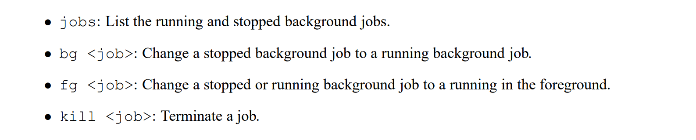
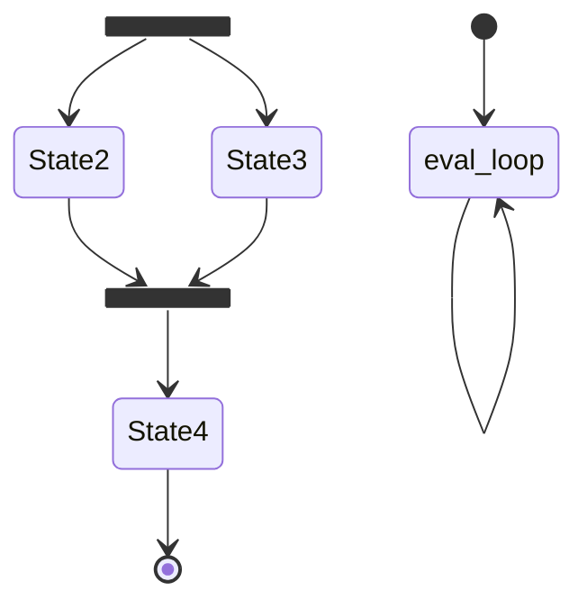

# Preliminaries
## Shell Program
### Linux Process Hierarchy
> [!overview]
> The command line is a sequence of ASCII text words delimited by whitespace. The first word in the command line is either the name of a **built-in command** or the **pathname of an executable file**. The remaining words are command-line arguments. 
> - If the first word is a built-in command, the shell immediately executes the command in the current process. 
> - Otherwise, the word is assumed to be the pathname of an executable program. In this case, the shell forks a child process, then loads and runs the program in the context of the child. 
> - **The child processes** created as a result of interpreting a single command line are known collectively as a **job**. In general, a job can consist of multiple child processes connected by Unix pipes. 
> 
> If the command line ends with an ampersand ”&”, then the job runs in the background, which means that the shell **does not wait for** the job to terminate before printing the prompt and awaiting the next command line. 
> 
> Otherwise, the job runs in the foreground, which means that the shell **waits for** the job to terminate before awaiting the next command line. Thus, at any point in time, at most one job can be running in the foreground. However, **an arbitrary number of jobs can run in the background.**
> 


### Simple Shell Programs
> [!def]
> 

> [!code]
> 


### Problem with Simple Shell Example
> [!important]
> 


## Job Control
> [!overview]
> More on Signals [Signals](../../../../Machine_Structures/8_Linking_OS_Processes/Signals.md)
> Unix shells support the notion of job control, which allows users to move jobs back and forth between background and foreground, and to change the process state (running, stopped, or terminated) of the processes in a job. Typing ctrl-c causes a SIGINT signal to be delivered to each process in the foreground job. 
> 
> The default action for SIGINT is to terminate the process. Similarly, typing ctrl-z causes a SIGTSTP signal to be delivered to each process in the foreground job. The default action for SIGTSTP is to place a process in the stopped state, where it remains until it is awakened by the receipt of a SIGCONT signal. Unix shells also provide various built-in commands that support job control. For example:
> 


## CRLF and LF
> [!important]
> If you cannot run `./sdriver.pl`, then you should manually save CRLF file as LF(linux-formatted).


# Phase 1: eval
> [!code]
> 
```c
/* 
 * eval - Evaluate the command line that the user has just typed in
 * 
 * If the user has requested a built-in command (quit, jobs, bg or fg)
 * then execute it immediately. Otherwise, fork a child process and
 * run the job in the context of the child. If the job is running in
 * the foreground, wait for it to terminate and then return.  Note:
 * each child process must have a unique process group ID so that our
 * background children don't receive SIGINT (SIGTSTP) from the kernel
 * when we type ctrl-c (ctrl-z) at the keyboard.  
*/
void eval(char *cmdline) 
{

    char* argv[MAXARGS];
    int is_bg = parseline(cmdline, argv);
    
    /* Ignore Empty Line */
    if (argv[0] == NULL) {
        return;
    }

    /*
     Check if it is builtin-command
    */

    if (!builtin_cmd(argv)) {
        /*
            Mask_one is to block a particular signal, mask_all is to block all signals, used 
            when we addjob or deletejob
        */ 
        sigset_t mask_one, mask_all;
        sigemptyset(&mask_one);
        sigfillset(&mask_all);
        sigaddset(&mask_one, SIGCHLD);
        

        /*
            The parent must use sigprocmask to block SIGCHLD signals before it forks the child,
            and then unblock these signals, again using sigprocmask after it adds the child to the job list by
            calling addjob. Since children inherit the blocked vectors of their parents, the child must be sure
            to then unblock SIGCHLD signals before it execs the new program.

            The parent needs to block the SIGCHLD signals in this way in order to avoid the race condition where
            the child is reaped by sigchld handler (and thus removed from the job list) before the parent
            calls addjob.
        */
        sigprocmask(SIG_BLOCK, &mask_one, NULL);
        pid_t pid = fork();
        
        if (pid == 0) {
            /*
            Child will inherit the signal mask from the parent process.
            The child must be sure to then unblock SIGCHLD signals before it execs the new program.
            */
            sigprocmask(SIG_UNBLOCK, &mask_one, NULL);

            /*
                Important Notes: When you run your shell from the standard Unix shell, your shell is running in the foreground process
                group. If your shell then creates a child process, by default that child will also be a member of the
                foreground process group. Since typing ctrl-c sends a SIGINT to every process in the foreground
                group, typing ctrl-c will send a SIGINT to your shell, as well as to every process that your shell
                created, which obviously isn’t correct.

                Here is the workaround: After the fork, but before the execve, the child process should call
                setpgid(0, 0), which puts the child in a new process group whose group ID is identical to the
                child’s PID. This ensures that there will be only one process, your shell, in the foreground process
                group. When you type ctrl-c, the shell should catch the resulting SIGINT and then forward it
                to the appropriate foreground job (or more precisely, the process group that contains the foreground
                job). It's used for accurate job control, especially when the we manually send 
                terminal signal like SIGINT or SIGSTP.

                Even if the child process changed its process group ID, the original parent-child relationship
                is maintained by the operating system kernel. So the parent processes can still use wait() or
                waitpid() to reap its child processes.
            */
            setpgid(0,0);

            // Variant of execvp, it can specify environment variables
            /*
                The if statement that checks the return value of execve() and possibly executes code,
                such as printing an error message, will only be executed if execve() fails.
                When execve() is successful, the current process image is replaced entirely
                by the new program image, and the current program's code (including any code 
                after the execve() call) is no longer present or executed. Therefore, the 
                remaining part of the original program, including the if statement, 
                is not executed after a successful execve() call.
            
            */
            if (execve(argv[0], argv, environ) == -1) {
                if (errno == ENOENT) {
                    printf("%s: Command not found.\n", argv[0]);
                }
            }

            /* 
                The child process will not come back here if execve is successful since its return address is 
                modified The code after this won't be executed.

                But if the program is not executed successfully, it will return here, and we need 
                to terminate the child process.

                Otherwise, if we want to execute ./bogus which doesn't exist, we will continue on executing
                the following codes in the parent proces's codebase, adding this foreground job to job list.
            */
            exit(0);
        } 

        sigprocmask(SIG_BLOCK, &mask_all, NULL);
        if (is_bg) {
            // Add job to background job list jobs
            addjob(jobs, pid, BG, cmdline);
            printjob(jobs, pid);
            sigprocmask(SIG_UNBLOCK, &mask_all, NULL);                       
        } else {
            // int status;

            /*
                Job list is typically designed to keep track of the background jobs, not foreground ones.
                - that have been started by shell and are running asychronously w.r.t
                  shell's program.

                There are several reasons that foreground jobs may not be added to the job list
                - Immediate Feedback and Interaction: Foreground jobs are executed with the terminal's input 
                  and output directly connected to them, allowing for immediate user interaction and feedback. 
                  Users expect foreground jobs to complete or to be manually stopped or suspended 
                  (using Ctrl-Z, for instance) before returning to the shell prompt. 
                  Therefore, tracking them in a job list, which is primarily used for managing background jobs
                  , might not be necessary or useful.
                - Simplicity in Job Management: Background jobs are those that users have explicitly indicated should run independently of the 
                  terminal (using & at the end of a command, for example). These jobs need to be tracked so users 
                  can manage them later (using commands like bg, fg, jobs), check their status, or bring them back 
                  to the foreground. Foreground jobs, by contrast, do not require this level of tracking since they 
                  occupy the user's immediate attention and the terminal's input/output.

                  But for this question, since in our helper function, in order to find the foreground job
                  , we have to traverse the job list to find the job with FG state, so we have to add 
                  foreground job to jobs.
            */
            // if (strcmp(argv[0], "/bin/echo") != 0) {
            //     // Used to filter out /bin/echo -e in the trace.txt files
                
            // }
            addjob(jobs, pid, FG, cmdline);
            sigprocmask(SIG_UNBLOCK, &mask_all, NULL);
            
            /*
                The functionality of waitpid is not directly influenced by the signal mask of the parent process
                because it deals with the state of child processes at the system level rather than through signal delivery.
                Even if you block SIGCHLD or other signals in the parent process, waitpid can still be used to wait for 
                child processes to change state (e.g., to terminate).

                Here, we don't need to call waitpid() to reap the child processes, since we have a signal handler that also calls a waitpid to reap the child processes.
                If the waitpid here is called first, then in the signal handler, the waitpid will immediately return 0 and the child processes that are stopped by some signal won't be correctly reaped.
            */
            // if(waitpid(pid, &status, 0) < 0) {
            //     unix_error("waitfg: waitpid errror");
            // }


			// Instead, we call waitfg which is a usy waiting loop that check if the 
            waitfg(pid);
            
        }
        
    }
    return;
}
```


# Phase 2: builtin_cmd
> [!code]
> 
```c
/* 
 * builtin_cmd - If the user has typed a built-in command then execute
 * it immediately, which means we don't have to follow fork-exec procedure. 
 */
int builtin_cmd(char **argv) 
{
    char* name = argv[0];
    if (!strcmp(name, "quit")) {
        exit(0);
    } else if (!strcmp(name, "&")) {
        /* Ignore singleton & */
        return 1;
    } 
    else if (!strcmp(name, "bg")) {
        do_bgfg(argv);
        return 1;
    } else if (!strcmp(name, "fg")) {
        do_bgfg(argv);
        return 1;
    } else if (!strcmp(name, "jobs")) {
        listjobs(jobs);
        return 1;
    } else {
        /* not a builtin command */
        return 0;
    }
}
```


# Phase 3: do_bgfg
> [!code]
```c
/* 
 * do_bgfg - Execute the builtin bg and fg commands
 */
void do_bgfg(char **argv) 
{   

    if (argv[1] == NULL) {
        /*
            In C, when you're working with strings and formatting functions like printf or sprintf,
            you use a double percent sign (%%) to insert a single percent sign (%) into the output string.
        */ 
        app_error("fg command requires PID or %%jobid argument");
    }

    if (!strcmp(argv[0], "bg")) {
        /* The bg <job> command restarts <job> by sending it a SIGCONT signal, 
        and then runs it in the background. The <job> argument can be either 
        a PID or a JID.
        */
        char* id = argv[1];
        const char* num = (const char*) (id + 1);
        struct job_t* job = NULL;
        if (id[0] == '%') {
            // jid
            int jid = atoi(num);
            job = getjobjid(jobs, jid);

            if (job == NULL) {
                printf("%s: No such job\n", id);
            } else {
                pid_t pid = jid2pid(jid);
                job -> state = BG;
                printjob(jobs, pid);
                kill(-pid, SIGCONT);
            }
        } else {
            //pid
            pid_t pid = atoi(num); 
            job = getjobpid(jobs, pid);
            if (job == NULL) {
                printf("(%d): No such process\n", pid);
            } else {
                job -> state = BG;
                printjob(jobs, pid);
                kill(-pid, SIGCONT);
            }
        }
    } else {
        /* The fg <job> command restarts <job> by sending it a SIGCONT signal, 
        and then runs it in the foreground. The <job> argument can be either
        a PID or a JID.
        */
        char* id = argv[1];
        const char* num = (const char*) (id + 1);
        struct job_t* job = NULL;
        if (id[0] == '%') {
            // jid
            int jid = atoi(num);
            job = getjobjid(jobs, jid);
            if (job == NULL) {
                printf("%s: No such job\n", id);
            } else {
                pid_t pid = jid2pid(jid);
                job -> state = FG;
                kill(-pid, SIGCONT);
                waitfg(pid);
            }
        } else {
            //pid
            pid_t pid = atoi(num); 
            job = getjobpid(jobs, pid);
            if (job == NULL) {
                printf("(%d): No such process\n", pid);
            } else {
                job -> state = FG;
                kill(-pid, SIGCONT);
                waitfg(pid);
            }
        }
    }
}

```


# Phase 4: sigchld_handler
> [!code]
```c
/* 
 * sigchld_handler - The kernel sends a SIGCHLD to the shell whenever
 *     a child job terminates (becomes a zombie), or stops because it
 *     received a SIGSTOP or SIGTSTP signal. The handler reaps all
 *     available zombie children, but doesn't wait for any other
 *     currently running children to terminate.  
 */
void sigchld_handler(int sig) 
{
    int olderrno = errno;
    sigset_t mask_all;
    pid_t pid;
    int child_status;

    sigfillset(&mask_all);

    /* 
        Important notes: If there are multiple child processes sending STGSTOP or STGCHLD
        at once, since we have blocked these signals while we are adding jobs
        Once we unlock the signals, this signal handler is executed, but since signals are
        not queued, from signal pending and blocking bits we only know whether there is any
        child processes that have changed state, but we don't know how many child processes
        have changed states, and which child's state has been changed. so we will need waitpid
        and &status to see the exit status of the child processes that have changed states.
    */
    /*
        By default, waitpid() only blocks until any child processes terminates, but here we want 
        a more precise control, we also want to wait for any child processes that are stopped(by keyboard interrupt)
        so that we can manage their state in the job list.

        WNOHANG is to not block the signal handler if there is no child processes waiting to
        be reaped.

        WUNTRACED is used to explicitly wait for child processes that is stopped
           - either from terminal, SIGTSTP(SIG-T-STP), but here it cannot be from the terminal
             since it has a different process group as the foreground process group.
           - or from other process, SIGSTOP  

		The reason why here the predicate is > instead of >= is that
		we only cares about those child processes that has terminated or stopped, which makes waitpid() return > 0.

    */
    while((pid = waitpid(-1, &child_status, WNOHANG | WUNTRACED)) > 0) {
	    sigprocmask(SIG_BLOCK, &mask_all, NULL);
        struct job_t* job = getjobpid(jobs, pid);
        if (WIFEXITED(child_status)) {
            // If child process terminates normally
            deletejob(jobs, pid);
        } else if (WIFSTOPPED(child_status)) {
            // If child process stops
            job -> state = ST;
            // Want to see whether it's stopped from terminal or from other signals
            int signalNum = WTERMSIG(child_status);
            // Print something like Job [1] (9723) stopped by signal 20
            printf("Job [%d] (%d) stopped by signal %d\n", job -> jid, job -> pid, signalNum);
        } else if (WIFSIGNALED(child_status)) {
            /*
                If child process terminates because of some uncaught signals, maybe the child 
                process didn't have a certain signal handler for that signal.
                - Some signals like SIGKILL and SIGSTOP cannot be caught.
            */ 
            int signalNum = WTERMSIG(child_status);
            // Print something like Job (9721) terminated by signal 2
            printf("Job [%d] (%d) terminated by signal %d\n", job -> jid, job -> pid, signalNum);
            deletejob(jobs, pid);
        }
        sigprocmask(SIG_UNBLOCK, &mask_all, NULL); 
    }

    /*
      If waitpid() returns < 0, we hope that it is only because of that there are no more children 
      to wait, just as ECHILD shows.
      - Aside: ECHILD varies across different operating systems.
    */
    if (pid < 0 && errno != ECHILD) {
        unix_error("waitpid error");
    }
    errno = olderrno;
}

```


# Phase 5: sigint_handler
> [!code]
> 
```c
/* 
 * sigint_handler - The kernel sends a SIGINT to the shell whenver the
 *    user types ctrl-c at the keyboard.  Catch it and send it along
 *    to the foreground job. To terminate the foreground process group
 */
void sigint_handler(int sig) 
{
    pid_t pid = fgpid(jobs);

    /*
        For example, if you type Ctrl+C
        (i.e., press the Ctrl key and the ‘c’ key at the same time) while a process is running
        in the foreground, then the kernel sends a SIGINT (number 2) to each process in
        the foreground process group.
    */

    //  Since the foreground task is runned by all the process in the foreground process group.
    /*
        When a parent use fork()(use multiprocesses to complete the task), the child process 
        share the same process group ID as parent process.

        So when user type in CTRL+C, we send a SIGINT to the foreground task
        since there is only one fg task, we get its pid, which is also a pgid(different from shell's pgid).
        We have to send this signal to all the processes (child processes) within
        the same process group that has group id pid.
    */

    if (pid > 0) {
        kill(-pid, sig);
    }

    return;
}
```


# Phase 6: sigstp_handler
> [!code]
> 
```c
/*
 * sigtstp_handler - The kernel sends a SIGTSTP to the shell whenever
 *     the user types ctrl-z at the keyboard. Catch it and suspend the
 *     foreground job by sending it a SIGTSTP.  
 */
void sigtstp_handler(int sig) 
{
    pid_t pid = fgpid(jobs);

    // Stop the foreground processes
    if (pid > 0) kill(-pid, sig);

    return;
}

```

# The Big Picture





# Complete Program
```c
/* 
 * tsh - A tiny shell program with job control
 * 
 * <Put your name and login ID here>
 */
#include <stdio.h>
#include <stdlib.h>
#include <unistd.h>
#include <string.h>
#include <ctype.h>
#include <signal.h>
#include <sys/types.h>
#include <sys/wait.h>
#include <errno.h>

/* Misc manifest constants */
#define MAXLINE    1024   /* max line size */
#define MAXARGS     128   /* max args on a command line */
#define MAXJOBS      16   /* max jobs at any point in time */
#define MAXJID    1<<16   /* max job ID */

/* Job states */
#define UNDEF 0 /* undefined */
#define FG 1    /* running in foreground */
#define BG 2    /* running in background */
#define ST 3    /* stopped */

/* 
 * Jobs states: FG (foreground), BG (background), ST (stopped)
 * Job state transitions and enabling actions:
 *     FG -> ST  : ctrl-z
 *     ST -> FG  : fg command
 *     ST -> BG  : bg command
 *     BG -> FG  : fg command
 * At most 1 job can be in the FG state.
 */

/* Global variables */
extern char **environ;      /* defined in libc */
char prompt[] = "tsh> ";    /* command line prompt (DO NOT CHANGE) */
int verbose = 0;            /* if true, print additional output */
int nextjid = 1;            /* next job ID to allocate */
char sbuf[MAXLINE];         /* for composing sprintf messages */

struct job_t {              /* The job struct */
    pid_t pid;              /* job PID */
    int jid;                /* job ID [1, 2, ...] */
    int state;              /* UNDEF, BG, FG, or ST */
    char cmdline[MAXLINE];  /* command line */
};
struct job_t jobs[MAXJOBS]; /* The job list */
/* End global variables */


/* Function prototypes */

/* Here are the functions that you will implement */
void eval(char *cmdline);
int builtin_cmd(char **argv);
void do_bgfg(char **argv);
void waitfg(pid_t pid);

void sigchld_handler(int sig);
void sigtstp_handler(int sig);
void sigint_handler(int sig);

/* Here are helper routines that we've provided for you */
int parseline(const char *cmdline, char **argv); 
void sigquit_handler(int sig);

void clearjob(struct job_t *job);
void initjobs(struct job_t *jobs);
int maxjid(struct job_t *jobs); 
void printjob(struct job_t* jobs, pid_t pid);
int addjob(struct job_t *jobs, pid_t pid, int state, char *cmdline);
int deletejob(struct job_t *jobs, pid_t pid); 
pid_t fgpid(struct job_t *jobs);
struct job_t *getjobpid(struct job_t *jobs, pid_t pid);
struct job_t *getjobjid(struct job_t *jobs, int jid); 
int pid2jid(pid_t pid); 
pid_t jid2pid(int jid); 
void listjobs(struct job_t *jobs);

void usage(void);
void unix_error(char *msg);
void app_error(char *msg);
typedef void handler_t(int);
handler_t *Signal(int signum, handler_t *handler);

/*
 * main - The shell's main routine 
 */
int main(int argc, char **argv) 
{
    char c;
    char cmdline[MAXLINE];
    int emit_prompt = 1; /* emit prompt (default) */

    /* Redirect stderr to stdout (so that driver will get all output
     * on the pipe connected to stdout) */
    dup2(1, 2);

    /* Parse the command line */
    while ((c = getopt(argc, argv, "hvp")) != EOF) {
        switch (c) {
        case 'h':             /* print help message */
            usage();
	    break;
        case 'v':             /* emit additional diagnostic info */
            verbose = 1;
	    break;
        case 'p':             /* don't print a prompt */
            emit_prompt = 0;  /* handy for automatic testing */
	    break;
	default:
            usage();
	}
    }

    /* Install the signal handlers */

    /* These are the ones you will need to implement */
    Signal(SIGINT,  sigint_handler);   /* ctrl-c */
    Signal(SIGTSTP, sigtstp_handler);  /* ctrl-z */
    Signal(SIGCHLD, sigchld_handler);  /* Terminated or stopped child */

    /* This one provides a clean way to kill the shell */
    Signal(SIGQUIT, sigquit_handler); 

    /* Initialize the job list */
    initjobs(jobs);

    /* Execute the shell's read/eval loop */
    while (1) {

        /* Read command line */
        if (emit_prompt) {
            printf("%s", prompt);
            fflush(stdout);
        }
        if ((fgets(cmdline, MAXLINE, stdin) == NULL) && ferror(stdin))
            app_error("fgets error");
        if (feof(stdin)) { /* End of file (ctrl-d) */
            fflush(stdout);
            exit(0);
        }

        /* Evaluate the command line */
        eval(cmdline);   
        fflush(stdout);
        fflush(stdout);
    } 

    exit(0); /* control never reaches here */
}
  
/* 
 * eval - Evaluate the command line that the user has just typed in
 * 
 * If the user has requested a built-in command (quit, jobs, bg or fg)
 * then execute it immediately. Otherwise, fork a child process and
 * run the job in the context of the child. If the job is running in
 * the foreground, wait for it to terminate and then return.  Note:
 * each child process must have a unique process group ID so that our
 * background children don't receive SIGINT (SIGTSTP) from the kernel
 * when we type ctrl-c (ctrl-z) at the keyboard.  
*/
void eval(char *cmdline) 
{

    char* argv[MAXARGS];
    int is_bg = parseline(cmdline, argv);
    
    /* Ignore Empty Line */
    if (argv[0] == NULL) {
        return;
    }

    /*
     Check if it is builtin-command
    */

    if (!builtin_cmd(argv)) {
        /*
            Mask_one is to block a particular signal, mask_all is to block all signals, used 
            when we addjob or deletejob
        */ 
        sigset_t mask_one, mask_all;
        sigemptyset(&mask_one);
        sigfillset(&mask_all);
        sigaddset(&mask_one, SIGCHLD);
        

        /*
            The parent must use sigprocmask to block SIGCHLD signals before it forks the child,
            and then unblock these signals, again using sigprocmask after it adds the child to the job list by
            calling addjob. Since children inherit the blocked vectors of their parents, the child must be sure
            to then unblock SIGCHLD signals before it execs the new program.

            The parent needs to block the SIGCHLD signals in this way in order to avoid the race condition where
            the child is reaped by sigchld handler (and thus removed from the job list) before the parent
            calls addjob.
        */
        sigprocmask(SIG_BLOCK, &mask_one, NULL);
        pid_t pid = fork();
        
        if (pid == 0) {
            /*
            Child will inherit the signal mask from the parent process.
            The child must be sure to then unblock SIGCHLD signals before it execs the new program.
            */
            sigprocmask(SIG_UNBLOCK, &mask_one, NULL);

            /*
                Important Notes: When you run your shell from the standard Unix shell, your shell is running in the foreground process
                group. If your shell then creates a child process, by default that child will also be a member of the
                foreground process group. Since typing ctrl-c sends a SIGINT to every process in the foreground
                group, typing ctrl-c will send a SIGINT to your shell, as well as to every process that your shell
                created, which obviously isn’t correct.

                Here is the workaround: After the fork, but before the execve, the child process should call
                setpgid(0, 0), which puts the child in a new process group whose group ID is identical to the
                child’s PID. This ensures that there will be only one process, your shell, in the foreground process
                group. When you type ctrl-c, the shell should catch the resulting SIGINT and then forward it
                to the appropriate foreground job (or more precisely, the process group that contains the foreground
                job). It's used for accurate job control, especially when the we manually send 
                terminal signal like SIGINT or SIGSTP.

                Even if the child process changed its process group ID, the original parent-child relationship
                is maintained by the operating system kernel. So the parent processes can still use wait() or
                waitpid() to reap its child processes.
            */
            setpgid(0,0);

            // Variant of execvp, it can specify environment variables
            /*
                The if statement that checks the return value of execve() and possibly executes code,
                such as printing an error message, will only be executed if execve() fails.
                When execve() is successful, the current process image is replaced entirely
                by the new program image, and the current program's code (including any code 
                after the execve() call) is no longer present or executed. Therefore, the 
                remaining part of the original program, including the if statement, 
                is not executed after a successful execve() call.
            
            */
            if (execve(argv[0], argv, environ) == -1) {
                if (errno == ENOENT) {
                    printf("%s: Command not found.\n", argv[0]);
                }
            }

            /* 
                The child process will not come back here if execve is successful since its return address is 
                modified The code after this won't be executed.

                But if the program is not executed successfully, it will return here, and we need 
                to terminate the child process.

                Otherwise, if we want to execute ./bogus which doesn't exist, we will continue on executing
                the following codes in the parent proces's codebase, adding this foreground job to job list.
            */
            exit(0);
        } 

        sigprocmask(SIG_BLOCK, &mask_all, NULL);
        if (is_bg) {
            // Add job to background job list jobs
            addjob(jobs, pid, BG, cmdline);
            printjob(jobs, pid);
            sigprocmask(SIG_UNBLOCK, &mask_all, NULL);                       
        } else {
            // int status;

            /*
                Job list is typically designed to keep track of the background jobs, not foreground ones.
                - that have been started by shell and are running asychronously w.r.t
                  shell's program.

                There are several reasons that foreground jobs may not be added to the job list
                - Immediate Feedback and Interaction: Foreground jobs are executed with the terminal's input 
                  and output directly connected to them, allowing for immediate user interaction and feedback. 
                  Users expect foreground jobs to complete or to be manually stopped or suspended 
                  (using Ctrl-Z, for instance) before returning to the shell prompt. 
                  Therefore, tracking them in a job list, which is primarily used for managing background jobs
                  , might not be necessary or useful.
                - Simplicity in Job Management: Background jobs are those that users have explicitly indicated should run independently of the 
                  terminal (using & at the end of a command, for example). These jobs need to be tracked so users 
                  can manage them later (using commands like bg, fg, jobs), check their status, or bring them back 
                  to the foreground. Foreground jobs, by contrast, do not require this level of tracking since they 
                  occupy the user's immediate attention and the terminal's input/output.

                  But for this question, since in our helper function, in order to find the foreground job
                  , we have to traverse the job list to find the job with FG state, so we have to add 
                  foreground job to jobs.
            */
            // if (strcmp(argv[0], "/bin/echo") != 0) {
            //     // Used to filter out /bin/echo -e in the trace.txt files
                
            // }
            addjob(jobs, pid, FG, cmdline);
            sigprocmask(SIG_UNBLOCK, &mask_all, NULL);
            
            /*
                The functionality of waitpid is not directly influenced by the signal mask of the parent process
                because it deals with the state of child processes at the system level rather than through signal delivery.
                Even if you block SIGCHLD or other signals in the parent process, waitpid can still be used to wait for 
                child processes to change state (e.g., to terminate).

                Here, 
            */
            // if(waitpid(pid, &status, 0) < 0) {
            //     unix_error("waitfg: waitpid errror");
            // }

            waitfg(pid);
            
        }
        
    }
    return;
}


/* 
 * parseline - Parse the command line and build the argv array.
 * 
 * Characters enclosed in single quotes are treated as a single
 * argument.  Return true if the user has requested a BG job, false if
 * the user has requested a FG job.  
 */
int parseline(const char *cmdline, char **argv) 
{
    static char array[MAXLINE]; /* holds local copy of command line */
    char *buf = array;          /* ptr that traverses command line */
    char *delim;                /* points to first space delimiter */
    int argc;                   /* number of args */
    int bg;                     /* background job? */

    strcpy(buf, cmdline);
    buf[strlen(buf)-1] = ' ';  /* replace trailing '\n' with space */
    while (*buf && (*buf == ' ')) /* ignore leading spaces */
	buf++;

    /* Build the argv list */
    argc = 0;
    if (*buf == '\'') {
	buf++;
	delim = strchr(buf, '\'');
    }
    else {
	delim = strchr(buf, ' ');
    }

    while (delim) {
	argv[argc++] = buf;
	*delim = '\0';
	buf = delim + 1;
	while (*buf && (*buf == ' ')) /* ignore spaces */
	       buf++;

	if (*buf == '\'') {
	    buf++;
	    delim = strchr(buf, '\'');
	}
	else {
	    delim = strchr(buf, ' ');
	}
    }
    argv[argc] = NULL; /* We terminate the char** argv by nul terminator */
    
    if (argc == 0)  /* ignore blank line */
	return 1;

    /* should the job run in the background? */
    if ((bg = (*argv[argc-1] == '&')) != 0) {
	argv[--argc] = NULL;
    }
    return bg;
}

/* 
 * builtin_cmd - If the user has typed a built-in command then execute
 * it immediately, which means we don't have to follow fork-exec procedure. 
 */
int builtin_cmd(char **argv) 
{
    char* name = argv[0];
    if (!strcmp(name, "quit")) {
        exit(0);
    } else if (!strcmp(name, "&")) {
        /* Ignore singleton & */
        return 1;
    } 
    else if (!strcmp(name, "bg")) {
        do_bgfg(argv);
        return 1;
    } else if (!strcmp(name, "fg")) {
        do_bgfg(argv);
        return 1;
    } else if (!strcmp(name, "jobs")) {
        listjobs(jobs);
        return 1;
    } else {
        /* not a builtin command */
        return 0;
    }
}

/* 
 * do_bgfg - Execute the builtin bg and fg commands
 */
void do_bgfg(char **argv) 
{   

    if (argv[1] == NULL) {
        /*
            In C, when you're working with strings and formatting functions like printf or sprintf,
            you use a double percent sign (%%) to insert a single percent sign (%) into the output string.
        */ 
        app_error("fg command requires PID or %%jobid argument");
    }

    if (!strcmp(argv[0], "bg")) {
        /* The bg <job> command restarts <job> by sending it a SIGCONT signal, 
        and then runs it in the background. The <job> argument can be either 
        a PID or a JID.
        */
        char* id = argv[1];
        const char* num = (const char*) (id + 1);
        struct job_t* job = NULL;
        if (id[0] == '%') {
            // jid
            int jid = atoi(num);
            job = getjobjid(jobs, jid);

            if (job == NULL) {
                printf("%s: No such job\n", id);
            } else {
                pid_t pid = jid2pid(jid);
                job -> state = BG;
                printjob(jobs, pid);
                kill(-pid, SIGCONT);
            }
        } else {
            //pid
            pid_t pid = atoi(num); 
            job = getjobpid(jobs, pid);
            if (job == NULL) {
                printf("(%d): No such process\n", pid);
            } else {
                job -> state = BG;
                printjob(jobs, pid);
                kill(-pid, SIGCONT);
            }
        }
    } else {
        /* The fg <job> command restarts <job> by sending it a SIGCONT signal, 
        and then runs it in the foreground. The <job> argument can be either
        a PID or a JID.
        */
        char* id = argv[1];
        const char* num = (const char*) (id + 1);
        struct job_t* job = NULL;
        if (id[0] == '%') {
            // jid
            int jid = atoi(num);
            job = getjobjid(jobs, jid);
            if (job == NULL) {
                printf("%s: No such job\n", id);
            } else {
                pid_t pid = jid2pid(jid);
                job -> state = FG;
                kill(-pid, SIGCONT);
                waitfg(pid);
            }
        } else {
            //pid
            pid_t pid = atoi(num); 
            job = getjobpid(jobs, pid);
            if (job == NULL) {
                printf("(%d): No such process\n", pid);
            } else {
                job -> state = FG;
                kill(-pid, SIGCONT);
                waitfg(pid);
            }
        }
    }
}

/* 
 * waitfg - Block until process pid is no longer the foreground process
 */
void waitfg(pid_t pid)
{   
    /*
        Not actually switch to the foreground, but act as if the shell
        is waiting for the pid process to terminate

        Remember at the same time there could only be one foreground 
        task running
    */
    while ((pid = fgpid(jobs))) {sleep(1);}
    return;
}

/*****************
 * Signal handlers
 *****************/

/* 
 * sigchld_handler - The kernel sends a SIGCHLD to the shell whenever
 *     a child job terminates (becomes a zombie), or stops because it
 *     received a SIGSTOP or SIGTSTP signal. The handler reaps all
 *     available zombie children, but doesn't wait for any other
 *     currently running children to terminate.  
 */
void sigchld_handler(int sig) 
{
    int olderrno = errno;
    sigset_t mask_all;
    pid_t pid;
    int child_status;

    sigfillset(&mask_all);

    /* 
        Important notes: If there are multiple child processes sending STGSTOP or STGCHLD
        at once, since we have blocked these signals while we are adding jobs
        Once we unlock the signals, this signal handler is executed, but since signals are
        not queued, from signal pending and blocking bits we only know whether there is any
        child processes that have changed state, but we don't know how many child processes
        have changed states, and which child's state has been changed. so we will need waitpid
        and &status to see the exit status of the child processes that have changed states.
    */
    /*
        By default, waitpid() only blocks until any child processes terminates, but here we want 
        a more precise control, we also want to wait for any child processes that are stopped(by keyboard interrupt)
        so that we can manage their state in the job list.

        WNOHANG is to not block the signal handler if there is no child processes waiting to
        be reaped.

        WUNTRACED is used to explicitly wait for child processes that is stopped
           - either from terminal, SIGTSTP(SIG-T-STP), but here it cannot be from the terminal
             since it has a different process group as the foreground process group.
           - or from other process, SIGSTOP  
    */
    while((pid = waitpid(-1, &child_status, WNOHANG | WUNTRACED)) > 0) {
        struct job_t* job = getjobpid(jobs, pid);
        if (WIFEXITED(child_status)) {
            // If child process terminates normally
            deletejob(jobs, pid);
        } else if (WIFSTOPPED(child_status)) {
            // If child process stops
            job -> state = ST;
            // Want to see whether it's stopped from terminal or from other signals
            int signalNum = WTERMSIG(child_status);
            // Print something like Job [1] (9723) stopped by signal 20
            printf("Job [%d] (%d) stopped by signal %d\n", job -> jid, job -> pid, signalNum);
        } else if (WIFSIGNALED(child_status)) {
            /*
                If child process terminates because of some uncaught signals, maybe the child 
                process didn't have a certain signal handler for that signal.
                - Some signals like SIGKILL and SIGSTOP cannot be caught.
            */ 
            int signalNum = WTERMSIG(child_status);
            // Print something like Job (9721) terminated by signal 2
            printf("Job [%d] (%d) terminated by signal %d\n", job -> jid, job -> pid, signalNum);
            deletejob(jobs, pid);
        }
        sigprocmask(SIG_UNBLOCK, &mask_all, NULL); 
    }

    /*
      If waitpid() returns < 0, we hope that it is only because of that there are no more children 
      to wait, just as ECHILD shows.
      - Aside: ECHILD varies across different operating systems.
    */
    if (pid < 0 && errno != ECHILD) {
        unix_error("waitpid error");
    }
    errno = olderrno;
}

/* 
 * sigint_handler - The kernel sends a SIGINT to the shell whenver the
 *    user types ctrl-c at the keyboard.  Catch it and send it along
 *    to the foreground job. To terminate the foreground process group
 */
void sigint_handler(int sig) 
{
    pid_t pid = fgpid(jobs);

    /*
        For example, if you type Ctrl+C
        (i.e., press the Ctrl key and the ‘c’ key at the same time) while a process is running
        in the foreground, then the kernel sends a SIGINT (number 2) to each process in
        the foreground process group.
    */

    //  Since the foreground task is runned by all the process in the foreground process group.
    /*
        When a parent use fork()(use multiprocesses to complete the task), the child process 
        share the same process group ID as parent process.

        So when user type in CTRL+C, we send a SIGINT to the foreground task
        since there is only one fg task, we get its pid, which is also a pgid(different from shell's pgid).
        We have to send this signal to all the processes (child processes) within
        the same process group that has group id pid.
    */

    if (pid > 0) {
        kill(-pid, sig);
    }

    return;
}

/*
 * sigtstp_handler - The kernel sends a SIGTSTP to the shell whenever
 *     the user types ctrl-z at the keyboard. Catch it and suspend the
 *     foreground job by sending it a SIGTSTP.  
 */
void sigtstp_handler(int sig) 
{
    pid_t pid = fgpid(jobs);

    // Stop the foreground processes
    if (pid > 0) kill(-pid, sig);

    return;
}

/*********************
 * End signal handlers
 *********************/

/***********************************************
 * Helper routines that manipulate the job list
 **********************************************/

/* clearjob - Clear the entries in a job struct */
void clearjob(struct job_t *job) {
    job->pid = 0;
    job->jid = 0;
    job->state = UNDEF;
    job->cmdline[0] = '\0';
}

/* initjobs - Initialize the job list */
void initjobs(struct job_t *jobs) {
    int i;

    for (i = 0; i < MAXJOBS; i++)
	clearjob(&jobs[i]);
}

/* maxjid - Returns largest allocated job ID */
int maxjid(struct job_t *jobs) 
{
    int i, max=0;

    for (i = 0; i < MAXJOBS; i++)
	if (jobs[i].jid > max)
	    max = jobs[i].jid;
    return max;
}


void printjob(struct job_t* jobs, pid_t pid) {
    for (int i = 0; i < MAXJOBS; i++) {
        struct job_t job = jobs[i];
        if (job.pid == pid) {
            if (job.state == BG) {
                printf("[%d] (%d) %s", job.jid, job.pid, job.cmdline);
            }
        }
    }
}


/* addjob - Add a job to the job list */
int addjob(struct job_t *jobs, pid_t pid, int state, char *cmdline) 
{
    int i;
    
    if (pid < 1)
	return 0;

    for (i = 0; i < MAXJOBS; i++) {
        if (jobs[i].pid == 0) {
            jobs[i].pid = pid;
            jobs[i].state = state;
            jobs[i].jid = nextjid++;
            if (nextjid > MAXJOBS)
            nextjid = 1;
            strcpy(jobs[i].cmdline, cmdline);
            if(verbose){
                printf("Added job [%d] %d %s\n", jobs[i].jid, jobs[i].pid, jobs[i].cmdline);
            }
            return 1;
        }
    }
    printf("Tried to create too many jobs\n");
    return 0;
}

/* deletejob - Delete a job whose PID=pid from the job list */
int deletejob(struct job_t *jobs, pid_t pid) 
{
    int i;

    if (pid < 1)
	return 0;

    for (i = 0; i < MAXJOBS; i++) {
	if (jobs[i].pid == pid) {
	    clearjob(&jobs[i]);
	    nextjid = maxjid(jobs)+1;
	    return 1;
	}
    }
    return 0;
}

/* fgpid - Return PID of current foreground job, 0 if no such job */
pid_t fgpid(struct job_t *jobs) {
    int i;

    for (i = 0; i < MAXJOBS; i++)
	if (jobs[i].state == FG)
	    return jobs[i].pid;
    return 0;
}

/* getjobpid  - Find a job (by PID) on the job list */
struct job_t *getjobpid(struct job_t *jobs, pid_t pid) {
    int i;

    if (pid < 1)
	return NULL;
    for (i = 0; i < MAXJOBS; i++)
	if (jobs[i].pid == pid)
	    return &jobs[i];
    return NULL;
}

/* getjobjid  - Find a job (by JID) on the job list */
struct job_t *getjobjid(struct job_t *jobs, int jid) 
{
    int i;

    if (jid < 1)
	return NULL;
    for (i = 0; i < MAXJOBS; i++)
	if (jobs[i].jid == jid)
	    return &jobs[i];
    return NULL;
}

/* pid2jid - Map process ID to job ID */
int pid2jid(pid_t pid) 
{
    int i;

    if (pid < 1)
	return 0;
    for (i = 0; i < MAXJOBS; i++)
	if (jobs[i].pid == pid) {
            return jobs[i].jid;
        }
    return 0;
}

/* jid2pid - Map job ID to process ID */
pid_t jid2pid(int jid) 
{
    pid_t i;

    if (jid < 1)
	return 0;
    for (i = 0; i < MAXJOBS; i++)
	if (jobs[i].jid == jid) {
            return jobs[i].pid;
        }
    return 0;
}

/* listjobs - Print the job list */
void listjobs(struct job_t *jobs) 
{
    int i;
    
    for (i = 0; i < MAXJOBS; i++) {
	if (jobs[i].pid != 0) {
	    printf("[%d] (%d) ", jobs[i].jid, jobs[i].pid);
	    switch (jobs[i].state) {
		case BG: 
		    printf("Running ");
		    break;
		case FG: 
		    printf("Foreground ");
		    break;
		case ST: 
		    printf("Stopped ");
		    break;
	    default:
		    printf("listjobs: Internal error: job[%d].state=%d ", 
			   i, jobs[i].state);
	    }
	    printf("%s", jobs[i].cmdline);
	}
    }
}
/******************************
 * end job list helper routines
 ******************************/


/***********************
 * Other helper routines
 ***********************/

/*
 * usage - print a help message
 */
void usage(void) 
{
    printf("Usage: shell [-hvp]\n");
    printf("   -h   print this message\n");
    printf("   -v   print additional diagnostic information\n");
    printf("   -p   do not emit a command prompt\n");
    exit(1);
}

/*
 * unix_error - unix-style error routine
 */
void unix_error(char *msg)
{
    fprintf(stdout, "%s: %s\n", msg, strerror(errno));
    exit(1);
}

/*
 * app_error - application-style error routine
 */
void app_error(char *msg)
{
    fprintf(stdout, "%s\n", msg);
    exit(1);
}

/*
 * Signal - wrapper for the sigaction function
 */
handler_t *Signal(int signum, handler_t *handler) 
{
    struct sigaction action, old_action;

    action.sa_handler = handler;  
    sigemptyset(&action.sa_mask); /* block sigs of type being handled */
    action.sa_flags = SA_RESTART; /* restart syscalls if possible */

    if (sigaction(signum, &action, &old_action) < 0)
	unix_error("Signal error");
    return (old_action.sa_handler);
}

/*
 * sigquit_handler - The driver program can gracefully terminate the
 *    child shell by sending it a SIGQUIT signal.
 */
void sigquit_handler(int sig) 
{
    printf("Terminating after receipt of SIGQUIT signal\n");
    exit(1);
}


```