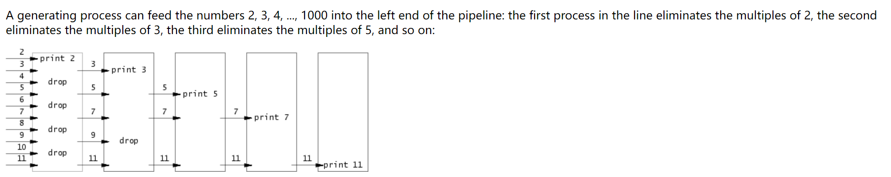

# Task 1: Sleep
> [!code]
> 
```c
#include "kernel/types.h"
#include "kernel/stat.h"
#include "user/user.h"

int main(int argc, char* argv[]) {
    // If the user forgets to pass the argument
    if (argc <= 1) {
        fprintf(2, "usage: sleep [number secs]\n");
        exit(1);
    }

    // Obtain the command line argument, argv[0] is "sleep", argv[1] is the sleep time
    int secs = atoi(argv[1]);

    // Trigger system call
    sleep(secs);

    // Make sure to run this
    exit(0);

}
```
> [!code] Test Output
> 


# Task 2: Pingpong
> [!code]
> 
> The low-level api we use:
> 1. `read(fd, buf, size)`, read `size` bytes from fd to `buf`, return the number of bytes read, can have [Short Counts](../../../Machine_Structures/8_Linking_OS_Processes/System_Level_IO.md#Short%20Counts) problems. Return `-1` if failed, `0` on EOF.
> 2. `write(fd, buf, size)`, write `size` bytes from `buf` to `fd`, return the number of bytes written, `-1` on failed.
```c
#include "kernel/types.h"
#include "kernel/stat.h"
#include "user/user.h"

int main(int argc, char* argv[]) {
    // Initialize the pipe variable
    int p[2];
    pipe(p);
    
    // Fork a child
    if (fork() == 0) {
        // Child
        int cpid = getpid();
        char buf[1];
        // Child first read from the parent, blocking itself until parent process
        // write something to the write end of the pipe.
        if (read(p[0], buf, 1) != 1) {
            fprintf(2, "failed to read in child process!");
            exit(1);
        }
        fprintf(1, "%d: received ping\n", cpid);
        close(p[0]);
        buf[0] = 'b';
        // Child Process then makes response to the parent process.
        if (write(p[1], buf, 1) != 1) {
            fprintf(2, "failed to write in child process!");
            exit(1);
        }
        close(p[1]);
    } else {
        //Parent
        int ppid = getpid();
        char buf[1];
        buf[0] = 'b';
        // Parent first send a byte to the pipe write end first
        if (write(p[1], buf, 1) != 1) {
            fprintf(2, "failed to write in parent process!");
            exit(1);
        };
        close(p[1]);
        // Parent then block itself to wait child process's sending
        if (read(p[0], buf, 1) != 1) {
            fprintf(2, "failed to read in parent process!");
            exit(1);
        };
        fprintf(1, "%d: received pong\n", ppid);
        close(p[0]);
    }
    exit(0);
}
```
> [!code] Test Output
> 


# Task 3: Primes - Pipe
> [!code]
> 
> Parent can let the child know that it has finished writing content to the write end of the pipe by closing the write end of the pipe, where it essentially sends an EOF (End-Of-File) to the reading end of the pipe. Then when child process attempts to read(pipe[0],...), it returns 0.
```c
#include "kernel/types.h"
#include "kernel/stat.h"
#include "user/user.h"


void fork_recurse(int left_fd[2]) {

    /* For the current process
     - left_fd is the pipe connecting from it parent process to itself
     - right_fd is the pipe connecting from itself to its immediate child process.
     - At the same time both ends of left_fd and right_fd are managed (later closed) by current process
     - But the current process don't need:
	     - left_fd[1] since current process don't have to communicate with parent process
	     - right_fd[0] since current process don't have to read from the child process, only write to child process.
    */
    int prime_buf;
    close(left_fd[1]);

    int rbytes = read(left_fd[0], &prime_buf, 4);
    if (rbytes == -1) {
        fprintf(2,  "Error occurrred during read, child process pid: %d", getpid());
        exit(1);
    }

    int curr_num = prime_buf;
	printf("prime %d\n", prime_buf);

	// We split by fork() only from here, since all the above is done 
	// before split.

	// Here the termination condition is bytes == 0, where the parent has nothing to write to the child and the child exit(0) and return;
	// When the parent process closes the write end of a pipe, it essentially sends an EOF (End-Of-File) to the reading end of the pipe.
    int bytes = read(left_fd[0], &curr_num, 4);
    if (bytes != 0 && bytes != -1) {
        int right_fd[2]; 
        pipe(right_fd);
        if (fork() == 0) {
            fork_recurse(right_fd);
        } else {
            close(right_fd[0]);
            // While curr process is still waiting for parent process to 
            // send integers and no error
            while (bytes !=-1 && bytes != 0) {
                if (curr_num % prime_buf != 0) {
                    // Pass onto the right
                    int wbytes = write(right_fd[1], &curr_num, 4);
                    if (wbytes == -1) {
                        fprintf(2, "Error occurrred during write, child process pid: %d", getpid());
                        exit(1);
                    }
                }
                // Iter++
                bytes = read(left_fd[0], &curr_num, 4);
                if (bytes == -1) {
                    fprintf(2, "Error occurrred during write, child process pid: %d", getpid());
                    exit(1);
                }
            }
            if (bytes == -1) {
                fprintf(2, "Error occurrred during write, child process pid: %d", getpid());
                exit(1);
            }
            close(left_fd[0]);
            close(right_fd[1]);
            wait(0); // wait() only waits for any immediate child once, if it has multiple immediate child, it has to wait multiple times by calling wait(0) multiple times.
        }
    }

    if (bytes == -1) {
        fprintf(2, "Error occurrred during write, child process pid: %d", getpid());
        exit(1);
    }
    
    // Wait for any immediate child process to terminate
    exit(0);
}


int main(int argc, char* argv[]) {
    int p[2];

    pipe(p);
    if (fork() == 0) {
        fork_recurse(p);
    } else {
        close(p[0]); // Parent process don't have to read from anything.
        // This will be our first process, generating sequence of numbers from 2 to 35
        for (int i = 2; i < 35; i++) {
            int bytes = write(p[1], &i, 4);
            if (bytes == -1) {
                fprintf(2, "Error occurred while writing!");
                exit(1);
            }
        }
        close(p[1]); // Parent finish writing to the pipe.
    }
    
    int status;
    wait(&status);
    exit(0);
}

```
> [!code] Test Output
> 


# Task 4: Find 
> [!code]
> 
> Usage of `ls <filepath 1> <filepath 2> <flags>` on linux system:
> 
> 
> Usage of `ls filename/filepath` on xv6 system.
> 
> The idea is simple: We just need to modify the `ls.c` implementation of directory reading procedure, the code are detailedly commented.
```c
#include "kernel/types.h"
#include "kernel/stat.h"
#include "user/user.h"
#include "kernel/fs.h"

void find(char* path, char* filename) {
    char buf[512], *p;
    int fd;
    struct dirent de;
    struct stat st;

    // path = "root", where root could be "." or "dir", etc
    if((fd = open(path, 0)) < 0){
        fprintf(2, "find: cannot open %s\n", path);
        return;
    }

    if(fstat(fd, &st) < 0){
        fprintf(2, "find: cannot stat %s\n", path);
        close(fd);
        return;
    }
    switch(st.type){
    // Fail fast, if user pass in a filename as the first argument, exit directly
    case T_FILE:
        fprintf(2, "Usage: find dir file\n");
        exit(1);
    case T_DIR:
        // "root/14-bytes-dir-name/" here 1 and 1 are just slash
        // If the longest path possible in the system is more than 512 bytes, then break;
        if(strlen(path) + 1 + DIRSIZ + 1 > sizeof buf){
            printf("ls: path too long\n"); // Path is longer than 512 bytes
            break;
        }

        // Construct root/curr_dirname or root/curr_filename
        // Copy "root" to buf
        strcpy(buf, path);
        // Put a slash a the end, getting "root/"
        p = buf+strlen(buf);
        *p++ = '/';

        // Read through the directory, we fould get all the filename from fd descriptor
        while(read(fd, &de, sizeof(de)) == sizeof(de)){
            char* cur_dirname = de.name;
            // File doesn't exist or if the directory is . or .., skip, otherwise infinite loop
            if(de.inum == 0 || strcmp(cur_dirname, ".") == 0 || strcmp(cur_dirname, "..") == 0)
                continue;
            // Find all the successors
            // Append the filename/dirname at the end to p
            memmove(p, cur_dirname, DIRSIZ);
            // Terminate the successor path with \0
            p[DIRSIZ] = 0;

            // Check our newly constructed path, is it valid?
            if(stat(buf, &st) < 0){
                printf("ls: cannot stat %s\n", buf);
                continue;
            }

			// See if the type of the new path is directory or file
            if (st.type == T_DIR) {
                // Recurse into the directory
                find(buf, filename);
            } else if (st.type == T_FILE) {
                if (strcmp(de.name, filename) == 0)
                    {
	                    // Termination point, don't have to recurse
                        printf("%s\n", buf);
                    }
            }
        }
        break;
    }
    close(fd);
}


int main(int argc, char* argv[]) {

    if (argc != 3) {
        fprintf(2, "Argument number mismatch!");
        exit(1);
    }

    find(argv[1], argv[2]);

    exit(0);
}


```
> [!code] Test Output
> 


# Task 5: Xargs 
> [!code]
> 
> See [I/O Redirection](../../2_Abstractions/3_Sockets_IPCs.md#Pipes#I/O%20Redirection) for the idea of `echo ... | ...`.
```c
#include "kernel/types.h"
#include "kernel/stat.h"
#include "user/user.h"
#include "kernel/param.h"

#define MAXLEN 100
int main(int argc, char *argv[]) 
{
    if(argc <= 1) {
        fprintf(2, "usage: xargs command (arg...)\n");
        exit(1);
    }
    char *command = argv[1];
    char buf;
    char new_argv[MAXARG][MAXLEN]; // assuming the maximun single parameter length is 512
    char *p_new_argv[MAXARG];

    while(1) {
        memset(new_argv, 0, MAXARG * MAXLEN); // reset the parameter

        for(int i = 1; i < argc; ++i) {
            strcpy(new_argv[i-1], argv[i]);
        }

        int cur_argc = argc - 1;
        int offset = 0;
        int is_read = 0;

        while((is_read = read(0, &buf, 1)) > 0) {
            if(buf == ' ') {
                cur_argc++;
                offset = 0; 
                continue;
            }
            if(buf == '\n') {
                break;
            }
            if(offset==MAXLEN) {
                fprintf(2, "xargs: parameter too long\n");
                exit(1);
            }
            if(cur_argc == MAXARG) {
                fprintf(2, "xargs: too many arguments\n");
                exit(1);
            }
            new_argv[cur_argc][offset++] = buf;
        }

        if(is_read <= 0) {
            break;
        } 
        for(int i = 0; i <= cur_argc; ++i) {
            p_new_argv[i] = new_argv[i];
        }
        if(fork() == 0) {
            exec(command, p_new_argv);
            exit(1);
        } 
        wait((int*) 0);
    }
    exit(0);
}
```
> [!code] Test Output
> 


