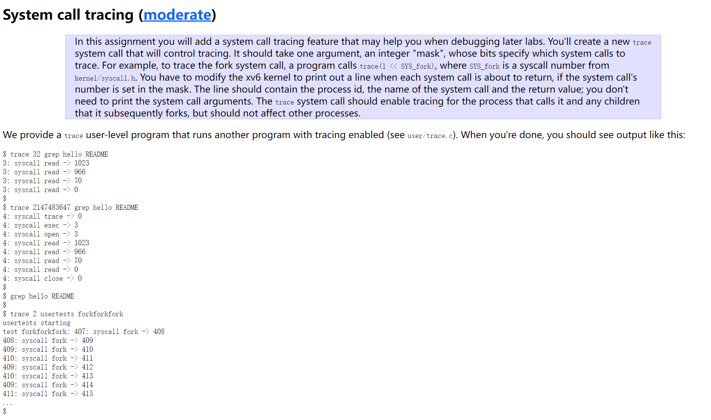
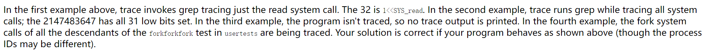
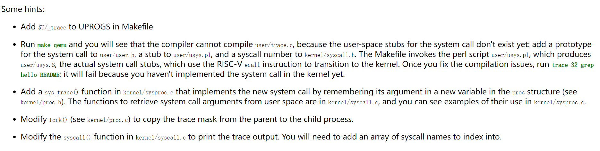
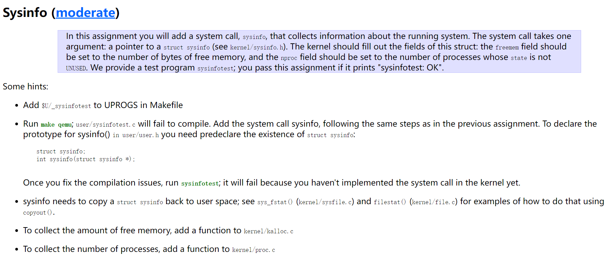
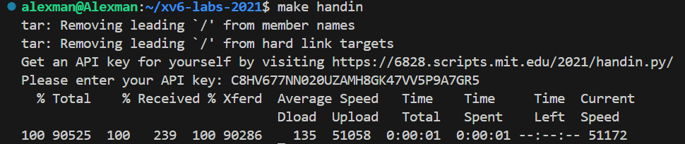
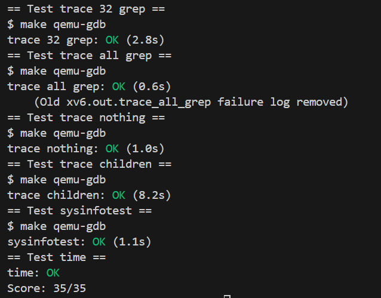

# Preliminaries
## OS File Organizations


## System Startup


# Systrace
> [!important]
> Remember to checkout to `syscall` branch before this lab.


## Task
> [!task]
> 


## Design Ideas
> [!hint]
> 
> 整体思路是，用户在执行`trace`命令的时候，会先解析参数和需要被`trace`的指令名称和参数。
> - 例如，用户执行`trace 32 grep hello README`, 表示用户想要追踪所有在`grep hello README`执行过程中所调用的编号为`5`的系统调用(因为$2^5=32$), 也就是`SYS_READ`。
> - 用户程序`user/trace.c`主要负责解析参数
> 	- 如果`trace`的参数`trace_mask`不是数字，则直接退出程序，不触发系统调用
> 	- 否则，执行系统调用`sys_trace`(定义在`sysproc.c`中)。
> - 系统调用`kernel/sysproc.c/sys_trace`主要负责从`trapframe`上获取`trace_mask`
> - `proc.c/fork()`将父进程(也就是触发`trace`系统调用的进程)中的`trace_mask`拷贝到子进程(也就是使用`exec()`执行`grep hello README`的进程)中。
> - `syscall.c/syscall()`函数负责系统调用的执行
> 	- 当`user/trace.c`被执行时，先触发了系统调用执行这个函数，因为`trace`本身没有被追踪(`p->trace_mask`的值为默认值，没有被父进程设置过)，所以直接执行返回，不打印任何日志。
> 	- 而当`exec()`线程执行`grep hello README`时，由于父进程已经将其`trace_mask`在`fork()`的时候就设置为了`0x100000`, 所以需要被追踪, 同时明确了`SYS_READ`需要被追踪。
> 	- 因为在`user/grep.c`中触发了`read()`系统调用，且`trace_mask`也吻合，所以当`read`系统调用出发了`syscall.c/syscall()`函数时，就会打印日志。

## Important Files
> [!code] Modified Files
``` c
/* user/trace.c */

int
main(int argc, char *argv[])
{
  int i;
  char *nargv[MAXARG];


  // See if the trace_mask argument is a number
  if(argc < 3 || (argv[1][0] < '0' || argv[1][0] > '9')){
    fprintf(2, "Usage: %s mask command\n", argv[0]);
    exit(1);
  }

  // Convert trace_mask to int and call the sys_trace here
  if (trace(atoi(argv[1])) < 0) {
    fprintf(2, "%s: trace failed\n", argv[0]);
    exit(1);
  }
  
  for(i = 2; i < argc && i < MAXARG; i++){
    nargv[i-2] = argv[i];
  }

  // Execute the user program, since exec() will call fork
  /**
    e.g trace 32 grep hello README, it will execute "grep" with arguments hello and README
   */
  exec(nargv[0], nargv);
  exit(0);
}

/* -------------------------------------------------------------------*/

/* syscall.c */
void
syscall(void)
{
  int num;
  struct proc *p = myproc();

  // Get the current syscall number
  num = p->trapframe->a7;
  if(num > 0 && num < NELEM(syscalls) && syscalls[num]) {
    uint64 return_value = syscalls[num]();
    // We have to get the trace_mask after the syscall to make sure trace_mask is well-received, so that trace itself can actually be traced, if you get the p-> trace_mask before doing the syscalls, then otherwise would happen.
    p->trapframe->a0 = return_value;
    if ( p -> trace_mask & (0x1 << num)) {
      // log
      printf("%d: syscall %s -> %d\n", p->pid, syscalls_name[num], return_value);
    }
  } else {
    printf("%d %s: unknown sys call %d\n",
            p->pid, p->name, num);
    p->trapframe->a0 = -1;
  }
}


/* -------------------------------------------------------------------*/

/* sysproc.c */
uint64 
sys_trace(void) {
  int mask;

  // 从trapframe上获取0th argument 到mask上
  if(argint(0, &mask) < 0)
    return -1;

  // save the trace_mask in the parent process
  myproc()->trace_mask = mask;
  return 0;

}


/* -------------------------------------------------------------------*/

/* proc.c */
// Create a new process, copying the parent.
// Sets up child kernel stack to return as if from fork() system call.
int
fork(void)
{
  int i, pid;
  struct proc *np; // child
  struct proc *p = myproc();  // parent

  // Allocate process.
  if((np = allocproc()) == 0){
    return -1;
  }

  // Copy user memory from parent to child.
  if(uvmcopy(p->pagetable, np->pagetable, p->sz) < 0){
    freeproc(np);
    release(&np->lock);
    return -1;
  }
  np->sz = p->sz;

  // copy saved user registers.
  *(np->trapframe) = *(p->trapframe);


  // Added for lab2: copy parent's trace_mask to child 
  np->trace_mask = p -> trace_mask;

  // Cause fork to return 0 in the child.
  np->trapframe->a0 = 0;

  // increment reference counts on open file descriptors.
  for(i = 0; i < NOFILE; i++)
    if(p->ofile[i])
      np->ofile[i] = filedup(p->ofile[i]);
  np->cwd = idup(p->cwd);

  safestrcpy(np->name, p->name, sizeof(p->name));

  pid = np->pid;

  release(&np->lock);

  acquire(&wait_lock);
  np->parent = p;
  release(&wait_lock);

  acquire(&np->lock);
  np->state = RUNNABLE;
  release(&np->lock);

  return pid;
}

```


## Optional: Print Syscall arguments
> [!code]
```c


```


# Sysinfo
## Task
> [!task]
> 


## Important Files
> [!code]
```c
/** kalloc.c */
// Find total number of free bytes
uint64 free_mem_bytes(void) {
  uint64 free_mem_bytes = 0;
  struct run *r = kmem.freelist;

  acquire(&kmem.lock);
  while(r) {
    free_mem_bytes += PGSIZE;
    r = r->next;
  }
    
  release(&kmem.lock);

  return free_mem_bytes;
}


/** proc.c */
// Find the total number of processes that is not in UNUSED state
uint64 num_proc_active(void) {
  uint64 num = 0;
  struct proc *p;

  
  for(p = proc; p < &proc[NPROC]; p++) {
    acquire(&p->lock);
    if(p->state != UNUSED) {
      num++;
    }
    release(&p->lock);
  }
  
  return num;
}


/** sysproc.c */
uint64
sys_sysinfo(void) {
  
  struct proc* p = myproc();
  uint64 user_pointer; // user pointer to struct sysinfo

  struct sysinfo kernel_pointer; // kernel pointer to the struct sysinfo

  (&kernel_pointer) -> nproc = num_proc_active();
  (&kernel_pointer) -> freemem = free_mem_bytes();

  // argaddr is defined in syscall.c and declared in "defs.h", which is included
  if(argaddr(0, &user_pointer) < 0)
    return -1;

  // copyout is defined in vm.c and declared in "defs.h", which is included, copy from kernel_pointer to user_pointer
  if(copyout(p->pagetable, user_pointer, (char *)&kernel_pointer, sizeof(struct sysinfo)) < 0)
      return -1;

  return 0;
}


```


# Submission
> [!test]
> 


