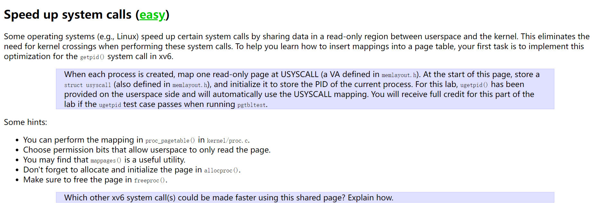
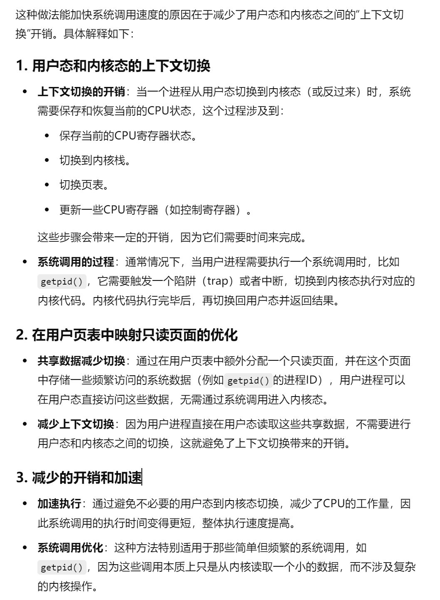
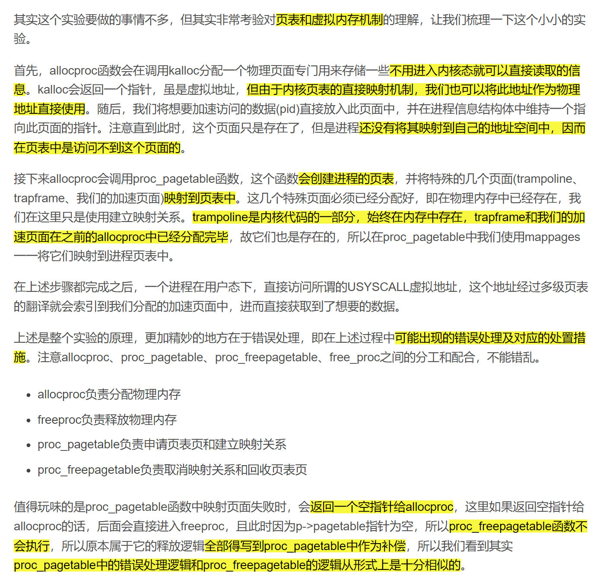
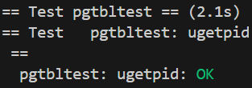
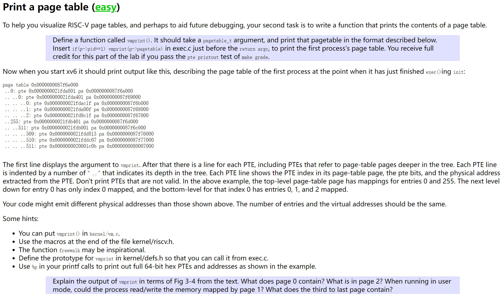
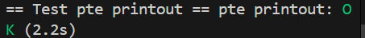
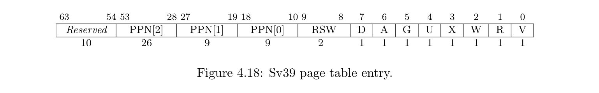
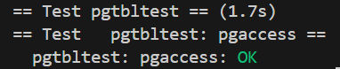

# Speed up System Calls(Easy)
> [!task]
> 
> 第一个任务是加速系统调用，主要做法就是==在创建进程时==在用户页表中额外分配一个==只读的页面==，这样就可以在执行特定系统调用时==直接从用户页表中读出数据并返回==，==减少在用户态和内核态之间的穿越次数==，从而减少系统调用的开销，加速执行过程
> 
> 


## allocproc
```c
// 译：查找进程表，找到UNUSED状态的进程
// 如果找到了UNUSED状态的进程，那么初始化它的状态，使其能在内核态下运行
// 并且返回时不占用锁
// 如果没有空闲进程，或内存分配失败，则返回0
static struct proc*
allocproc(void)
{
  struct proc *p;

  // 遍历进程组，寻找处于UNUSED状态的进程
  for(p = proc; p < &proc[NPROC]; p++) {
    // 首先获取进程的锁，保证访问安全
    acquire(&p->lock);

    // 如果进程状态为UNUSED，则跳转至found
    if(p->state == UNUSED) {
      goto found;
    } else {
      // 否则释放锁，检查下一个进程是否为UNUSED状态
      release(&p->lock);
    }
  }
  return 0;

// 以下是初始化一个进程的代码
found:
  // 为当前进程分配PID，并将当前进程状态改为USED
  p->pid = allocpid();
  p->state = USED;

  // Allocate a trapframe page.
  // 分配一个trapframe页，如果不成功则释放当前进程和锁, kalloc()返回的都是物理地址，可用于后续页表映射
  if((p->trapframe = (struct trapframe *)kalloc()) == 0){
    freeproc(p);
    release(&p->lock);
    return 0;
  }

  // Added, 仿照上面的写法
  if((p->usyscall = (struct usyscall *)kalloc()) == 0){
    freeproc(p);
    release(&p->lock);
    return 0;
  }

  // <将pid信息放入结构体，其实也就是放到了这个物理页面开头处>
  p->usyscall->pid = p->pid;

  // An empty user page table.
  p->pagetable = proc_pagetable(p);
  if(p->pagetable == 0){
	// 用户页表分配失败，直接调用freeproc
    freeproc(p);
    release(&p->lock);
    return 0;
  }

  // Set up new context to start executing at forkret,
  // which returns to user space.
  memset(&p->context, 0, sizeof(p->context));
  p->context.ra = (uint64)forkret;
  p->context.sp = p->kstack + PGSIZE;

  return p;
}


```


## freeproc
```c
// free a proc structure and the data hanging from it,
// including user pages.
// p->lock must be held.
static void
freeproc(struct proc *p)
{
  if(p->trapframe)
    kfree((void*)p->trapframe);
  p->trapframe = 0;
  if(p->pagetable)
    proc_freepagetable(p->pagetable, p->sz);
  p->pagetable = 0;
  p->sz = 0;
  p->pid = 0;
  p->parent = 0;
  p->name[0] = 0;
  p->chan = 0;
  p->killed = 0;
  p->xstate = 0;
  p->state = UNUSED;
}

```


## proc_pagetable
```c
// Create a user page table for a given process,
// with no user memory, but with trampoline pages.
pagetable_t
proc_pagetable(struct proc *p)
{
  pagetable_t pagetable;

  // An empty page table.
  // 创建一个空的用户页表，当内存耗尽时返回空指针(物理地址，因为调用了kalloc)
  pagetable = uvmcreate();
  if(pagetable == 0)
    return 0;

  // Initialize mapping, making references to page 39 of xv6 book

  // map the trampoline code (for system call return)
  // at the highest user virtual address.
  // only the supervisor uses it, on the way
  // to/from user space, so not PTE_U.
  if(mappages(pagetable, TRAMPOLINE, PGSIZE,
              (uint64)trampoline, PTE_R | PTE_X) < 0){
    // 如果出错，用uvmfree释放用户进程页表
    uvmfree(pagetable, 0);
    return 0;
  }

  // map the trapframe just below TRAMPOLINE, for trampoline.S.
  if(mappages(pagetable, TRAPFRAME, PGSIZE,
              (uint64)(p->trapframe), PTE_R | PTE_W) < 0){
    // 如果出错，首先取消TRAMPOLINE的映射关系，再使用uvmfree释放页表映射关系，回收页表
    uvmunmap(pagetable, TRAMPOLINE, 1, 0);
    uvmfree(pagetable, 0);
    return 0;
  }

  // Added, 使用mappages将此页映射到页表中
  // 如果出错要释放映射trampoline和trapframe的映射关系
  // 并释放pagetable的内存，返回空指针
  if (mappages(pagetable, USYSCALL, PGSIZE, 
              (uint64)(p->usyscall), PTE_R | PTE_U) < 0) {
    uvmunmap(pagetable, TRAMPOLINE, 1, 0);
    uvmunmap(pagetable, TRAPFRAME, 1, 0);
    uvmfree(pagetable, 0);
    return 0;
  }  

  return pagetable;
}

```

## proc_freepagetable
```c
void
proc_freepagetable(pagetable_t pagetable, uint64 sz)
{
  // 解除TRAMPOLINE和TRAPFRAME的映射关系
  // 之所以要分开来写是因为它们和连续的地址空间是分离的
  // 连续空间的话使用uvmfree一套解决
  uvmunmap(pagetable, TRAMPOLINE, 1, 0);
  uvmunmap(pagetable, TRAPFRAME, 1, 0);
  uvmunmap(pagetable, USYSCALL, 1, 0); // Added
  uvmfree(pagetable, sz);
}
```


## Test
> [!test]
> 执行`./grade-lab-pgtbl ugetpid`
> 


# Print A Page Table(Easy)
> [!task]
> 
> 第二个小任务也很简单，就是将一个进程的页表按照指定格式打印出来。按照实验指导书所述，这个函数的格式应该和`freewalk`非常相似，所以应该是一个递归的逻辑，所以我们就参照这个函数的格式来写。但是最困难的地方可能在于控制打印格式，所以我首先定义了`vmprint_helper`函数，这个函数的作用在于按照页表的层次打印指定数量的缩进符。


## vm.c
```python
void vmprint(pagetable_t pagetable) {
  printf("page table %p\n", pagetable);
  vmprint_helper(pagetable, 0);
}


static void vmprint_helper(pagetable_t pagetable, int level) {

  for(int i = 0; i < 512; i++){
    pte_t pte = pagetable[i];
    // 注意，这里通过标志位的设置来判断是否到达了叶级页表
    // 如果有效位为1，且读位、写位、可执行位都是0
    // 说明这是一个高级别(非叶级)页表项
    if((pte & PTE_V) && (pte & (PTE_R|PTE_W|PTE_X)) == 0){
      // this PTE points to a lower-level page table.
      uint64 child = PTE2PA(pte);
      for( ; level != 0 ; --level)
        printf(".. ");
      printf("..%d: pte %p pa %p\n", i, pte, PTE2PA(pte));
      vmprint_helper((pagetable_t)child, level + 1);
    // 如果有效位为1，且读位、写位、可执行位有一位为1
    // 表示这是一个叶级PTE
    } else if(pte & PTE_V){
      printf(".. .. ..%d: pte %p pa %p\n", i, pte, PTE2PA(pte));
    }
  }
}
```


## Test
> [!test]
> 


# Detect Page Access(Hard)
> [!task]
> 


## riscv.h
```c
#define PTE_A (1L << 6) // Added, access bit in pte
#define MAXSCAN 32      // <限制一次最多可以查询的页面数量>
```


## sysproc.c
```c
#ifdef LAB_PGTBL
int
sys_pgaccess(void)
{
  // lab pgtbl: your code here.
  uint64 bitmask = 0;

  uint64 va;
  int npages;
  uint64 ua;
  
  if (argint(1, &npages) < 0) {
    return -1;
  }

  // 超过最大扫描页面数量的限制
  if (npages > MAXSCAN) {
    return -1;
  }

  if (argaddr(0, &va) < 0) {
    return -1;
  }
  if (argaddr(2, &ua) < 0) {
    return -1;
  }

  pagetable_t proc_pagetable = myproc() -> pagetable;
  for (int i = 0; i < npages; i++) {
    pte_t* pte_addr;
    if((pte_addr = walk(proc_pagetable, va + i * PGSIZE, 0)) > 0) {
      if (*pte_addr & PTE_A) {
        bitmask |= (1L << i);
        // Reset
        *pte_addr &= ~PTE_A;
      }
    } else {
      panic("pgaccess : walk failed");
    }
  }

  // 拷贝到用户空间
  if (copyout(proc_pagetable, ua, (char*) &bitmask, sizeof(bitmask)) < 0) {
    return -1;
  }

  return 0;
}
#endif
```


## Test
> [!test]
> 

