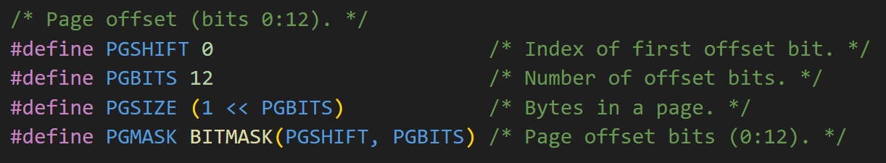
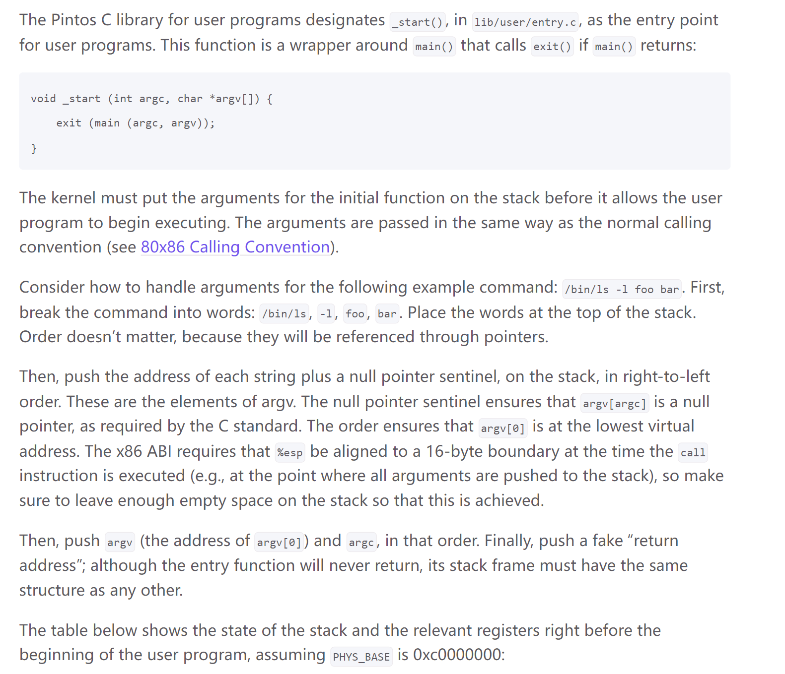
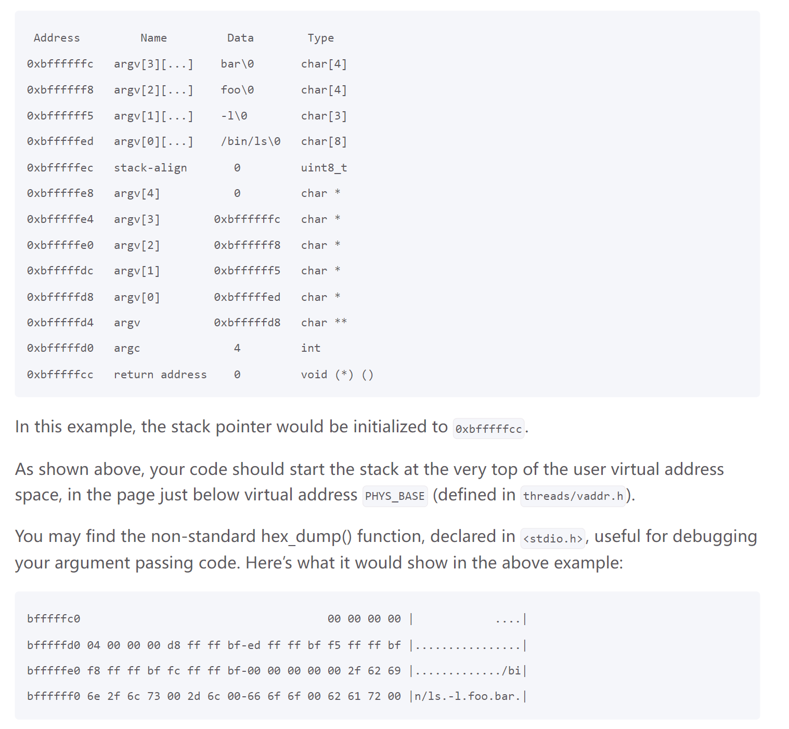
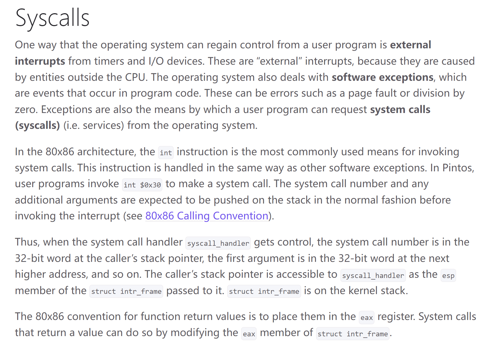
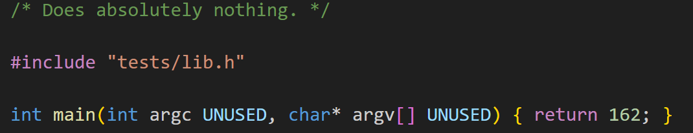
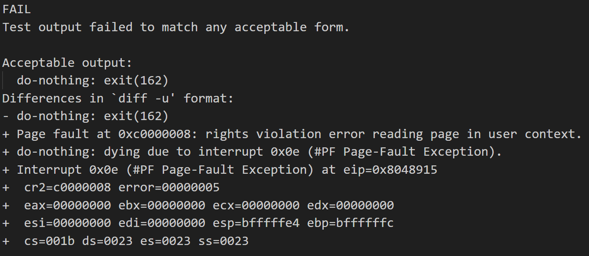
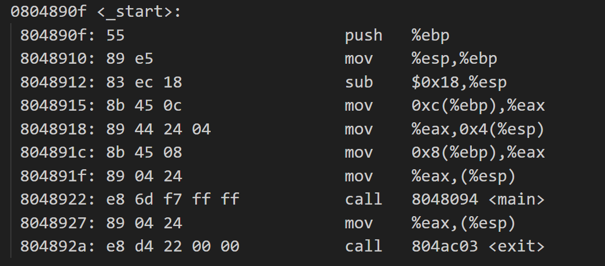
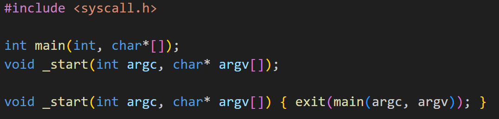

# Pintos Overview
## Virtual Memory Layout
> [!important]
> The virtual memory space is `0x0 ~ 0xffffffff`(4GB) since it uses 32 bit address, which converts to $2^{32}$ bytes = $2^{2} =4GB$ in total.
> - User virtual memory ranges from `0x0 ~ 0xc0000000`(3GB)
> - Kernel virtual memory ranges from `0xc0000000 ~ 0xffffffff`(1GB). Kernel virtual memory maps `0xc0000000` to `0x0` in physical memory space.
> 
> As we navigate into `threads/vddr.h` and `threads/pte.h`, we see that 
> the page offset is 12 bit, which means:
> - There are $2^{32-12}=2^{20}$ PTEs in the page table.
> - Each page is $2^{12-10}=4KB$


## Accessing User Memory
> [!important]
> As part of a system call, the kernel must often access memory through pointers provided by a user program. The kernel must be very careful about doing so, because the user can pass a null pointer, a pointer to unmapped virtual memory, or a pointer to kernel virtual address space (above `PHYS_BASE`). All of these types of invalid pointers must be rejected without harm to the kernel or other running processes, by terminating the offending process and freeing its resources.
> 
> There are at least two reasonable ways to do this correctly:
> - Verify the validity of a user-provided pointer, then dereference it. If you choose this route, you’ll want to look at the functions in `userprog/pagedir.c` and in `threads/vaddr.h`. This is the simplest way to handle user memory access.
> - Check only that a user pointer points below `PHYS_BASE`, then dereference it. An invalid user pointer will cause a “page fault” that you can handle by modifying the code for `page_fault()` in `userprog/exception.c`. This technique is normally faster because it takes advantage of the processor’s MMU, so it tends to be used in real kernels (including Linux).
> 
> In either case, you need to make sure not to “leak” resources. For example, suppose that your system call has acquired a lock or allocated memory with `malloc()`. 
> 
> If you encounter an invalid user pointer afterward, you must still be sure to release the lock or free the page of memory. 
> 
> If you choose to verify user pointers before dereferencing them, this should be straightforward. It’s more difficult to handle if an invalid pointer causes a page fault, because there’s no way to return an error code from a memory access. 
> 
> Therefore, for those who want to try the latter technique, we’ll provide a little bit of helpful code:
```c
/* Reads a byte at user virtual address UADDR.
   UADDR must be below PHYS_BASE.
   Returns the byte value if successful,
   -1 if a segfault occurred. */
static int get_user (const uint8_t *uaddr) {
    int result;
    asm ("movl $1f, %0; movzbl %1, %0; 1:"
    : "=&a" (result) : "m" (*uaddr));
    return result;
}


/* Writes BYTE to user address UDST.
   UDST must be below PHYS_BASE.
   Returns true if successful,
   false if a segfault occurred. */
static bool put_user (uint8_t *udst, uint8_t byte) {
    int error_code;
    asm ("movl $1f, %0; movb %b2, %1; 1:"
    : "=&a" (error_code), "=m" (*udst) : "q" (byte));
    return error_code != -1;
}
```
> [!exp]
> Each of these functions assumes that the user address has already been verified to be below `PHYS_BASE`. They also assume that you’ve modified `page_fault()` so that a page fault in the kernel merely sets `eax` to `0xffffffff` and copies its former value into `eip`.
> 
> If you do choose to use the second option (rely on the processor’s MMU to detect bad user pointers), do not feel pressured to use the `get_user` and `put_user` functions from above. There are other ways to modify the page fault handler to identify and terminate processes that pass bad pointers as arguments to system calls, some of which are simpler and faster than using `get_user` and `put_user` to handle each byte.


## Program Startup Details
> [!important]
> 


## Syscalls
> [!def]
> 
> In essence, when a user program uses trap(synchonous) to invoke a system call, it will push the system call number, arguments to the system call from lower address to higher address. These arguments will then be passed to the corresponding system call handlers through a `struct intr_frame` data structure that contains the `%esp` which points to the arguments list.
> 
> When the system call handler finishes executing and are ready to give the control back to user program, it simply modifies the `eax` member of `struct intr_frame` and gives back control. The caller user program can check the `eax` member and get the return value.
> 
> In other words, the bridge between the caller program and system call handler program is this `struct intr_frame`.


## Threads
### Thread Struct
> [!def]


## Processes


# Task 0: Finding the faulting Instruction
> [!task]
> - First compile the `proj-pregame/src/tests/userprog/do-nothing.c` with `make`
> 
> - Then direct to `proj-pregame/src/userprog/build/tests/userprog/do-nothing.result` and observe:
> 
> 	- The virtual memory that the program tries to access from userspace is `0xc0000008`. This memory is not allocated for user program. It is protected segment. The current process doesn't have the permission to access this memory address.
> 	- The virtual address of the instruction that resulted in the crash is given in the `%eip` register, which shows `0x8048915`.
> 	- We disassemable the object code with `objdump -D do-nothing.o > do-nothing-dump.txt`
> 	- We can also disassemble the executable file with `objdump -x -d do-nothing` to see the function that the program was in before it crashed. Since `%eip = 0x8048915`, we know that when program crashes, it is in the `_start` function.
> 
> 
> The `_start` function is located in the `proj-pregame/src/lib/user`: 
> 
> 
> 
> The testing framework expected Pintos to output `do-nothing: exit(162)`. This is the standard message that Pintos prints when a process exits (you’ll encounter this again in Project Userprog). However, as shown in the diff, Pintos did not output this message.
> 
> If `main()` function in `do-nothing.c` returns `162` successfully, then the only place that the crash could happen is the `_start` function.
> 
> We notice that from the `do-nothing-dump-exec.txt` file we see that the function is trying to execute `mov 0xc(%ebp), %eax`, since `%ebp = 0xbffffffc`, `0xc(%ebp)` is exactly `0xc0000008`, which is the portion of memory that is right above the stack frame of `_start` function, and belongs to **kernel virtual memory address space**, which is not permissible to user program.


# Task 1: Step through the crash


# Task 2: Debug