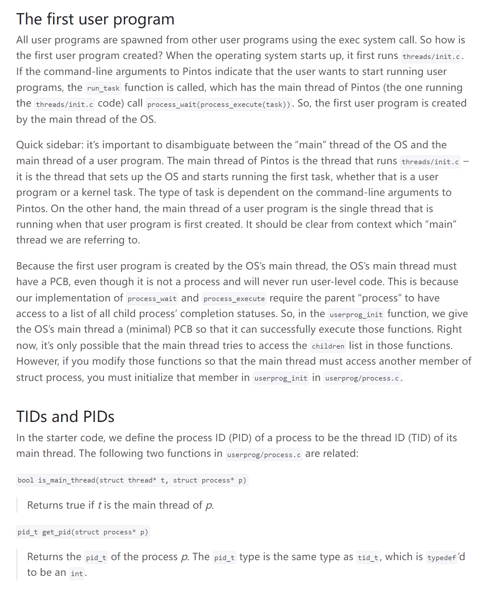
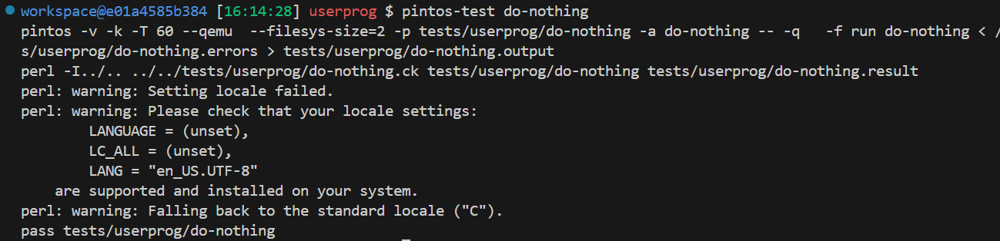
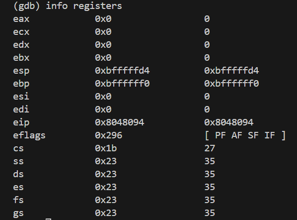
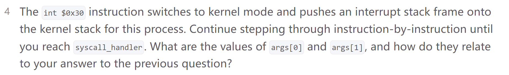

# Pintos Overview
## Virtual Memory Layout
> [!important]
> The virtual memory space is `0x0 ~ 0xffffffff`(4GB) since it uses 32 bit address, which converts to $2^{32}$ bytes = $2^{2} =4GB$ in total.
> - User virtual memory ranges from `0x0 ~ 0xc0000000`(3GB)
> - Kernel virtual memory ranges from `0xc0000000 ~ 0xffffffff`(1GB). Kernel virtual memory maps `0xc0000000` to `0x0` in physical memory space.
> 
> As we navigate into `threads/vddr.h` and `threads/pte.h`, we see that 
> the page offset is 12 bit, which means:
> - There are $2^{32-12}=2^{20}$ PTEs in the page table.
> - Each page is $2^{12-10}=4KB$


## Accessing User Memory
> [!important]
> As part of a system call, the kernel must often access memory through pointers provided by a user program. The kernel must be very careful about doing so, because the user can pass a null pointer, a pointer to unmapped virtual memory, or a pointer to kernel virtual address space (above `PHYS_BASE`). All of these types of invalid pointers must be rejected without harm to the kernel or other running processes, by terminating the offending process and freeing its resources.
> 
> There are at least two reasonable ways to do this correctly:
> - Verify the validity of a user-provided pointer, then dereference it. If you choose this route, you’ll want to look at the functions in `userprog/pagedir.c` and in `threads/vaddr.h`. This is the simplest way to handle user memory access.
> - Check only that a user pointer points below `PHYS_BASE`, then dereference it. An invalid user pointer will cause a “page fault” that you can handle by modifying the code for `page_fault()` in `userprog/exception.c`. This technique is normally faster because it takes advantage of the processor’s MMU, so it tends to be used in real kernels (including Linux).
> 
> In either case, you need to make sure not to “leak” resources. For example, suppose that your system call has acquired a lock or allocated memory with `malloc()`. 
> 
> If you encounter an invalid user pointer afterward, you must still be sure to release the lock or free the page of memory. 
> 
> If you choose to verify user pointers before dereferencing them, this should be straightforward. It’s more difficult to handle if an invalid pointer causes a page fault, because there’s no way to return an error code from a memory access. 
> 
> Therefore, for those who want to try the latter technique, we’ll provide a little bit of helpful code:
```c
/* Reads a byte at user virtual address UADDR.
   UADDR must be below PHYS_BASE.
   Returns the byte value if successful,
   -1 if a segfault occurred. */
static int get_user (const uint8_t *uaddr) {
    int result;
    asm ("movl $1f, %0; movzbl %1, %0; 1:"
    : "=&a" (result) : "m" (*uaddr));
    return result;
}


/* Writes BYTE to user address UDST.
   UDST must be below PHYS_BASE.
   Returns true if successful,
   false if a segfault occurred. */
static bool put_user (uint8_t *udst, uint8_t byte) {
    int error_code;
    asm ("movl $1f, %0; movb %b2, %1; 1:"
    : "=&a" (error_code), "=m" (*udst) : "q" (byte));
    return error_code != -1;
}
```
> [!exp]
> Each of these functions assumes that the user address has already been verified to be below `PHYS_BASE`. They also assume that you’ve modified `page_fault()` so that a page fault in the kernel merely sets `eax` to `0xffffffff` and copies its former value into `eip`.
> 
> If you do choose to use the second option (rely on the processor’s MMU to detect bad user pointers), do not feel pressured to use the `get_user` and `put_user` functions from above. There are other ways to modify the page fault handler to identify and terminate processes that pass bad pointers as arguments to system calls, some of which are simpler and faster than using `get_user` and `put_user` to handle each byte.


## Program Startup Details
> [!important]
> 


## Syscalls
> [!def]
> 
> In essence, when a user program uses trap(synchonous) to invoke a system call, it will push the system call number, arguments to the system call from lower address to higher address. These arguments will then be passed to the corresponding system call handlers through a `struct intr_frame` data structure that contains the `%esp` which points to the arguments list.
> 
> When the system call handler finishes executing and are ready to give the control back to user program, it simply modifies the `eax` member of `struct intr_frame` and gives back control. The caller user program can check the `eax` member and get the return value.
> 
> In other words, the bridge between the caller program and system call handler program is this `struct intr_frame`.


## Threads
### Thread Struct(TCB)
> [!def]
> Each thread struct represents either a pure kernel thread (i.e. a thread that only runs kernel code) or a thread in a user process.
> 
> This layout has two consequences. First, struct thread must not be allowed to grow too big. If it does, then there will not be enough room for the kernel stack. The base struct thread is only a few bytes in size. It probably should stay well under 1 kB.
> 
> Second, kernel stacks must not be allowed to grow too large. If a stack overflows, it will corrupt the thread state. 
> 
> Thus, kernel functions should not allocate large structures or arrays as non-static local variables. Use dynamic allocation with `malloc()` or `palloc_get_page()` instead.
```c
struct thread {
  /* Owned by thread.c. */
  tid_t tid;                 /* Thread identifier. */
  enum thread_status status; /* Thread state. */
  char name[16];             /* Name (for debugging purposes). */
  uint8_t* stack;            /* Saved stack pointer. */
  int priority;              /* Priority. */
  struct list_elem allelem;  /* List element for all threads list. */

  /* Shared between thread.c and synch.c. */
  struct list_elem elem; /* List element. */
}
```
> [!exp]
> - `tid_t`: The thread’s thread identifier or _tid_. Every thread must have a tid that is unique over the entire lifetime of the kernel. By default, `tid_t` is a `typedef` for `int` and each new thread receives the numerically next higher tid, starting from 1 for the initial process.
> - `enum thread_status status`: 
> 	- `THREAD_RUNNING`: The thread is running. Exactly one thread is running at a given time. `thread_current()` returns the running thread.
> 	- `THREAD_READY`: The thread is ready to run, but it’s not running right now. The thread could be selected to run the next time the scheduler is invoked. Ready threads are kept in a doubly linked list called `ready_list`.
> 	- `THREAD_BLOCKED`: The thread is waiting for something, e.g. a lock to become available or an interrupt to be invoked. **The thread won’t be scheduled again until it transitions to the `THREAD_READY` state with a call to `thread_unblock()`.** This is most conveniently done indirectly, using one of the Pintos synchronization primitives that block and unblock threads automatically.
> 	- `THREAD_DYING`: The thread has exited and will be destroyed by the scheduler after switching to the next thread.
> - `char name[16]`: The thread’s name as a string, or at least the first few characters of it.
> - `uint8_t *stack`: This pointer is not in use while the thread is in the `THREAD_RUNNING` state. But when the thread is not running, then in order to prepare for later schduling, the kernel will push the content that is minimally required for thread running onto the stack. Thus the `stack` points to the stack top. When an interrupt occurs, whether in the kernel or a user program, a `struct intr_frame` is pushed onto the stack. When the interrupt occurs in a user program, the `struct intr_frame` is always at the very top of the page.
> - `int priority`: Thread priority. From 0 to 63.
> 
> 


### Thread Functions
> [!important]
> 


## Processes
### Process Struct(PCB)
> [!important]
> Every process is associated with a process control block (PCB), containing all the information needed to manange the process at runtime. In Pintos (as in most operating systems with multithreaded user processes), each thread _within_ a process also owns a data structure known as a Thread Control Block (TCB), which contains information relevant to that thread in particular, including its name, priority, and stack pointer. 
> 
> Any information which is relevant to _all_ threads in the process (e.g. the page directory or name of the process) is instead contained in the PCB. Finally, note that the kernel associates with each user thread exactly one kernel thread to manage privileged operations relevant to the thread.
> 
> In Pintos, the TCB of a thread is stored within the same page as the thread’s stack, at the bottom of the page. This is possible because each thread has its own stack; since there is no stack owned exclusively by the process (and not by any of its child threads), the PCB instead must be stored in the process’ heap via `malloc`, where all of its child threads can access it via pointer. Here the key distinction between thread and process are that:
> - Thread has its own execution stack for function calls. TCB is stored on each thread's own stack(`struct thread` at the bottom and kernel stack at the top, 4KB in total).
> - Process doesn't have its own stack since when OS starts a process, it starts a main thread within this process. We can think of a process's stack being the stack of the threads it mananges.
> - We cannot save process state on the stack since it is used for thread execution. Instead, heap is used to stored PCB.
> 
> A barebones definition of the PCB can be found in the file `userprog/process.c`. You will likely find it necessary to extend this definition in the course of completing the projects.
```c
/* Initializes user programs in the system by ensuring the main
   thread has a minimal PCB so that it can execute and wait for
   the first user process. Any additions to the PCB should be also
   initialized here if main needs those members */
void userprog_init(void) {
  struct thread* t = thread_current();
  bool success;

  /* Allocate process control block
     It is imoprtant that this is a call to calloc and not malloc,
     so that t->pcb->pagedir is guaranteed to be NULL (the kernel's
     page directory) when t->pcb is assigned, because a timer interrupt
     can come at any time and activate our pagedir */
  t->pcb = calloc(sizeof(struct process), 1);
  success = t->pcb != NULL;

  /* Kill the kernel if we did not succeed */
  ASSERT(success);
}
```
> [!code] process.h
```c
/* The process control block for a given process. Since
   there can be multiple threads per process, we need a separate
   PCB from the TCB. All TCBs in a process will have a pointer
   to the PCB, and the PCB will have a pointer to the main thread
   of the process, which is `special`. */
struct process {
  /* Owned by process.c. */
  uint32_t* pagedir;          /* Page directory. */
  char process_name[16];      /* Name of the main thread */
  struct thread* main_thread; /* Pointer to main thread */
};
```


### User Program
> [!important]
> 


## Memory Allocation
### Page Allocator
> [!def]


### Block Allocator
> [!def]


## Inline Assembly
> [!important]
> `asm volatile` is a construct used in C and C++ programming languages to embed assembly language code directly within C or C++ source code. This is part of what's often called "inline assembly"
> 
> 
> Here the `input` goes to the `%0` placeholder and `output` goes to the `%1` placeholder.


# Task 0: Finding the faulting Instruction
> [!task]
> - First compile the `proj-pregame/src/tests/userprog/do-nothing.c` with `make`
> 
> - Then direct to `proj-pregame/src/userprog/build/tests/userprog/do-nothing.result` and observe:
> 
> 	- The virtual memory that the program tries to access from userspace is `0xc0000008`. This memory is not allocated for user program. It is protected segment. The current process doesn't have the permission to access this memory address.
> 	- The virtual address of the instruction that resulted in the crash is given in the `%eip` register, which shows `0x8048915`.
> 	- We disassemable the object code with `objdump -D do-nothing.o > do-nothing-dump.txt`
> 	- We can also disassemble the executable file with `objdump -x -d do-nothing > do-nothing-exec-dump.txt`  to see the function that the program was in before it crashed. Since `%eip = 0x8048915`, we know that when program crashes, it is in the `_start` function.
> 
> 
> The `_start` function is located in the `proj-pregame/src/lib/user`: 
> 
> 
> 
> The testing framework expected Pintos to output `do-nothing: exit(162)`. This is the standard message that Pintos prints when a process exits (you’ll encounter this again in Project Userprog). However, as shown in the diff, Pintos did not output this message.
> 
> If `main()` function in `do-nothing.c` returns `162` successfully, then the only place that the crash could happen is the `_start` function.
> 
> We notice that from the `do-nothing-dump-exec.txt` file we see that the function is trying to execute `mov 0xc(%ebp), %eax`, since `%ebp = 0xbffffffc`, `0xc(%ebp)` is exactly `0xc0000008`, which is the portion of memory that is right above the stack frame of `_start` function, and belongs to **kernel virtual memory address space**, which is not permissible to user program.


# Task 1: Step through the crash
## Boot the Machine
> [!task]
> 


## Checkout the Thread Linked List
> [!task]
> 
> We can see that while our program stops at the first line of `run_task()`, there are two threads running:
> - Main thread that starts at `0xc000e000` 
> - Idle thread that starts at `0xc0104000`
> 
> 
> 
> After we step into `process_execute()` function, we get:
> 
> the same as above, so we can see that the main thread of OS is responsible for executing all the codes from the start.


## Backtrace current thread in kernel space
> [!task]
> 


## Executing User Program
### Start a thread for user program
> [!task]
> 
> The `process-execute()` function creates a new thread that is responsible for executing the `do-nothing` user program and set the name of this thread to `do-nothing`.
> 
> 
> Inside the thread's function, we have: 
> 
> 
> Now if we attempt to visualize all the threads in the memory, we have:
> 
> 
> So we know that the name of the thread is `do-nothing` and the address is `0xc010b000`.


### Load program into memory
> [!task]
> 
> 
> We see that the `load()` function sets the `eip` to be an address of the instruction, and `esp` to be the top of user virtual memory space(`0xc0000000`) and execute the user program.
> 
> Pay attention to the value of `eip = 0x0804890f`, which is an user virtual memory address.
> 
> Also notice that `esp = 0xc0000000`, which is the stack pointer that we want to recover before executing user program.


### Pushing the argument with interrupt frame
> [!code]
> 
```c
/* Interrupt exit.

   Restores the caller's registers, discards extra data on the
   stack, and returns to the caller.

   This is a separate function because it is called directly when
   we launch a new user process (see start_process() in
   userprog/process.c). */
.globl intr_exit
.func intr_exit
intr_exit:
	/* Restore caller's registers. */
	popal   /* This instruction deserves closer inspection */
	popl %gs
	popl %fs
	popl %es
	popl %ds

        /* Discard `struct intr_frame' vec_no, error_code,
           frame_pointer members. */
	addl $12, %esp

        /* Return to caller. */
	iret
.endfunc

```
> [!exp]
> 


### iret to execute user program
> [!important]
> The key jump here is `iret`, which jumps to the address specified by `%eip`, which is different from `ret` instruction which jumps to the address specified by the top of the stack. 
> 
> More importantly, the `iret` instruction will set the `%esp` to `if_.esp` which is the top of the user space.
> 
> Once we finish executing `iret`, the function returns into userspace(Since when the system boots, it has switched to kernel space.) and execute the code previously specified at `if_.eip = 0x804890f`
> 
> 
> They are exactly the same as the values in `if_`, which validates the argument that the `infr_frame` is the bridge between user program and kernel program.


## Backtrace current thread in user space
> [!task]
> Notice that if you try to get your current location with `backtrace` you’ll only get a hex address. This is because because the debugger only loads in the symbols from the kernel. Now that we are in userspace, we have to load in the symbols from the Pintos executable we are running, namely `do-nothing`. To do this, use `loadusersymbols tests/userprog/do-nothing`. Now, using `backtrace`, you’ll see that you’re currently in the `_start` function.
> 
> 
> Using the `disassemble` and `stepi` commands, step through userspace instruction by instruction until the page fault occurs. At this point, the processor has immediately entered kernel mode to handle the page fault, so `backtrace` will show the current stack in kernel mode, not the user stack at the time of the page fault. However, you can use `btpagefault` to find the user stack at the time of the page fault. Copy down the output of `btpagefault`.
> 
> Notice that the instruction that causes page fault is `0xc(%ebp)`, which is the same as what we have found in task 0, so we succeesfully pinpoint the bug.


# Task 2: Debug
## Debug the do-nothing
> [!task]
> 
> Before we execute the first instruction of `_start()` in `entry.c`, we have `%esp = 0xc0000000` and `%ebp = 0x0`. The `%esp` is previously set by the `load()` function in the `start_process()` in `process.c`. Inside `load()` function, the `setup_stack()` function set the `esp` to `PHYS_BASE`, which is causing the error to happen.
> 
> Since the key instruction that causes the page fault is `0xc(%ebp), %eax` since `0xbffffffc + 0xc > PHYS_BASE`, which is the kernel address space, we just have to set `esp` to `PHYS_BASE - 0xc` so that `0xc(%ebp)` will access `0xbffffffc`, right below the kernel virtual address space.
```c
/* Create a minimal stack by mapping a zeroed page at the top of
   user virtual memory. */
static bool setup_stack(void** esp) {
  uint8_t* kpage;
  bool success = false;

  kpage = palloc_get_page(PAL_USER | PAL_ZERO);
  if (kpage != NULL) {
    success = install_page(((uint8_t*)PHYS_BASE) - PGSIZE, kpage, true);
    if (success)
	  /* buggy: *esp = PHYS_BASE */
      *esp = PHYS_BASE - 0xc; /* Modified */
    else
      palloc_free_page(kpage);
  }
  return success;
}
```
> [!exp]
> After this modification, we will pass the pintos test:
> 


## Debug the stack-align-0
> [!task]
> 
```c
/* Does absolutely nothing. */

#include "tests/lib.h"

int main(int argc UNUSED, char* argv[] UNUSED) {
	/* Tell the gcc to save variable esp in the %esp register instead of anywhere else (like on the stack)*/
  register unsigned int esp asm("esp"); 
  return esp % 16;
}

```
> [!important]
> Again, we can only modify the kernel instead of the user program. For the program above, we use `i386-objdump -x -d stack-align-0 > stack-align-0-exec-dump.txt` and find that the main function of `stack-align-0` is compiled to:
> 
> where the second line is used to extract the result of `esp % 16`. Using `info registers` we see that:
> 
> so here the function returns 4. But we want 12. Thus the 4 least significant bits should be `0xc`.
> 
> For pintos, before we progress to `main()` of user program, it will execute some codes the `_start()` function as an entry point(in `entry.c`), which compiles to:
> 
> So before we step into the `main()` function of `start-align-0`(line 917), we have to execute some codes(line 910 ~ line 916). During these lines, `push %ebp` will decrement the `esp` by `4`, `$0x18, %esp` will decrement the `esp` by `0x18`. So in total, `esp` will be decremented by `0x1c` before `main()`. 
> 
> But remember that before we execute `_start()` as user program's entry point, the `esp` is set by `setup_stack()` in `process.c`. 
> 
> So in order for both `do-nothing.c` and `stack-align-0.c` to pass the test, we have to make sure that the `esp` set by `setup_stack()` has the following properties:
> 1. `esp - 0x4 + 0xc < PHYS_BASE` (make sure `_start()` won't trigger page fault.)
> 2. `(esp - 0x4 - 0x18 - 0x4) | 0xf = 0xc` (make sure `stack-align-0` returns 12)
> 
> Thus a plausible choice is the following:
```c
/* Create a minimal stack by mapping a zeroed page at the top of
   user virtual memory. */
static bool setup_stack(void** esp) {
  uint8_t* kpage;
  bool success = false;

  kpage = palloc_get_page(PAL_USER | PAL_ZERO);
  if (kpage != NULL) {
    success = install_page(((uint8_t*)PHYS_BASE) - PGSIZE, kpage, true);
    if (success)
      *esp = PHYS_BASE - 0x14; /* Modified code */
    else
      palloc_free_page(kpage);
  }
  return success;
}
```


## System Call
> [!task]
> 
> We can see that `int $0x30` push these arguments from user code into kernel code.


# Big Picture
> [!important]
> For a user program to run, the pintos will go through the following steps:


