# Task 1: Argument Passing
> See https://www.youtube.com/watch?v=RbsE0EQ9_dY

## Overview
> [!task]
> 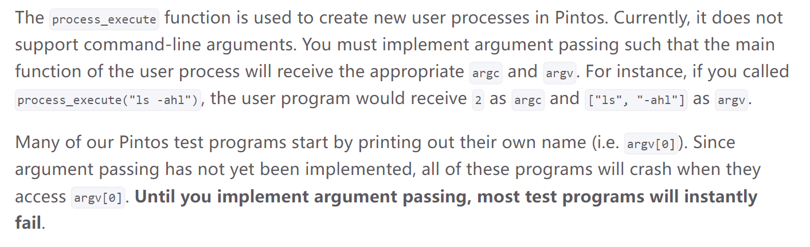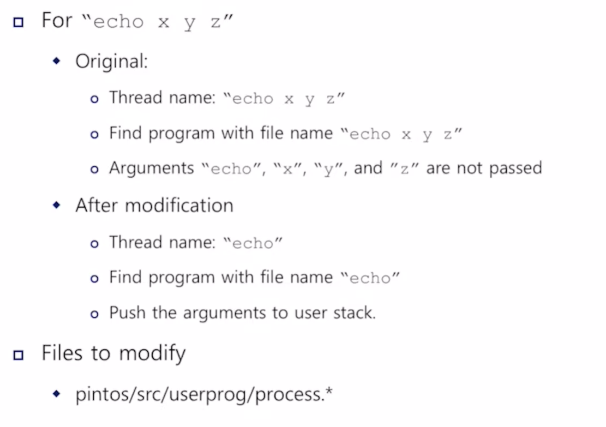

## Functions to modify
> [!important]
> 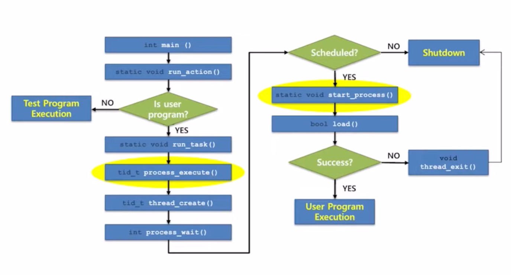

## Tokenizing
> [!important]
> Function provided by `stdlib.c`
> 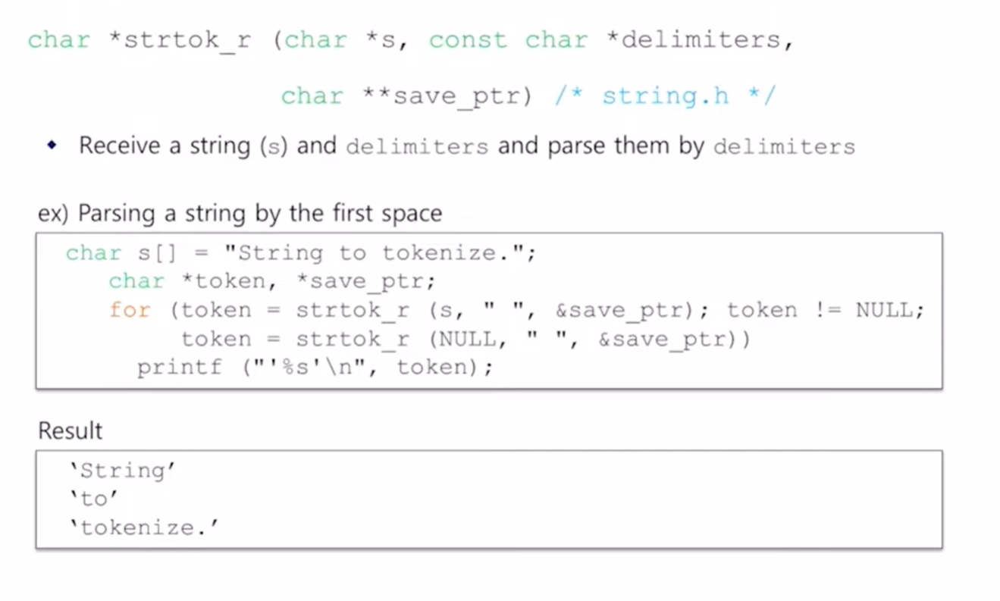

## Interruption Frame
> [!important]
> 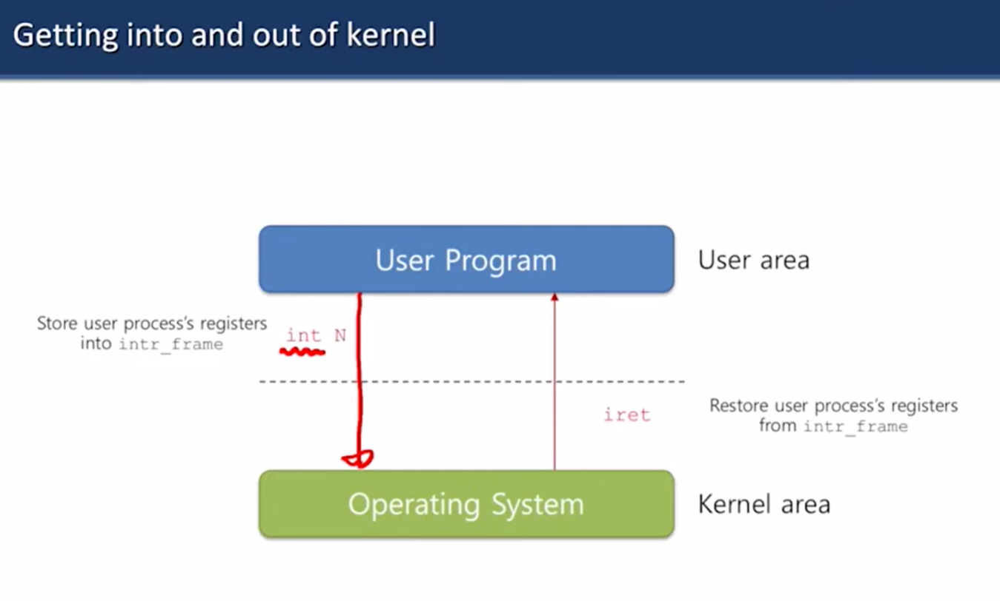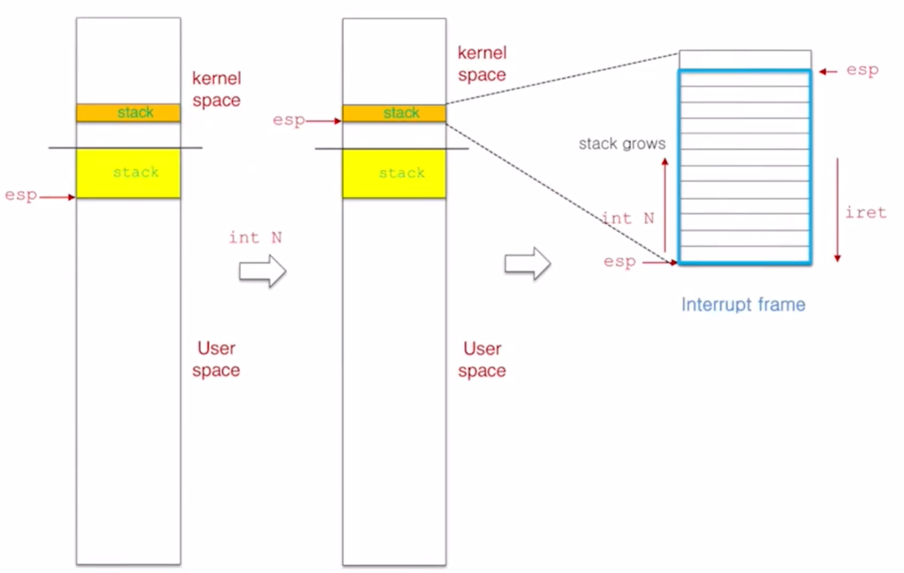
> The above is the virtual address space of the operating system.
> - If we are in user space, when we call `int N`, the operating system will push the user program's registers' values onto interrupt frame and set the `esp` to be the top of the kernel stack. **In short, it saves all the registers onto the interrupt frame and suspend the user space execution.**
> - If we are in kernel space, to trap into the user space, we have to initialize a interrupt frame to save the kernel register values and also when we call `iret`, the operating system will set the `esp` to be the top of the user stack. **In short, it resumes user space execution**
> - The operating system will initialize a new interrupt frame for each newly created thread. Once created, it serves as register saving purposes to hold everything the user program need to resume execution.

### Get into the kernel
> [!important]
> 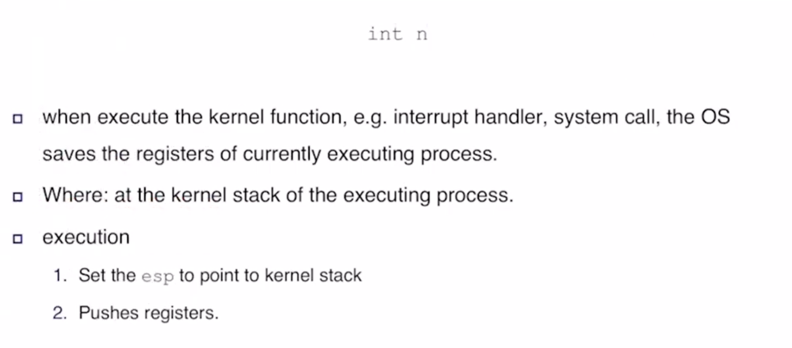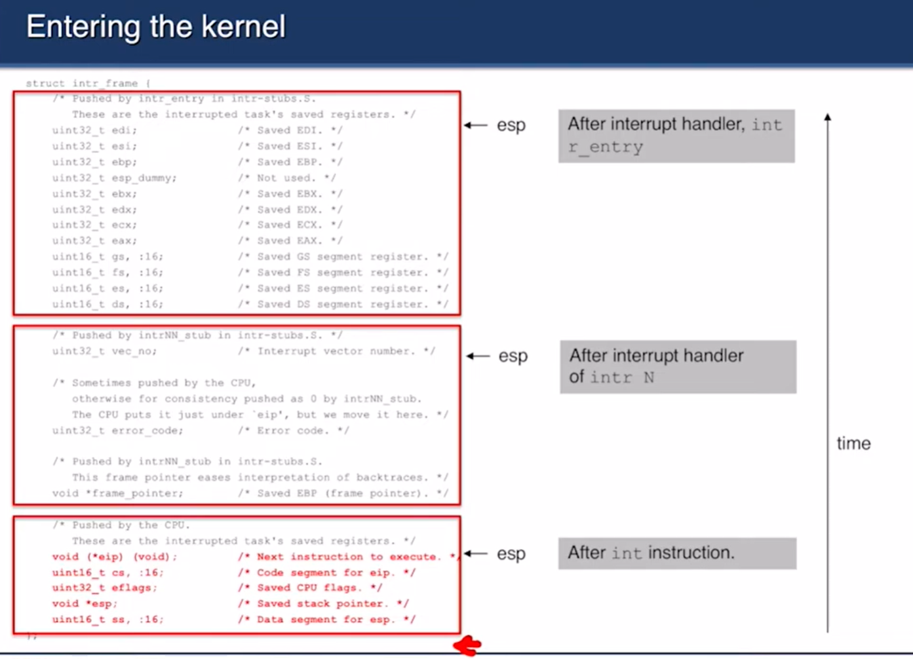

### Get out of Kernel
> [!important]
> 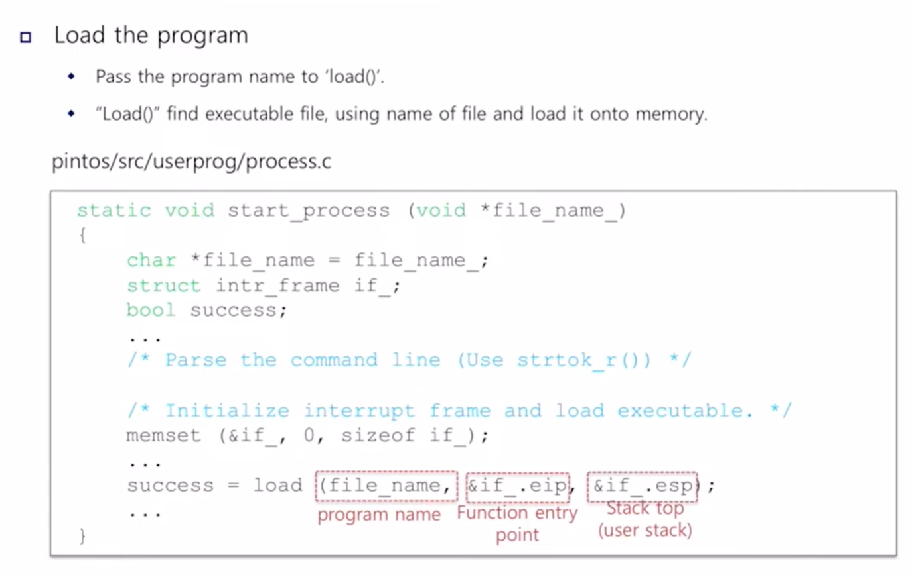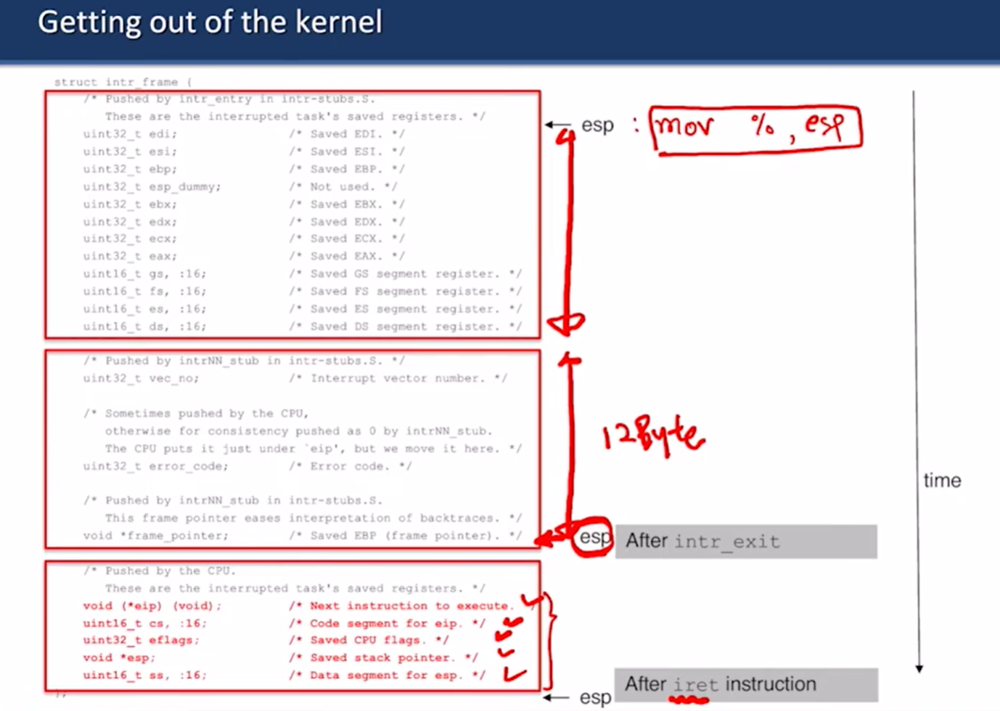

## Function Calling Convention
> [!important]
> 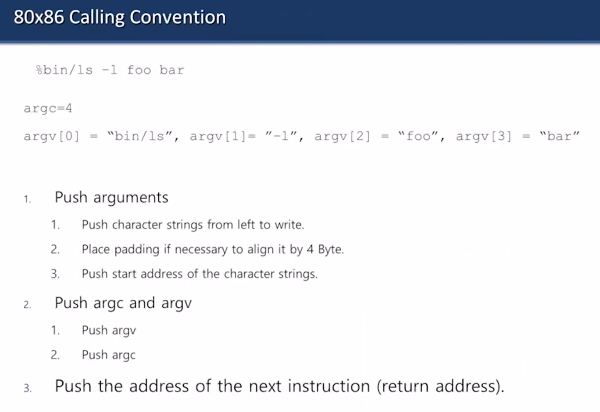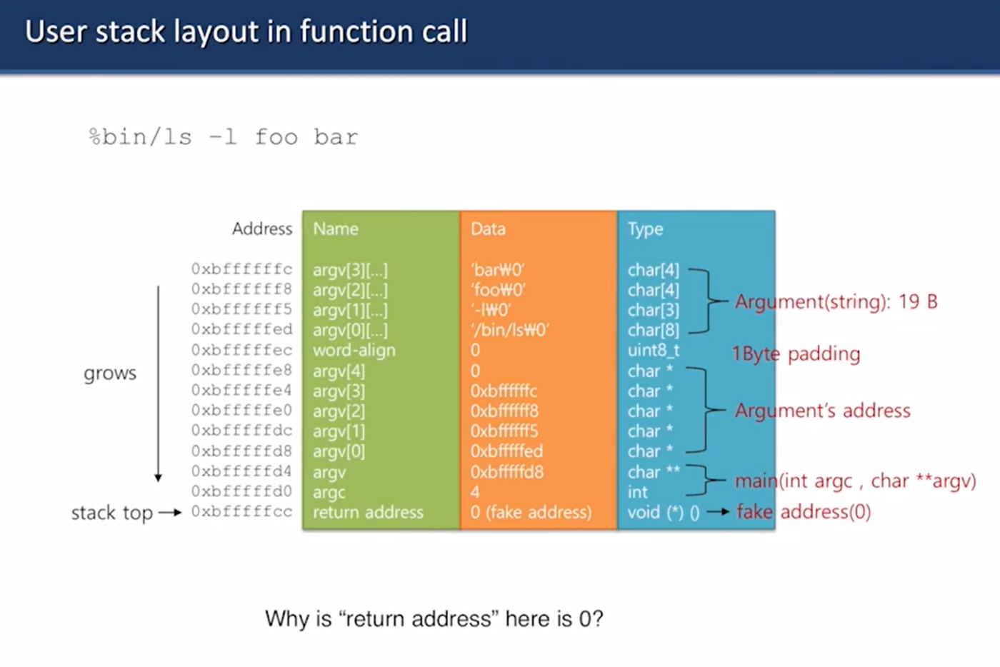
> Since each time we start a new kernel thread to to execute a program, 

## Code Implementations

# Task 2: Syscall

