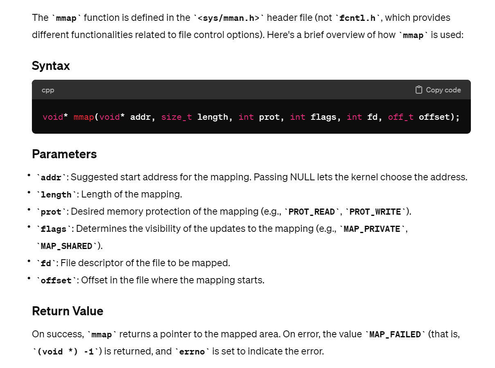
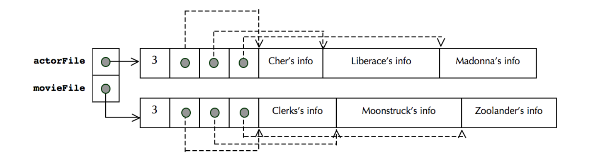
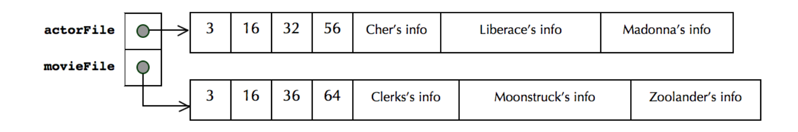
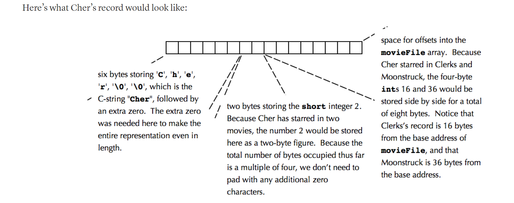

# Preliminaries
## Lambda Functions
> [!important]
> See [Functions and Lambdas](../../../../Data_Structures_Algorithms/Data_Structures/CS106B_X/6_OOP_Abstractions/Functions%20and%20Lambdas.md)

## lower_bound() algorithm

## mmap Routine
> [!important]
> The `imdb.cc` class constructor reads the file data using low-level file API `open()` and Linux/Unix-specific `mmap` routine to acquire file mapping.
> 
> All we need to know is that `mmap` function returns a `void *` pointer to the start of the file content in the memory. Since it is `void *`, we can cast it to get whatever bytes of data we want.
> 

# Task 1: The imdb Class
## ActorFile Structure
> [!concept]
> 
> **`actorFile`** points to a large mass of memory packing all of the information about all of the actors. 
> 1. The first four bytes store the number of actors (as an **`int`**); 
> 2. The next four bytes store the offset to the zeroth actor.
> 3. The next four bytes store the offset to the first actor, and so forth. 
> 4. The last offset is followed by the zeroth record, then the first record, and so forth. The records themselves are sorted by name.

## MovieFile Structure
> [!concept]
> 
> **`movieFile`** also points to a large mass of memory, but this one packs the information about all films ever made. 
> 1. The first four bytes store the number of movies (again, as an **`int`**).
> 2. The next `(*(int*)movieFile)*sizeof(int)` bytes store all of the **`int`** offsets, and everything beyond is real movie data. 
> 3. The movies are sorted by title, and those sharing the same title are sorted by year.

## Actor Record
> [!concept]
> 
> 1. The **name** of the actor is laid out character by character, as a normal null-terminated C-string. 
> 	- If the length of the actor’s name is even, then the string is padded with an extra **`'\0'`** so that the total number of bytes dedicated to the name is always an even number. 
> 	- The information that follows the name is most easily interpreted as a **`short`**, and the `myth`s often constrain addresses manipulated as `short* `s to be even.
> 1. The **number of movies in which the actor has appeared**, expressed as a two-byte short. (Some people have been in more than 255 movies, so a single byte isn’t always enough). 
> 	- If the number of bytes dedicated to the actor’s name (always even) and the short (always 2) isn’t a multiple of four, then two additional`'\0'`’s appear after the two bytes storing the number of movies. 
> 	- This padding is conditionally done so that the four-byte integers that follow sit at addresses that are multiples of four (again, because the 64-bit **`myth`**’s might be configured to require this).
> 1. An array of offsets into the **`movieFile`** image, where each offset identifies one of the actor’s films.

## Movie Record
> [!concept]
> 
> The movie record is only slightly more complicated. The information is compressed as follows:  
> 1. The **title** of the movie, terminated by a **`'\0'`**, so the character array behaves as a normal C-string incidentally wedged into a larger binary data figure.
> 2. The **year** the film was released, expressed as a single byte. This byte stores the year, minus 1900. Since Hollywood is less than 256 years old, it was fine to just store the year as an offset from 1900. If the total number of bytes used to encode the name and year of the movie is odd, then an extra **`'\0'`** sits in between the one-byte year and the data that follows.
> 3. A two-byte **`short`** storing the number of actors appearing in the film, padded with two additional bytes of zeroes if needed.
> 4. An array of four-byte integer offsets, where each integer offset identifies one of the actors accessible via **`actorFile`**. The number of offsets here is, of course, equal to the **`short`** read during step 3.

## getCredits()
> [!concept]

## getCast()
> [!concept]

# Task 2: BFS Algorithm