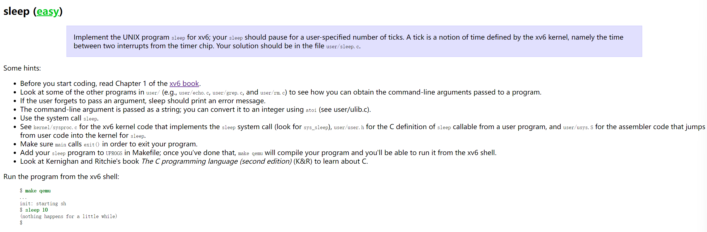
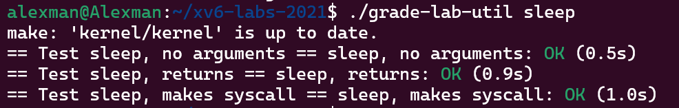
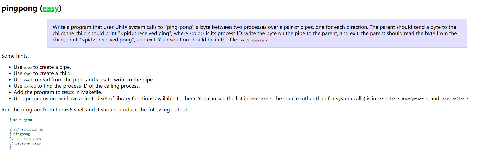
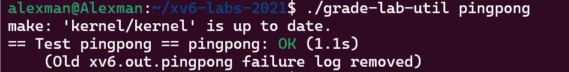
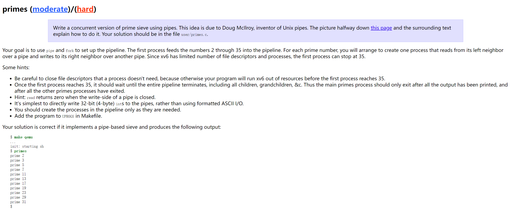
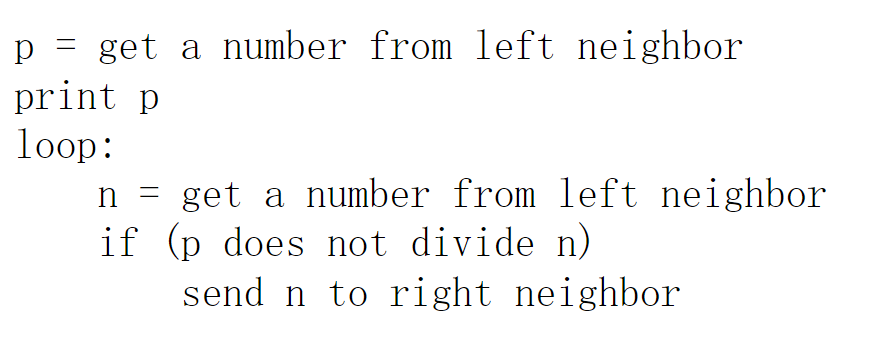
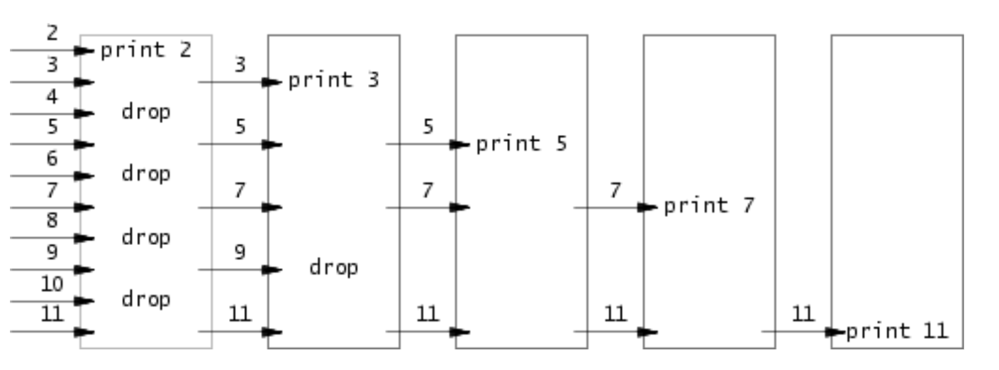

# Task 1: sleep(Easy)
> [!task]
> 
> **Concepts:** System Calls, Command Line Arguments

```c
#include "kernel/types.h"
#include "kernel/stat.h"
#include "user/user.h"

int main(int argc, char* argv[]) {
    // If the user forgets to pass the argument
    if (argc <= 1) {
        fprintf(2, "usage: sleep [number secs]\n");
        exit(1);
    }

  
    // Obtain the command line argument, argv[0] is "sleep", argv[1] is the sleep time
    int secs = atoi(argv[1]);

    // Trigger system call
    sleep(secs);

    // Make sure to run this
    exit(0);
}
```

> [!test]
> 


# Task 2: pingpong (Easy)
> [!task]
> 
> **Concepts:** Pipe, File Descriptors, Fork Exec Idiom

```c
#include "kernel/types.h"

#include "kernel/stat.h"

#include "user/user.h"


int main(int argc, char* argv[]) {

    // Initialize the pipe variable

    int p[2];

    pipe(p);

    // Fork a child

    if (fork() == 0) {

        // Child

        int cpid = getpid();

        char buf[1];

        // Child first read from the parent, blocking itself until parent process

        // write something to the write end of the pipe.

        if (read(p[0], buf, 1) != 1) {

            fprintf(2, "failed to read in child process!");

            exit(1);

        }

        fprintf(1, "%d: received ping\n", cpid);

        close(p[0]);

        buf[0] = 'b';

        // Child Process then makes response to the parent process.

        if (write(p[1], buf, 1) != 1) {

            fprintf(2, "failed to write in child process!");

            exit(1);

        }

        close(p[1]);

    } else {

        //Parent

        int ppid = getpid();

        char buf[1];

        buf[0] = 'b';

        // Parent first send a byte to the pipe write end first

        if (write(p[1], buf, 1) != 1) {

            fprintf(2, "failed to write in parent process!");

            exit(1);

        };

        close(p[1]);

        // Parent then block itself to wait child process's sending

        if (read(p[0], buf, 1) != 1) {

            fprintf(2, "failed to read in parent process!");

            exit(1);

        };

        fprintf(1, "%d: received pong\n", ppid);

        close(p[0]);

    }

  

    exit(0);

}
```

> [!test]
> 


# Task 3: Primes (Moderate)
## Task Descriptions
> [!task]
> 
> **Concepts:** Recursion, Pipe, File Descriptors, Concurrent Programming


## CSP(Communicating Sequential Processes)
> [!concept]
> Concurrent programming in this style is interesting for reasons not of efficiency but of clarity. That is, it is a widespread mistake to think only of concurrent programming as a means to increase performance, _e.g._, to overlap disk I/O requests, to reduce latency by prefetching results to expected queries, or to take advantage of multiple processors. Such advantages are important but not relevant to this discussion. After all, they can be realized in other styles, such as asynchronous event-driven programming. Instead, we are interested in concurrent programming because it provides a natural abstraction that can make some programs much simpler.


## Hoare's Algorithm
> [!algo] Algorithm to sequentially list prime numbers concurrently.
> 
> A generating process can feed the numbers 2, 3, 4, ..., 1000 into the left end of the pipeline: the first process in the line eliminates the multiples of 2, the second eliminates the multiples of 3, the third eliminates the multiples of 5, and so on:
> 
> 


> 

```c

```


> [!test]
> 