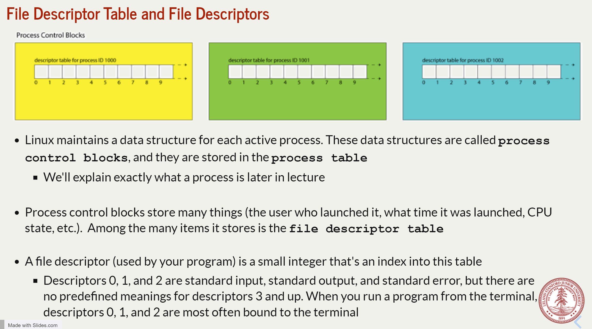
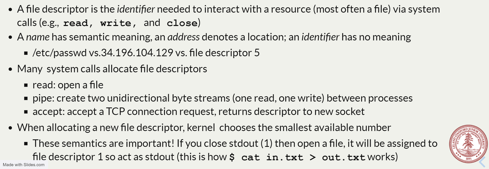
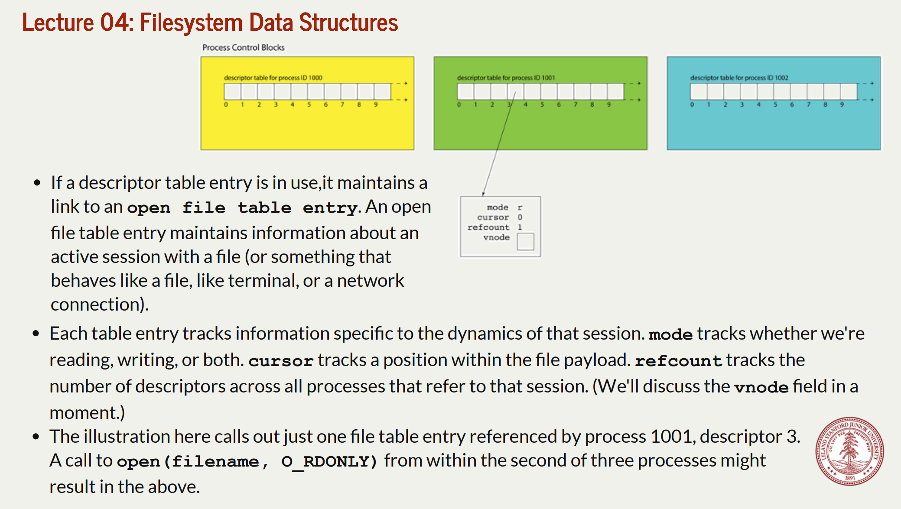
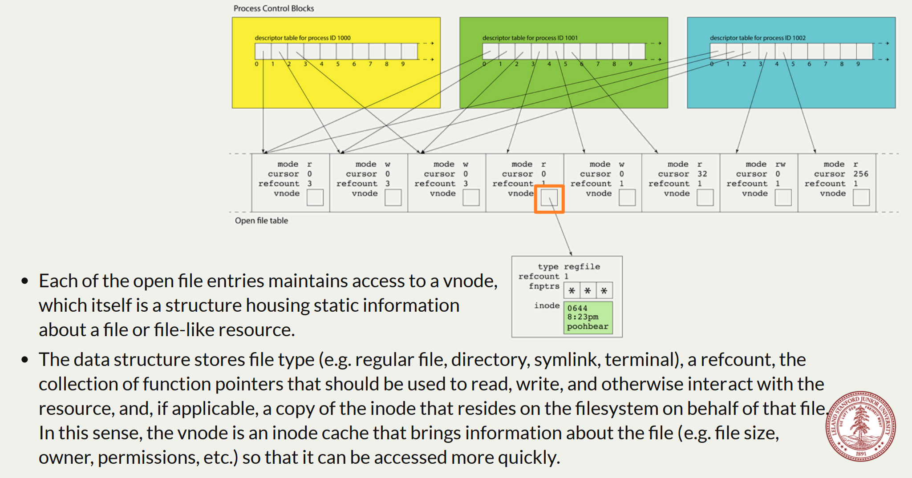
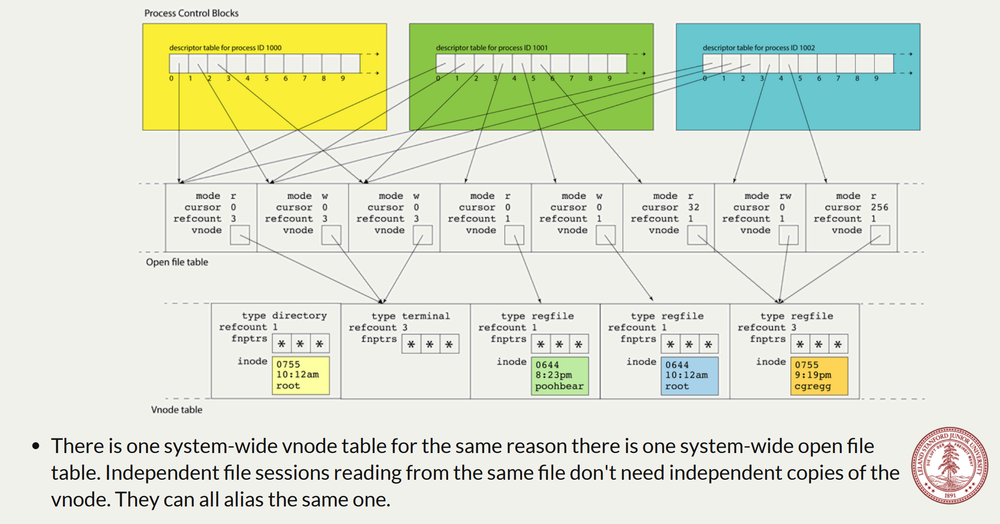
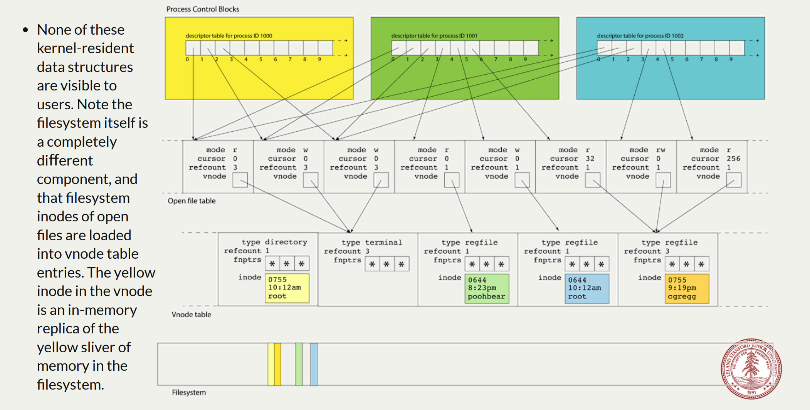

# File Descriptor Table
## File Descriptors
> [!concept]
> 

## File Descriptor Table Entries
> [!concept]
> 
> 

# Open File Table
> [!concept]
> 

# Vnode Table
> [!important]
> 
> **Notes:**
> 1. The open file table is not sorted, and each process could find the vnode correspoinding to file descriptor in a very short amount of time.
> 2. None of these is available to users.
> 3. **vnodes** live in the **vnode table**; a single table referenced by all open file table entries.  A vnode is an abstraction of a file; it includes information on what kind of file it is, how many file table entries reference it, and function pointers for performing operations.  Also cache of inode (if exists).
> 4. These resources are all freed over time:
> - Free a file table entry when the last file descriptor closes it
> - Free a vnode when the last file table entry is freed
> - Free a file when its reference count is 0 and there is no vnode
> - **In short, freeing the file is like deleting edges from a DAG** where the file descriptor table entries are like these sink vertices.

