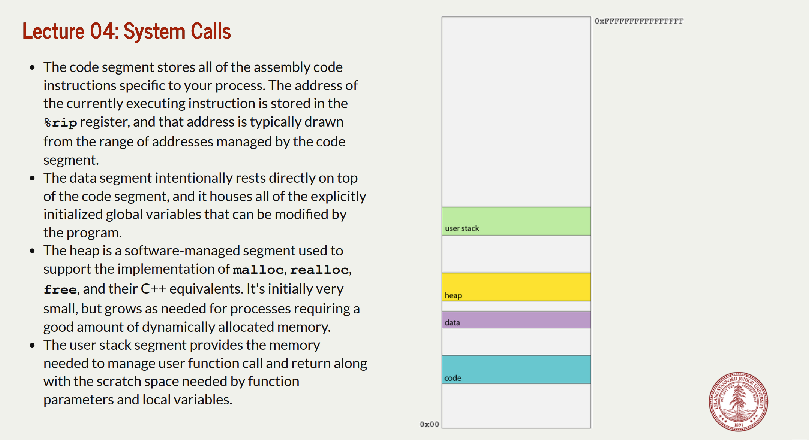

# System Calls
> [!concept]
> 

# System Calling Conventions
> [!concept]
> 
> - The user function call and return protocol, however, does little to encapsulate and privatize the memory used by a function. 
> - Consider, for instance, the execution of **loadFiles** as per the diagram below. Because **loadFiles**'s stack frame is directly below that of its caller, it can use pointer arithmetic to advance beyond its frame and examine—or even update— the stack frame above it. 
> - After **loadFiles** returns, **main** could use pointer arithmetic to descend into the ghost of **loadFiles**'s stack frame and access data **loadFiles** never intended to expose. Because incrementing stack pointer doesn't wipe out the data in the frame.
> - Functions are supposed to be modular, but the function call and return protocol's support for modularity and privacy is pretty soft.
> 
> 
> - The relevant opcode is placed in **%rax**. Each system call has its own opcode (e.g. 0 for **read**, 1 for **write**, 2 for **open**, 3 for **close**, 4 for **stat**, and so forth). 
> - The system call arguments—there are at most 6—are evaluated and placed in **%rdi, %rsi, %rdx, %r10, %r8,** and **%r9**. ==Note the fourth parameter is %r10, not %rcx==. **Note that by design, there are no system calls with more than six input parameters.**
> - The system issues a software interrupt (otherwise known as a trap) by executing **syscall,** which prompts an interrupt **handler** to execute in superuser mode. 
> - The interrupt handler builds a frame in the kernel stack, executes the relevant code, places any return value in %rax, and then executes iretq to return from the interrupt handler, revert from superuser mode, and execute the instruction following the syscall.
> - If **%rax** is negative, **errno** is set to abs(**%rax**) and **%rax** is updated to contain a ­**-1**. If **%rax** is nonnegative, it's left as is. The value in is **%rax** then extracted by the caller as any return value would be.

