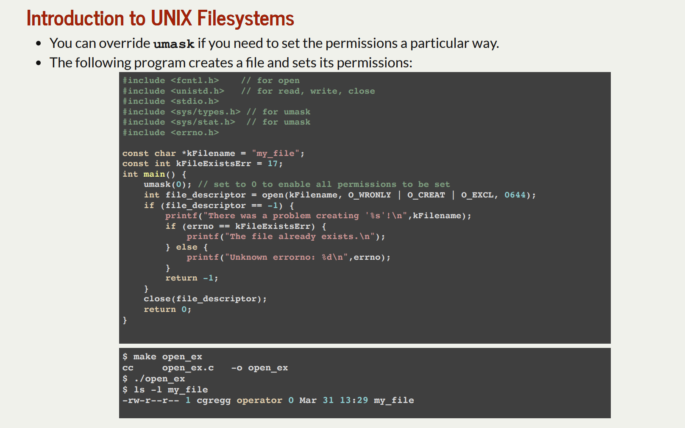
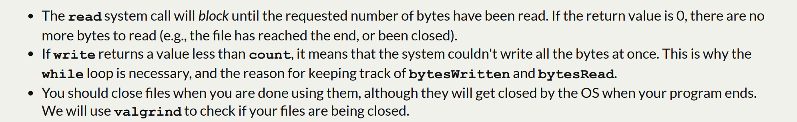

# Introduction to UNIX Filesystems
## ls command
> [!concept]
> 

## file permission - umask
> [!concept]
> 
> Notes on **umask**:
> - First of all, “mask” does not mean “subtract”, in the arithmetic sense – there is no borrow or carry involved.
> - Secondly, a “mask” should be understood _bitwise_ instead: applying logical operations on each bit column independently. That is, the 4th bit of the permission bit-sequence interacts with only the 4th bit of the mask.
> - Third, the mask turns _off_ permission bits. If they are already off, the `umask` makes no change to the permission,
> - To sum up, the formula for new file permission upon **umask** setting is `result = file permission & (~umask)` as the example below verifies it:
> 
> 

## use umask to set permission
> [!example]
> 
> **Notes:**
> - Note that in the above code, we set the umask to 0000, which means owner, group and other all have the rights to set the file permission to any bit combinations.
> - If we run `./open_ex` again, it wil trigger an `EEXIST 17 File exists` error.
> - If we want to check all the error number, we could use `errno -l` command.
> - If we want to check all the error number, but on multiple scrollable pages, we could use `errno -l | less` command, with pipe techniques.

## cp command
> [!concept]
> 
> **Notes:**
> 1. In unix, `cp filename1 filename2` will copy the content of file1 to file2.
> 2. In unix, `diff filename1 filename2` will copy the content of file1 to file2.
> 
> 
> **Notes:**
> 1. When we ==read from local file==, unless we get to the end of the file or encounter some internal errors, we will always read the amount of bytes specified by the argument. But when we ==read from network data==, chances are that CPU hang the current file reading process and cause the bytes read to be less than specified.
> 2. If `bytesRead == 0`, it results from eof, meaning that there are no more bytes to read from the file. If `bytesRead < 0`, it results from reading errors.
> 3. Short counts:
> 
> 

# File System Abstraction Layers
# Blocks
> In unix v6, the block size is 512 bytes, and is equal to a sector size.

# Inodes
> [!concept]
> 

