[lab02.zip](https://www.yuque.com/attachments/yuque/0/2023/zip/12393765/1673601816828-17a04eba-5285-4f29-b661-dc8b680d5f6d.zip)


# Q1 Donations
> 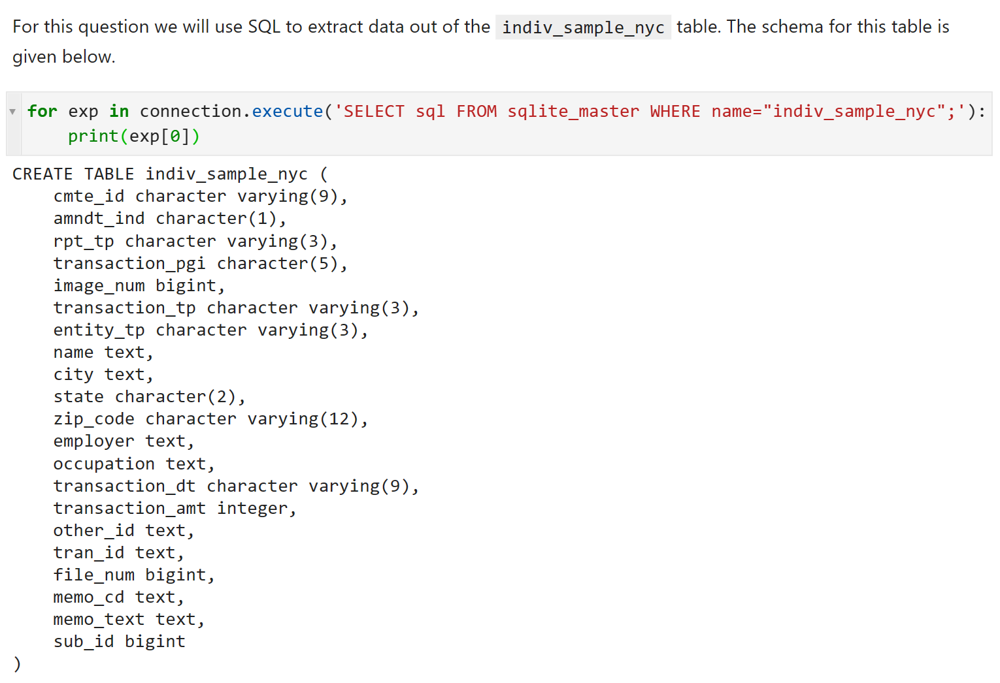


## Q1a LIKE Trump
> 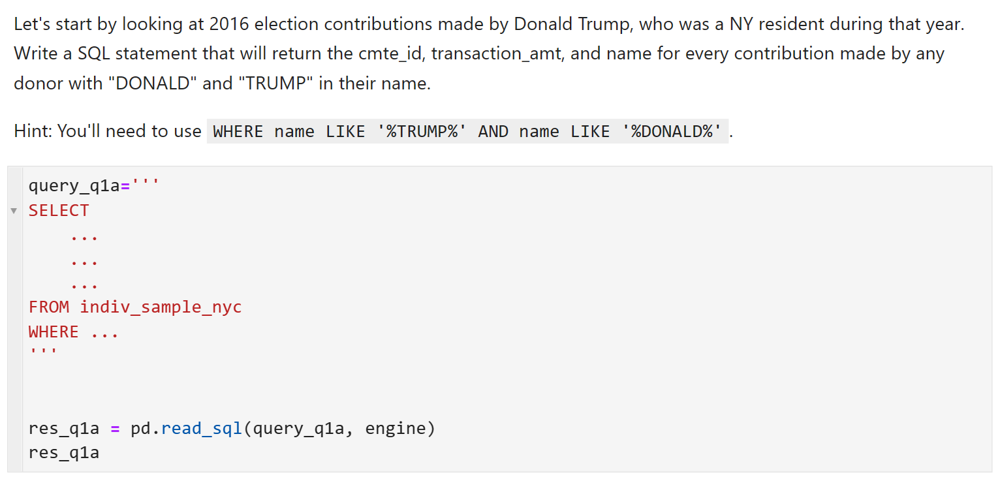

```python
query_q1a='''
SELECT
    cmte_id, 
    transaction_amt,
    name
FROM indiv_sample_nyc
WHERE name LIKE '%TRUMP%'
AND name LIKE '%DONALD%'
'''

res_q1a = pd.read_sql(query_q1a, engine)
res_q1a
```
**SQL Output**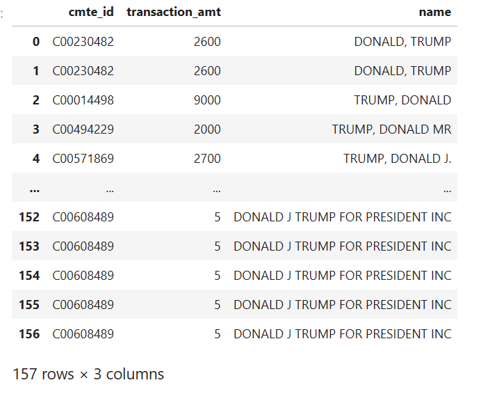

## Q1b NOT LIKE President
> 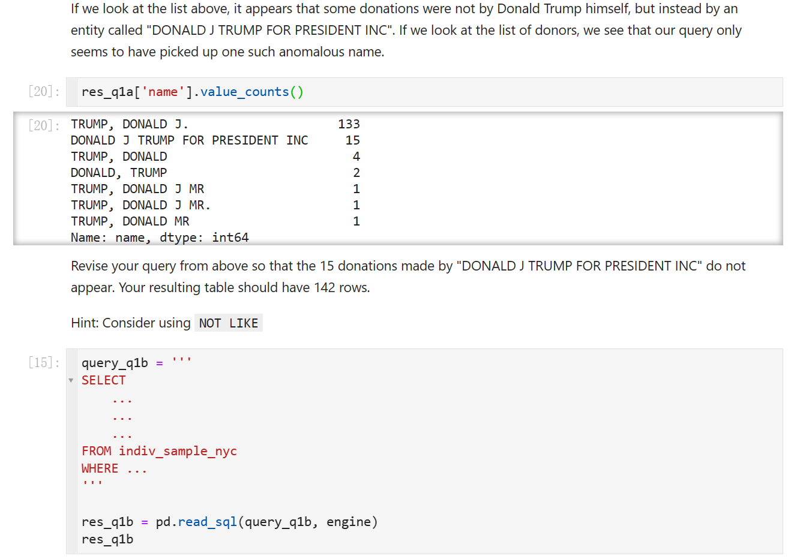

```python
query_q1b = '''
SELECT
    cmte_id, 
    transaction_amt,
    name
FROM indiv_sample_nyc
WHERE name LIKE '%TRUMP%'
AND name LIKE '%DONALD%'
AND name NOT LIKE '%PRESIDENT%'
'''

res_q1b = pd.read_sql(query_q1b, engine)
res_q1b
```
**SQL Output**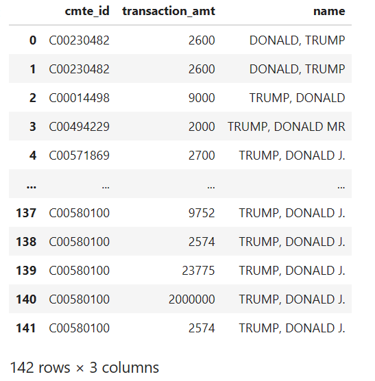


## Q1c Aggregation
> 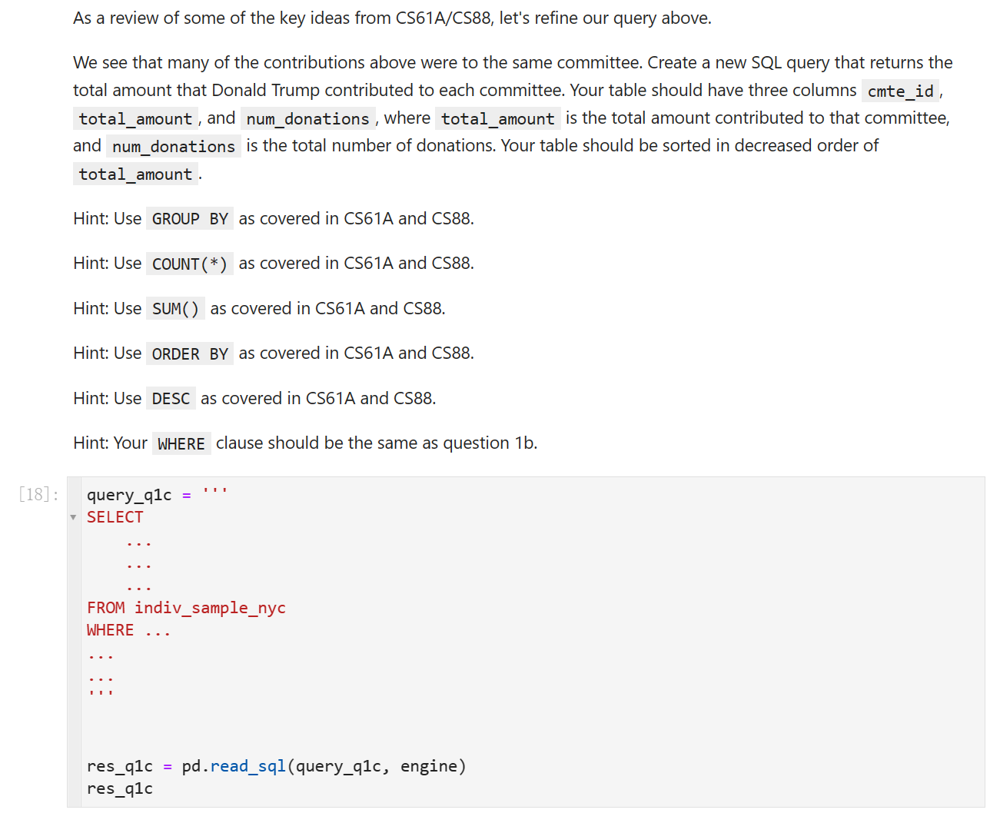

```python
query_q1c = '''
SELECT
    cmte_id, 
    sum(transaction_amt) as total_amount,
    count(*) as num_donations
FROM indiv_sample_nyc
WHERE name LIKE '%TRUMP%'
AND name LIKE '%DONALD%'
AND name NOT LIKE '%PRESIDENT%'
GROUP BY cmte_id
ORDER BY total_amount
DESC
'''


res_q1c = pd.read_sql(query_q1c, engine)
res_q1c
```
**SQL Output**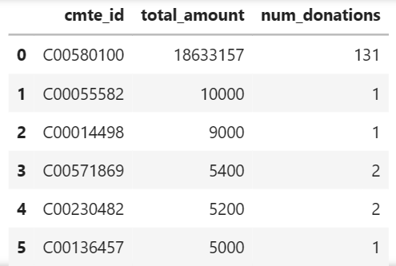
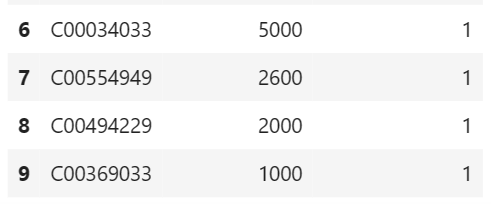

## Q1d Join& Nested Queries⭐⭐⭐
> 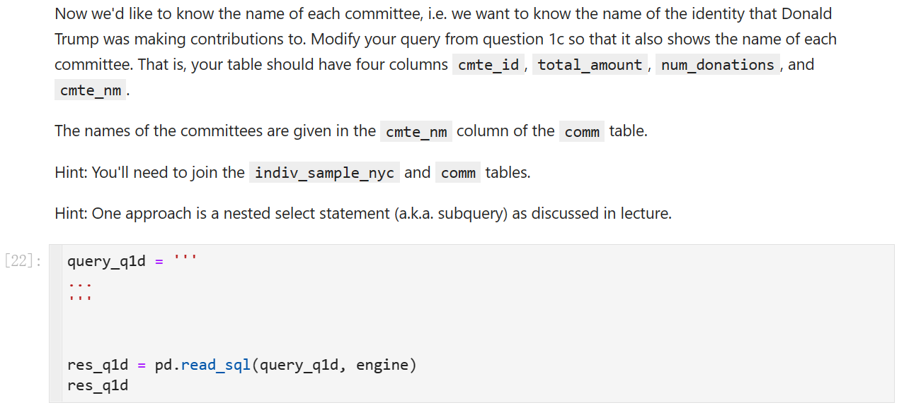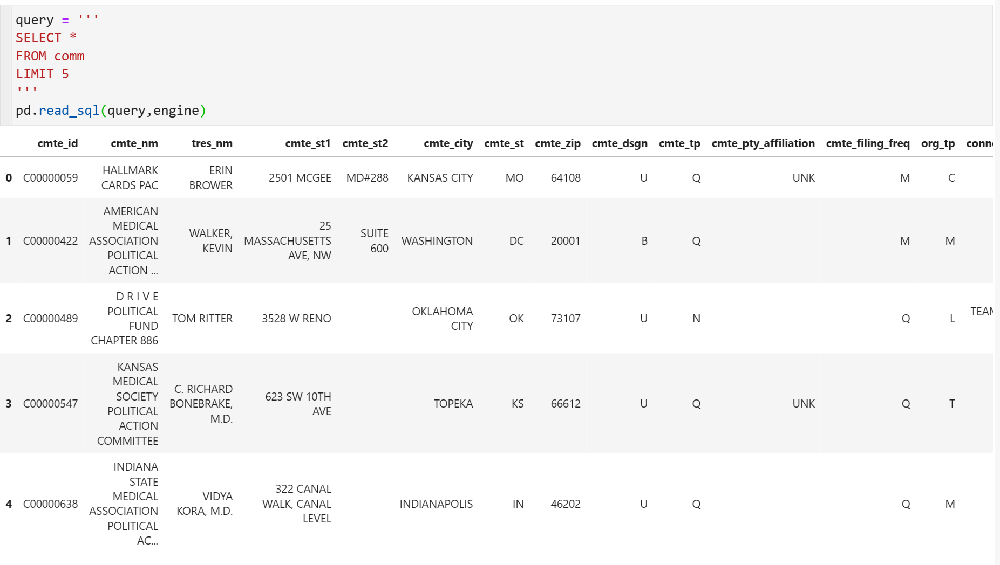
> **本题提供两种解法:**
> 1. 使用`JOIN`建立从`cmte_id`到`cmte_nm`的映射。
> 2. 使用`subqueries`找出符合`cmte_id`的`cmte_nm`。

```python
query_q1d = '''
SELECT
    s.cmte_id, 
    sum(s.transaction_amt) as total_amount,
    count(*) as num_donations,
    c.cmte_nm 
FROM indiv_sample_nyc as s
LEFT JOIN comm as c ON c.cmte_id = s.cmte_id
WHERE s.name LIKE '%TRUMP%'
AND s.name LIKE '%DONALD%'
AND s.name NOT LIKE '%PRESIDENT%'
GROUP BY s.cmte_id
ORDER BY total_amount
DESC
'''


res_q1d = pd.read_sql(query_q1d, engine)
res_q1d
```
```python
query_q1d = '''
SELECT
    cmte_id, 
    sum(transaction_amt) as total_amount,
    count(*) as num_donations,
    (SELECT cmte_nm 
        FROM comm
        WHERE comm.cmte_id = s.cmte_id) as cmte_nm
FROM indiv_sample_nyc as s
WHERE name LIKE '%TRUMP%'
AND name LIKE '%DONALD%'
AND name NOT LIKE '%PRESIDENT%'
GROUP BY cmte_id
ORDER BY total_amount
DESC
'''


res_q1d = pd.read_sql(query_q1d, engine)
res_q1d
```
**SQL Output**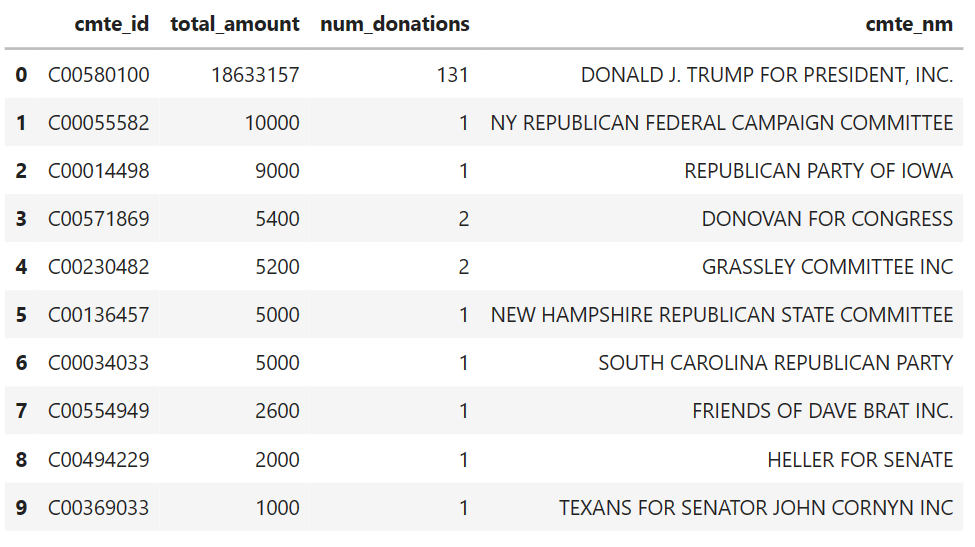


# Q2 Candidates
## Q2a Community Ending in 5
> 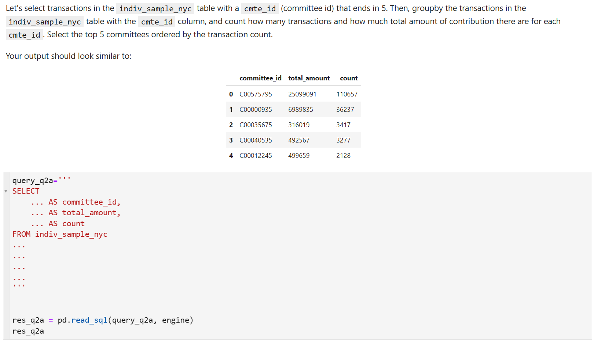

```python
query_q2a='''
SELECT
    cmte_id AS committee_id,
    sum(transaction_amt) AS total_amount,
    count(cmte_id) AS count
FROM indiv_sample_nyc
WHERE cmte_id LIKE "%5"
GROUP BY cmte_id
ORDER BY count
DESC
LIMIT 5
'''


res_q2a = pd.read_sql(query_q2a, engine)
res_q2a
```
**SQL Output**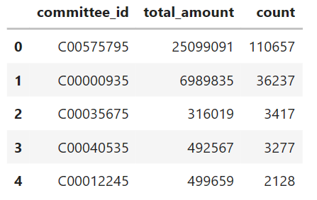

## Q2b INNER JOIN
> 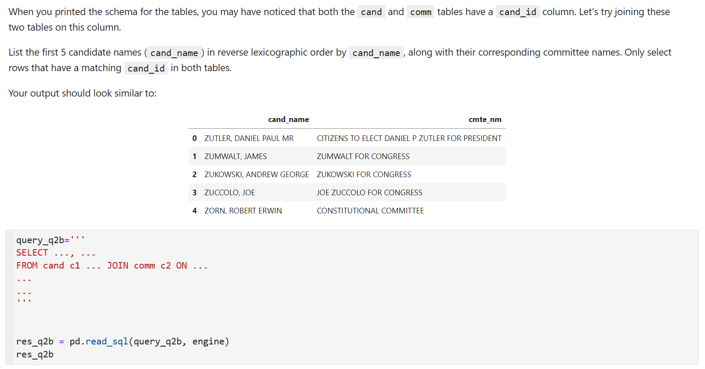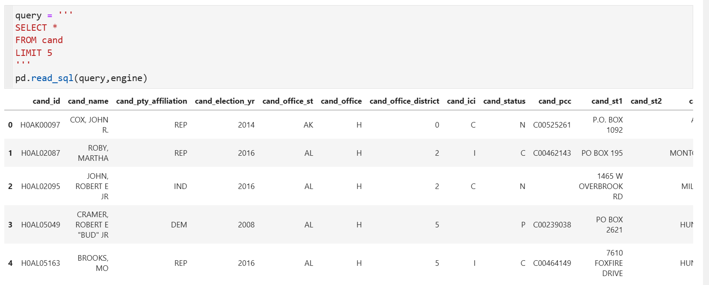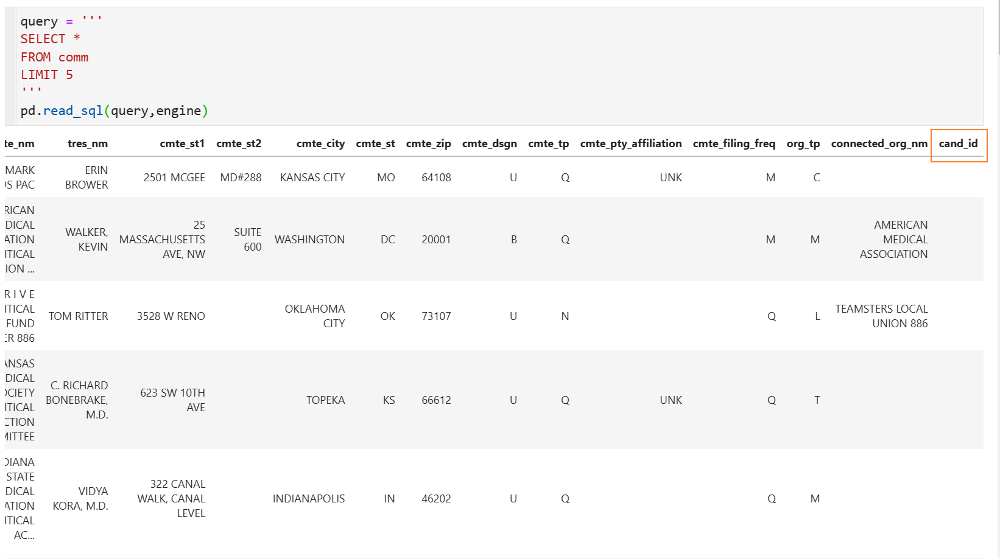

```python
query_q2b='''
SELECT c1.cand_name as cand_name, c2.cmte_nm as cmte_nm
FROM cand c1 INNER JOIN comm c2 ON c1.cand_id = c2.cand_id
ORDER BY cand_name
DESC
LIMIT 5
'''


res_q2b = pd.read_sql(query_q2b, engine)
res_q2b
```
**SQL Output**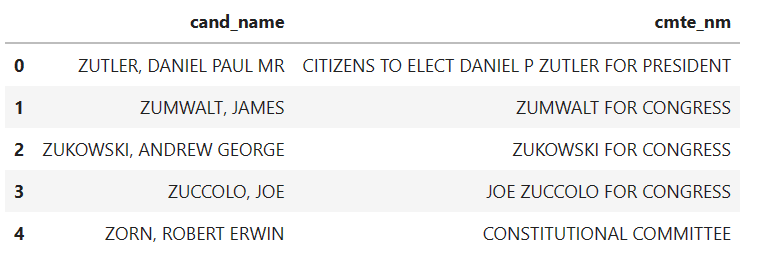


## Q2c LEFT JOIN
> 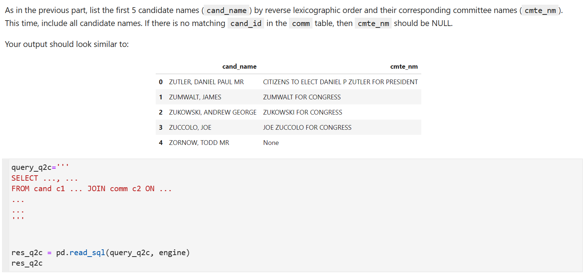

```python
query_q2c='''
SELECT c1.cand_name as cand_name, c2.cmte_nm as cmte_nm
FROM cand c1 LEFT JOIN comm c2 ON c1.cand_id = c2.cand_id
ORDER BY cand_name
DESC
LIMIT 5
'''


res_q2c = pd.read_sql(query_q2c, engine)
res_q2c
```
**SQL Output**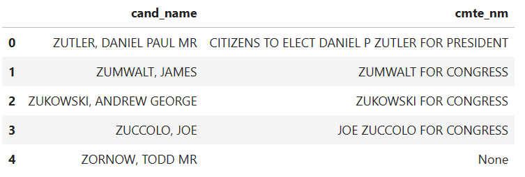
