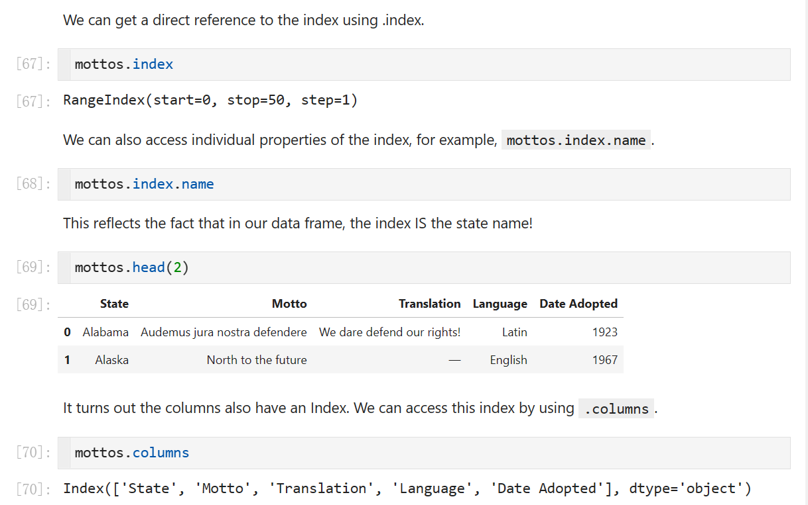
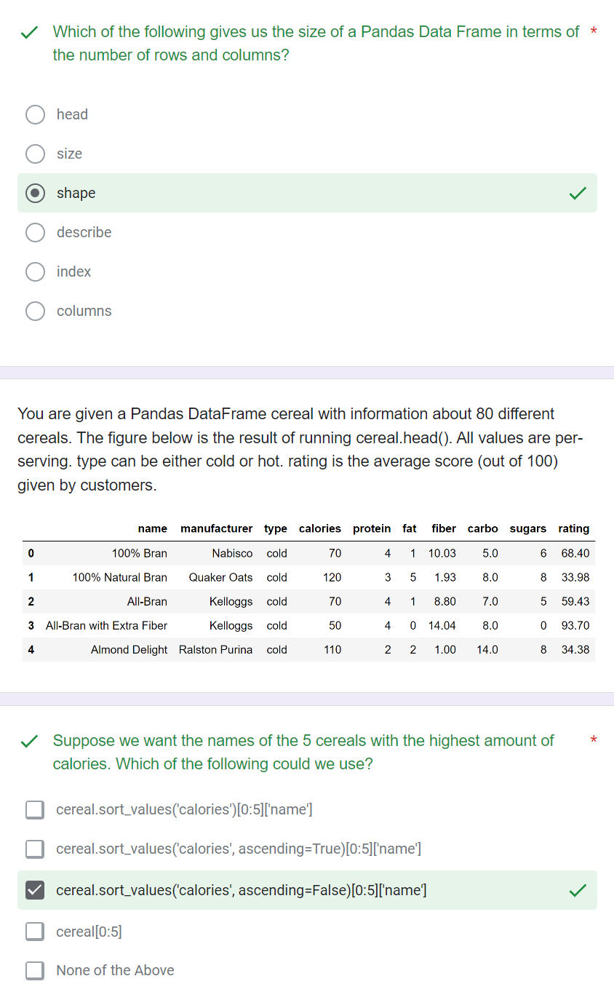

> **Ch6:** [https://learningds.org/ch/06/pandas_intro.html](https://learningds.org/ch/06/pandas_intro.html)

# 1 Pandas Basics
[5. Pandas 1.pdf](https://www.yuque.com/attachments/yuque/0/2023/pdf/12393765/1673679057375-839051f8-ed5e-43e7-a13c-933f6412e611.pdf)
[lec05.zip](https://www.yuque.com/attachments/yuque/0/2023/zip/12393765/1673679824936-4422b1a3-55db-4f83-86ef-f9af77f21523.zip)

## DataFrames& Series & Indices
### Basics
:::info

`Pandas`会自动区分那些重复的`column_names`，比如创建新的`column_alias`
:::

### Quick Check
:::info

:::

## Indexing
### Index by Columns
:::info

:::

### Index by Rows
:::info

:::
**Exercise**⭐⭐⭐⭐⭐

### Summary
:::info

:::

### Quick Check
:::info

:::

## Boolean Array Selection
:::info
Used to select the rows
:::
### Using Raw Boolean
:::info

:::

### Using Boolean Expressions
:::info

:::

### isin
:::info

:::

### query
:::info

:::

### Quick Check
:::info

:::

## 
## Loc
### Basics
:::info

:::

### Loc with Lists
:::info

:::

### Loc with Slices
:::info

:::

### Loc with Single Values
:::info

:::

### Loc with Boolean Array
:::info

:::

### Quick Check
:::info

:::

## iloc
### Basics
:::info

**注意: **`**iloc slicing**`**是**`**exclusive**`**的。**
:::

### Challenges
:::info

:::
**Solution**

### Samples
:::info

:::

### Quick Check
:::info

:::

## Pandas Utility Functions
### Numpy Operations
:::info

:::

### head/size/shape/describe
:::info

:::

### DataFrame.index/column
:::info

:::

### sort_values
:::info

:::

### Series.value_counts
:::info

:::

### Series.unique
:::info

`DataFrame`没有`unique`。
:::

### Quick Check
:::info

`DataFrame`没有`value_counts()`方法，所以报错。
:::

# 2 Pandas Advanced
[6. Pandas 2.pdf](https://www.yuque.com/attachments/yuque/0/2023/pdf/12393765/1673679069244-b505f346-52aa-4d76-9d00-2c5b95176c59.pdf)
[lec06.zip](https://www.yuque.com/attachments/yuque/0/2023/zip/12393765/1673679844016-a5376919-aade-4e0b-b795-d5afb8475d9b.zip)

## Data
:::info

:::

## Pandas String Methods
### Intro Example
:::info

:::

### Str Methods
:::info

:::

### Challenges
:::info

:::

### Quick Check
:::info
**Guide:** [series.str.split](https://pandas.pydata.org/pandas-docs/stable/user_guide/text.html#splitting-and-replacing-strings)
:::
:::info

:::

## Sort columns
### Approach 1: Create Temporary Columns
#### Sort the name length
> 

:::info

:::

#### Sort arbitrary substr
:::info

:::

### Approach 2: Create a sorted Index with loc
:::info

:::

### Quick Check
:::info

:::

## Aggregation
### Goal
:::info

:::

### For Loop(Bad)
:::info

**Access variables in python within queries:  **`**@variable**`** **

:::

### Groupby and agg
:::info

:::

### Quick Check
:::info

:::

## Groupby Puzzles
### Puzzle 1 Changed Intention
:::info

这个本质上求的是，`Difference between the least popular name and the most popular name`
:::

### Puzzle 2 Independent Calculations
:::info

:::

### Puzzle 3 Independent Calculations
:::info

:::

### Puzzle 4 Against the Independence⭐⭐⭐⭐⭐
:::info

:::

### Quick Check
:::info

:::

## Other groupby Features
### return type of groupby()
:::info

:::

### .size()⭐⭐⭐⭐
:::info

注意, `.size()`返回的是`Series`类型的数据。
:::

### filter by group⭐⭐⭐⭐
:::info

`filter`最终的结果不是以组别为单位的， 而是以`row`为单位的。即，如果某个组别满足某些条件，则这个组别内的所有`rows`都会出现在结果集中。
:::

### Simplification⭐⭐
:::info

:::

### Quick Check
:::info

:::

## Group by multiple columns
### Multi-Index
:::info

本质上`Multi-index`会列出所有的`Cartesian Product of multi-indices`
:::

### Pivot Tables
:::info

:::

### Multi-index vs Pivot Tables
:::info

:::

### Quick Check
:::info

:::

## Joins
:::info

:::

### Quick Check
:::info

:::
