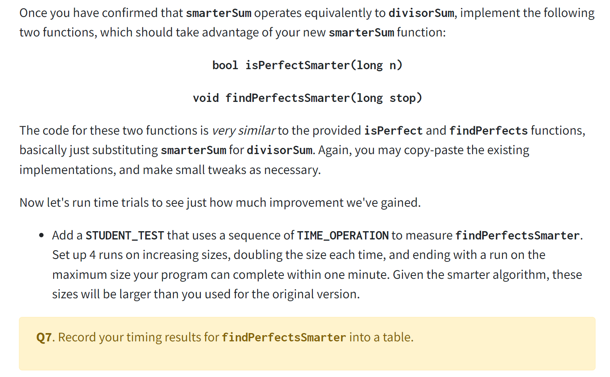

[section1_starter.zip](https://www.yuque.com/attachments/yuque/0/2022/zip/12393765/1672389793102-25bd8806-d7f0-4f0b-826d-faa89c93693c.zip)

# 1 Perfect Numbers
[CS106B Perfect numbers.pdf](https://www.yuque.com/attachments/yuque/0/2023/pdf/12393765/1675320107117-b4a2dbbb-1110-4498-ad37-ab6a5afd1010.pdf)

## Task 1 Observe the Runtime
> 

**Q1 Program Output**
总时间为$4s$, 找到四个`perfect numbers`, 分别是6, 28, 496, 8128.


## Task 2 TIME_OPERATION
> `TIME_OPERATION`是一个`C++`宏, 代码如下:

```cpp
#undef TIME_OPERATION
#define TIME_OPERATION(n, expr) do {\
    Timer t;\
    t.start();\
    (void)(expr); \
    double elapsed_ms = t.stop();\
    std::ostringstream _out; \
    _out << "Line " << __LINE__ << " TIME_OPERATION " << #expr << " (size = " << std::setw(8) << n << ")" << " completed in " << std::setw(8) << std::fixed << std::setprecision(3) << (elapsed_ms/1000) << " secs";\
    addDetail(_out.str());\
} while(0)

```
> 参数`size`没有实质性的作用，只是用于表格化展示
> 参数`expr`是一个函数的执行过程，也是我们需要计时的对象，比较重要


### Record the Time
> 

**Q2 Program Output**


### Doubling the Size
> 

```cpp
STUDENT_TEST("Time it takes for isPerfect() method") {

    int smallest = 10, largest = 1000;

    TIME_OPERATION(1000, isPerfect(smallest));
    TIME_OPERATION(1000, isPerfect(largest));
}

```
**Program Output**
**Q3 Sample Solutions**
1. No. Since `divisorSum()`is implemented in an iterative way, which depends linearly on size.
2. No. Since `findPerfect()`calls `isPerfect()`, which calls `divisorSum()`, so the time it takes to search between `1000 - 2000`will be longer than searching between `0 - 1000`.

### Extrapolate the Runtime
> 

**Q4 Sample Solution**The algorithm's asymtoticity is $O(n^2)$, and we know that when $n = 40000$, the time is around $4s$, so when $n = 33000000$, it would take, $33000000^2\times 4 / 40000\approx 1.089\times 10^{11}s=1260416~days\approx 3501~years$


## Task 3 Digging deeper into testing
> 

```cpp
STUDENT_TEST("isPerfect on negative inputs") {
    EXPECT(!isPerfect(-1));
    EXPECT(!isPerfect(-2));
}
```
**Q5 Program Output**
Yes, it always pass the test, since the short circuiting behaviors of the last line of `divisorSum()`, which is `return (n != 0) && (n == divisorSum(n))`, will always return `false`since negative numbers can never equal `0`


## Task 4 Streamlining and more testing
> 
> **This is true and we can prove it by cases:**
> 1. 假设$n$是`perfect square number`, 那么`divisor`最大不能超过$\sqrt{n}$(可以包含)
> 2. 假设$n$不是`perfect square number`, 那么`divisor`最大不能超过$\sqrt{n}$(不能包含)


### smarterSum()
> 

```cpp
/* TODO: Replace this comment with a descriptive function
 * header comment.
 */
long smarterSum(long n) {
    /* TODO: Fill in this function. */
    if (n == 1 || n < 0) {
        return 0;
    }
    int total = 0;
    for (int i = 1; i <= sqrt(n); i++) {
        if (n % i == 0) {
            if (i != 1) {
                total += i;
                total += n / i;
            }else {
                total += i;
            }
        }
    }
    return total;
}
```
```cpp
STUDENT_TEST("Confirm divisorSum of small inputs") {
    EXPECT_EQUAL(smarterSum(1), 0);
    EXPECT_EQUAL(smarterSum(6), 6);
    EXPECT_EQUAL(smarterSum(12), 16);
    EXPECT_EQUAL(smarterSum(25), 11);
}
```
**Q6 Solution**

- First test any numbers that come up in mind. 
- Then test any perfect square number
- Finally test the negative number.


### isPerfectSmarter()
> 

```cpp
/* TODO: Replace this comment with a descriptive function
 * header comment.
 */
long smarterSum(long n) {
    /* TODO: Fill in this function. */
    if (n == 1 || n < 0) {
        return 0;
    }
    int total = 0;
    for (int i = 1; i <= sqrt(n); i++) {
        if (n % i == 0) {
            if (i != 1) {
                total += i;
                total += n / i;
            }else {
                total += i;
            }
        }
    }
    return total;
}

/* TODO: Replace this comment with a descriptive function
 * header comment.
 */
bool isPerfectSmarter(long n) {
    /* TODO: Fill in this function. */
    return (n != 0) && (n == smarterSum(n));
}

/* TODO: Replace this comment with a descriptive function
 * header comment.
 */
void findPerfectsSmarter(long stop) {
     /* TODO: Fill in this function. */
    for (long num = 1; num < stop; num++) {
        if (isPerfectSmarter(num)) {
            cout << "Found perfect number: " << num << endl;
        }
        if (num % 10000 == 0) cout << "." << flush; // progress bar
    }
    cout << endl << "Done searching up to " << stop << endl;
}

```
```cpp
STUDENT_TEST("Multiple time trials of findPerfectsSmarter on increasing input sizes") {

    int smallest = 1000, largest = 8000;

    for (int size = smallest; size <= largest; size *= 2) {
        TIME_OPERATION(size, findPerfectsSmarter(size));
    }
}
```
**Q7 Solution**


### Efficiency Analysis
> 

**Q8 Solution**我们知道新的算法是$O(n\sqrt{n})$, 所以我们将$n = 33000000$代入，根据前面的推算: $33000000\sqrt{33000000}\times 4 / 40000\approx  0.6~years
\approx7.31~months$


## Extra: Mersenne Primes and Euclid
> 


## Task 5 Turbo-charging with Euclid
> 
> [List of perfect numbers](https://en.wikipedia.org/wiki/List_of_Mersenne_primes_and_perfect_numbers)
> 

```cpp
/* TODO: Replace this comment with a descriptive function
 * header comment.
 */
long findNthPerfectEuclid(long n) {
    /* TODO: Fill in this function. */
    int k = 1;
    int found = 0;
    int NthPerfect;
    while (found < n) {
        int m = pow(2, k) - 1;
        bool isPrime = smarterSum(m) == 1;
        if (isPrime) {
            NthPerfect = pow(2, k - 1) * (pow(2, k) - 1);
             cout << "Found perfect number: " << NthPerfect << endl;
            found++;
        }
        k++;
    }
    return NthPerfect;
}

```
```cpp
STUDENT_TEST("Find Nth Perfect Number") {
    EXPECT_EQUAL(findNthPerfectEuclid(1), 6);
    EXPECT_EQUAL(findNthPerfectEuclid(2), 28);
    EXPECT_EQUAL(findNthPerfectEuclid(3), 496);
    EXPECT_EQUAL(findNthPerfectEuclid(4), 8128);
    EXPECT_EQUAL(findNthPerfectEuclid(5), 33550336);
}
```

## Conclusions
> 


# 2 Soundex Search
[CS106B Soundex Search.pdf](https://www.yuque.com/attachments/yuque/0/2023/pdf/12393765/1675320107383-853f85f8-8e34-4eba-ba5f-3c70d6d37bcf.pdf)
> 


## Introduction on Soundex
> 
> 本质上传统的`string matching algorithm`在解决一些实际问题(比如找到发音相同的拼写)的时候非常浪费时间，而`Soundex`可以理解为`phonetics matching algorithm`, 在寻找发音相同的拼写时会更高效。
> **Simply put, soundex is an encoding of a name such that names that sound the same will get the same encoding. **A search application based on soundex will look for matches of the soundex code rather than matches of the name itself, thereby finding all names that sound like the name being sought.
> As an example, the American Soundex code for Schwarzenegger is S625.  If the name was misspelled as Shwarzenegger, the code would still be S625, so any search application based on American Soundex would still find the match in spite of that misspelling.  However if the name was misspelled as Schwartsenegger, the American Soundex code would be S632, so a search application based on American Soundex would not find the match with that misspelling.


## Algorithm Overview
> 

**Q10 Sample Solution**首先我们来看`Curie`: 

1. 第一步得到`Curie`
2. 第二步得到`20600`
3. 第三步合并删除相同的元素，得到`2060`。
4. 第四步得到`C060`
5. 第五步删除所有的`0`, 得到`C6`
6. 第六步在尾部填充零直到其达到四位的长度`C600`

然后是`O'Conner`:

1. 去掉所有的非字母，得到`OConner`
2. 对照`Encoding Table`, 得到`0205506`
3. 合并相邻的重复数字, 得到`020506`
4. 将第一位数字替换为首字母大写，得到`O020506`
5. 去掉所有的零，得到`O256`
6. 已经是四位，不用填充。

最后是`Angelou`:

1. 去掉所有的非字母，发现都是字母，得到`Angelou`
2. 对照`Encoding Table`，得到`0520400`
3. 合并相邻的重复数字，得到`052040`
4. 将首字母替换, 得到`A52040`
5. 去掉所有的零，得到`A524`
6. 已经是四位，于是最终结果就是`A524`

本人的英文名是`Alex`

1. `Alex`
2. `0402`
3. `0402`
4. `A402`
5. `A42`
6. `A420`

 

## Algorithm Design
### Decompose the Problem
> 

**Q11 Sample Solution**实际上就是把每一个`step`的逻辑抽象成一个函数，比如:

1. 第一步`removeNonLetters(string s)`, 把字符串中所有的非字母都删除掉。
2. 第二步`encodeString(string s)`，将字符串按照`Encoding Table`中进行编码
3. 第三步`deAdjDuplicate(string s)`, 将数字字符串中的相邻且重复的数字删除直到还剩下一个。
4. 第四步`replaceCapital(string s, char c)`, 将数字字符串的首位字符替换成`c`
5. 第五步`deleteAllZeros(string s)`, 将字符串中所有的零都删除
6. 第六步`makeExactFour(string s)`, 将字符串`s`在尾部截断或者在尾部填充零直到长度为$4$


### Testing, testing, testing
> 

```cpp
// TODO: add your test cases here
STUDENT_TEST("Add corner cases") {
    string s = "O'Hara";
    string result = lettersOnly(s);
    EXPECT_EQUAL(result, "OHara");
    s = "Planet9";
    result = lettersOnly(s);
    EXPECT_EQUAL(result, "Planet");
    s = "tl dr";
    result = lettersOnly(s);
    EXPECT_EQUAL(result, "tldr");
    s = "";
    result = lettersOnly(s);
    EXPECT_EQUAL(result, "");
    s = ",./;'";
    result = lettersOnly(s);
    EXPECT_EQUAL(result, "");
}
s
```

### Debugging a failing test case
> 

```cpp
 /* The first line of the original function body is buggy, where result
 * should be initialized as "" instead of charToString(s[0]),
 * this will cause the resulting string by non-empty if the input
 * string is entirely composed of non-letter characters.
 */
string lettersOnly(string s) {
    string result = charToString(s[0]);
    for (int i = 1; i < s.length(); i++) {
        if (isalpha(s[i])) {
            result += s[i];
        }
    }
    return result;
}
string lettersOnly(string s) {
    string result = "";
    for (int i = 0; i < s.length(); i++) {
        if (isalpha(s[i])) {
            result += s[i];
        }
    }
    return result;
}
```
**Student Test Program Output**


## Implementing the Algorithm
> 


### Step 1: Remove NonLetters
```cpp
/*
 * Helper function for step 1
 */
string removeNonLetters(string s) {
    string result = "";
    for (int i = 0; i < s.length(); i++) {
        if (isalpha(s[i])) {
            result += s[i];
        }
    }
    return result;
}
```

### Step 2: EncodeString
```cpp
/*
 * Helper function for step 2
 */
string encodeString(string s) {
    s = toUpperCase(s);
    Vector<string> encodingTable
            = {"AEIOUHWY", "BFPV",
              "CGJKQSXZ","DT","L","MN","R"};
    string res = "";
    for (char ch: s) {
        for (int i = 0; i < encodingTable.size(); i++) {
            if (encodingTable[i].find(ch) != string::npos) {
                res.append(integerToString(i));
            }
        }
    }
    return res;
}

```
```cpp
STUDENT_TEST("Step 2: Test the encoding process") {
    string s = "Curie";
    string result = encodeString(s);
    EXPECT_EQUAL(result, "20600");
    s = "OConnor";
    result = encodeString(s);
    EXPECT_EQUAL(result, "0205506");
}
```


### Step 3: Coalesce Duplicates
```cpp
/*
 * Helper function for step 3
 */
string deAdjDuplicate(string s) {
    string result = "";
    int i = 0;
    int j = 0;
    while (j < s.length()) {
        if (i == j) {
            result.append(charToString(s[i]));
            j++;
        } else if (s[i] == s[j]) {
            j++;
        } else if (s[i] != s[j]) {
            i = j;
        }
    }
    return result;
}
```
```cpp
STUDENT_TEST("Step 3: Deduplicate") {
    string s = "02000";
    string result = deAdjDuplicate(s);
    EXPECT_EQUAL(result, "020");
    s = "2225022";
    result = deAdjDuplicate(s);
    EXPECT_EQUAL(result, "2502");
    s = "233332455";
    result = deAdjDuplicate(s);
    EXPECT_EQUAL(result, "23245");
}
```

### Step 4: ReplaceInitial
```cpp
/*
 * Helper function for step 4
 */
string replaceCapital(string s, char c) {
    string res = s;
    res[0] = c;
    return res;
}

```
```cpp
STUDENT_TEST("Step 4: ReplaceCapital") {
    string s = "020";
    char r = 'S';
    string result = replaceCapital(s, r);
    EXPECT_EQUAL(result, "S20");
    s = "2502";
    r = 'T';
    result = replaceCapital(s, r);
    EXPECT_EQUAL(result, "T502");
    s = "23245";
    r = 'B';
    result = replaceCapital(s, r);
    EXPECT_EQUAL(result, "B3245");
}
```


### Step 5: Delete Zeros
```cpp
/*
 * Helper function for step 5
 */
string deleteAllZeros(string s) {
    string result = "";
    for (char ch: s) {
        if (isdigit(ch) && charToInteger(ch) == 0) {
            continue;
        }
        result.append(charToString(ch));
    }
   return result;
}

```
```cpp
STUDENT_TEST("Step 5: DeleteZeros") {
    string s = "B20";
    string result = deleteAllZeros(s);
    EXPECT_EQUAL(result, "B2");
    s = "T20340";
    result = deleteAllZeros(s);
    EXPECT_EQUAL(result, "T234");
    s = "M02930";
    result = deleteAllZeros(s);
    EXPECT_EQUAL(result, "M293");
}

```


### Step 6: Padding or Truncating
```cpp
/*
 * Helper function for step 6
 */
string makeExactFour(string s) {
   int stringLength = s.length();
   if (stringLength < 4) {
       for (int i = 0; i < 4 - stringLength; i++) {
            s.append(integerToString(0));
       }
       return s;
   } else if (stringLength > 4) {
       return s.substr(0,4);
   } else {
       return s;
   }
}
```
```cpp
STUDENT_TEST("Step 6: PaddingOrTruncate") {
    string s = "B2";
    string result = makeExactFour(s);
    EXPECT_EQUAL(result, "B200");
    s = "T42";
    result = makeExactFour(s);
    EXPECT_EQUAL(result, "T420");
    s = "M293";
    result = makeExactFour(s);
    EXPECT_EQUAL(result, "M293");
    s = "R37975";
    result = makeExactFour(s);
    EXPECT_EQUAL(result, "R379");
}
```


### Bundle: soundex()
```cpp

/* TODO: Replace this comment with a descriptive function
 * header comment.
 */
string soundex(string s) {
    /* TODO: Fill in this function. */
    char capital = s[0];
    string result = removeNonLetters(s);
    result = encodeString(result);
    result = deAdjDuplicate(result);
    result = replaceCapital(result, capital);
    result = deleteAllZeros(result);
    result = makeExactFour(result);
    return result;
}

```
```cpp
STUDENT_TEST("Soundex Testing") {
    string s = "Curie";
    string result = soundex(s);
    EXPECT_EQUAL(result, "C600");
    s = "O'Conner";
    result = soundex(s);
    EXPECT_EQUAL(result, "O256");
    s = "Angelou";
    result = soundex(s);
    EXPECT_EQUAL(result, "A524");
    s = "Alex";
    result = soundex(s);
    EXPECT_EQUAL(result, "A420");
}

```


### Testing Output
> 


## Developing a Census Search Program
> 

```cpp
/* TODO: Replace this comment with a descriptive function
 * header comment.
 */
void soundexSearch(string filepath) {
    // This provided code opens the specified file
    // and reads the lines into a vector of strings
    ifstream in;
    Vector<string> allNames;

    if (openFile(in, filepath)) {
        readEntireFile(in, allNames);
    }
    cout << "Read file " << filepath << ", "
         << allNames.size() << " names found." << endl;

    // The names read from file are now stored in Vector allNames

    /* TODO: Fill in the remainder of this function. */
    while (true) {
        Vector<string> matchingNames;
        string surnameInput = getLine("Enter a surname (RETURN to quit):");
        string soundexString = soundex(surnameInput);
        cout << "Soundex code is " << soundexString << endl;
        string soundexSurname;
        for (string surname: allNames) {
            soundexSurname = soundex(surname);
            if (soundexSurname == soundexString) {
                matchingNames.add(surname);
            }
        }
        matchingNames.sort();
        cout << "Matches from database: " << matchingNames << endl;
    }
}
```
**Program Output**


## Considering Limitation of Soundex
> 

**Q12 Sample Solution**[Daitch-Mokotoff Soundex](https://en.wikipedia.org/wiki/Daitch%E2%80%93Mokotoff_Soundex)算法旨在提供比`Soundex`算法在`Slavic`和`Yiddish surnames`更好的表现。
DM Soundex is a soundex system optimized for Eastern European names.  Under DM Soundex, the correct spelling, Schwarzenegger, has two codes, namely 474659 and 479465.  The incorrect spelling, Shwarzenegger, has the same two codes, and the incorrect spelling, Schwartsenegger, has the DM code of 479465, which is one of the two codes for the correct spelling.  So a search application based on DM Soundex would find the match with either of these misspellings.  This illustrates the advantage of DM Soundex over American Soundex for Eastern European names (Austrian in this case).
Both of these soundex systems have, nevertheless, a major disadvantage – they generate many false hits, requiring the researcher to wade through a lot of extraneous matches.  The phonetic-matching method proposed in this paper attempts to alleviate that situation.
**Q13 Sample Solution**Lots of names that cannot be represented by ASCII are mis-encoded.


## Useful Resources
> 

