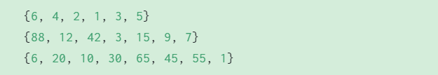

> **Resource Website:** [https://web.stanford.edu/class/archive/cs/cs106b/cs106b.1232/section/section1/](https://web.stanford.edu/class/archive/cs/cs106b/cs106b.1232/section/section1/)
> **SimpleTest Guide:** [https://www.yuque.com/alexman/ac5oth/koxfo0etzvcwy843#HgAzE](https://www.yuque.com/alexman/ac5oth/koxfo0etzvcwy843#HgAzE)

> 注意在读取文件的时候要取消`Qt Creator`的默认影子构建的选项。
> 

[section1_starter.zip](https://www.yuque.com/attachments/yuque/0/2022/zip/12393765/1672389722423-0b05e5bb-a66d-4ba2-9ba3-bb47dd66fc8f.zip)
[CS106B C++ fundamentals.pdf](https://www.yuque.com/attachments/yuque/0/2022/pdf/12393765/1672483030607-50626325-a925-448f-a09a-0035ac1d2010.pdf)

# Q1 Returning and Printing
> 

**Solution**


# Q2 References Available Upon Request
> 

**Solution**

# Q3 SumNumbers
> **Prereq:** `CS106L: Streams & Types`
> 
> - [readEntireFile](https://web.stanford.edu/dept/cs_edu/resources/cslib_docs/filelib.html#Function:readEntireFile)
> - [stringSplit](https://web.stanford.edu/dept/cs_edu/resources/cslib_docs/strlib.html#Function:stringSplit)
> - [isdigit](https://en.cppreference.com/w/cpp/string/byte/isdigit)
> - [stringToInteger](https://web.stanford.edu/dept/cs_edu/resources/cslib_docs/strlib.html#Function:stringToInteger)

```cpp

/*
 * Sum Numbers (Code Write)
 * ----------------------------------
 * Write a program to read through a given file and sum
 * all of the numbers in the file. You can assume that numbers
 * will be composed entirely of numerical digits, optionally
 * preceded by a single negative sign.
 */
int sumNumbers(string filename) {
    // TODO: Your code here
    Vector<string> lines;
    Vector<string> tokens;
    int sumNumber = 0;
    bool flag;
    ifstream input(filename.c_str());
    readEntireFile(input, lines);
    for(string line: lines){
        tokens = stringSplit(line," ");
        for(string token: tokens){
            flag = true;
            for (char character: token){
                if( !isdigit(character) && character != '-'){
                    flag = false;
                    break;
                }
            }
            if(flag == true){
                sumNumber += stringToInteger(token);
            }
        }
    }
    return sumNumber;
}
```
```cpp
// Judge whether the token is an interger, including the negative ones
bool isNumber(string s)
{
    // strip negative sign off negative numbers
    if (s.length() > 0 && s[0] == '-') {
        s = s.substr(1);
    }
    for (char ch : s) {
        if (!isdigit(ch)) return false;
    }
    return s.length() > 0;
}

// Summing up the integers
int sumNumbers(string filepath)
{
    ifstream in;
    Vector<string> lines;
    int sum = 0;

    if (!openFile(in, filepath)) {
        return 0;
    }

    readEntireFile(in, lines);
    for (string line : lines) {
        Vector<string> tokens = stringSplit(line, " ");
        for (string t : tokens) {
            if (isNumber(t)) {
                sum += stringToInteger(t);
            }
        }
    }
    return sum;
}
```


# Q4 Debugging Deduplicating⭐⭐⭐
> 
> 我们需要通过`STUDENT_TEST`增加一些测试用例来找出代码中的`bugs`。

**Solution**


# Q5 Pig-Latin
> 
> 本题的关键方法是`string.substr(start_index, length)`

```cpp
/*
* PigLatin (Code Write)
* ---------------------
* Write TWO functions that convert a string INPUT into its
* pig-Latin form. To convert a word into pig-Latin, follow these
* steps:
* 1. Split INPUT into 2 parts, the string of letters BEFORE the
*    first vowel, and the string of letters AFTER (and including) the
*    first vowel.
* 2. Append the before-string to the after-string.
* 3. Append "ay" to this resulting string.
*
* You may assume your input is a single, valid word with no trickery.
*
* Both functions below should have the same functionality, but pigLatinReturn()
* expects a new string in return that is the pig-Latin form of INPUT, and
* pigLatinReference() expects the parameter INPUT to be modified by the function call.
*/

string pigLatinReturn(string input) {
    (void) input;
    return "";
}

void pigLatinReference(string &input) {
    (void) input;
}


```
```cpp
/*
 * CS106B Section Handout Test Harness: Section 1
 * ----------------------------------------------
 * These problems have been galvanized from years of
 * section handouts that have been worked on by numerous
 * instructors and TA's. Originally codified by Trip Master
 * and Nick Bowman for CS106B Spring 2020.
 *
 * A huge thank you to Keith Schwarz and Julie Zelenski
 * for creating an amazing testing harness!
 */

#include <iostream>
#include "string.h"
#include "vector.h"
#include "SimpleTest.h"
using namespace std;

/*
 * PigLatin (Code Write)
 * ---------------------
 * Write TWO functions that convert a string INPUT into its
 * pig-Latin form. To convert a word into pig-Latin, follow these
 * steps:
 * 1. Split INPUT into 2 parts, the string of letters BEFORE the
 *    first vowel, and the string of letters AFTER (and including) the
 *    first vowel.
 * 2. Append the before-string to the after-string.
 * 3. Append "ay" to this resulting string.
 *
 * You may assume your input is a single, valid word with no trickery.
 *
 * Both functions below should have the same functionality, but pigLatinReturn()
 * expects a new string in return that is the pig-Latin form of INPUT, and
 * pigLatinReference() expects the parameter INPUT to be modified by the function call.
 */

bool isVowel(char c) {
    // Short Circuit
    return c == 'a' || c == 'e' || c == 'i' || c == 'o' || c == 'u';
}

string pigLatinReturn(string input) {
//    (void) input;
    int vowelIndex = -1;
    for (int i = 0; i < input.length(); i++) {
        if (isVowel(input[i])) {
            vowelIndex = i;
            break;
        }
    }
    if (vowelIndex != -1) {
        string front = input.substr(0, vowelIndex);
        string back = input.substr(vowelIndex);
        string append = "ay";
        string res = back + front + append;
        return res;
    }
    return "";
}

void pigLatinReference(string &input) {
//    (void) input;
    int vowelIndex = -1;
    for (int i = 0; i < input.length(); i++) {
        if (isVowel(input[i])) {
            vowelIndex = i;
            break;
        }
    }
    if (vowelIndex != -1) {
        string front = input.substr(0, vowelIndex);
        int backMove = input.length() - vowelIndex;
        for (int i = 0; i < backMove; i++) {
            input[i] = input[i + vowelIndex];
        }
        for (int i = backMove; i < backMove + front.length(); i++) {
            input[i] = front[i - backMove];
        }
        input.append("a");
        input.append("y");
    }
}


/* * * * * Provided Tests Below This Point * * * * */

PROVIDED_TEST("test case from handout") {
    string name = "julie";
    string str1 = pigLatinReturn(name);
    EXPECT_EQUAL(str1, "uliejay");

    pigLatinReference(name);
    EXPECT_EQUAL(name, "uliejay");
}

PROVIDED_TEST("Test a few more names from the handout") {
    Vector<string> names = { // Declarations like this will make you the talk of the town!
        "nick",
        "kylie",
        "trip"
    };
    Vector<string> pigLatinNames = {
        "icknay",
        "iekylay",
        "iptray"
    };
    for (int i = 0; i < names.size(); i++) {
        EXPECT_EQUAL(pigLatinNames[i], pigLatinReturn(names[i]));
        /* Not good form to modify the contents of a container you loop thru, so make a copy! */
        string nameCpy = names[i];
        pigLatinReference(nameCpy);
        EXPECT_EQUAL(pigLatinNames[i], nameCpy);
    }
}

```
```cpp
// Use const because VOWELS won't change -- no need to declare repeatedly
// in isVowel.
const string VOWELS = "aeiouy";

// Helper function, which I'd highly recommend writing!
bool isVowel(char ch) {
    // A little kludgy, but the handout guarantees that
    // ch will ALWAYS be lower case :)
    // NOTE: For an assignment, you probably want a more robust isVowel.
    return VOWELS.find(ch) != string::npos;
}

string pigLatinReturn(string input) {
    int strOneIndex = 0;
    for (int i = 0; i < input.length(); i++) {
        if (isVowel(input[i])) {
            strOneIndex = i;
            break;
        }
    }
    string strOne = input.substr(0, strOneIndex);
    string strTwo = input.substr(strOneIndex);
    return strTwo + strOne + "ay";
}

void pigLatinReference(string &input) {
    int strOneIndex = 0;
    for (int i = 0; i < input.length(); i++) {
        if (isVowel(input[i])) {
            strOneIndex = i;
            break;
        }
    }
    string strOne = input.substr(0, strOneIndex);
    string strTwo = input.substr(strOneIndex);
    input = strTwo + strOne + "ay";
}
```
**Efficiency Analysis**

# Q6 Mirror - Transpose
> 

```cpp
/*
 * CS106B Section Handout Test Harness: Section 1
 * ----------------------------------------------
 * These problems have been galvanized from years of
 * section handouts that have been worked on by numerous
 * instructors and TA's. Codified by Trip Master and Nick
 * Bowman for CS106B Spring 2020.
 *
 * A huge thank you to Keith Schwarz and Julie Zelenski
 * for creating an amazing testing harness!
 */
#include <iostream>
#include "grid.h"
#include "SimpleTest.h"
using namespace std;

/*
 * Mirror (Code Write)
 * ----------------------------------
 * Write a function that accepts a reference to a Grid of integers
 * as a parameter and flips the grid along its diagonal. You may
 * assume the grid is square; in other words, that it has the
 * same number of rows as columns.
 *
 */

void mirror(Grid<int> &nums) {
    // TODO: Your code here
}


/* * * * * Provided Tests Below This Point * * * * */


PROVIDED_TEST("test case from handout") {
    Grid<int> g = { { 6, 1, 9, 4},
                    {-2, 5, 8, 12},
                    {14, 39, -6, 18},
                    {21, 55, 73, -3}};

    Grid<int> soln = { {6, -2, 14, 21},
                       {1, 5, 39, 55},
                       {9, 8, -6, 73},
                       {4, 12, 18, -3} };
    mirror(g);
    EXPECT_EQUAL(g, soln);
}
```
```cpp
void mirror(Grid<int> &nums) {
    // TODO: Your code here
    int rows = nums.numRows();
    int cols = nums.numCols();
    for (int i = 0; i < rows; i++){
        for (int j = i; j < cols; j++) {
            if (i != j) {
                int temp = nums[i][j];
                nums[i][j] = nums[j][i];
                nums[j][i] = temp;
            }
        }
    }
}

```
```cpp
// solution
void mirror(Grid<int>& grid) {
    for (int r = 0;r < grid.numRows(); r++) {
        // start at r+1 rather than 0 to avoid double-swapping 
        for (int c = r + 1; c < grid.numCols(); c++) { 
            int temp = grid[r][c]; 
            grid[r][c] = grid[c][r]; 
            grid[c][r] = temp;
        } 
    }
}
```
```cpp
// bonus 
void mirror(Grid<int>& grid) {
    Grid<int> result(grid.numCols(), grid.numRows());
    for (int r = 0; r < grid.numRows(); r++) {
        for (int c = 0; c < grid.numCols(); c++) {
            result[r][c] = grid[c][r];
        }
    }
    grid = result;
}
```

# Q7 Check Balance
> 

```cpp
/*
 * CS106B Section Handout Test Harness: Section 1
 * ----------------------------------------------
 * These problems have been galvanized from years of
 * section handouts that have been worked on by numerous
 * instructors and TA's. Codified by Trip Master and Nick
 * Bowman for CS106B Spring 2020.
 *
 * A huge thank you to Keith Schwarz and Julie Zelenski
 * for creating an amazing testing harness!
 */
#include <iostream>
#include "stack.h"
#include "SimpleTest.h"
using namespace std;

/*
 * Balance (Code Write)
 * ----------------------------------
 * Write a function named checkBalance that accepts a string of
 * source code and uses a Stack to check whether the braces/parentheses
 * are balanced. Every ( or { must be closed by a } or ) in the opposite order.
 * Return the index at which an imbalance occurs, or -1 if the string is
 * balanced. If any ( or { are never closed, return the string’s length.
 */

int checkBalance(string code) {
    return 0;
}


/* * * * * Provided Tests Below This Point * * * * */

PROVIDED_TEST("test cases from handout") {
    EXPECT_EQUAL(checkBalance("if (a(4) > 9) { foo(a(2)); }"), -1);
    EXPECT_EQUAL(checkBalance("for (i=0;i<a;(3};i++) { foo{); )"), 15);
    EXPECT_EQUAL(checkBalance("while (true) foo(); }{ ()"), 20);
    EXPECT_EQUAL(checkBalance("if (x) {"), 8);
}
```
```cpp
int checkBalance(string code) {
    Stack<char> stack;
    for (int i = 0; i < code.length() ; i++) {
        char ch = code[i];
        if (ch == '(' || ch == '{') {
            stack.push(ch);
        } else if (ch == ')') {
            if (stack.isEmpty() || stack.peek() != '(') {
                return i;
            } else {
                stack.pop();
            }
        } else if (ch == '}') {
            if (stack.isEmpty() || stack.peek() != '{') {
                return i;
            } else {
                stack.pop();
            }
        } else {
            continue;
        }
    }
    // 这里要注意。
    return stack.isEmpty()? -1: code.length();
}
```
```cpp
int checkBalance(string code) {
    Stack<char> parens;
    for (int i = 0; i < (int) code.length(); i++) {
        char c = code[i];
        if (c == '(' || c == '{') {
        parens.push(c);
        } else if (c == ')' || c == '}') {
            if (parens.isEmpty()) {
                return i;
            }
            char top = parens.pop();
            if ((top == '(' && c != ')') || (top == '{' && c != '}')) {
                return i;
            }
        }
    }

    if (parens.isEmpty()) {
        return -1; // balanced
    } else {
        return code.length();
    }
}
```

# Q8 Collection Mystery
> 

**Solution**本质上就是队列不改变元素输入的顺序而栈改变元素输入的顺序，本题就是将偶数反序，然后接上奇数正序，于是可以得到:



# Q9 Friend List
> 
> 读取文件的方法可以参考`Q3`中的。
> - [readEntireFile](https://web.stanford.edu/dept/cs_edu/resources/cslib_docs/filelib.html#Function:readEntireFile)
> - [stringSplit](https://web.stanford.edu/dept/cs_edu/resources/cslib_docs/strlib.html#Function:stringSplit)
> - [isdigit](https://en.cppreference.com/w/cpp/string/byte/isdigit)
> - [stringToInteger](https://web.stanford.edu/dept/cs_edu/resources/cslib_docs/strlib.html#Function:stringToInteger)
> 
本题的`Sample/Formal Solution`使用了`C++`中的`Auto Insert`的特性。[Auto Insert](https://www.yuque.com/alexman/ac5oth/zqht7kygmof75k1l#GCqmd)

```cpp
/*
 * CS106B Section Handout Test Harness: Section 1
 * ----------------------------------------------
 * These problems have been galvanized from years of
 * section handouts that have been worked on by numerous
 * instructors and TA's. Codified by Trip Master and Nick
 * Bowman for CS106B Spring 2020.
 *
 * A huge thank you to Keith Schwarz and Julie Zelenski
 * for creating an amazing testing harness!
 */

#include <iostream>
#include "map.h"
#include "vector.h"
#include "filelib.h"
#include "strlib.h"
#include "SimpleTest.h"
using namespace std;

/*
 * Friend List (Code Write)
 * ----------------------------------
 * Write a function named friendList that takes in a file name and reads
 * friend relationships from a file and writes them to a Map.
 * friendList should return the populated Map. Friendships are bi-directional.
 * The file contains one friend relationship per line, with names separated
 * by a single space. You do not have to worry about malformed entries.
 */

Map<string, Vector<string>> friendList(string filename) {
    return {};
}


///* * * * * Provided Tests Below This Point * * * * */

PROVIDED_TEST("provided test case from handout") {
    Map<string, Vector<string>> soln;
    soln["Abby"] = {"Barney", "Clyde"};
    soln["Barney"] = {"Abby"};
    soln["Clyde"] = {"Abby"};
    EXPECT_EQUAL(soln, friendList("res/buddies.txt"));
}

```
```cpp
/*
 * Friend List (Code Write)
 * ----------------------------------
 * Write a function named friendList that takes in a file name and reads
 * friend relationships from a file and writes them to a Map.
 * friendList should return the populated Map. Friendships are bi-directional.
 * The file contains one friend relationship per line, with names separated
 * by a single space. You do not have to worry about malformed entries.
 */

Map<string, Vector<string>> friendList(string filename) {
    ifstream in;
    Map<string, Vector<string>> res;
    Vector<string> lines;

    if (!openFile(in, filename)) {
        return res;
    }

    readEntireFile(in, lines);
    for (string line: lines) {
       Vector<string> splittedString = stringSplit(line," ");
       string first = splittedString[0];
       string second = splittedString[1];
       res[first].add(second);
       res[second].add(first);
    }

    return res;
}

```
```cpp
Map<string, Vector<string> > friendList(string filename) {
    ifstream in;
    Vector<string> lines;

    if (openFile(in, filepath)) {
        readEntireFile(in, lines);
    }

    Map<string, Vector<string> > friends;
    for (string line: lines) {
        Vector<string> people = stringSplit(line, " ");
        string s1 = people[0];
        string s2 = people[1];
        friends[s1] += s2;
        friends[s2] += s1;
    }
    return friends;
}
```
```cpp
Map<string, Vector<string>> friendList(string filename) {
    ifstream in(filename);
    Map<string, Vector<string>> res;

    if (!in.is_open()) {
        return res;
    }

    string first;
    string second;
    while(in >> first >> second) {
        res[first].add(second);
        res[second].add(first);
    }
    return res;
```


# Q10 Twice⭐⭐⭐⭐⭐
> 

```cpp
/*
 * CS106B Section Handout Test Harness: Section 1
 * ----------------------------------------------
 * These problems have been galvanized from years of
 * section handouts that have been worked on by numerous
 * instructors and TA's. Codified by Trip Master and Nick
 * Bowman for CS106B Spring 2020.
 *
 * A huge thank you to Keith Schwarz and Julie Zelenski
 * for creating an amazing testing harness!
 */

#include <iostream>
#include "set.h"
#include "vector.h"
#include "SimpleTest.h"
using namespace std;

/*
 * Twice (Code Write)
 * ----------------------------------
 * Write a function named twice that takes a vector of integers
 * and returns a set containing all the numbers in the vector
 * that appear exactly twice.
 */

Set<int> twice(Vector<int> nums) {
    return {};
}


/* * * * * Provided Tests Below This Point * * * * */

PROVIDED_TEST("test case from handout") {
    Vector<int> v = {1, 3, 1, 4, 3, 7, -2, 0, 7, -2, -2, 1};
    Set<int> soln = {3, 7};
    EXPECT_EQUAL(twice(v), soln);
}
```
```cpp
Set<int> twice(Vector<int> nums) {
    Map<int, int> counts;
   for (int i : nums) {
       counts[i]++;
   }
   Set<int> twice;
   for (int i : counts) {
       if (counts[i] == 2) {
           twice += i;
       }
   }
   return twice;
}
```
```cpp
// solution
Set<int> twice(Vector<int>& v) {
    Map<int, int> counts;
    for (int i : v) {
        counts[i]++;
    }
    Set<int> twice;
    for (int i : counts) {
        if (counts[i] == 2) {
            twice += i;
        }
    }
    return twice;
}

// bonus⭐⭐⭐⭐⭐
Set<int> twice(Vector<int>& v) {
    Set<int> once;  // 只出现一次的数
    Set<int> twice; // 只出现两次的数
    Set<int> more;  // 出现两次以上的数
    for (int i : v) {
        if (once.contains(i)) {
            once.remove(i);
            twice.add(i);
        } else if (twice.contains(i)) {
            twice.remove(i);
            more.add(i);
        } else if (!more.contains(i)) {
            once.add(i);
        }
    }
    return twice;
}

```
