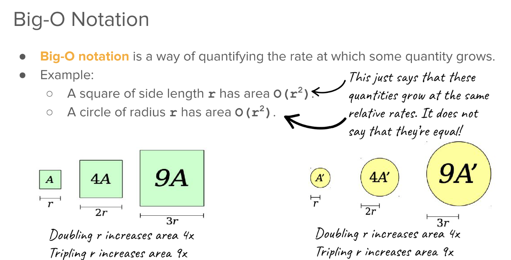

> **Text: **7.1~7.4, 8.4, 10.2


# 1 BigO & Asymptotics(Skimmed)
[Lecture8_Slides.pdf](https://www.yuque.com/attachments/yuque/0/2023/pdf/12393765/1675474571017-cb27c3dc-f4de-4683-8ba8-e88729c8f465.pdf)
## Why Efficiency?
> 


## Leveraging Intuition
**Example 1**
**Example 2**
**Example 3**
**Example 4**
**Example 5**
**Key Takeaway**


## Big-O Notation
> 

**Example**

## Runtime
> 

**Runtime Analysis Example - vectorMax()**
**Runtime Analysis Example - printStars()**
**Runtime Analysis Example - hmmThatsStrange()**


## Efficiency Categorization
> 


## ADT Big-O Matrix
> 


# 2 Introduction to Recursion
[Lecture9_Slides.pdf](https://www.yuque.com/attachments/yuque/0/2023/pdf/12393765/1675482824521-9927f725-a14d-4653-a03e-1fcfe71ff080.pdf)
[Lecture9Starter.zip](https://www.yuque.com/attachments/yuque/0/2023/zip/12393765/1675482895172-83aece41-1407-43a7-93ed-e185961d6d46.zip)
[Lecture9Final.zip](https://www.yuque.com/attachments/yuque/0/2023/zip/12393765/1675482895135-714294c6-fbf4-4d95-8475-d99a8da73df7.zip)

## Textbook Examples
**Program to List the Fibonacci Series**
**Programs to check for Palindromes**


## Definition of Recursion
> 

**Quick Example**

## Components of Recursion
> 


## String Reversion
> 

**Recursive Solution**
```cpp
/* This function recursively reverses the characters of the provided
 * string and returns the reversed string.
 */
string reverse(string s) {
    if (s == "") {
        return "";
    }
    return reverse(s.substr(1)) + s[0]; // Builds up the string by moving
                                        // the first letter to the end

    // Builds up the string by moving the last letter to the front
    //return s[s.length() - 1] + reverse(s.substr(0, s.length() - 1));
}
```


## Palindrome
> 


## Summary
> 


# 3 Graphical Recursion&Fractals
[Lecture10_Slides.pdf](https://www.yuque.com/attachments/yuque/0/2023/pdf/12393765/1675483658940-ae075ca0-1acd-4e30-a98a-a13d6b32877d.pdf)
[Lecture10Starter.zip](https://www.yuque.com/attachments/yuque/0/2023/zip/12393765/1675483649438-c67f8e36-e15f-4396-9197-95469722ad63.zip)
[Lecture10Final.zip](https://www.yuque.com/attachments/yuque/0/2023/zip/12393765/1675483649462-6400cacb-0a95-4586-bad4-7690e0aec3cf.zip)


## Self-Similarity
> 

**Graphical Representation of Recursion**


## Fractals(碎形，分形学)
> 


## Order-N Trees
> 

**Order 0 Tree**
**Order 1 Tree**
**Order 2 Tree**
**Order 3 Tree**
**Order 4 Tree**
**Order 11 Tree**
**Summary**


## Cantor Set
> 

**Order 0 Cantor Set**
**Order 1 Cantor Set**
**Order 2 Cantor Set**
**Order 6 Cantor Set**


## Sierpinski Carpet
> 

**Order 0**
**Order 1**
**Order 2**

# 4 C++ Stanford Graphics Library
## Official Documentation
> [official documentation](https://web.stanford.edu/dept/cs_edu/resources/cslib_docs/)


## GWindow
> 


## GPoint
> 


## Draw Cantor Set
> 

```cpp
#pragma once

#include "gwindow.h"
#include "gobjects.h"
#include "point.h"

/* Cantor Set Information */
GPoint getLoweredPoint(GPoint point);
void drawThickLine(GWindow &w, GPoint left, GPoint right);
void runCantorDemo();

// display constants
static const int FRACTAL_DEPTH = 6;
static const int SCREEN_WIDTH = 1000;
static const int SCREEN_HEIGHT = SCREEN_WIDTH;
static const int LEVEL_HEIGHT = 20;
static const int RECT_HEIGHT = 10;
static const int INSET = 20;

/* Snowflake Information */

GPoint pointBetween(GPoint p1, GPoint p2, double fraction);
GPoint thirdEquilateralPoint(GPoint bottomLeft, GPoint otherPoint);
void runSnowflakeDemo();

// useful math constants
static const double COS_60 = 0.5;            //value of cos(60 degrees)
static const double SIN_60 = sqrt(3)*0.5;    //value of sin(60 degrees)

// display constants
//static const int FRACTAL_DEPTH = 3;
//static const int SCREEN_WIDTH = 1000;
//static const int SCREEN_HEIGHT = SCREEN_WIDTH;
static const int BASE_Y = SCREEN_HEIGHT - SCREEN_HEIGHT * .4;
static const int BASE_LEFT_X = 170;
static const int BASE_RIGHT_X = SCREEN_WIDTH - 170;

/* Sierpinski Carpet Information */
void runSierpinskiDemo();

/* Constants controlling the window size. */
const double kWindowWidth  = 1000;
const double kWindowHeight = 800;

/* Margin from window sides to content area. */
const double kMargin = 40;

/* Colors! */
const std::string kBackgroundColor = "white";
const std::string kRectangleColor  = "#400080";

/* Maximum order to draw. */
const double kMaxOrder = 5;

void clear(GWindow& window);
void repaint(GWindow& window);
```
```cpp
/*
 * FILE: CANTOR FRACTALS
 * ---------------------
 * This program draws a Cantor Fractal of a constant depth on the screen.
 * A Cantor fractal of depth N is a thick horizontal line on top, with
 * a depth N-1 Cantor fractal below the left third, and a depth N-1 Cantor
 * fractal below the right third, of the drawn line.
 */

#include <math.h>
#include "gwindow.h"
#include "gobjects.h"
#include "point.h"
#include "simpio.h"
#include "fractals.h"

using namespace std;

/* Function: Draw Cantor
 * ---------------------
 * A recursive function that draws a Cantor Fractal between points
 * "left" and "right." The fractal will have "level" numbers of levels.
 */
void drawCantor(GWindow & w, int order, GPoint left, GPoint right) {
    /* Base Case: An order 0 Cantor Set involves drawing nothing. */
    if (order == 0) {
        return;
    }

    /* Reucrsive Case: An order n Cantor Set involves drawing two order n-1 Cantor Sets. */

    /* Pause briefly to be able to watch the animation in the graphical window. */
    pause(500);

    /* Step 1: Draw the main line. */
    drawThickLine(w, left, right);

    /* Step 2: Draw the smaller Cantor Set on the left third of the screen. */
    GPoint oneThird = pointBetween(left, right, 1.0 / 3);
    drawCantor(w, order - 1, getLoweredPoint(left), getLoweredPoint(oneThird));

    /* Step 3: Draw the smaller Cantor Set on the right third of the screen. */
    GPoint twoThirds = pointBetween(left, right, 2.0 / 3);
    drawCantor(w, order - 1, getLoweredPoint(twoThirds), getLoweredPoint(right));
}

/* PROVIDED HELPER FUNCTIONS */

/* Function: pointBetween
 * ---------------------
 * Given two points and a franction (assumed to be in the range
 * [0, 1], the function returns the point "fraction" amount of the
 * way between p1 and p2.
 */
GPoint pointBetween(GPoint p1, GPoint p2, double fraction) {
    double deltaX = p2.getX() - p1.getX();
    double deltaY = p2.getY() - p1.getY();
    double x = p1.getX() + fraction * deltaX;
    double y = p1.getY() + fraction * deltaY;
    GPoint newPoint(x, y);
    return newPoint;
}


/* Function: Draw Thick Line
 * ---------------------
 * Because sometimes thin lines just don't look good enough in
 * a lecture demo. Actually draws a rectangle instead of a line :)
 */
void drawThickLine(GWindow & w, GPoint left, GPoint right) {
    double width = right.getX() - left.getX();
    // this is called a pointer. We will learn about them later.
    GRect * rect = new GRect(0, 0, width, RECT_HEIGHT);
    rect->setFilled(true);
    cout << left.getX() << "," << left.getY() << endl;
    w.add(rect, left.getX(), left.getY());
}

/* Function: Get Lowered Point
 * ---------------------
 * Returns a GPoint which is LEVEL_HEIGHT pixels lower than the one
 * passed in (has a larger Y value).
 */
GPoint getLoweredPoint(GPoint point) {
    GPoint next(point.getX(), point.getY() + LEVEL_HEIGHT);
    return next;
}

void runCantorDemo() {
    GWindow w(SCREEN_WIDTH, SCREEN_HEIGHT);
    GPoint left(INSET, INSET);
    GPoint right(SCREEN_WIDTH - INSET, INSET);
    drawCantor(w, FRACTAL_DEPTH, left, right);
}

```
**Program Output**


## Draw Sierpinski Carpet
> 

**Solution**
```cpp
/*
 * File: Trees.cpp
 * ---------------
 * A program that generates trees using recursion!
 */

#include <iostream>
#include <string>
#include "gwindow.h"
#include "gobjects.h"
#include "gthread.h"
#include "fractals.h"
using namespace std;

void drawSquare(GWindow& window, double x, double y, double size);

void drawSierpinskiCarpet(GWindow& window, double x, double y, double size, int order) {
    /* Base case: A carpet of order 0 is a filled square. */
    if (order == 0) {
        drawSquare(window, x, y, size);
    }
    /* Recursive case: Draw eight smaller copies of the Sierpinski carpet,
     * arranged in a 3x3 grid with a hole in the middle.
     */
    else {
        for (int row = 0; row < 3; row++) {
            for (int col = 0; col < 3; col++) {
                /* The only square to skip is the very center one. Great
                 * question to ponder: why is this an OR and not an AND?
                 * Great follow-up question: if we replace this OR with
                 * an AND, what will you see?
                 */
                if (row != 1 || col != 1) {
                    /* Compute new coordinates. Each smaller square is one-
                     * third the size of the original.
                     */
                    double newX = x + col * size / 3;
                    double newY = y + row * size / 3;
                    drawSierpinskiCarpet(window, newX, newY, size / 3, order - 1);
                }
            }
        }
    }
}

/* Main program */
void runSierpinskiDemo() {
    GWindow window(kWindowWidth, kWindowHeight);
    window.setExitOnClose(true);

    while (true) {
        for (int order = 0; order <= kMaxOrder; order++) {
            clear(window);
            window.setTitle("Sierpinski Carpet of Order " + to_string(order));

            /* Determine the width and height of the square to draw. */
            double width  = window.getCanvasWidth()  - 2 * kMargin;
            double height = window.getCanvasHeight() - 2 * kMargin;
            double size = min(width, height);

            /* Determine position. */
            double x = (window.getCanvasWidth()  - size) / 2.0;
            double y = (window.getCanvasHeight() - size) / 2.0;

            drawSierpinskiCarpet(window, x, y, size, order);
            pause(2000);
        }
    }
}

/* This somewhat clunky-looking function is
 * designed to repaint the window immediately
 * so that if we step through this code in
 * the debugger, the window is responsive and
 * shows the lines we're drawing. This is basically
 * a hack around our libraries; you aren't
 * expected to understand how this works.
 */
void repaint(GWindow& window) {
    GThread::runOnQtGuiThread([&] {
        window.repaint();
    });
}

/* Clears the graphics contents from the window. */
void clear(GWindow& window) {
    window.setColor(kBackgroundColor);
    window.fillRect(0, 0, window.getCanvasWidth(), window.getCanvasHeight());
    repaint(window);
}

void drawSquare(GWindow& window,
                double x, double y,
                double size) {
    window.setColor(kRectangleColor);
    window.fillRect(x, y, size, size);
    repaint(window);
}

```
**Program Output**
