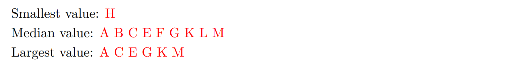

# 1 Discussions
## Heap Operations
### Insertion
> Sp21 disc09
> 
> 🔔: 注意，对于`MinHeap`来说, 如果我们要进行`sink`操作时左右节点都比当前节点数值小，则我们会选择数值更小的那个节点进行交换，结果如下:

**Solution**

## Min-heap&Max-heap
### Transformation
> 

**Solution**

# 2 Exam Preparations
## Heap Numericals&Insertions
### Heap Numericals I⭐⭐⭐⭐⭐
> **Sp19 ExamPrep09 **
> 
> **Incresing Order:**
> **假设插入的就是**`**1~11**`**, 则**`**H=1, D=2, L=3, ..., G=11**`**, 就是层序遍历依次对应不同节点:**
> - Smallest Value: H
> - Median Value: K 
> - Largest Value: G
> 
**Decreasing Order:**
> 假设插入的是`11~1`, 则:
> - Smallest Value: H
> - Median Value: L
> - Largest Value: A
> 
**Random Order:**
> 因为是`Min Heap`, 所以`Smallest Value`永远是`H`，最大值永远在`Leaf Node`处，所以`Largest Value`可能是`A,C,E,G,K,M`中的任意一个。
> `Median Value`稍微复杂一些，但可以使用排除法:
> 1. 首先可以排除`H`, 因为根据`Minheap`的性质没有元素比它小。
> 2. `D`不可能是`Median`, 因为比`D`小的元素最多只有`H,K,L,M`四个, 而`Median`在本题中要求`5`个节点比自己小。
> 3. 剩下的都有可能是`Median`，因为都可以构造出一个`Heap Tree`使得恰有`5`个元素比自己小。
> 

### Heap&BST Numericals⭐⭐⭐
> **Sp18 Examprep10**
> 
> 🔔: 我们逐行分析：
> 1. 排除$\alpha,\beta, \pi$, 因为他们都有子节点，而子节点的元素永远比父节点大，但是剩下的元素都有可能是最大值。
> 2. 根据`MinHeap`的性质，根节点一定最小且唯一, 其他元素都可以找到比他们自身更小的元素，所以我们有: 
> 3. `BST`的最大值永远在最右下侧，是$w$: 
> 4. `BST`的最小值永远在最左下侧: 是$\delta$: 
> 5. 首先我们的`Heap`中有`7`个元素，所以某个节点要想作为`Median`, 必须有三个节点的值比其小，三个节点的值比其大，我们还是使用排除法，$\alpha$没有元素比其小，所以排除$\alpha$。其他元素均可以作为`Median`: 
> 6. `BST`的`Median`只能是$\alpha$，没有歧义。
> 7. 首先交换$\alpha$和$\omega$, 然后删除$\alpha$, 最后`sink(w)`, 在`sink`的过程中, 我们会选择更小的那个子节点进行交换，但是我们不知道哪个子节点更小，所以$\beta$和$\pi$都有可能成为新的根节点:
> 8. `Hibbard Deletion`就是与`successor/predecessor`进行交换,  于是$\theta$或者$\epsilon$会成为新的根节点：
> 9. `Minheap Insertion`插入在最左侧，在`swim`的过程中可能与$\alpha$发生交换，也可能不交换，所以$\alpha$和$\phi$都有可能成为新的最小值 
> 10. `BST Insertion`不改变原来的树结构，也就是不改变根节点: 

### Heap Numericals II
> **Sp21 Examprep09**
> 
> 4. 本题很经典，关键在于要想清楚三点：
>    1. `Heap`的每一层的所有`Nodes`都是等价的(`Level Nodes are all equivalent in the sense of numbers`)，因为我们不知道左节点比较大还是右节点比较大，所以他们本质上没有区别。
>    2. 根节点永远不可能作为`i-th smallest element`(也就是`i>1`), 因为没有元素比他更小，换句话说`i`只能等于`1`。
>    3. 深度大于等于`4`的节点不可能作为`4-th smallest element`, 因为有深度为`0,1,2,3`的节点一定比他小，所以只能作为`i-th smallest element`(其中`i>4`)。
> 

> 5. 本题比较简单，首先我们画出`Minheap`的图:
> 

>    - 如果我们要在`Second Level`的话，那么首先他一定要比自己的所有子孙节点的值都要小，而对于一个有$2^n-1$个节点的`Minheap`来说，比第二层上的节点大的节点数量为$\frac{2^n-1-1}{2}-1=2^{n-1}-2$。另外如果要在第二层，那么至少要比第一层的元素大，于是`greater than 1`
>    - 如果我们要在`Bottom-Most level`的话，那么根据之前第`4`问中的推导可知，如果根节点是`1-th smallest element`的话，那么底部的节点就应该是`n-th smallest element`, 所以必须要有$n-1$个节点比其小，也就是要比$n-1$个节点大。另外我们知道，最后一层所有的元素都有可能成为整个`Minheap`中最大的元素，所以最后一层的元素可以小于`0`个元素。
> 

### Heap Insertion⭐⭐⭐⭐⭐
> **Sp21 Examprep09**
> 
> 🔔本题非常经典，我们需要通过一定的逻辑判断来得出结论，值得反复思考，视频里给出了非常详细的解答和思考过程。

[Heap Mystery.mp4](https://www.yuque.com/attachments/yuque/0/2023/mp4/12393765/1679656288876-ec702ff0-4124-4248-87a4-c9b29576653c.mp4)
**Solution (a)**
**Solution (b)**

## Runtime Analysis⭐⭐⭐⭐⭐
> **Sp21 Examprep09（非常好的题）**
> 
> 🔔我们逐个分析:
> 1. **本题非常容易错，也非常经典。**`Worst Case`很容易想到，如果`Minheap`的结构使得我们在`sink`的过程中和每一个遇到的节点都进行一次交换，这样交换的次数是$\Theta(logN)$。`Best Case`很有意思，我们可以构造一个如下图所示的`Minheap`: 
> 

> 此时如果我们`removeMin`, 那么`99`先和`1`交换，然后`99`执行`sink()`操作, 在和`2`交换之后就终止程序。那么此时`removeMin()`的时间复杂度就是$\Theta(1)$。
> 总的来说，如果`Minheap`中的`Number`结构是严重倾斜的话，就有可能出现无论堆中有多少元素都只需要常数级别的时间来完成`removeMin()`的情况。
> 2. `Best Case`就是说如果`Minheap`中的元素本来就都很小，然后我插入一个很大的元素，此时在`swim()`的过程中可能完全不发生`swap`, 此时时间复杂度为$\Theta(1)$。`Worst Case`就是说如果`Minheap`中的元素都很大，然后我插入了一个很小的元素，那么`swim()`的过程中可能每一层节点都要发生一次交换，此时时间复杂度是$\Theta(logN)$。
> 
🔔: 至于我们为什么要用$\Theta$而不是$O$或者$\Omega$, 是因为我们的`Runtime`在`Best/Worst Case`下是固定的，不存在什么大于小于号。

