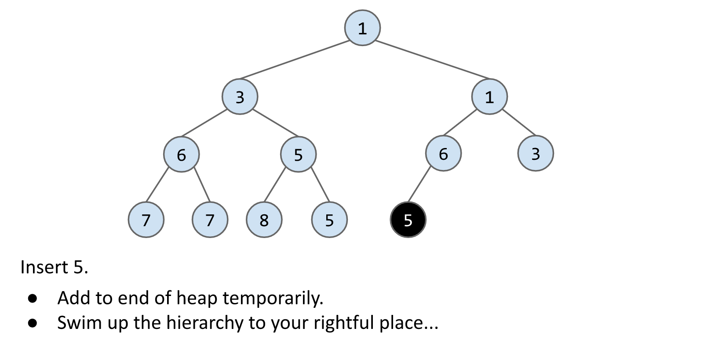
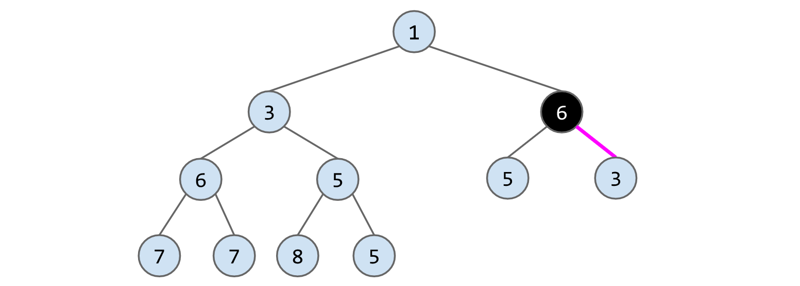

[cs61b 2019 ds6 lec20 heaps and pq.pdf](https://www.yuque.com/attachments/yuque/0/2023/pdf/12393765/1676204870766-91caa95d-d161-4510-a010-2712cde51f13.pdf)
[Heaps and Priority Queues Study Guide _ CS 61B Spring 2019.pdf](https://www.yuque.com/attachments/yuque/0/2023/pdf/12393765/1676204901247-a5fd6209-0589-4795-b9bc-7efd47c33743.pdf)

# Priority Queue Intro
## Interface
> 

## Real-World Problem
> 
> 

## Possible PQ Implementation
> 

# Heap
## Definition
> 

**Concept Check**

## Goodness of Heap
> 

## Heap Operations
> 

**Solution - Insert 3**
**Insert 5**

**Delete Min**

**Delete Another Min**

> `Insertion`: Append, swap then swim up.
> `Deletion`: Swap, cut and dive in.

## 
## Summary
> 

# Heap - PQ Implementation
## Approach 1 - Tree
### 1a - Fixed-Width Nodes
> 

### 1b - Variable-Width Nodes
> 

### 1c - Sibling Tree
> 

## Approach 2 - Two Arrays
> 

## Approach 3 - One Array⭐⭐⭐⭐⭐
### Representation
> 
> **注意: 使用**`**array**`**来表示的**`**trees**`**只能是**`**complete trees**`**.**

### 
### Approach 3A
> 

### Approach 3B - One Empty Spot⭐⭐⭐⭐⭐
> 

## Performance&Summary
> 

