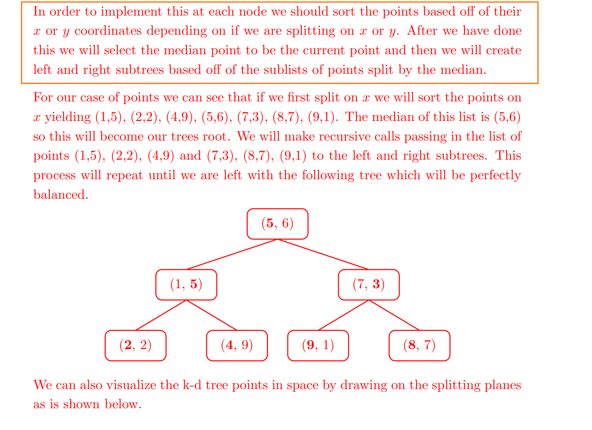
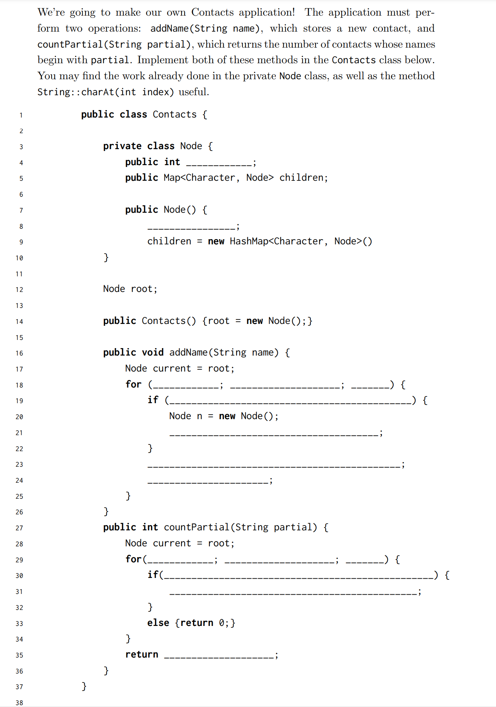

# 1 Discussion
## Tries-Prefix⭐⭐⭐⭐⭐
> **Sp19 Discussion 09**
> 

**Solution**


## Quadtrees
> **Sp18 disc10**
> 

**Solution**本质上就是`search`和`insert`两步走，先`search`后`insert`。


## K-d Trees⭐⭐⭐⭐⭐
> **Sp19&Disc09**
> 

**Solution 3.1**

> 

**Solution 3.2**
> **K-d Tree Nearest Neighbor**
> 
> 答案很长，详见文件。

[disc09sol_19.pdf](https://www.yuque.com/attachments/yuque/0/2023/pdf/12393765/1679668200627-6f74f811-23b7-4b56-9a2d-06de98f99c27.pdf)
**Solution**

## Kd-Tree Construction⭐⭐⭐
> 假设我们有一些`2D-points`, 则一般而言我们创建一颗`Perfectly balanced K-d Tree`有两种方法:
> 1. **二分法(使用所有点的信息): **就是首先对所有点的`x`轴坐标排序，然后找到作为`Median`的`x-value`对应的坐标点, 以此将平面分成左右两半。然后对于每个半平面中的点，对`y`轴坐标进行排序，然后重复上面的步骤。
> 2. 随机插入法(一次随机插入一个): 为了简化我们的构建代码，我们可以采用随机插入，这样得到的`K-d Tree`虽然不能保证`100%`是一颗`Perfectly-Balanced Tree`, 但是也是近似一颗`Balanace Tree`。
> 
🔔: 记住，我们如此追捧`Balanced Tree`的原因就是要优化查询速度，防止`Spindly Tree`的情况出现，而是尽可能追求`Bushy Tree`, 优化搜索速度达到$\Theta(logN)$。

**Two Ways for Construction(Explained)**


# 2 Exam Preparations
## Tries - Contacts Application⭐⭐⭐⭐⭐
> **Sp19 Examprep09**
> **🔔**: 本题其实就是在代码层面上实现[Tries Prefix Count](https://www.yuque.com/alexman/dxgel1/lyp0v168m5gs17db/edit#wVaTl)，统计所有前缀为`prefix`的`contacts`的个数。
> 

```java
public class Contacts {

    private class Node {
        public int prefixCount; // Used to count Partial
        public Map<Character, Node> children;

        public Node() {
            prefixCount = 0; // Initialize the prefix count tp zero
            children = new HashMap<Character, Node>();
        }
    }

    Node root;

    public Contacts() {root = new Node();}

    public void addName(String name) {
        Node current = root;
        for (int index = 0; index < name.length(); index++) {
            if (!current.children.containsKey(name.charAt(index))) {
                Node n = new Node();
                current.children.put(name.charAt(index), n);
                }
            current = current.children.get(name.charAt(index));
            current.prefixCount++;
            }
    }

    public int countPartial(String partial) {
        // First traversal to the end of the prefix,
        // then return the number stored on it
        Node current = root;
        for(int index = 0; index < partial.length(); index++) {
            if(current.children.containsKey(partial.charAt(index))) {
                current = current.children.get(partial.charAt(index));
            }
            else {
                return 0;
            }
        }
        return current.prefixCount;
    }
}
```


## KND Tree
> **Sp19 Examprep09**
> 


### Kd-Tree Construction
> 

**Solution**

### Finding Closest Point 
> 

**Solution**
