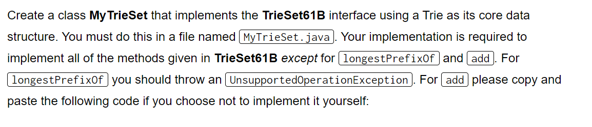
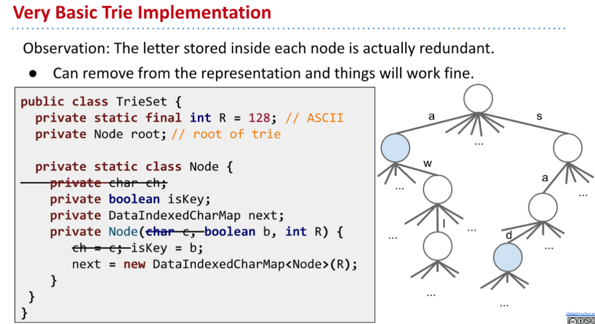
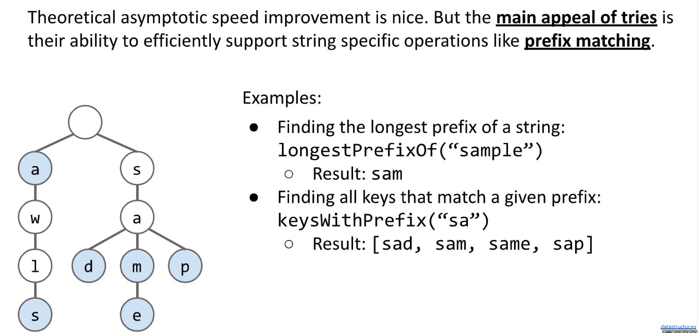
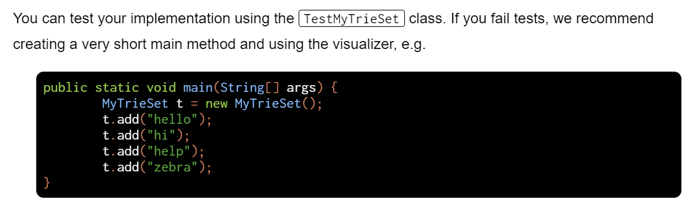

[Lab 9_ Tries _ CS 61B Spring 2019.pdf](https://www.yuque.com/attachments/yuque/0/2023/pdf/12393765/1676797552056-2a2c0d09-cff0-4541-852d-3cb149e2dc51.pdf)
[lab9.zip](https://www.yuque.com/attachments/yuque/0/2023/zip/12393765/1676797578948-97a33edf-1db1-4b7c-89d8-843b727656fd.zip)

# Code Implementation
> 
> **Hint:** [https://algs4.cs.princeton.edu/52trie/TrieST.java.html](https://algs4.cs.princeton.edu/52trie/TrieST.java.html)
> 下面我们使用`CharIndexedArray`来实现`Node.next`， 思路参考下图：
> 


## Class Design
> `MyTriset`类中存放:
> 1. `R`: 表示`Extended-ASCII`表的长度，是`256`, 由于无需修改，故设置为`256`即可。
> 2. `root`: 表示`Tries`的根节点，也表示空串。
> 3. `n`: 表示`Tries`中存放了多少个字符串（有多少个`key`）。
> 
嵌套类`Node`中需要存放下列实例变量:
> 1. `isKey`: 用于标记当前的`Node`是否是某个字符串的尾部。
> 2. `next`: 用于标记下一个字符是什么，使用`Extended-ASCII`表示法，需要初始化一个长度为`256`的泛型数组。

```java
public class MyTrieSet implements TrieSet61B{
    private static final int R = 256;

    private class Node {
        private boolean isKey;
        private Node[] next;
        private Node(boolean b, int R) {
            this.isKey = b;
            this.next = new Node[R];
        }
    }

    private Node root;
    private int n;  // Number of keys

    public MyTrieSet() {
        root = new Node(false, R);
        n = 0;
    }
}
```


## clear()
> 恢复到只有一个根节点(`isKey=false`, 白色节点的状态)。

```java
@Override
public void clear() {
    root = new Node(false, R);
    n = 0;
}
```
```java
// assumes add/contains work
@Test
public void sanityClearTest() {
    MyTrieSet t = new MyTrieSet();
    for (int i = 0; i < 455; i++) {
        t.add("hi" + i);
        //make sure put is working via contains
        assertTrue(t.contains("hi" + i));
    }
    t.clear();
    for (int i = 0; i < 455; i++) {
        assertFalse(t.contains("hi" + i));
    }
}
```

## add() ⭐⭐⭐⭐⭐
```java
@Override
public void add(String key) {
    if (key == null || key.length() < 1) {
        throw new IllegalArgumentException("argument to add() is null or with length < 1");
    }

    Node curr = root;
    for (int i = 0, n = key.length(); i < n; i++) {
        char c = key.charAt(i);
        if (curr.next[c] == null) {
            curr.next[c] = new Node(false, R);
        }
        curr = curr.next[c];
    }
    curr.isKey = true;
}
```
```java
@Override
public void add(String key) {
    if (key == null || key.length() < 1) {
        throw new IllegalArgumentException("argument to add() is null or with length < 1");
    }
    root = addHelper(root, key, 0);
}


/**
 * Add a key node to the tries rooted at node x
 * @param x: the rooted node
 * @param key: the key to be inserted
 * @param i: the current index of the string, also representing the accumulated length
 *         of the string path.from the root node to the current node.
 * @return
 */
private Node addHelper(Node x, String key, int i) {
    // When we traverse to the end of the tries(fell off the tree), we add the node
    // Careful, don't set node's isKey to true yet
    // Since we don't know whether we have reach the end of the string
    // Very likely we are in the middle of the string when
    // the tries are still very small and x == null often happens.
    if (x == null) {
        x = new Node(false, R);
    }
    // If we have traverse over the string but still not falls off the trie
    if (i == key.length()) {
        x.isKey = true;
        return x;
    }
    // Not the end of the string, keep recursing
    char c = key.charAt(i);
    x.next[c] = addHelper(x.next[c], key, i + 1);
    return x;
}
```


## numOfKeys()
```java
public int numOfKeys() {
    return n;
}
```
```java
@Test
public void testNumKeys() {
    String[] saStrings = new String[]{"same", "sam", "sad", "sap"};
    MyTrieSet t = new MyTrieSet();
    for (String s: saStrings) {
        t.add(s);
    }
    assertEquals(t.numOfKeys(), 4);
}
```

## collectAllKeys()⭐⭐⭐⭐⭐
> 我们需要一个数据结构来记录遍历的`path`, 由于`Tries`中的`Key`都是`String`, 我们自然而然可以想到使用`StringBuilder`来记录。

```java
/**
 * Collect all keys in the tries
 * @return
 */
public Set<String> collectAllKeys() {
    Set<String> res = new HashSet<>();
    StringBuilder prefix = new StringBuilder();
    collectAllKeysHelper(prefix, root, res);
    return res;
}

/**
 * Helper method for collecting, using backtracking.
 * @param prefix: The data structure that records the current string
 * @param x: current node, used to traverse the tries
 * @param res: the data structure that stores the final result, containing all keys
 * @return
 */
private void collectAllKeysHelper(StringBuilder prefix, Node x, Set<String> res) {
    if (x == null) {
        return;
    }
    if (x.isKey) {
        res.add(prefix.toString());
    }
    for (char ch = 0; ch < R; ch++) {
        prefix.append(ch);
        collectAllKeysHelper(prefix, x.next[ch], res);
        prefix.deleteCharAt(prefix.length() - 1);
    }
}
```
```java
@Test
public void testCollectAllKeys() {
    String[] saStrings = new String[]{"same", "sam", "sad", "sap"};
    Set<String> saStringsSet = new HashSet<>();
    saStringsSet.addAll(Arrays.asList(saStrings));
    MyTrieSet t = new MyTrieSet();
    for (String s: saStrings) {
        t.add(s);
    }
    assertEquals(saStringsSet, t.collectAllKeysSet());
}
```

## contains()
> `Assume add() works`

```java
@Override
public boolean contains(String key) {
    if (key == null || key.length() < 1) {
        throw new IllegalArgumentException("argument to contains() is null or with length < 1");
    }
    Set<String> allKeys = collectAllKeys();
    return allKeys.contains(key);
}

```
```java
// assumes add works
@Test
public void sanityContainsTest() {
    MyTrieSet t = new MyTrieSet();
    assertFalse(t.contains("waterYouDoingHere"));
    t.add("waterYouDoingHere");
    assertTrue(t.contains("waterYouDoingHere"));
}
```


## keysWithPrefix()⭐⭐⭐
> 我们需要先遍历到这个前缀的最后一位，然后再调用`collectAllKeyHelper()`来获取所有的`Strings`。
> 

```java
@Override
public List<String> keysWithPrefix(String prefix) {
    StringBuilder sb = new StringBuilder();
    List<String> res = new ArrayList<>();
    Node curr = root;
    for (int  i = 0, n = prefix.length(); i < n; i++) {
        char c = prefix.charAt(i);
        sb.append(c);
        Node next = curr.next[c];
        // Invalid prefix
        if (next == null) {
            return res;
        }
        curr = next;
    }
    collectAllKeysHelper(sb, curr, res);
    return res;
}
```
```java
@Test
public void sanityPrefixTest() {
    String[] saStrings = new String[]{"same", "sam", "sad", "sap"};
    String[] otherStrings = new String[]{"a", "awls", "hello"};

    MyTrieSet t = new MyTrieSet();
    for (String s: saStrings) {
        t.add(s);
    }
    for (String s: otherStrings) {
        t.add(s);
    }

    List<String> keys = t.keysWithPrefix("sa");
    for (String s: saStrings) {
        assertTrue(keys.contains(s));
    }
    for (String s: otherStrings) {
        assertFalse(keys.contains(s));
    }

    // Test for invalid prefix
    List<String> keysV = t.keysWithPrefix("tt");
    assertEquals(0, keysV.size());
}
```

## longestPrefixOf()⭐⭐
> 

```java
/**
 * Returns the string in the symbol table that is the longest prefix of {@code key},
 * or {@code null}, if no such string.
 * @param key the query string
 * @return the string in the symbol table that is the longest prefix of {@code key},
 *     or {@code null} if no such string
 * @throws IllegalArgumentException if {@code query} is {@code null}
 */
@Override
public String longestPrefixOf(String key) {
    if (key == null || key.length() < 1) {
        throw new IllegalArgumentException("argument to longestPrefixOf() is null or with length < 1");
    }

    return longestPrefixOfHelper(root, key, 0);
}

private String longestPrefixOfHelper(Node p, String key, int index) {
    // We fall off the tree
    if (p == null) {
        return key.substring(0, index - 1);
    }

    // We finish traversing the string
    if (index == key.length()) {
        return key;
    }

    // 顺着遍历就可以，知道遇到null或者string遍历完为止。
    // Get the current character
    char c = key.charAt(index);
    // Follow the character in the tree structure
    return longestPrefixOfHelper(p.next[c], key, index + 1);
}
```
```java
@Test
public void testLongestPrefix() {
    String[] saStrings = new String[]{"same", "sam", "sad", "sap"};
    MyTrieSet t = new MyTrieSet();
    for (String s: saStrings) {
        t.add(s);
    }
    assertEquals("sam", t.longestPrefixOf("sample"));

    saStrings = new String[]{"samplet", "samp", "sad", "sap"};
    t = new MyTrieSet();
    for (String s: saStrings) {
        t.add(s);
    }
    assertEquals("sample", t.longestPrefixOf("sample"));
}
```


## delete()(Optional)⭐⭐⭐⭐⭐
```java
/**
 * Delete the key from the tries
 * @param key
 */
public void delete(String key) {
    if (key == null) {
        throw new IllegalArgumentException("key is illegal!");
    }

    if (!contains(key)) {
        return;
    }

    root = deleteHelper(root, key, 0);
}


private Node deleteHelper(Node p, String key, int index) {
    if (p == null) {
        return null;
    }

    // 遍历到了key string的最后一位，而key string的最后一个
    // char就是我们的key, 我们需要将其设置为false, 从
    // 蓝色的点变为白色的点
    if (index == key.length()) {
        p.isKey = false; // Optional
        // 别忘了缩减size
        n--;
    } else {
        char ch = key.charAt(index);
        p.next[ch] = deleteHelper(p.next[ch], key, index + 1);
    }

    // 到达这里的两种情况
    // 1. index == key.length, 此时p.isKey在上面被设置成了false
    // 于是这里不执行
    // 2. index < key.length, 表示已经将target key删除完毕了，此时遇到其他key就返回
    if (p.isKey) {
        return p;
    }

    // 这里的逻辑用于判断一个白色的节点是否是根节点，如果是，则表明
    // 是我们要删除的target key, 若不是，则就是tries中间的某个白色节点
    // 不需要删除。
    for (char ch = 0; ch < R; ch++) {
        if (p.next[ch] != null) {
            return p;
        }
    }

    // 通过返回null来删除。
    return null;
}

```
```java
@Test
public void testDelete() {
    String[] saStrings = new String[]{"same", "sam", "sad", "sap"};
    Set<String> set = new HashSet<>();
    MyTrieSet t = new MyTrieSet();
    for (String s: saStrings) {
        set.add(s);
        t.add(s);
    }
    assertEquals(set, t.collectAllKeysSet());

    t.delete("same");
    set.remove("same");
    assertEquals(set, t.collectAllKeysSet());

    t.delete("sam");
    set.remove("sam");
    assertEquals(set, t.collectAllKeysSet());

    t.delete("sad");
    set.remove("sad");
    assertEquals(set, t.collectAllKeysSet());

    t.delete("sap");
    set.remove("sap");
    assertEquals(set, t.collectAllKeysSet());

    assertEquals(t.numOfKeys(), 0);
}
```


# Testing
> 
> See the above section for testing codes.

