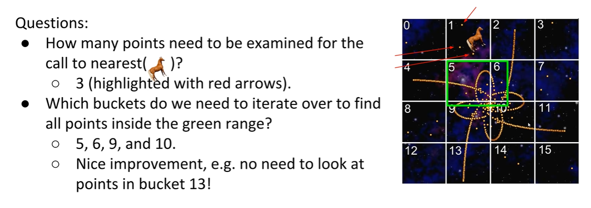
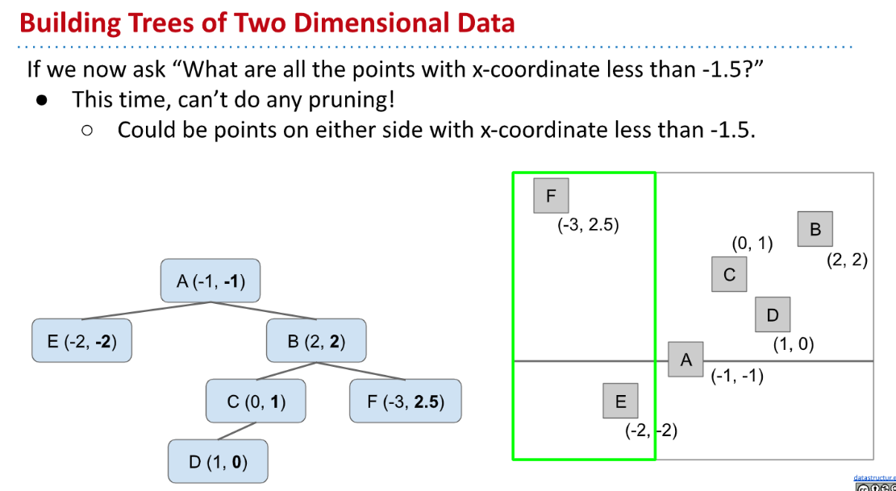
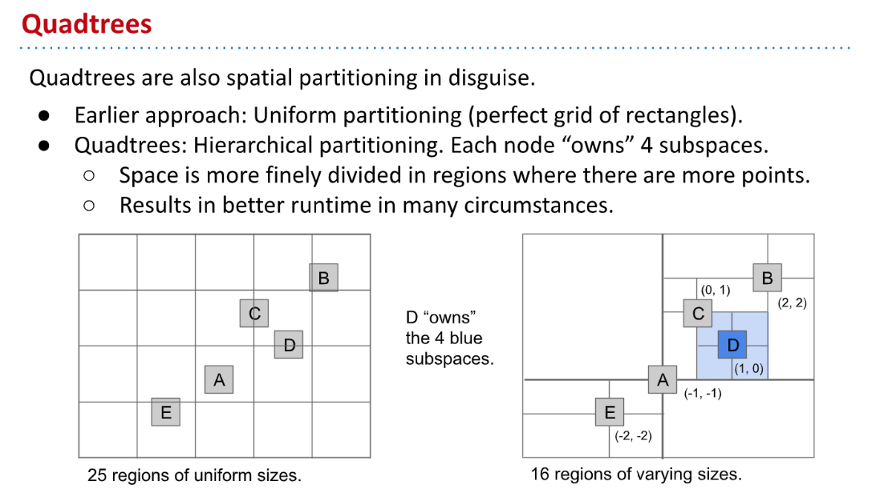

[cs61b 2019 ds6 lec22 kd trees.pdf](https://www.yuque.com/attachments/yuque/0/2023/pdf/12393765/1676795436657-fce56ee1-77fe-4d18-90ef-610b10de98fb.pdf)

# Recap
> 

# Motivation - Range Finding
> 

# Uniform Partitioning
## Attempt 1: HashTable
> 

## Attempt 2: Uniform Partitioning
### Rationale
> 

### Searching Questions
> 

### Runtime
> 

# Trees with 2D Data
## Trees vs Hash Tables
> 

## Building 2D Tree based on one axis
### Basics
> This isn't trivial though...in order to build a Binary Search Tree, we need to be able to compare objects. However, in two (or more) dimensional space, one object might be "less than" another in one dimension, but "greater than" the other in the other dimension. So which should be the "lesser" and "greater" for the purposes of our search tree?
> For example, below Mars is "less than" Earth in the x-dimension, but "greater than" Earth in the y-dimension.
> 

### X-based Partitioning
> 

### Y-based Partitioning
> 

### Summary
> Notice that if we are performing a search on this tree, and we're looking for a point that has an x-coordinate less than −1, from the root when we choose to take the left path, we immediately get to discard everything in the right subtree. And this is analogous to saying that we have been able to restrict our search space from the entire image space, to just the green rectangle. The ability to skip searching through parts of your search tree is called "pruning".
> However on the flip side, if we were looking for a point that has a particular y-coordinate, our X-based tree is not optimal for that kind of search and we'd have to perform a linear search on all the nodes.
> No matter whether we choose the X-based tree representation or the Y-based tree representation, we will always have suboptimal pruning; search in the optimized dimension will be $logN$, but search in the non-optimized dimension will be $N$ in runtime.
> 

# QuadTrees - 4 way partitioning
## Definition&Demos
> Here, we see that node A splits its surrounding area into a **northwest, northeast, southeast,** and **southwest **region. Since B resides in the northeast quadrant of A, when we insert B, we can put it as a child of A as its NE child.
> Note that just like in a BST, the order in which we insert nodes determines the topology of the QuadTree.
> Also note that **QuadTrees are a form of spatial partitioning in disguise**. Similar to how uniform partitioning created a perfect grid before, **QuadTrees hierarchically partition by having each node "own" 4 subspaces.**
> Effectively, spaces where there are many points are broken down into more finely divided regions, and in many cases this gives better performances.
> [Demo Link](https://docs.google.com/presentation/d/1vqAJkvUxSh-Eq4iIJZevjpY29nagNTjx-4N3HpDi0UQ/pub?start=false&loop=false&delayms=3000&slide=id.g11f44e6637_0_623)

**Insertion Demo 1**
**Insertion Demo 2**

## Range Finding&Demos
> 

[cs61b quadtree range search demo.pdf](https://www.yuque.com/attachments/yuque/0/2023/pdf/12393765/1677073451526-42de980d-8939-40ad-a2fc-2f45ad387984.pdf)
> Notice that with the 4-way division imposed by each node of the QuadTree,** we still have the pruning effect that was so advantageous in our X-Based Tree and Y-Based Tree**! If we are looking for points inside a green rectangle as shown below, from any node we can decide whether the green rectangle lies within one or more quadrants, and only explore the branches/subtrees corresponding to those quadrants. All other quadrants can be safely ignored and pruned away. Below, we see that the green rectangle lies only in the northeast quadrant, and so the NW, SE, and SW quadrants can all be pruned away and left unexplored. We can proceed recursively.

# K-D Trees
> Quad-Trees are great for 2-D spaces, because there are only 4 quadrants. However, what do we do if we want to move into higher dimension space? We'll explore another data structure in the next chapter that is equipped to tackle this question.

## Multi-dimensional Data
> 

## K-D Tree for 2D
> [Demo Link](https://docs.google.com/presentation/d/1WW56RnFa3g6UJEquuIBymMcu9k2nqLrOE1ZlnTYFebg/edit#slide=id.g54b6045b73_0_38)
> So for the 2-D case, it partitions like an X-based Tree on the first level, then like a Y-based Tree on the next, then as an X-based Tree on third level, a Y-based Tree on the fourth, etc.
> For the 3-D case, it** rotates between each of the three dimensions** **every three levels**, and so on and so forth for even higher dimensions. Here you can see the advantages in a K-D Tree in how it is more easily generalized to higher dimensions. 
> But, no matter how high the dimensions get, a K-D tree will always be a **binary** **tree**, **since each level is partitioned into "greater" and "less than".**

[cs61b kdtree insertion demo.pdf](https://www.yuque.com/attachments/yuque/0/2023/pdf/12393765/1676875152208-768b4bfd-895b-4c84-8fa5-46a19c09cd7f.pdf)
> 

## K-D Tree for Nearest Neighbors
### Comprehensive Demo
> [Demo Link(Important)](https://docs.google.com/presentation/d/1DNunK22t-4OU_9c-OBgKkMAdly9aZQkWuv_tBkDg1G4/edit#slide=id.g54b6045cf5_150_2705)

[cs61b kdtree nearest demo.pdf](https://www.yuque.com/attachments/yuque/0/2023/pdf/12393765/1676875122358-e379b259-26df-480e-a38e-de2893c28e63.pdf)

### PseudoCode
> 

# Summary&Applications
## Summary
> 

## Application 1
> 

## Application 2
> 

# Study Guide Exercises
[Multi-dimensional Data Study Guide _ CS 61B Spring 2019.pdf](https://www.yuque.com/attachments/yuque/0/2023/pdf/12393765/1676795465805-5d13c319-17bb-4ada-9c4b-8d0eef56804c.pdf)
