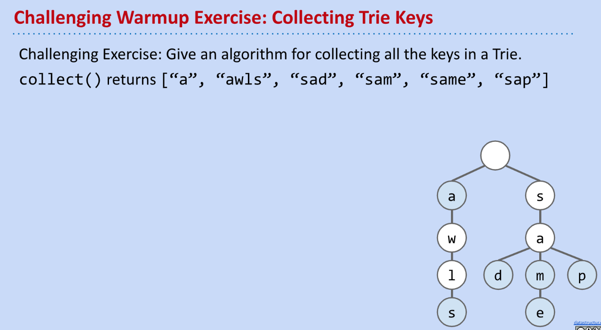

[cs61b 2019 lec21 tries.pdf](https://www.yuque.com/attachments/yuque/0/2023/pdf/12393765/1676795528965-f46b572a-db5f-4803-ae7d-f8e31546526e.pdf)

# Recap on data-indexed array
## Char-Indexed
> 

# Tries Basics
## Introduction
### String-Indexed Array
> 

### BST&HashTable Representation
> 

## Tries Invention
### Insertion
> 

### Search Hits&Misses
> 

## Tries Map
> 

## Comparison
> 

## Retrieval Tree
> 

## Takeaways⭐⭐⭐⭐⭐
> 

# Tries Implementations
## Basic Trie Implementation
### Class
> 

### Node
> 

### Improvement on redundancy
> 

### Performance
> 

## Improved Implementation
> 

### Approach 1: HashTable
> 

### Approach 2: BSTMap
> 

## Summary on Implementations
> 

# Tries String Operations
> Recall all of the comparisons that we've made between Tries and other data structures. 
> We can see that Tries offer us constant time lookup and insertion, but do they actually perform better than BSTs or Hash Tables? Possibly not. 
> For every string we have to traverse through every character, whereas in BSTs we have access to the entire string immediately. So what are Tries good for then?

## Prefix Matching
> 

## Collect All Keys
> 

## KeysWithPrefix
> 

## Autocomplete
### Problem Setting
> 

### Example
> 

### Flaw
> 

## Efficient Autocomplete
> 

# Tries Summary
> 

# Study Guide Exercises
[Tries Guide _ CS 61B Spring 2019.pdf](https://www.yuque.com/attachments/yuque/0/2023/pdf/12393765/1676795513574-8b2dfc82-244f-4d5f-8be6-9ac008c61dba.pdf)
