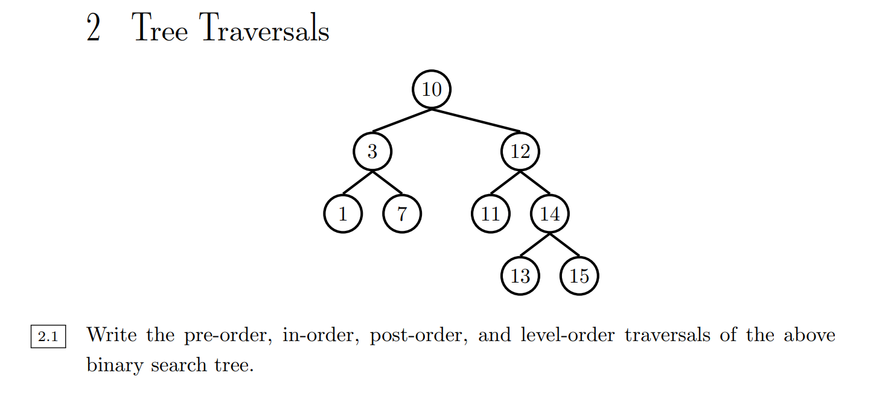
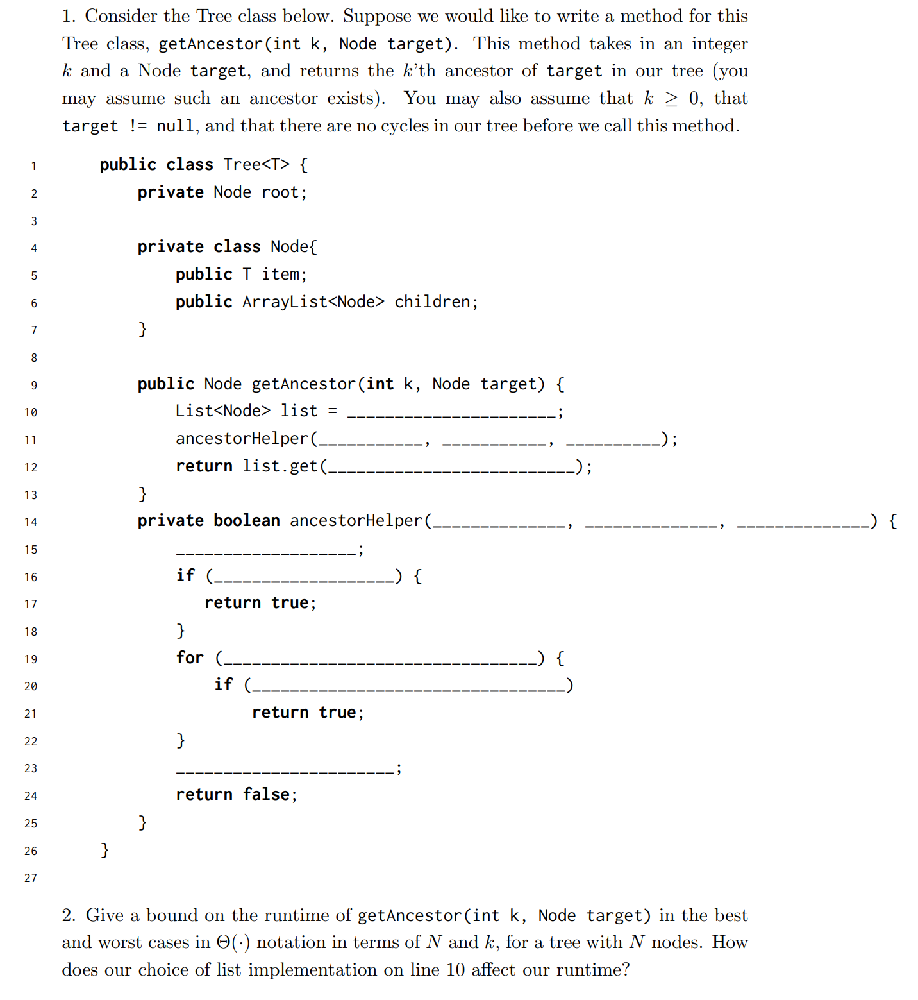
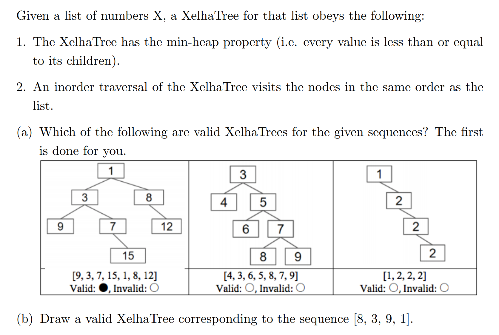
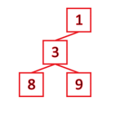
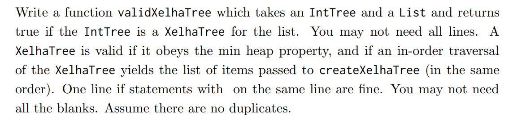
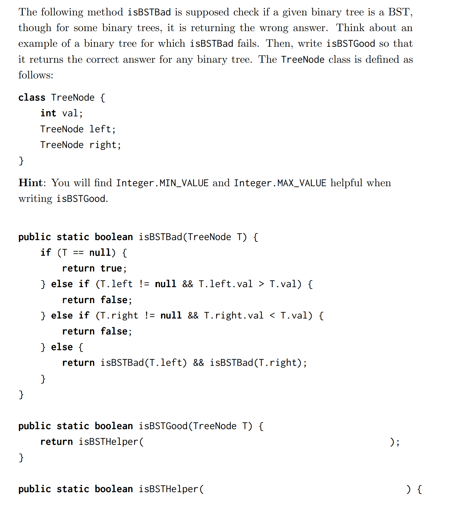
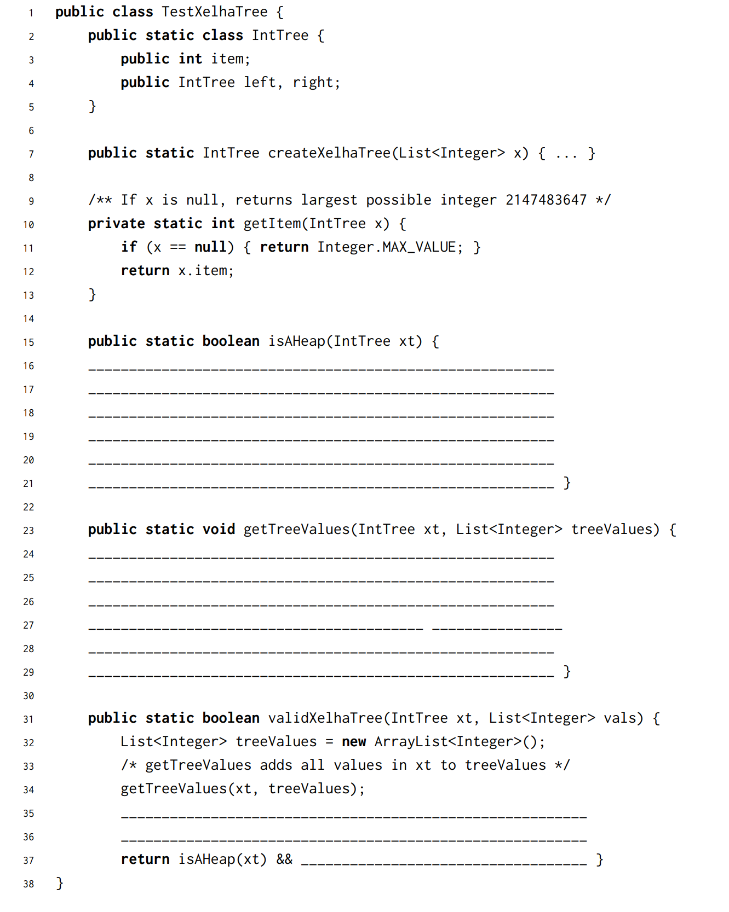
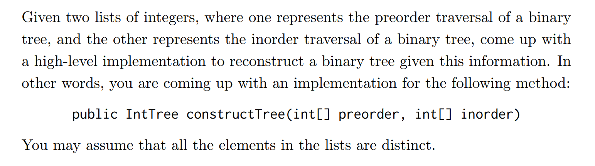
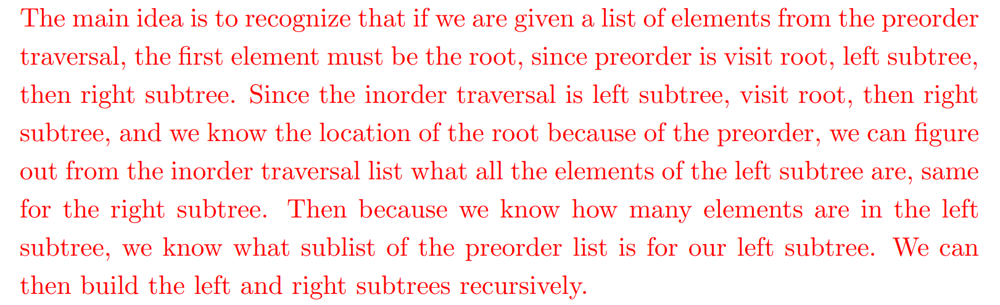

# 1 Discussion
## Types of Traversals
> **Sp18 Disc10**
> 

**Solution**


# 2 Exam Preparation
## K-th Ancestor(Backtracking)⭐⭐⭐⭐⭐
> **Sp19 Examprep09**
> 🔔: 本题是一个`General Tree`, 也就是每个节点有任意多个子节点。
> 🔔: 本题的目标是找到树中的某个特定节点`Target`的`K-th Ancestor`, 具体算法思路有点类似`Tries`, 本质上是在找能够从`root`到`Target`的路径，假设长为`n`, 然后返回路径中的第`n-1-k`个即可。
> 🔔: 本题寻找`Path`利用的是深度优先+BackTracking的遍历方式，详见代码解释。
> 
> 🔔: 第二小问的`Runtime`可以采用`Recurrence Function`进行分析。
> 🔔: 记住，当我们在对某个函数`f(param_list)`在进行`Best/Worst Case Runtime`分析的时候，往往考虑的是不同的`param_list`的情况。有些`param_list`的组合会使得函数运行速度非常快，有些则非常慢。
> 🔔: `DFS`遍历整棵树的时间复杂度为$\Theta(N)$, 详见[DFS Runtime Analysis](https://www.yuque.com/alexman/dxgel1/ozfegpctntlb3glr#n8kDT)。本质上可以理解为遍历了所有节点($N$个)。

```java
public class Tree<T> {
    private Node root;

    private class Node {
        public T item;
        public ArrayList<Node> children;
    }

    public Node getAncestor(int k, Node Target) {
        List<Node> list = new ArrayList<>(); // 如果使用ArrayList可能需要考虑resizing的额外开销
        ancestorHelper(root, Target, list);
        return list.get(list.size() - 1 - k);
    }

    private boolean ancestorHelper(Node t, Node target, List<Node> list) {
        list.add(t);
        if (t == target) {
            return true;
        }
        for (Node node: t.children) {
            // 可以保证如果当前路径含有target，则一路返回true一直到最外层函数
            if (ancestorHelper(node, target, list)) {
                return true;
            }
        }
        // 如果ancestorHelper()全是false, 说明以当前节点t为根节点的树中不包含target
        // 于是我们返回false, 且将t从path list中移除，从下一个根节点开始遍历
        list.remove(t);
        return false;
    }
}
```
**Solution 2**


## Xelha Trees
> **Sp18 Examprep10**
> 

**Solution (a)**
**Solution (b)**🔔: 因为`Xelha Tree`具有`Minheap`性质，所以`1`一定在根节点，那么答案就很明显了。


## Verify Xelha Trees
> **Sp18 Examprep10**
> 
> 🔔: 还记得我们在[Is it a BST?](https://www.yuque.com/alexman/dxgel1/qho6w2h0ont8toup#IMh8g)中的程序吗?
> 
> 虽然上述代码在检测`BST`时是错误的，但是本题我们可以采用上述思路，因为我们确实只需要比较每一层就行然后利用数学归纳即可。总的来说`isHeap`相较于`isBST`更容易实现。

**Starter Code**
```java
public class TestXelhaTree {
    public static class IntTree {
        public int item;
        public IntTree left, right;
    }

    public static IntTree createXelhaTree(List<Integer> x){
        return null;
    }

    private static int getItem(IntTree x) {
        if (x == null) { return Integer.MAX_VALUE; }
        return x.item;
    }

    public static boolean isAHeap(IntTree xt) {
        if (xt == null) { return true; }
        // 注意可以使用getItem()来简化代码
        if (xt.item > getItem(xt.left)) { return false; }
        if (xt.item > getItem(xt.right)) { return false; }
        return isAHeap(xt.left) && isAHeap(xt.right);
    }

    public static void getTreeValues(IntTree xt, List<Integer> treeValues) {
        // Do an inorder traversal
        // Avoid null-pointer exception
        if (xt == null) {
            return;
        }
        getTreeValues(xt.left, treeValues);
        treeValues.add(xt.item);
        getTreeValues(xt.right, treeValues);
    }

    public static boolean validXelhaTree(IntTree xt, List<Integer> vals) {
        List<Integer> treeValues = new ArrayList<Integer>();
        /* getTreeValues adds all values in xt to treeValues */
        getTreeValues(xt, treeValues);
        // 同时满足两个性质就是validXelhaTree
        return isAHeap(xt) && vals.equals(treeValues) ;
    }
}
```

## Reconstructing Trees⭐⭐⭐⭐⭐
> **Sp18 Examprep10**
> **🔔**: 本题可谓是非常重要，面试必考题。
> 

**Solution**

