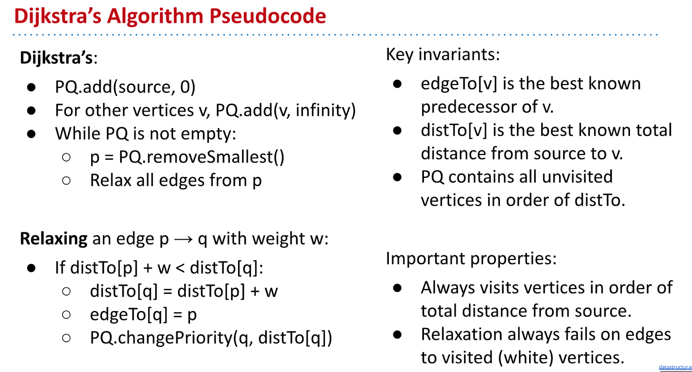
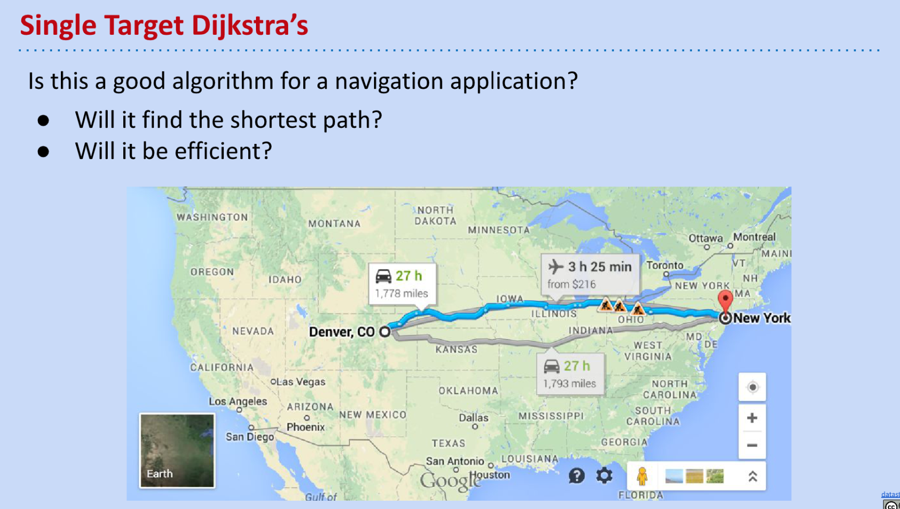

[cs61b 2019 lec 25 shortest paths.pdf](https://www.yuque.com/attachments/yuque/0/2023/pdf/12393765/1677076354965-9c6fc36c-fa8b-4a2c-9e13-f36e0b0da022.pdf)

# Shortest Weighted Path
## BFS is bad for google maps
> 
> 所以为了实现这个需求，我们主要使用`DFS`算法。

## Single Source Shortest Path
> 下面的问题是：如何找到从`s`节点到`t`节点之间的最短`weighted`路径。
> 
> Firstly, note that the shortest path (**for a graph whose edges have weights**) can have many, many edges. **What we care to minimize is the sum of the weights of the edges on the selected path.**
> Secondly, note the fact that the shortest paths tree from a source $s$ can be created in the following way:
> - For every vertex $v$(which is not $s$) in the graph, find the shortest path from $s$ to $v$.
> - "Combine"/"Union" all the edges that you found above. Tada!

## Shortest Path Tree
> 
> Note that the **"Shortest Path Tree" will always be a tree**. 
> Why? Well, let's think about our original solution, where we maintained an `edgeTo` array. **For every node, there was exactly one "parent" in the **`**edgeTo**`** array. (Why does this imply that the "Shortest Path Tree" will be a tree? Hint: A tree has **$V−1$** edges, where **$V$** is the number of nodes in the tree.)**

## SPT Edge Count
> 对于`Shortest Path Tree`来说，他一共有多少个`edges`呢？这牵扯到`Tree`的一个重要性质。
> 
> 对于一棵树来讲，他的`edges`数量永远是`nodes`数量减一。为什么呢?
> **我们可以通过数学归纳法来证明:**
> 1. 当树只有根节点的时候，`#edges = 0`, `#vertices = 1`, 关系成立。
> 2. 假设现在`#vertices =n`，且`# edges = n-1`成立，则当我们再增加一个节点的时候，会多一条`edge`和多一个节点，即`#vertices = n+1, #edges = n`, 仍然满足`#vertices - 1=#edges`
> 3. 根据数学归纳法，上述性质成立。
> 

## Finding a Shortest Paths Tree
> 知道了`Shortest Path Tree`实际上就是从某个节点出发，到达剩余节点的最短路径组成的树，下一个问题是，我们如何找到这样的树，又应该设计什么算法?
> 

### Bad Algorithms
> 第一种尝试: 既然我们要找到最短的路径。
> 
> 对于`Bad Algorithm 2`, 我们可以在节点的`distance to source`被更新时(比如B从5修改为2)之后，将其`unmark`, 然后重新遍历得到正确的结果，但是这样算法的速度会变慢。

# Dijkstra's Algorithm
## Demo
> 
> 
> [Demo Link](https://docs.google.com/presentation/d/1_bw2z1ggUkquPdhl7gwdVBoTaoJmaZdpkV6MoAgxlJc/pub?start=false&loop=false&delayms=3000&slide=id.g771336078_0_180)
> **Dijkstra's algorithm takes in an input vertex **$s$**, and outputs the shortest path tree from **$s$**. How does it work?**
> 1. Create a priority queue.
> 2. Add $s$ to the priority queue with priority (). Add all other vertices to the priority queue with priority $∞$.
> 3. While the priority queue is not empty: pop a vertex out of the priority queue, and **relax** all of the edges going out from the vertex.

[CS61B Dijkstra's Algorithm Demo.pdf](https://www.yuque.com/attachments/yuque/0/2023/pdf/12393765/1677122841782-19e3003b-98af-45b8-a4cc-876944e93ee2.pdf)
> 

## Pseudocode
> 

## Implementation
> [https://algs4.cs.princeton.edu/44sp/DijkstraSP.java.html](https://algs4.cs.princeton.edu/44sp/DijkstraSP.java.html)

## Properties
### Optimality - Nonnegativity⭐⭐⭐⭐⭐
> 

### Negative Edges - When this fails⭐⭐⭐
> Things can go pretty badly when negative edges come into the picture. Consider the following image.
> 
> Suppose you're at that vertex labeled $34$. Now you're going to try to relax all your edges. You have only one outgoing edge from yourself to $33$ with weight $−67$. Ah, but note: vertex $33$ is already visited (it's marked with white.) So... we don't relax it. (Recall the pseudocode for the relax method, we assume having the guranteed optimality with nonnegative edges..)
> Now we go home thinking that the shortest distance to $33$ is $82$ (marked in pink.) But really, we should have taken the path through $34$ because that would have given us a distance of $101−67=101−67=34$. Oops.
> **Dijkstra's algorithm is not guaranteed to be correct for negative edges. It might work... but it isn't guaranteed to work.**
> 需要使用`Bellman-Ford`解决`Negative Edges`的问题。

### Dijkstra Invariant
> **Observe that once a vertex is popped off the priority queue, it is never re-added. **Its distance is never re-updated. **So, in other words, once a vertex is popped from the priority queue, we know the true shortest distance to that vertex from the source.**
> **One nice consequence of this fact is "short-circuiting".** Suppose... that I didn't care about the shortest-paths tree, but just wanted to find the shortest path from some source to some other target. Suppose that you wanted to take, like, the cities of the world on a graph, and find the shortest path from Berkeley to Oakland. Running`dijkstra(Berkeley)`will mean that **you can't actually stop this powerful beast of an algorithm... you have to let it run... till it finds the shortest path to LA, and Houston, and New York City, and everywhere possible!**
> Well. Once `Oakland` is popped off the priority queue in the algorithm, we can just stop. We can just return the distance and the path we have at that point, and it will be correct. **So sometimes dijkstra takes in not only a source, but also a target. This is for the purposes of short-circuiting.**

## Runtime
> 

## Summary
> 假设一个`Undirected Acyclic Graph`中有$V$个节点, $E$条边，现在我们使用`Dijkstra's Algorithm`求出`SPT`:
> 🔔: 算法步骤详解:
> 1. 将所有节点表上号，标上数字就行用于区分不同的节点。
> 2. 将所有节点插入一个优先队列，并将所有的节点的`Priority`设置为$\infty$。
> 3. 选定一个初始节点，先将其从优先队列中移除（**只有移除时某个节点才能从绿色变成白色, 表示已经被访问过**）。移除之后马上访问其`Neighbors`，对这些`Edges`进行`Relaxation`操作，如果`Relaxation`将当前`Neighbor`的`Priority`修改了的话，就将这个`Edges`加入`SPT`中，否则不加入。操作之后对所有的节点进行`changePriority`。注意此时`Neighbors`还是绿色的，没有真正访问到。
> 4. 对`PQ`按序进行:
>    - `removeMin()`操作，将`remove`掉的节点从绿色标记成白色。
>    - `Edge Relaxation`操作，如果`relax`成功则将当前`Edge`加入`SPT`, 否则无视。
>    - `changePriority`操作。
> 
直到`PQ`为空。
> 🔔: 算法复杂度详解: 
> 1. 将所有的点加入一个`Priority Queue`, 用时$O(V*logV)$, 因为每次`Insert`操作用时$O(logV)$, 至于为什么不是$\Theta(logV)$，因为这取决于我们插入的元素的特性，在[Heap Runtime Analysis](https://www.yuque.com/alexman/dxgel1/ze5a7slor5tualhh#Q4uhs)中我们已经分析过，插入操作的`Best Case Runtime`是$\Theta(1)$, `Worst Case Runtime`是$\Theta(logV)$, 所以综合考虑`Runtime`就是$O(logV)$。
> 2. 将每个点从`PQ`中`remove`掉(因为最终我们的`PQ`中是没有元素的)，所以也需要$O(V*logV)$时间。
> 3. 将每条边都做`Relaxation`, 也就是更新到`Source`的距离， 每条边做`Relaxation`的时候都需要`changePriority`, 需要$O(logV)$, 一共$E$条`Edges`, 所以一共需要$O(E*logV)$。

# A*(A Star) Algorithm
## Problem with Dijkstra
> We ended the section on Dijkstra's by discussing a possible way to make Dijkstra's short-circuit and **just stop once it hits a given target. Is this good enough?**
> To answer the above question, we need to sit down and think about how dijkstra's really works. **Pictorially, Dijkstra's starts at the source node (imagine the source node being the center of a circle.) And Dijkstra's algorithm now makes concentric circles around this point,** in increasing radii, and 'sweeps' these circles, capturing points.
> **So... the first node Dijkstra's visits is the city closest to the source, then the city next-closest, then the city next-closest, and so on. This sounds like a good idea. What Dijkstra's is doing is first visiting all the cities that are 1-unit distance away, then 2 unit-distance away, and so on. In concentric circles.**
> Now imagine the following: on a map of the US, start somewhere in the center, say, Denver. Now I want you to find me a path to New York using Dijkstra's. You'll end up traversing nodes in 'closest concentric circle' order.
> 
> You'll make a small circle first, just around Denver, visiting all the cities in that circle. Eventually, your circles will get bigger, and you'll make a circle that passes through Las Vegas (and would have visited, by now, all the other cities that fall within the circle.) Then, your circle will be big enough to engulf Los Angeles and Dallas... but you're nowhere close to New York yet. All this effort, all these circles, but still... so far from the target. **Short-circuiting helps, but only if you actually hit the target node fast.**
> 
> **If only there existed a way to use your prior knowledge: the fact that new-york was eastwards, so you could "hint" your algorithm to prefer nodes that are on the east instead of those that are on the west.**

## A* Introduction
> 
> Observe the following: Dijkstra's is a "true" (i.e., not an estimate) measure of the distance** **to a node from the source. 
> So, say, you visit a city in Illinois and your source was Denver, then by that time, you have a true measure of the distance to Denver. What we're missing is: some janky, rough estimate of the distance from a node to the target node, New York. That would complete the picture. 
> Because then, if you sum these two things up **(the measure from the source to the node + the estimate from the node to the target), you get (an estimate from the source to the target.)** Of course, the better your original estimate from the node to the target, the better your estimate from the source to the target, the better your A* algorithm runs.
> So, let's modify our Dijkstra's algorithm slightly. In Dijkstra's, we used `**bestKnownDistToV**`** **as the priority in our algorithm. 
> **This time in **`**A***`**, we'll use **`**bestKnownDistToV + estimateFromV**`** as our heuristic.**

## A* Demo
> 
> `**h(v, goal)**`** is arbitrary**. In this example, it' s the min weight edge out of each vertex. 
> 🔔: Implementation details in HW4

[A_ Algorithm Demo.pdf](https://www.yuque.com/attachments/yuque/0/2023/pdf/12393765/1677124404215-6011e1e5-00fa-4cc9-b134-706c1665f023.pdf)

## Dijkstra vs A*⭐⭐⭐⭐⭐
> 
> **Observations:**
> 1. Not every vertex got visited. 因为我们找到`6`就停止，不需要清空`PQ`。
> 2. **Result is not a shortest paths tree for vertex zero (path to 3 is suboptimal!), but that’s OK because we only care about path to 6.**
> 
[Demo Link(Important)](http://qiao.github.io/PathFinding.js/visual/)

## Choice of Heuristics⭐⭐⭐
### How to estimate
> 

### Neutral Heuristic
> 

### Bad Heuristic
> 
> Suppose that the shortest path from Denver to New York goes through some city $C$. Suppose that my GPS is broken, and so I think that this city $C$ is infinity far away from everything, and I set the estimated distance to $C$ from every other node in the graph to $∞$.
> What will happen? Well A* will basically never want to visit this city. (Remember what our priorities are in the priority queue; for this city, the priority will always be $∞$, even if I visit the immediate neighbors of this city. The estimated distances from the immediate neighbors of this city to this city were set to $∞$ after all.)
> So... now what? We lose. A* breaks. We get the wrong answer back. Oops.

### Correct Heuristics
> 
> The takeaway here is that heuristics need to be good. **There are two definitions required for goodness.**
> 1. **Admissibility. **`heuristic(v, target) ≤ trueDistance(v, target)`. (`trueDistance`被定义为最短距离，也就是`shortest distance`) 🔔：换句话说，就是我们给出的`Heuristic`不能太随便。比如节点`v`和`w`之间只有`20 km`, 那么我们就不能任性地设置$h(v,w)$为$\infty$。
> 2. **Consistency. **For each neighbor $v$ of $w$:
>    - `heuristic(v, target) ≤ dist(v, w) + heuristic(w, target)`
>    - where `dist(v, w)` is the weight of the edge from v to w.
> 
🔔：本质上就是两边之和大于第三边的要求必须要满足（前提是所有的`Edge`都是`Positive`的）。

# Summary
> 

