[cs61b 2019 lec 26 mst.pdf](https://www.yuque.com/attachments/yuque/0/2023/pdf/12393765/1677076443280-5e8101b4-9d8a-400e-9d15-f97233bf29b3.pdf)
# Minimum Spanning Tree
## Definition
> 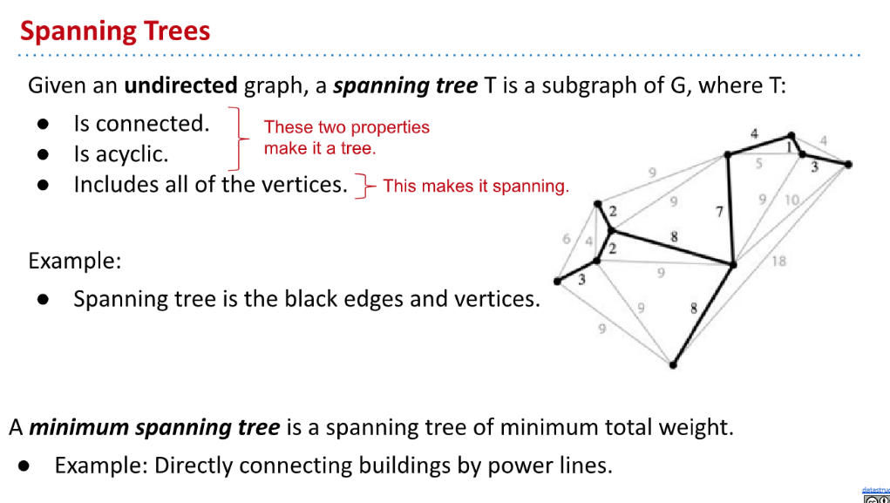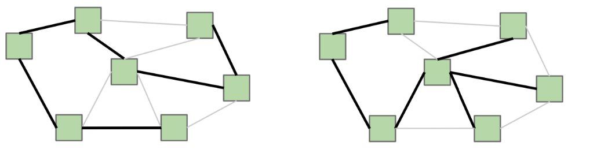

## SPT&MST⭐⭐⭐⭐⭐
> 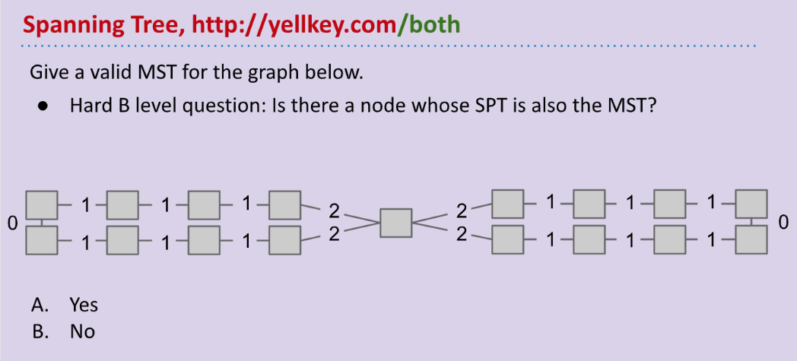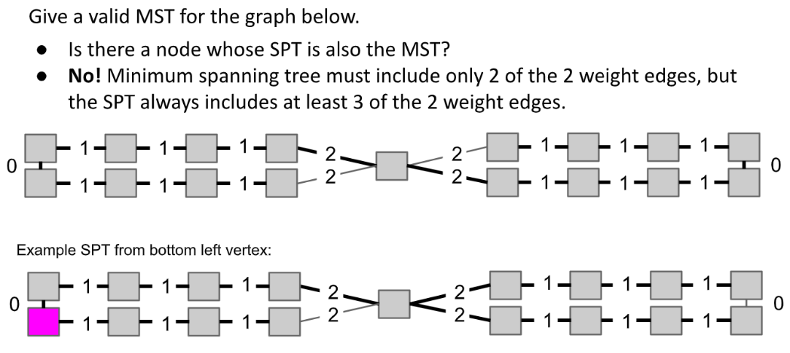

## Application
> 

# Cut Property
## Definition
> 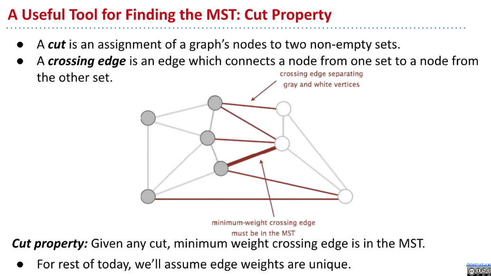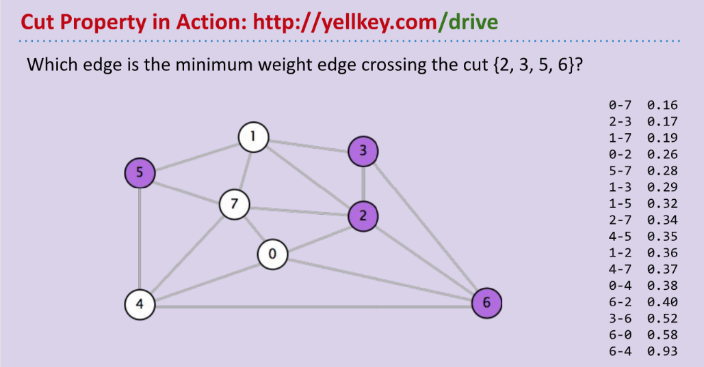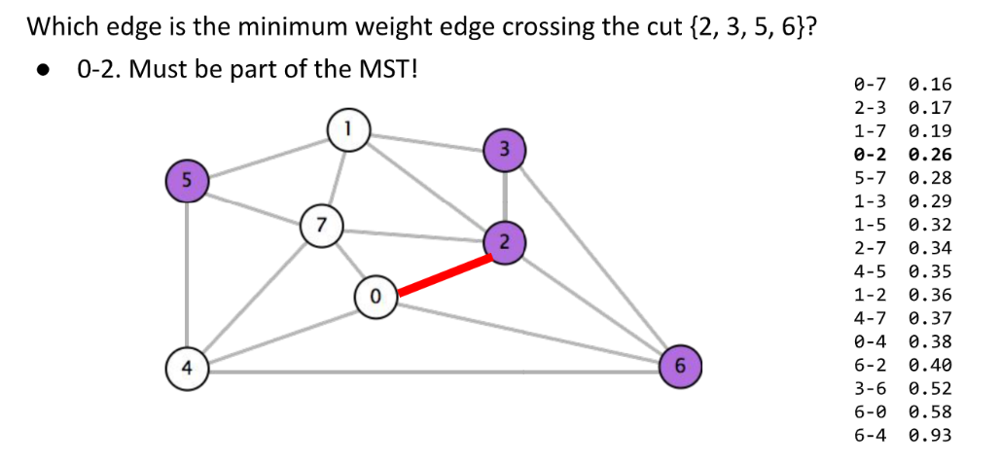

## Cut Property Proof⭐⭐⭐⭐⭐
> 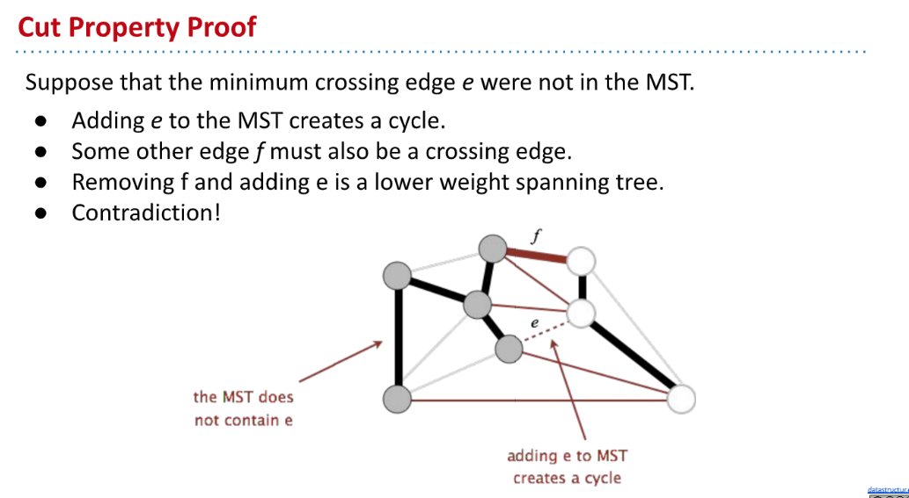
> `The proof for the cut property is as follows:`
> Suppose (for the sake of contradiction) that the minimum crossing edge _e_ were not in the MST. Since it is not a part of the MST, if we add that edge, a cycle will be created. Because there is a cycle, this implies that some other edge f must also be a crossing edge (for a cycle, if _e_ crosses from one set to another, there must be another edge that crosses back over to the first set). Thus, we can remove _f_ and keep _e_, and this will give us a lower weight spanning tree. But this is a contradiction because we supposedly started with a MST, but now we have a collection of edges which is a spanning tree but that weighs less, thus the original MST was not actually minimal. As a result, the cut property must hold.

# MST Finding Algorithm
## Prim's Algorithm
### Algorithm Steps
> 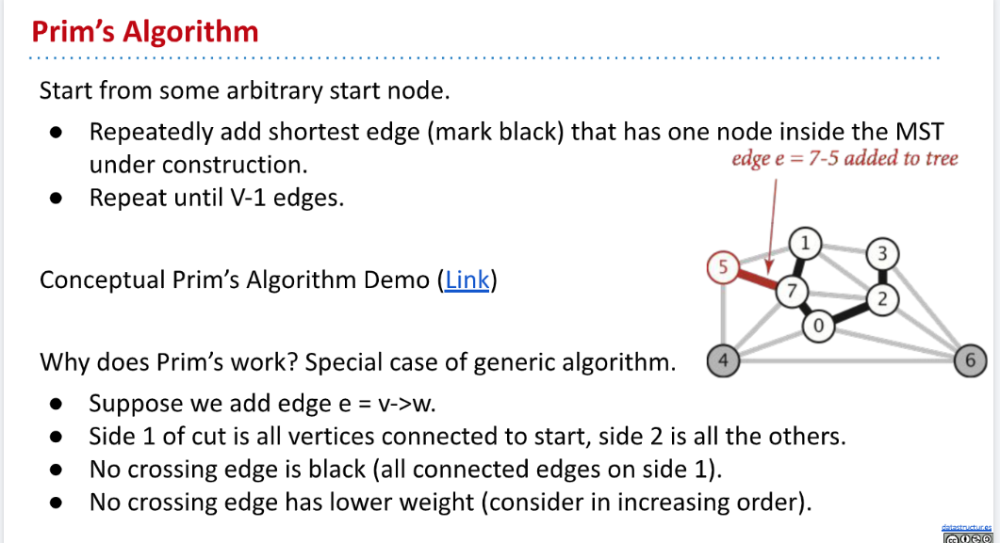

[CS61B Prim's Demo (Conceptual).pdf](https://www.yuque.com/attachments/yuque/0/2023/pdf/12393765/1679724213498-4accff4d-4639-4ee4-90eb-e196331289e0.pdf)
> 🔔: 算法思路：
> 1. 采用`Bipartite Graph` 和`Disjoint Set`的概念。本质上可以看做两个`Disjoint Set`。
> 2. 已经被访问的节点处于一个`Disjoint Set`中，称为`S1`，未被访问的节点处于另一个`Disjoint Set`中, 称为`S2`。
> 3. 每次选取那条连接`S1`和`S2`的`Edges`中最短的那条加入我们的`MST`。

### Implementations
[CS61B Prim's Demo (Implementations).pdf](https://www.yuque.com/attachments/yuque/0/2023/pdf/12393765/1679744664844-01d014ee-71b4-40bc-a65b-fb6bac0c3d7d.pdf)
> 假设一个`Undirected Acyclic Graph`中有$V$个节点, $E$条边，现在我们使用`Prim's Algorithm`求出`MST`:
> 🔔: 算法步骤详解:
> 1. 将所有节点表上号，标上数字就行用于区分不同的节点。
> 2. 将所有节点插入一个优先队列，并将所有的节点的`Priority`设置为$\infty$。
> 3. 选定一个初始节点，先将其从优先队列中移除（**只有移除时某个节点才能从绿色变成白色, 表示已经被访问过**）。移除之后马上访问其`Neighbors`，对这些`Edges`进行`Relaxation`操作（**注意，此时**`**Relaxation**`**比较的是**`**Neighbor**`**节点到当前节点的距离，而不是到**`**Source**`**的距离**）。操作之后对所有的节点进行`changePriority`。注意此时`Neighbors`还都是绿色的，没有真正访问到。
> 4. 对`PQ`按序进行:
>    - `removeMin()`操作，将`remove`掉的节点从绿色标记成白色，并将`Edge`(`Minimum Edge`)加入。
>    - `Edge Relaxation`操作。
>    - `changePriority`操作。
> 
直到`PQ`为空。
> 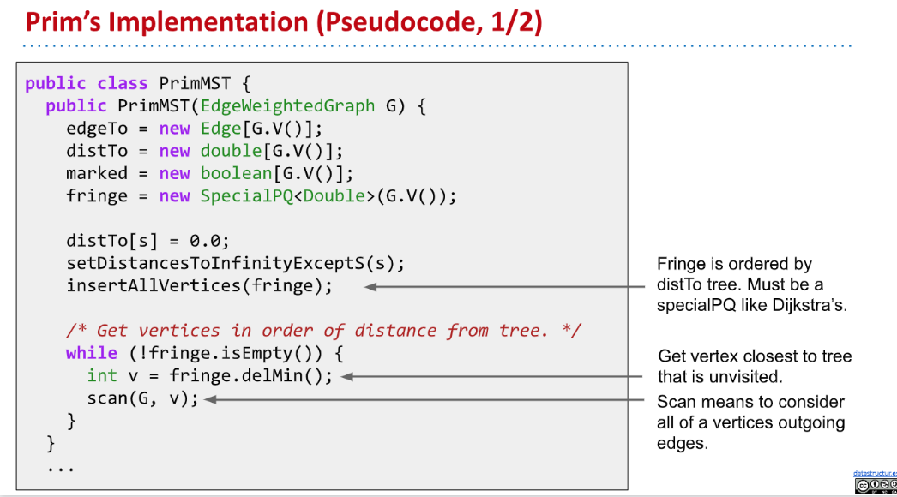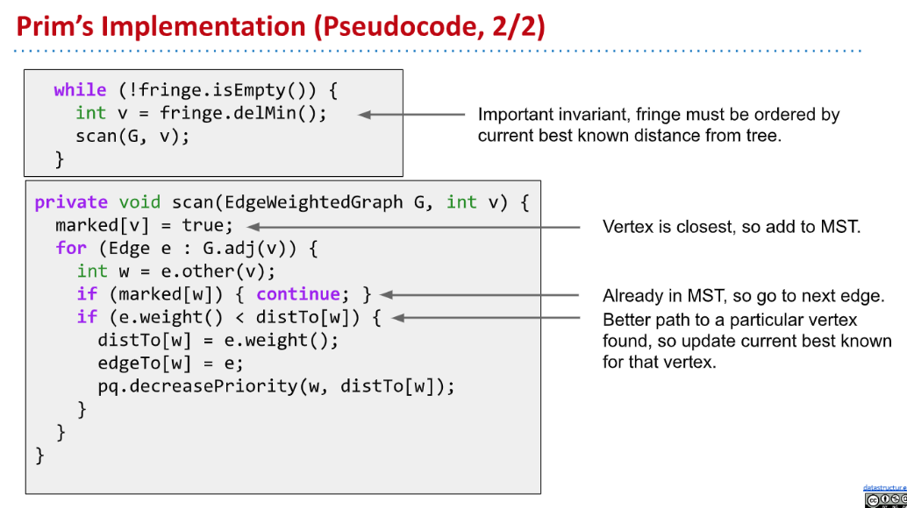

### Runtime Analysis
> 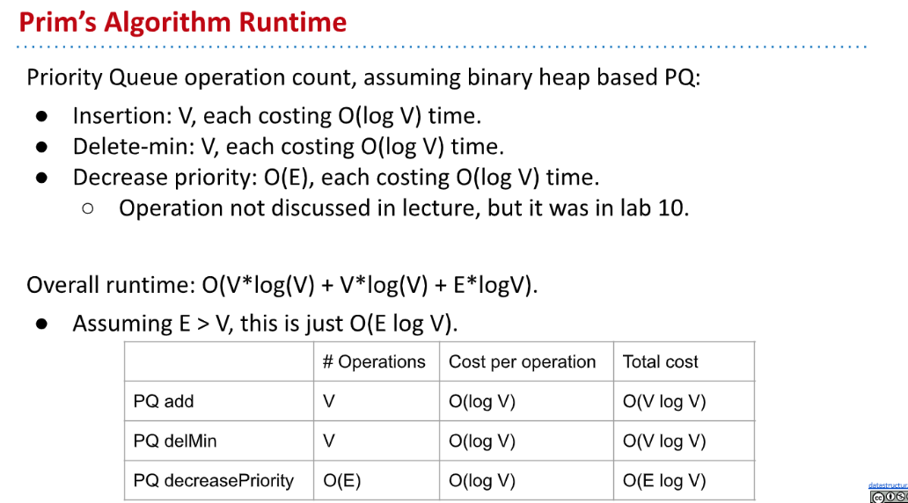

### Comparison with Dijkstra
> 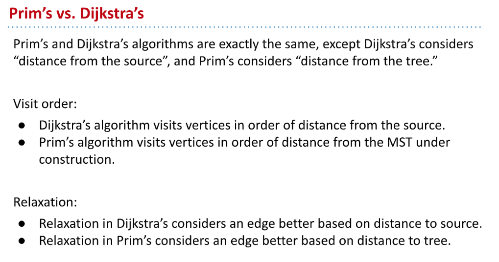

## Krushal's Algorithm
### Algorithm Steps
> 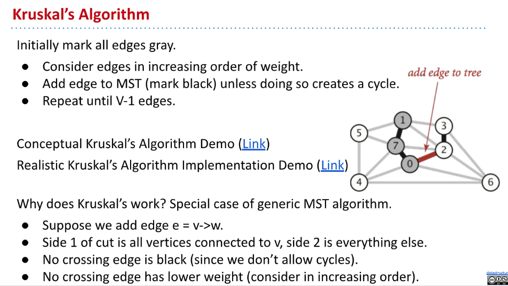

[kruskals conceptual demo.pdf](https://www.yuque.com/attachments/yuque/0/2023/pdf/12393765/1679747609212-75c53dac-09b6-4690-a4e9-fdf8e8885890.pdf)

### Implementations(Pseudocode)
> 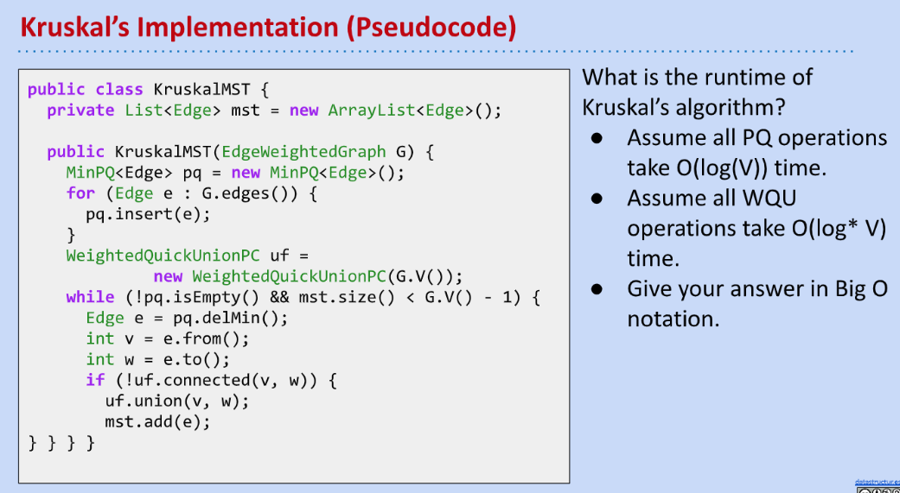

[kruskals realistic implementation demo.pdf](https://www.yuque.com/attachments/yuque/0/2023/pdf/12393765/1679747609213-258bdc1d-d496-48dc-90f2-d128b33a22f0.pdf)

### Runtime Analysis
> 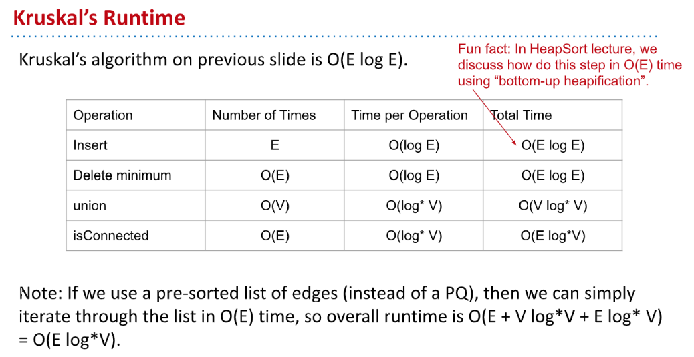

## Summary
> 

