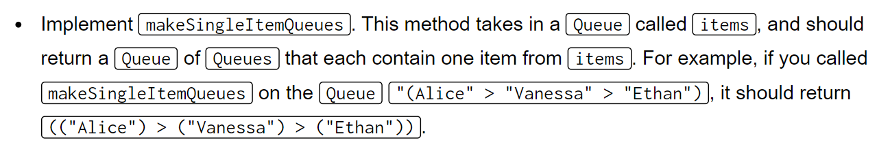
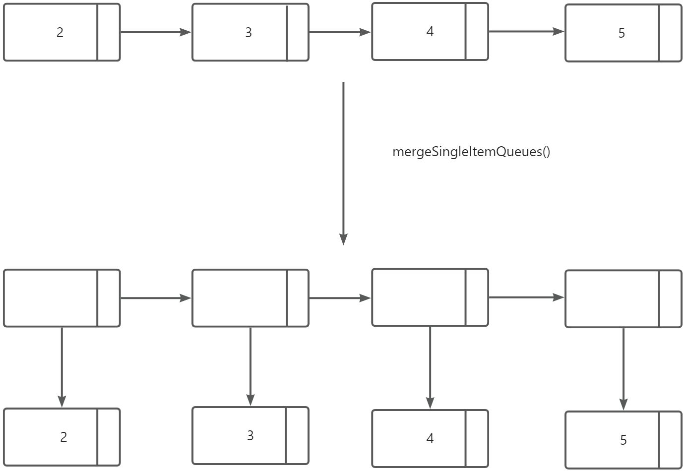
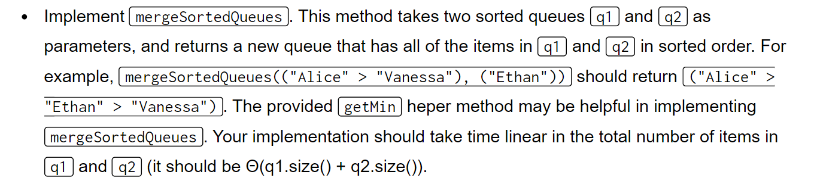
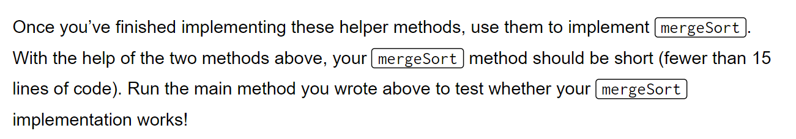
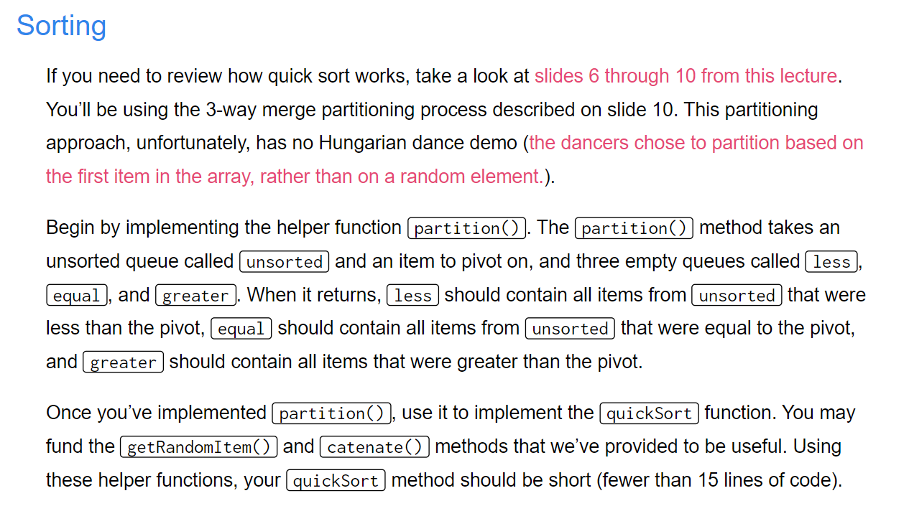
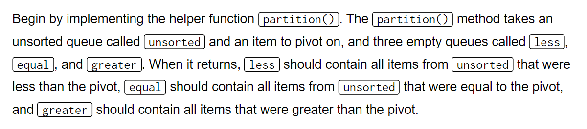
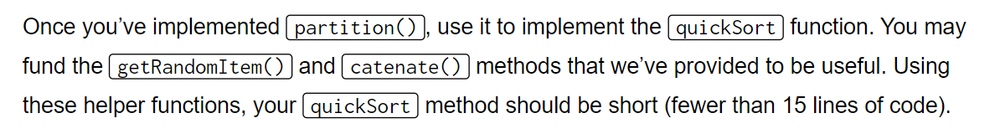
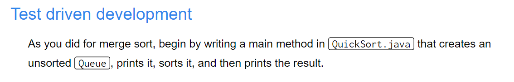
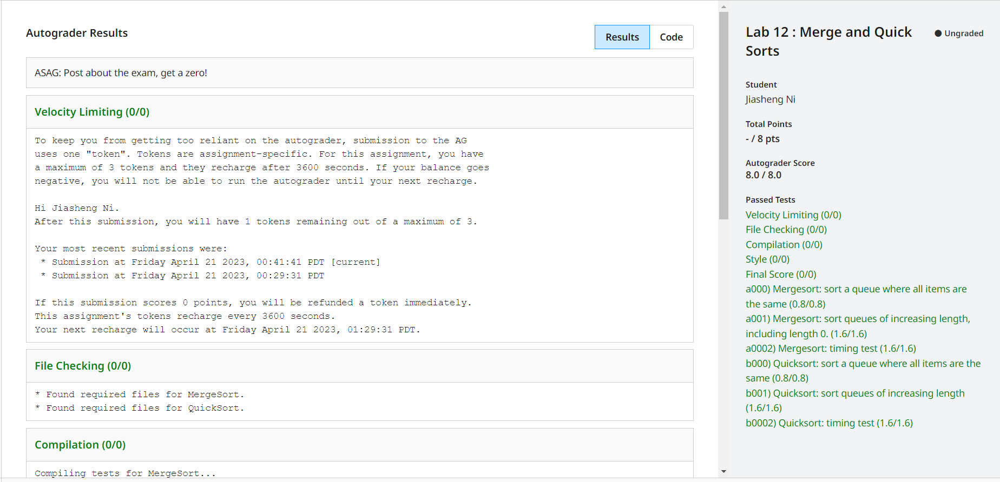

[Lab 12_ Merge Sort and Quick Sort _ CS 61B Spring 2018.pdf](https://www.yuque.com/attachments/yuque/0/2023/pdf/12393765/1682053139727-a23228d6-1657-4e5e-9eb4-9c62e98d6b7c.pdf)
[lab12.zip](https://www.yuque.com/attachments/yuque/0/2023/zip/12393765/1682053120790-c58dbec3-a9ed-4624-a49a-0e4c1539708c.zip)

# Introduction
> 本实验将练习使用`MergeSort`和`QuickSort`对`LinkedList`进行排序。
> 本实验的结果是，我们写的所有函数都能够在`Queue`接口上正常使用，因为`Queue`的底层实现逻辑就是`LinkedList`。


# Merge Sort
## TDD
> 在书写代码之前，我们首先需要写一个测试函数，要求是在`MergeSort`类中的主函数中创建一个`Queue<~>`队列，只要队列中的元素都实现了`Comparable`接口(也就是可以通过`compareTo`比较大小关系)即可。然后我们在队列中任意插入几个元素，打印一下插入后的结果。然后调用`MergeSort.mergeSort(Queue q)`, 然后再打印结果，我们期望调用后队列中的元素被按照某一顺序排序了。测试代码如下:

```java
 public static void main(String[] args) {
    Queue<String> students = new Queue<String>();
    students.enqueue("Alice");
    students.enqueue("Vanessa");
    students.enqueue("Ethan");
    System.out.println(students); // Alice Vanessa Ethan 
    MergeSort.mergeSort(students);
    System.out.println(students); // Alice Vanessa Ethan 
}
```
> 在实现前我们发现结果是`Alice Vanessa Ethan`, 并没有排序。下面我们实现`MergeSort`算法。


## Sorting Implementations
### makeSingleItemQueues
> 
> 本函数的目的是将一个`Queue`(底层由`Singly-linked list`组成)分解成几个`Queues`, 每个`SubQueue`只含有一个元素。


```java
 /** Returns a queue of queues that each contain one item from items. */
    private static <Item extends Comparable> Queue<Queue<Item>>
            makeSingleItemQueues(Queue<Item> items) {
        // Your code here!
        Queue<Queue<Item>> rq = new Queue<Queue<Item>>();
        for(Item item: items) {
            Queue<Item> tmpQ = new Queue<>();
            tmpQ.enqueue(item);
            rq.enqueue(tmpQ);
        }
        return rq;
    }
```
```java
@Test
    public void testMakeSingleItemQueues() {
        Queue<String> students = new Queue<>();
        students.enqueue("Alice");
        students.enqueue("Vanessa");
        students.enqueue("Ethan");
        Queue<Queue<String>> res = MergeSort.makeSingleItemQueues(students);
        for (Queue<String> tq: res) {
            assertEquals(tq.dequeue(),students.dequeue());
        }
    }
```

### mergeSortedQueues
> 
> 本方法接收两个已经排好序的`Queues`, 称为`q1`和`q2`，然后在遍历的过程中对`q1`和`q2`的元素进行排序。 

```java
/**
 * Returns a new queue that contains the items in q1 and q2 in sorted order.
 *
 * This method should take time linear in the total number of items in q1 and q2.  After
 * running this method, q1 and q2 will be empty, and all of their items will be in the
 * returned queue.
 *
 * @param   q1  A Queue in sorted order from least to greatest.
 * @param   q2  A Queue in sorted order from least to greatest.
 * @return      A Queue containing all of the q1 and q2 in sorted order, from least to
 *              greatest.
 *
 */
private static <Item extends Comparable> Queue<Item> mergeSortedQueues(
        Queue<Item> q1, Queue<Item> q2) {
    // Your code here!
    Queue<Item> resQ = new Queue<>();
    while (!q1.isEmpty() || !q2.isEmpty()) {
        Item popped = getMin(q1,q2);
        resQ.enqueue(popped);
    }
    return resQ;
}
```
```java
@Test
public void mergeSortedQueues() {
    Queue<String> students1 = new Queue<>();
    students1.enqueue("Alice");
    students1.enqueue("Ethan");
    students1.enqueue("Vanessa");
    Queue<String> students2 = new Queue<>();
    students2.enqueue("Bob");
    students2.enqueue("Salmon");
    students2.enqueue("Zoe");
    Queue<String> resQ = MergeSort.mergeSortedQueues(students1, students2);
    Queue<String> actual = new Queue<>();
    actual.enqueue("Alice");
    actual.enqueue("Bob");
    actual.enqueue("Ethan");
    actual.enqueue("Salmon");
    actual.enqueue("Vanessa");
    actual.enqueue("Zoe");
    // 注意assertEquals 会先比较expected和actual的内存地址，如果不一样才会去调用类中的equals()方法
    assertEquals(resQ.size(), actual.size());
    while (!actual.isEmpty()) {
        assertEquals(resQ.dequeue(), actual.dequeue());
    }
}
```


### MergeSort Implementations
> 
> 有了上述两个`Helper Methods`, 我们在实现`MergeSort`的时候就可以简化我们的代码，但是仍然有一些难点:
> 1. 正常来说，我们`MergeSort`的步骤是对当前的`List`进行二分，但是这对于`Queue`来说比较困难，尤其当我们的`Queue`是由`Singly-Linked List`构成的时候。
> 2. `Queue`的常用$\Theta(1)$操作仅仅只有`dequeue()`和`enqueue()`。
> 3. 每次`Merge`时需要两个`SubQueues`。
> 
所以我们可以构造下列的算法:
> 首先使用`makeSingleItemQueues`方法将大的`Queue`拆分成一个一个仅含有单个元素的`Queue<Queue<Item>>`, 然后每次从`Queue`中`dequeue()`出两个`Queue<Item>`, 对其进行合并，合并完后的结构放到`Queue`的尾部。如此迭代直到`Queue`中只剩下一个`Queue<Item>`, 就是我们`Merge`完后的结果，将其`dequeue()`出来即可。
> 直观来讲，就有点像是我两两合并，直到所有元素都被排序为止。
> 🔔注意:
> 1. 我们不能修改原来的`Queue`，否则过不了`Autograder`。
> 2. 要考虑到`Queue.size() == 0`的情况。

```java
/** Returns a Queue that contains the given items sorted from least to greatest. */
public static <Item extends Comparable> Queue<Item> mergeSort(
        Queue<Item> items) {
    // Your code here!
    // When <= 1? To consider the case where the size of items is zero!
    if (items.size() <= 1) {
        return items;
    }

    Queue<Queue<Item>> splittedQueue = makeSingleItemQueues(items);
    while(splittedQueue.size() > 1) {
        Queue<Item> first = splittedQueue.dequeue();
        Queue<Item> second = splittedQueue.dequeue();
        splittedQueue.enqueue(mergeSortedQueues(first, second));
    }
    return splittedQueue.dequeue();
}
```
```java
@Test
public void testMergeSort() {
    Queue<String> actual = new Queue<>();
    actual.enqueue("Ethan");
    actual.enqueue("Alice");
    actual.enqueue("Salmon");
    actual.enqueue("Bob");
    actual.enqueue("Zoe");
    actual.enqueue("Vanessa");
    int oSize = actual.size();
    Queue<String> expected = new Queue<>();
    expected.enqueue("Alice");
    expected.enqueue("Bob");
    expected.enqueue("Ethan");
    expected.enqueue("Salmon");
    expected.enqueue("Vanessa");
    expected.enqueue("Zoe");
    Queue<String> resQ = MergeSort.mergeSort(actual);
    assertEquals(resQ.size(), expected.size());
    assertEquals(actual.size(), oSize); // No modification check!
    while (!expected.isEmpty()) {
        assertEquals(resQ.dequeue(), expected.dequeue());
    }
}
```


# Quick Sort
## Sorting Implementations
> 
> `3-way Scan`就是首先创建三个`Subqueue`(`less`, `equal`, `greater`)分别储存小于，等于和大于`pivot`的元素，通过一次遍历完成。 
> 🔔注意:
> 1. 我们不能修改原来的`Queue`，否则过不了`Autograder`。
> 2. 要考虑到`Queue.size() == 0`的情况。


### Partition
> 

```java
/**
 * Partitions the given unsorted queue by pivoting on the given item.
 *
 * @param unsorted  A Queue of unsorted items
 * @param pivot     The item to pivot on
 * @param less      An empty Queue. When the function completes, this queue will contain
 *                  all of the items in unsorted that are less than the given pivot.
 * @param equal     An empty Queue. When the function completes, this queue will contain
 *                  all of the items in unsorted that are equal to the given pivot.
 * @param greater   An empty Queue. When the function completes, this queue will contain
 *                  all of the items in unsorted that are greater than the given pivot.
 */
private static <Item extends Comparable> void partition(
        Queue<Item> unsorted, Item pivot,
        Queue<Item> less, Queue<Item> equal, Queue<Item> greater) {
    // Your code here!
    while (!unsorted.isEmpty()) {
        Item curr = unsorted.peek();
        if (curr.compareTo(pivot) > 0) {
            greater.enqueue(unsorted.dequeue());
        } else if (curr.compareTo(pivot) < 0) {
            less.enqueue(unsorted.dequeue());
        } else {
            equal.enqueue(unsorted.dequeue());
        }
    }
}
```
```java
/**
 * Partitions the given unsorted queue by pivoting on the given item.
 *
 * @param unsorted  A Queue of unsorted items
 * @param pivot     The item to pivot on
 * @param less      An empty Queue. When the function completes, this queue will contain
 *                  all of the items in unsorted that are less than the given pivot.
 * @param equal     An empty Queue. When the function completes, this queue will contain
 *                  all of the items in unsorted that are equal to the given pivot.
 * @param greater   An empty Queue. When the function completes, this queue will contain
 *                  all of the items in unsorted that are greater than the given pivot.
 */
private static <Item extends Comparable> void partition(
        Queue<Item> unsorted, Item pivot,
        Queue<Item> less, Queue<Item> equal, Queue<Item> greater) {
    // Your code here!
    int size = unsorted.size();
    int i = 0;
    while (i < size) {
        Item curr = unsorted.peek();
        if (curr.compareTo(pivot) > 0) {
            greater.enqueue(unsorted.dequeue());
        } else if (curr.compareTo(pivot) < 0) {
            less.enqueue(unsorted.dequeue());
        } else {
            equal.enqueue(unsorted.dequeue());
        }
        i++;
        unsorted.enqueue(curr);
    }
}
```

### QuickSort Implementations
> 

```java
/** Returns a Queue that contains the given items sorted from least to greatest. */
public static <Item extends Comparable> Queue<Item> quickSort(
        Queue<Item> items) {
    // Your code here!

    // When we need zero here?
    // Since it is possible that there is zero items in the less/greater queue.
    if (items.size() <= 1) {
        return items;
    }

    // 1. Get the Pivot
    Item pivot = getRandomItem(items);

    // 2. Partition the queue
    Queue<Item> less = new Queue<>();
    Queue<Item> equal = new Queue<>();
    Queue<Item> greater = new Queue<>();
    partition(items, pivot, less, equal, greater);
    Queue<Item> left = quickSort(less);
    Queue<Item> right = quickSort(greater);

    // 3. Catenate the queue
    Queue<Item> resQ = catenate(catenate(left, equal), right);
    return resQ;
}
```


## Testing
> 

```java
@Test
public void testQuickSort() {
    Queue<String> actual = new Queue<>();
    actual.enqueue("Ethan");
    actual.enqueue("Alice");
    actual.enqueue("Salmon");
    actual.enqueue("Bob");
    actual.enqueue("Zoe");
    actual.enqueue("Vanessa");
    Queue<String> expected = new Queue<>();
    expected.enqueue("Alice");
    expected.enqueue("Bob");
    expected.enqueue("Ethan");
    expected.enqueue("Salmon");
    expected.enqueue("Vanessa");
    expected.enqueue("Zoe");
    int oSize = actual.size();
    Queue<String> resQ = QuickSort.quickSort(actual);
    assertEquals(resQ.size(), expected.size());
    assertEquals(actual.size(), oSize); // No modification check!
    while (!expected.isEmpty()) {
        assertEquals(resQ.dequeue(), expected.dequeue());
    }
}
```


# Submission
> 

