[Project 0_ 2048 _ CS 61B Spring 2021.pdf](https://www.yuque.com/attachments/yuque/0/2023/pdf/12393765/1676639129266-f0b6e550-1542-43fc-a78b-13ac9884f431.pdf)
[proj0.zip](https://www.yuque.com/attachments/yuque/0/2023/zip/12393765/1676639174870-2d290d7c-39c8-45e3-be86-86ca297a2e21.zip)

# Game Introduction - Design Patterns
[proj0  - high level skeleton code tour.mp4](https://www.yuque.com/attachments/yuque/0/2023/mp4/12393765/1676639584692-a8d36b56-deef-4aa9-a0d6-c7368c355fb6.mp4)
> 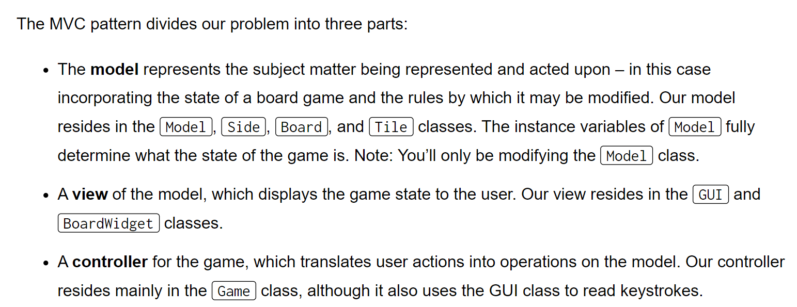


## Enum Type⭐⭐⭐⭐⭐
> 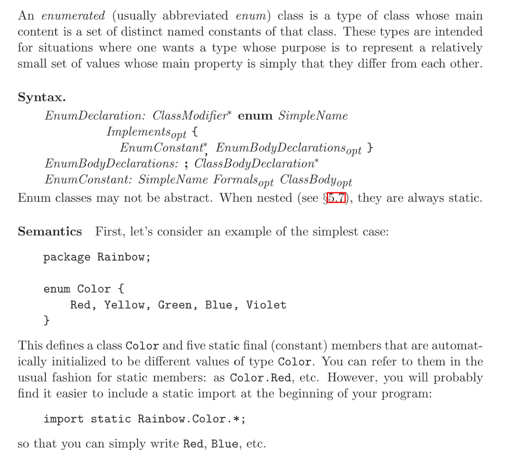

**More Details**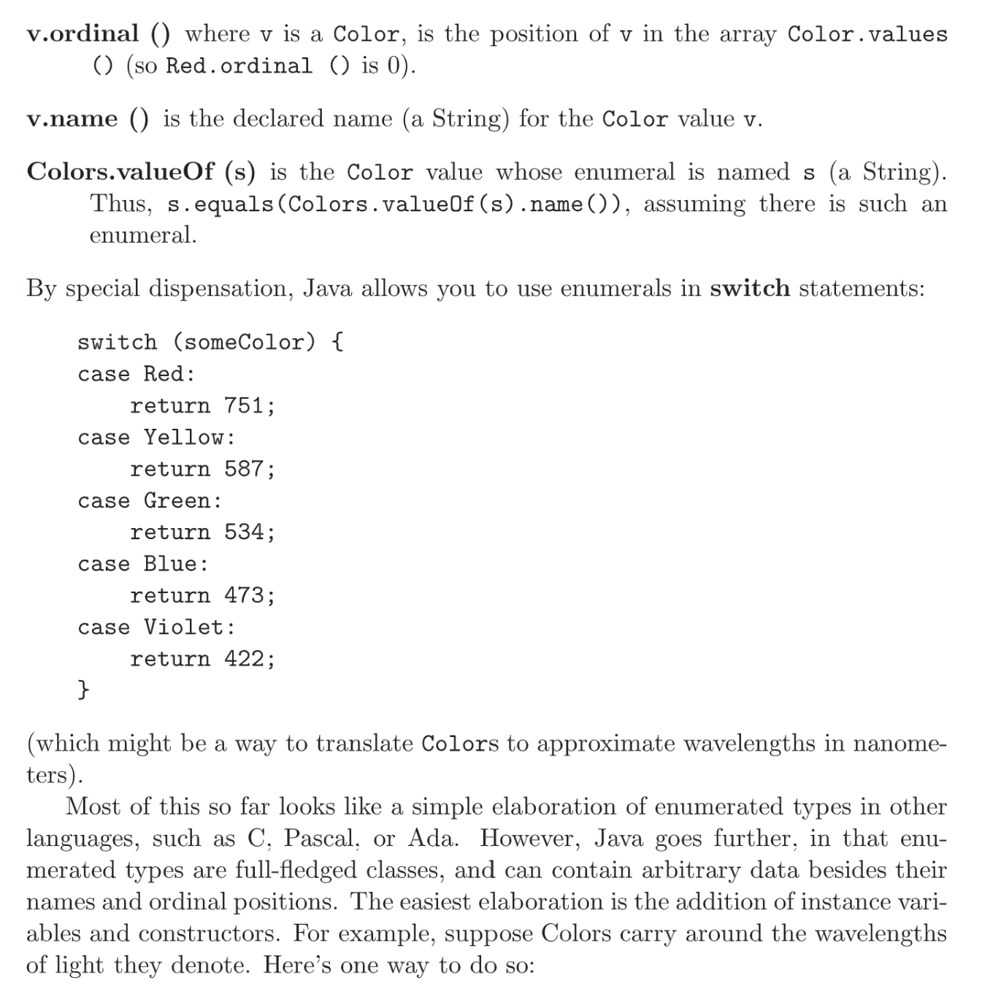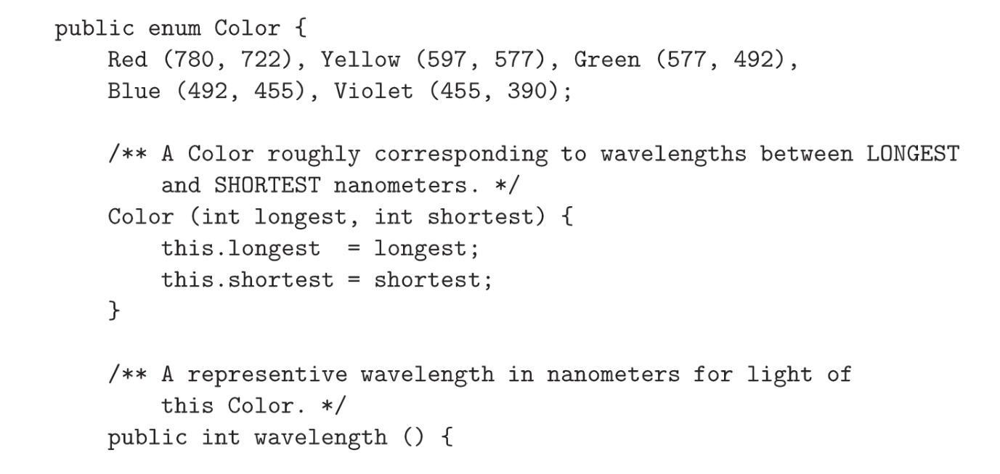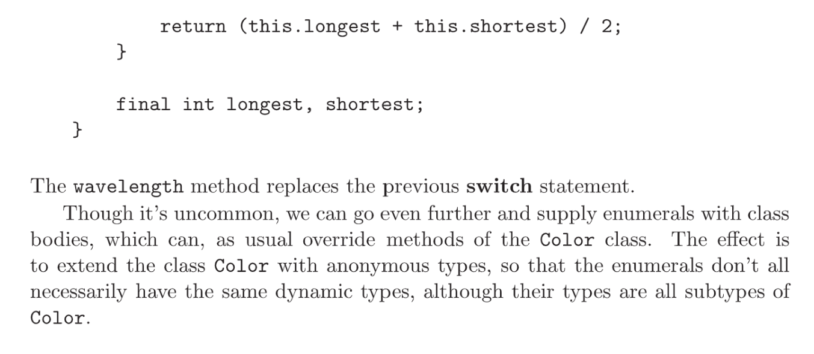


## Tile Class - Factory Pattern
> 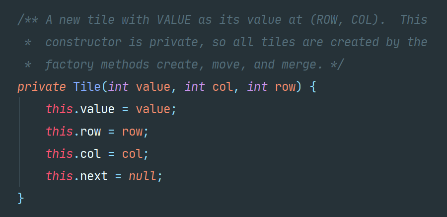


## Side Class - Coordinate System
> 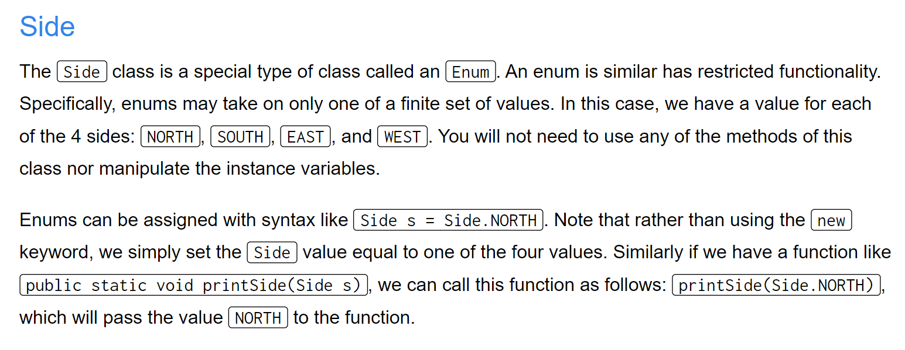
> 下面我们来分析一下`Side Class`的代码结构:

```java
package game2048;

/** Symbolic names for the four sides of a board.
 *  @author P. N. Hilfinger */
// Enum类
public enum Side {
    NORTH(0, 0, 0, 1),
    EAST(0, 1, 1, 0),
    SOUTH(1, 1, 0, -1),
    WEST(1, 0, -1, 0);

    // 用于7~10行用户自定义Side.NORTH/EAST/SOUTH/WEST.row0/col0/drow/dcol的数值
    Side(int col0, int row0, int dcol, int drow) {
        this.row0 = row0;
        this.col0 = col0;
        this.drow = drow;
        this.dcol = dcol;
    }

    /** Returns the side opposite of side S. */
    static Side opposite(Side s) {
        if (s == NORTH) {
            return SOUTH;
        } else if (s == SOUTH) {
            return NORTH;
        } else if (s == EAST) {
            return WEST;
        } else {
            return EAST;
        }
    }

    // standard coordinate是NORTH 在top, 此时lower-left corner的实际坐标是(0*size,0*size)
    // c 和 r 是相对坐标，比如当前的Side是WEST, 
    // 则WEST坐标系下lower-left corner的实际坐标是(1*size, 0*size), c 和 r 就是相对于
    // 这个lower-left corner的坐标。
    // 所以这个函数就是在把相对坐标转换成standard coordinate。
    public int col(int c, int r, int size) {
        // col0 * (size - 1) 求出lower-left corner
        return col0 * (size - 1) + c * drow + r * dcol;
    }

    /** Return the standard row number for square (C, R) on a board
     *  of size SIZE oriented with this Side on top. */
    public int row(int c, int r, int size) {
        return row0 * (size - 1) - c * dcol + r * drow;
    }

    /** Parameters describing this Side, as documented in the comment at the
     *  start of this class. */
    private int row0, col0, drow, dcol;

};
```


## Model Class - Model Layer
> 


## Board Class - Model Layer
> 
> `Board`的本质是一个`2D-Array`of `Tiles`, `Tile`的`value`由用户指定，如果`value==0`, 则`Board[row][col]=null`，否则`Tile`的`value`就是用户指定的值。

 

## Start the Game
> 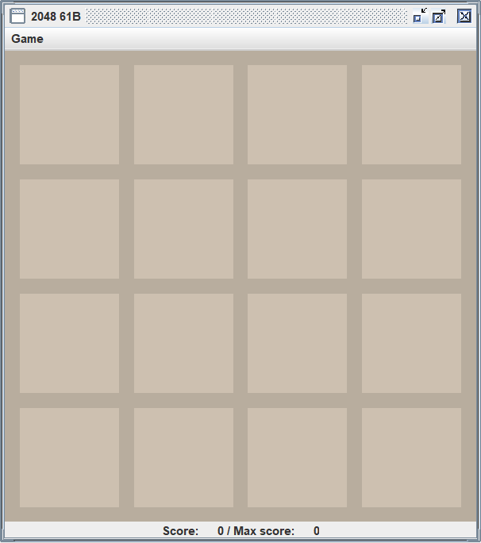


# Code Implementation(Model.Class)
> 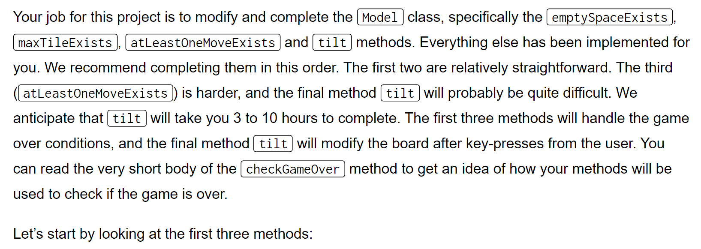


## Game Rules
### 检测是否有空的Tile
> 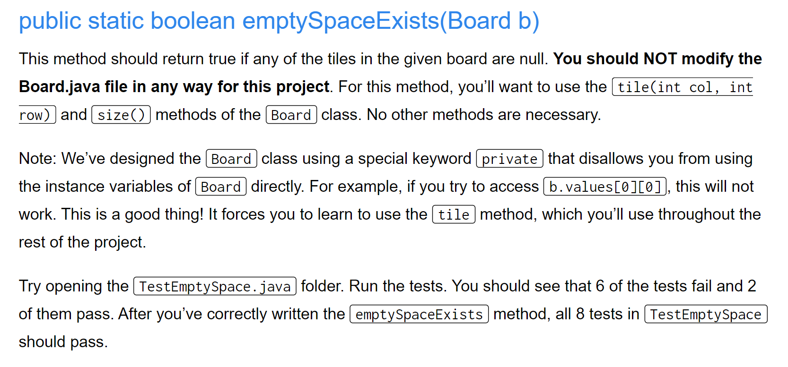

```java
/** Returns true if at least one space on the Board is empty.
 *  Empty spaces are stored as null.
 * */
public static boolean emptySpaceExists(Board b) {
    // TODO: Fill in this function.
    // 注意到这里的Board b 实现了Iterable接口，所以表明我们可以使用Enhanced For Loop.
    for (Tile tile: b) {
        if (tile == null) {
            return true;
        }
    }
    return false;
}
```


### 检测是否有Tile的值为2048
> 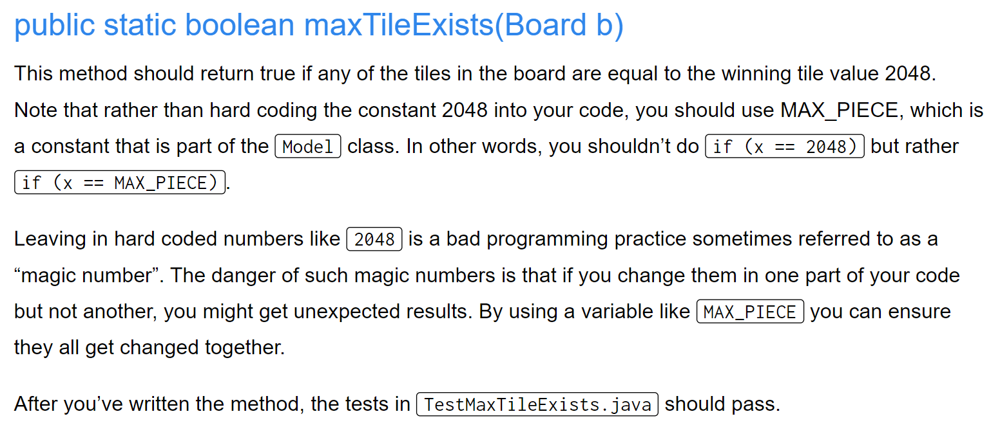

```java
/**
 * Returns true if any tile is equal to the maximum valid value.
 * Maximum valid value is given by MAX_PIECE. Note that
 * given a Tile object t, we get its value with t.value().
 */
public static boolean maxTileExists(Board b) {
    // TODO: Fill in this function.
    for (Tile tile: b) {
        if (tile != null && tile.value() == MAX_PIECE) {
            return true;
        }
    }
    return false;
}
```


### 检测是否还可以移动
> 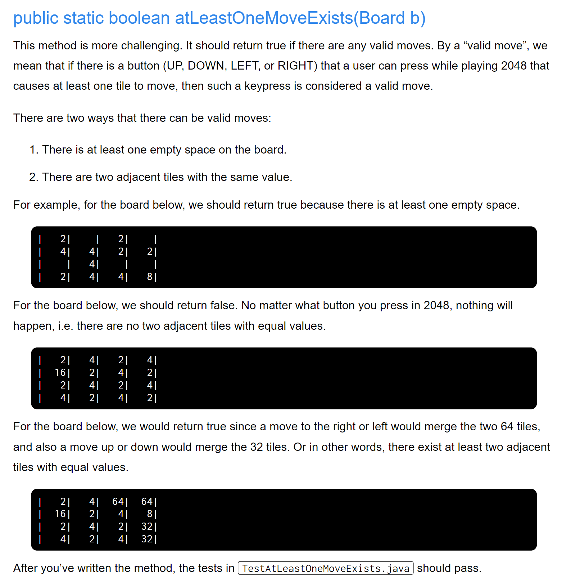
> 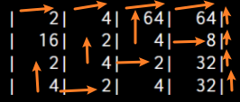

```java
/**
 * Returns true if there are any valid moves on the board.
 * There are two ways that there can be valid moves:
 * 1. There is at least one empty space on the board.
 * 2. There are two adjacent tiles with the same value.
 */
public static boolean atLeastOneMoveExists(Board b) {
    // TODO: Fill in this function.
    int flag = 0;
    int size = b.size();
    // 从lower-left corner开始往右往上逐个判断
    for (int row = 0; row < size - 1; row++) {
        for (int col = 0; col < size - 1; col++) {
            Tile curr = b.tile(col,row);
            Tile right = b.tile(col + 1, row);
            Tile up = b.tile(col, row + 1);
            if (curr == null) {
                continue;
            }
            if ((right != null && curr.value() == right.value()) ||
                    (up != null && curr.value() == up.value())) {
                flag += 1;
            }
        }
    }
    // 最后一列判断一下
    for (int row = 0; row < size - 1; row++) {
        Tile curr = b.tile(size - 1, row);
        Tile up = b.tile(size - 1, row + 1);
        if (curr == null) {
            continue;
        }
        if (up != null && curr.value() == up.value()) {
            flag++;
        }
    }
    // 最后一行判断一下
    for (int col = 0; col < size - 1; col++) {
        Tile curr = b.tile(col, size - 1);
        Tile right = b.tile(col + 1, size - 1);
        if (curr == null) {
            continue;
        }
        if (right != null && curr.value() == right.value()) {
            flag++;
        }
    }
    return emptySpaceExists(b) || flag > 0;
}
```


## Game Logics
### Run the Game
> 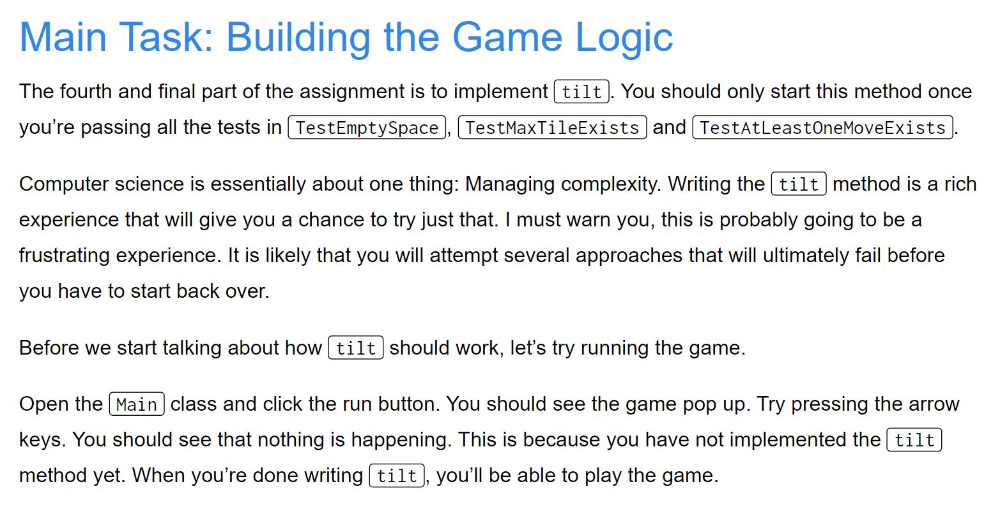


### public boolean tilt
> 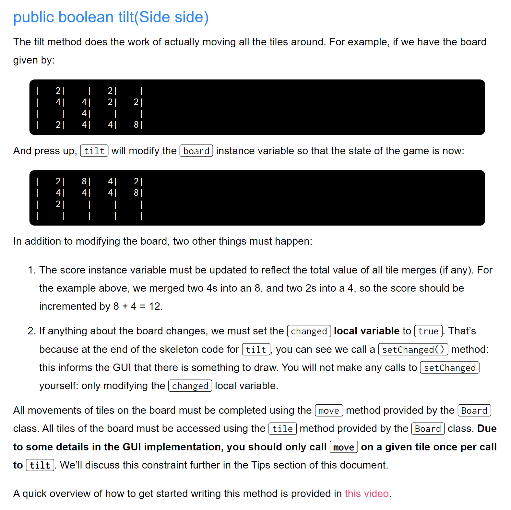
> 主要的逻辑在`tilt`函数中，算法结构是:
> 1. `moveTilesInColumns`负责移动某一列中的所有`Block`。
> 2. `tilt`负责对每个`column`调用`moveTilsInColumns`。
> 
思路是: 对于每一列，我们从上(`row`较大的`Block`)到下(`row`较小的`Block`)依次判断某个`Block`在`Up North`的操作之后的结果。对于坐标为`(c,r)`的`Block`来说我们从`(c, r+1)`开始遍历该列，如果`(c, r*)`处出现了一个`Non-Empty Block`, 需要考虑如下两种情况:
> 1. `Value(c, r*) != Value(c, r)`, 说明不能`merge`, 此时我们只能将当前`Block`移动到`(c, r*-1)`处，但是如果`r* - 1 = r`，说明不用移动，这种情况需要排除。
> 2. `Value(c, r*) = Value(c, r)`, 说明可以`merge`, 但是要注意，如果`(c, r*)`对应的`Block`已经是`merge`之后的`Block`了，则我们不能将`(c, r)`与`(c, r*)`合并。于是我们需要一个数据结构来记录`(c, r*)`这个`Block`是否已经是`merge`之后的结果。我们可以使用一个一维列表来记录每一列中已经`merge`过的`Block`的位置。
> 
代码如下:

```java
public boolean tilt(Side side) {
        boolean changed;
        changed = false;

        // Modify this.board (and perhaps this.score) to account
        // for the tilt to the Side SIDE. If the board changed, set the
        // changed local variable to true.
        this.board.setViewingPerspective(side);
        for (int col = 0; col < size(); col++) {
            boolean moved = moveTilesInColumn(col);
            if (moved) {
                changed = true;
            }
        }
        this.board.setViewingPerspective(Side.NORTH);
        checkGameOver();
        if (changed) {
            setChanged();
        }


        return changed;
    }

    /**
     * Return the row coordinate we should place our tile(Using Up Operation)
     * Given the (col, row) of the tile that we want to move
     * @return whether the tile is actually moved
     */
    private boolean moveTilesInColumn(int col) {
        boolean[] mergedTile = new boolean[size()];
        int moved = 0;
        for (int row = size() - 1; row >= 0; row--) {
            Tile t = this.board.tile(col, row);
            if (t != null) {
                for (int r = row + 1; r < size(); r++) {
                    Tile next = this.board.tile(col, r);
                    if (next != null) {
                        if (next.value() == t.value() && !mergedTile[r]) {
                            boolean merged = this.board.move(col, r, t);
                            assert merged;
                            this.score += 2 * t.value();
                            moved++;
                            mergedTile[r] = true;
                        } else {
                            if (r - 1 > row) {
                                boolean merged = this.board.move(col, r - 1, t);
                                assert !merged;
                                moved++;
                            }
                        }
                        break;
                    } else {
                        if (r == size() - 1) {
                            boolean merged = this.board.move(col, r, t);
                            assert !merged;
                            moved++;
                        }
                    }
                }
            }
        }
        return moved > 0;
    }
```

# Submission
> 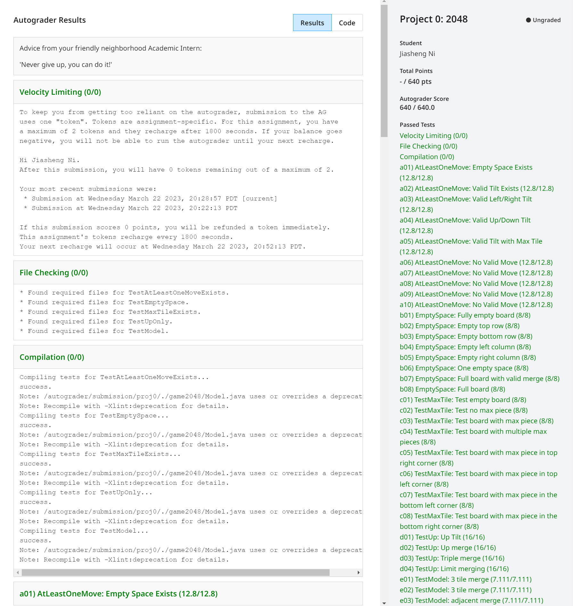


# Run the Game
> 注意需要修改`GUISource`中的一些代码才能保证程序正确接收到键盘命令:
> 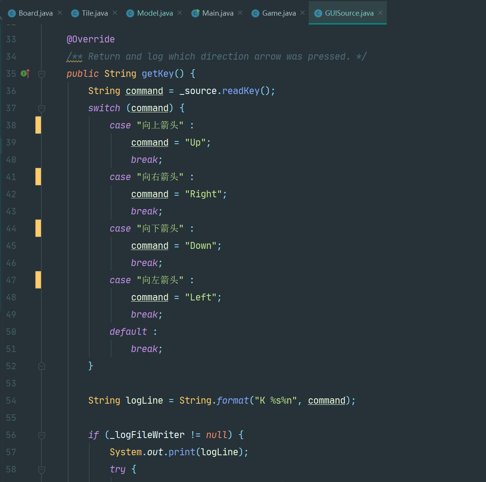


