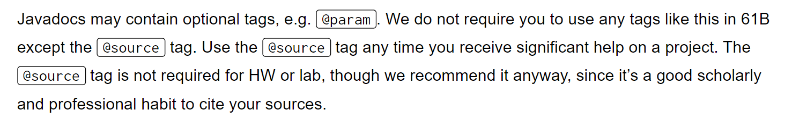
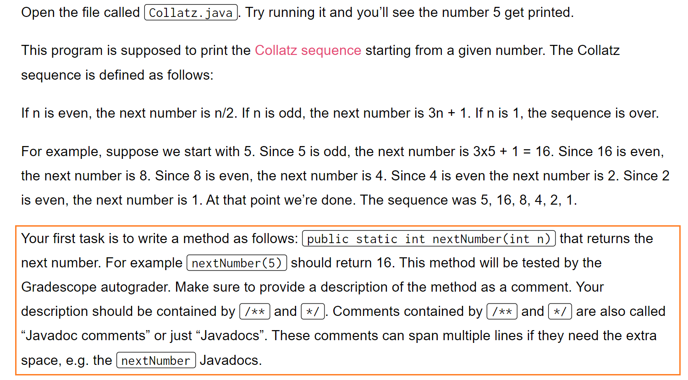
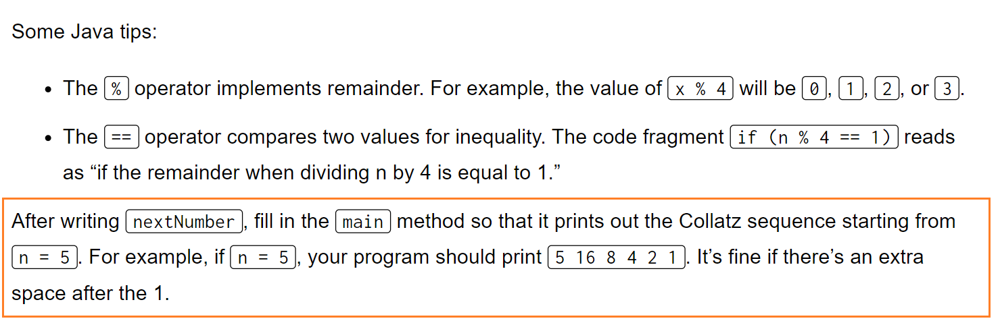
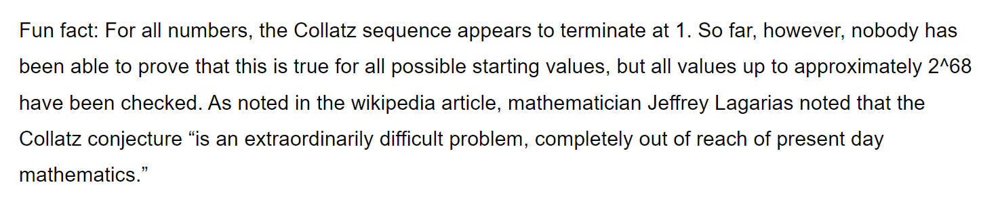
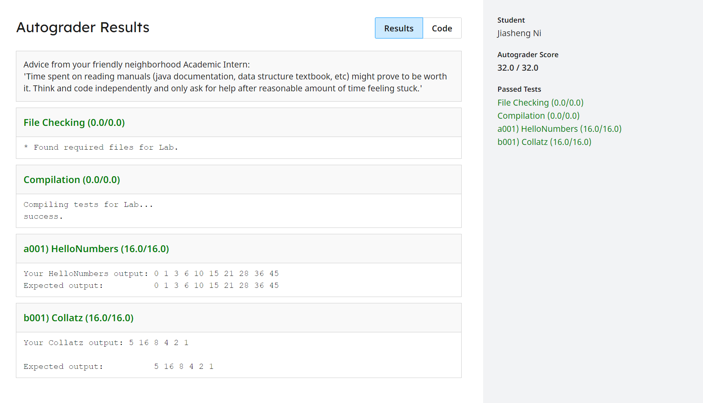

# Environment Setup
> [https://sp21.datastructur.es/materials/lab/lab1/lab1SnapsSetupWindows.html](https://sp21.datastructur.es/materials/lab/lab1/lab1SnapsSetupWindows.html)


# Collatz Sequence
> 也称为`Hailstone Sequence`, 我们在`CS61A`中见过。


## Javadoc
> 


## Fix the Bug
> 

```java
/** Class that prints the Collatz sequence starting from a given number.
 *  @author YOUR NAME HERE
 */
public class Collatz {

    /** Buggy implementation of nextNumber! */
    public static int nextNumber(int n) {
        if (n  == 128) {
            return 1;
        } else if (n == 5) {
            return 3 * n + 1;
        } else {
            return n * 2;
        }
    }

    public static void main(String[] args) {
        int n = 5;
        System.out.print(n + " ");
        while (n != 1) {
            n = nextNumber(n);
            System.out.print(n + " ");
        }
        System.out.println();
    }
}
```
```java
/** Class that prints the Collatz sequence starting from a given number.
 *  @author YOUR NAME HERE
 */
public class Collatz {

    /** Buggy implementation of nextNumber! */
    public static int nextNumber(int n) {
        if (n  == 128) {
            return 1;
        } else if (n % 2 == 1) {
            return 3 * n + 1;
        } else {
            return n / 2;
        }
    }

    public static void main(String[] args) {
        int n = 5;
        System.out.print(n + " ");
        while (n != 1) {
            n = nextNumber(n);
            System.out.print(n + " ");
        }
        System.out.println();
    }

}
```


## Fun Facts
> 


# Submission
> 

