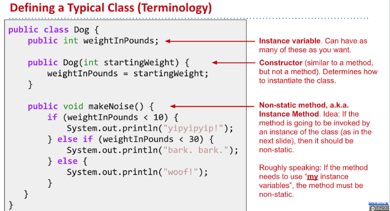

> **Textbook 1.1~1.2**

[cs61b lec1 2018 intro.pdf](https://www.yuque.com/attachments/yuque/0/2022/pdf/12393765/1672208211512-5045d8d9-c67b-4474-98cf-167b49d15854.pdf)
[cs61b lec2 2018 intro2.pdf](https://www.yuque.com/attachments/yuque/0/2022/pdf/12393765/1672208211454-84760cac-c9a4-4e71-84d0-4d10af2e930b.pdf)

# Static Typing - Key Java Feature
## Basics
> `Java Complier`会进行`Static Type Checking`, 下面的程序会在执行前就报错。和`Python`不同，`Java`会在执行前就对语法进行检测，而不像`Python`那样只会报运行时错误。
> **To summarize, static typing has the following advantages:**
> - The compiler ensures that all types are compatible, making it easier for the programmer to debug their code.
> - Since the code is guaranteed to be free of type errors, users of your compiled programs will never run into type errors. For example, Android apps are written in Java, and are typically distributed only as .class files, i.e. in a compiled format. As a result, such applications should never crash due to a type error since they have already been checked by the compiler.
> - Every variable, parameter, and function has a declared type, making it easier for a programmer to understand and reason about code.

```cpp
public class HelloNumbers {
    public static void main(String[] args) {
        int x = 0;
        while (x < 10) {
            System.out.print(x + " ");
            x = x + 1;
        }
        x = "horse"; // 类型错误, 指定了int却赋值为string
    }
}
```
**Output**

## String Concat
> 下面两行`Java`代码
> `String h = 5 + "horse";` 能够通过编译，原因是`int`类型能够向上转型成`String`包装类。后面会讲到原因。
> `int h = 5 + "horse";`编译阶段报错，原因是`String`类型不能转换成`int`类型。
> 类似的，`System.out.println(5 + "10")`输出`510`, 这里`5`被转型成`String`类型。


# Defining Functions(Methods)
```cpp
public class LargerDemo {
    public static int larger(int x, int y) {
        if (x > y) {
            return x;
        }
        return y;
    }

    public static void main(String[] args) {
        System.out.println(larger(8, 10));
    }
}
```


# Code Style & Comment
## Code Style
> [https://sp19.datastructur.es/materials/guides/style-guide.html](https://sp19.datastructur.es/materials/guides/style-guide.html)


## Comments(Javadoc)
```cpp
public class LargerDemo {
    /** Returns the larger of x and y. */           
    public static int larger(int x, int y) {
        if (x > y) {
            return x;
        }
        return y;
    }

    public static void main(String[] args) {
        System.out.println(larger(8, 10));
    }
}
```


# Defining and Using Classes
## Static vs Non-Static Methods
> 如果想要运行`Java`文件，则类中必须有`main`方法来调用，否则直接`run`会报错。
> 
> 

```java
public class Dog {

    public static void makeNoise(){
        System.out.println("bark");
    }

    // 类中必须有一个main, 否则会报错
    public static void main(String[] args) {
        Dog.makeNoise();
        makeNoise();
    }
}

```
```java
public class DogLauncher {
    public static void main(String[] args) {
        Dog.makeNoise();
    }
}
```


## Object Instantiation
> 
> **Some key observations and terminology:**
> - An `Object` in Java is an instance of any class.
> - The `Dog` class has its own variables, also known as _instance variables or non-static variables._ These must be declared inside the class, unlike languages like Python or Matlab, where new variables can be added at runtime.
> - The method that we created in the Dog class did not have the `static` keyword. We call such methods _instance methods_ or _non-static methods_.
> - To call the `makeNoise` method, we had to first _instantiate_ a `Dog` using the new keyword, and then make a specific `Dog` bark. In other words, we called `d.makeNoise()` instead of `Dog.makeNoise()`.
> - Once an object has been instantiated, it can be assigned to a _declared variable_ of the appropriate type, e.g. `d = new Dog()`;
> - Variables and methods of a class are also called members of a class.
> - Members of a class are accessed using _dot notation._

```java
public class TinyDog {
    public static void makeNoise() {
        System.out.println("yip yip yip yip");
    }
}
```
```java
public class MalamuteDog {
    public static void makeNoise() {
        System.out.println("arooooooooooooooo!");
    }
}

```
```java
public class Dog {
    public int weightInPounds;

    public void makeNoise() {
        if (weightInPounds < 10) {
            System.out.println("yipyipyip!");
        } else if (weightInPounds < 30) {
            System.out.println("bark. bark.");
        } else {
            System.out.println("woof!");
        }
    }
}

// With Constructor
public class Dog {
    public int weightInPounds;

    public Dog(int w) {
        weightInPounds = w;
    }

    public void makeNoise() {
        if (weightInPounds < 10) {
            System.out.println("yipyipyip!");
        } else if (weightInPounds < 30) {
            System.out.println("bark. bark.");
        } else {
            System.out.println("woof!");
        }    
    }
}
```
```java
// Without Constructor
public class DogLauncher {
    public static void main(String[] args) {
        Dog d;
        d = new Dog();
        d.weightInPounds = 20;
        d.makeNoise(); // bark bark
    }
}

// With Constructor
public class DogLauncher {
    public static void main(String[] args) {
        Dog d = new Dog(20);
        d.makeNoise();
    }
}
```


## Array Instantiation
> Do HW0 First!
> 

```java
public class ArrayDemo {
    public static void main(String[] args) {
        /* Create an array of five integers. */
        int[] someArray = new int[5];
        someArray[0] = 3;
        someArray[1] = 4;
    }
}

```
```java
public class DogArrayDemo {
    public static void main(String[] args) {
        /* Create an array of two dogs. */
        Dog[] dogs = new Dog[2];
        dogs[0] = new Dog(8);
        dogs[1] = new Dog(20);

        /* Yipping will result, since dogs[0] has weight 8. */
        dogs[0].makeNoise();
    }
}

```


# Static & Instance Method/Variables
:::info

:::
```java
public class Dog {
    public int weightInPounds;
    public static String binomen = "Canis familiaris"; // Static Variables

    public Dog(int w) {
        weightInPounds = w;
    }

    public void makeNoise() {
        if (weightInPounds < 10) {
            System.out.println("yipyipyip!");
        } else if (weightInPounds < 30) {
            System.out.println("bark. bark.");
        } else {
            System.out.println("woof!");
        }
    }


    public static Dog maxDog(Dog d1, Dog d2){
        /*
         Static Method: Compare between the pounds of dogs.
         */
        if(d1.weightInPounds > d2.weightInPounds){
            return d1;
        }
        return d2;
    }

    public Dog maxDog(Dog d2){
        /*
         Non-Static Method: Compare between the pounds of dogs.
         */
        if(this.weightInPounds > d2.weightInPounds){
            return this;
        }
        return d2;
    }
}

```
```java
package Chapter_1_2.Static_Non_Static;

import Chapter_1_2.Static_Non_Static.Dog;

/**
 * Created by AlexMan
 */
public class DogLauncher {
    public static void main(String[] args) {
        Dog d1;
        Dog d2;
        d1 = new Dog(51);
        d2 = new Dog(52);
        System.out.println(d1.maxDog(d2));
        System.out.println(Dog.maxDog(d1,d2));
    }
}


```
**Output**


# Class Exercise
:::info

**Answer:**

- bark!
- woof!
- woof!
:::


# PSVM & CMD
:::info

:::
```java
public class ArgsDemo {
    public static void main(String[] args) {
        System.out.println(args[0]);
    }
}
```
**Output**
:::info

[https://www.cnblogs.com/wangxiaoha/p/6293340.html](https://www.cnblogs.com/wangxiaoha/p/6293340.html)
:::
```java
public class ArgsExercise {
    public static void main(String[] args) {
        int res =0;
        for(int i=0;i<args.length;i++){
            res += Integer.parseInt(args[i]);
        }
        System.out.println(res);
    }
}

```
**Output**

# Using Libraries
:::info

:::


