# 1 Discussion 03
>Prereq: Chapter 2.5
	[disc03.pdf](https://www.yuque.com/attachments/yuque/0/2023/pdf/12393765/1673838550489-03966ce1-7728-4fc2-b782-723589419da3.pdf)
	[disc03sol.pdf](https://www.yuque.com/attachments/yuque/0/2023/pdf/12393765/1673838550436-87d7ea72-a98b-444d-9a84-8ad57e605803.pdf)
	[Discussion 03 Slides.pdf](https://www.yuque.com/attachments/yuque/0/2023/pdf/12393765/1673838550515-bc1c2597-bab7-4a61-9060-730a657d12f5.pdf)

## Q1 More practice with linked lists
>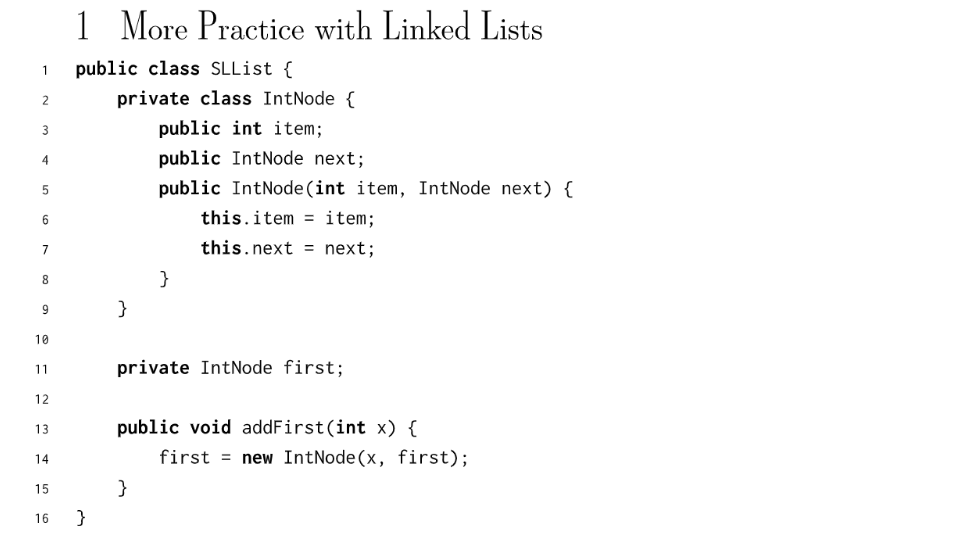
```java
/**
 * Created by AlexMan
 * An SLList is a list of integers, which hides the terrible truth
 * of the nakedness within.
 */
public class SLList {
    private IntNode first;

    /**
     * 这里IntNode不需要访问SLList实例化对象中的任何属性和方法，所以推荐使用static
     */
    private static class IntNode {
        public int item;
        public IntNode next;

        public IntNode(int item, IntNode next){
            this.item = item;
            this.next = next;
        }
    }

    public SLList(){
    }


    public SLList(int x){
        first = new IntNode(x, null);
    }

    /**
     * Append a new node at the front of the SLList
     * @param i
     */
    public void addFirst(int i){
        IntNode newHead = new IntNode(i, first);
        first = newHead;
    }

    /**
     * Return the string representation of the SLList
     * @return
     */
    public String printList(){
        IntNode s = first;
        String res = "";
        while(s != null){
            if(s.next !=null){
                res += String.valueOf(s.item) + "->";
            }else{
                res += String.valueOf(s.item);
            }
            s = s.next;
        }
        return res;
    }

    /**
     * Insert an item at the given position
     * @param item
     * @param position
     */
    public void insert(int item, int position){
        // Your Code Here!
    }

}

```


### Q1a SLList Insert(position > 1)⭐⭐⭐
:::info
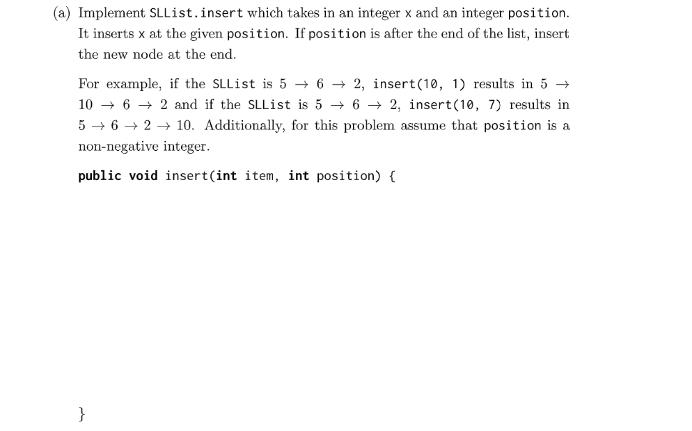
注意: 本题不能使用`size()`且没有`sentinel node`
:::
```java
    /**
     * Insert an item at the given position
     * @param item
     * @param position
     */
    public void insert(int item, int position){
        // Empty SLList
        if(first == null){
            addFirst(item);
            return;
        }
        // At least one item
        IntNode curr = first;
        IntNode prev = new IntNode(-1, curr);
        int pos = 0;
        while(curr != null){
            if(pos == position){
                if(pos == 0){
                    addFirst(item);
                }else{
                    prev.next = new IntNode(item, curr);
                }
                return;
            }
            curr = curr.next;
            prev = prev.next;
            pos ++ ;
        }
        // Insert at the end
        prev.next = new IntNode(item,null);
    }
```
```java
/**
 * Insert an item at the given position
 * @param item
 * @param position
 */
public void insert(int item, int position){
    // Empty SLList or insert at the front
    if(first == null || position == 0){
        addFirst(item);
        return;
    }

    IntNode currentNode = first;

    // position > 1 是为了让我们在insert position的前一位就停下，这样省去了构造一个prev
    // pointer的代码量
    // currentNode.next != null 和 position > 1是成对出现的
    // currentNode != null 和 position > 0是成对出现的, 但是需要考虑更多的边界情况
    while(position > 1 && currentNode.next != null){
        position --;
        currentNode = currentNode.next;
    }

    IntNode newNode = new IntNode(item, currentNode.next);
    currentNode.next = newNode;
}
```


### Q1b removeItem - Recursive⭐⭐⭐
:::info
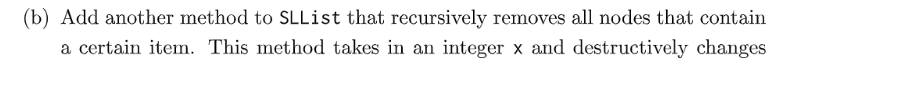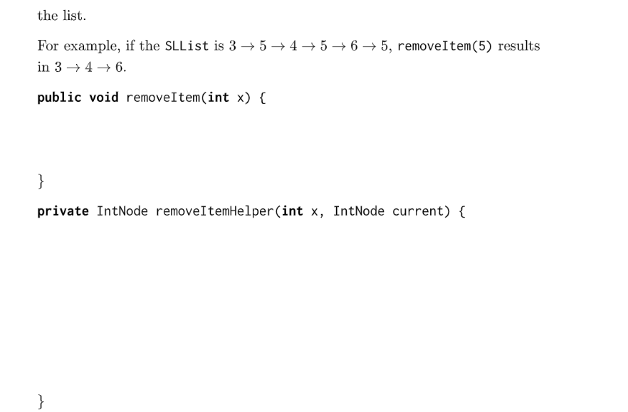
:::
```java
 public IntNode removeItemHelper(int x, IntNode current){
        if(current == null){
            return null;
        }else if(current.item == x){
            // 跳过这一个元素
            return removeItemHelper(x, current.next);
        }else{
            // 接上, 这个函数需要返回值的原因在这里
            // 如果当前的currentNode不是要删除的，则要删除的currentNode可能在
            // currentNode.next为首的链表，removeItemHelper(...)会返回
            // 以currentNode.next为首的删除过后的链表的头结点
            // We have to trust the recursive function.
            current.next = removeItemHelper(x, current.next);
            // 返回头结点，很重要
            return current;
        }
    }
```
**Solution**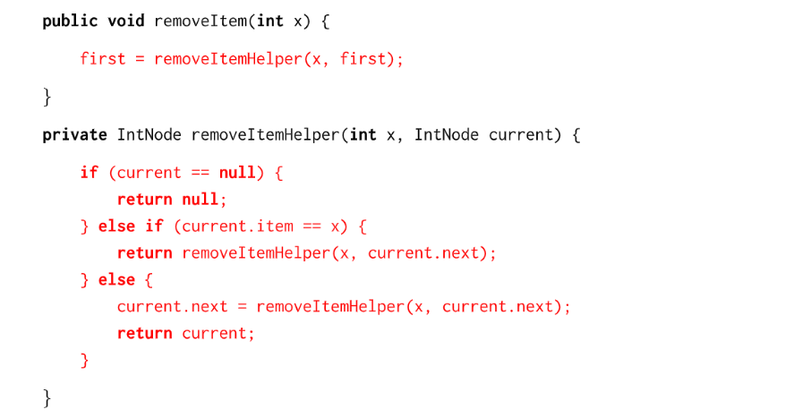


### Q1c reverse⭐⭐⭐⭐⭐
:::info
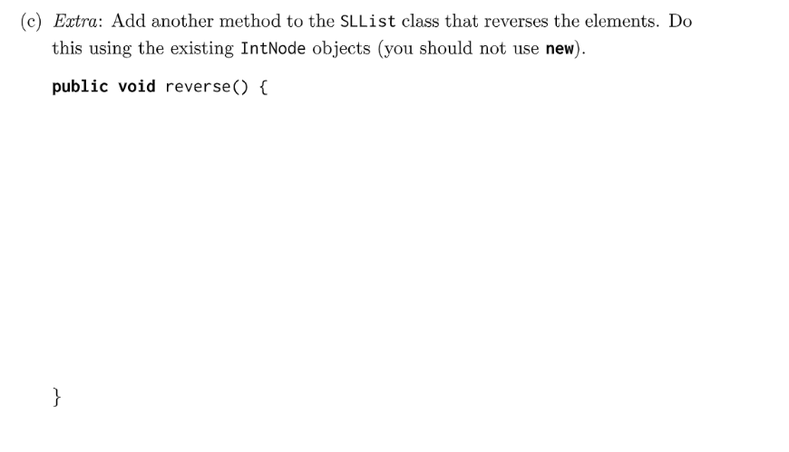
:::
```java
/**
 * Reverse the list, destructive, should not use new
 */
public void reverse(){
    if(first == null){
        return;
    }
	// 其实prevNode可以省略，因为我们最终要更新的就是first, 可以
    // 直接选择first作为遍历的指针
    IntNode prevNode = first;
    IntNode currNode = first.next;
    first.next = null;
    while(currNode != null){
        IntNode afterNode = currNode.next;
        currNode.next = prevNode;
        prevNode = currNode;
        currNode = afterNode;
    }
    first = prevNode;
}
```
**Alternate Solution - recommended**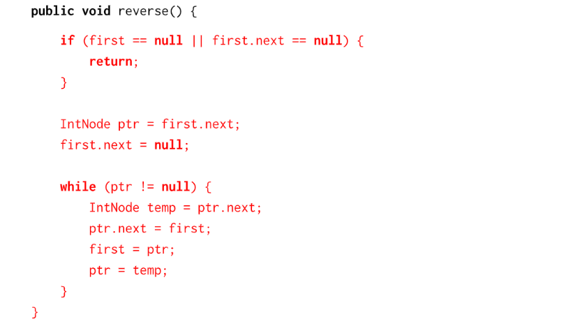


## Q2 Arrays
### Q2a Array Insert
:::info
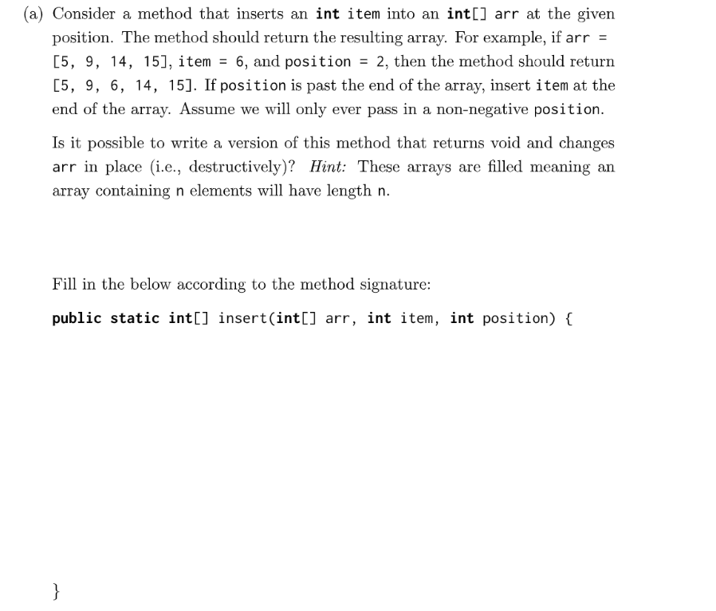
:::
```java
import java.util.Arrays;

/**
 * Created by AlexMan
 */
public class ArrayMethod {

    public static int[] insert(int[] arr, int item, int position){
        int[] newArr = new int[arr.length + 1];
        System.arraycopy(arr, 0, newArr, 0, arr.length);
        if(position >= arr.length){
            newArr[newArr.length - 1] = item;
            return newArr;
        }
        for(int i = newArr.length - 1; i > position; i--){
            newArr[i] = newArr[i-1];
        }
        newArr[position] = item;
        return newArr;

    }

    public static void main(String[] args) {
        int[] temp = new int[] {1,2,3};
        int[] newTemp = insert(temp, 4, 4);
        System.out.println(Arrays.toString(newTemp));
    }
}
```
**Alternate Solution - 分段插入**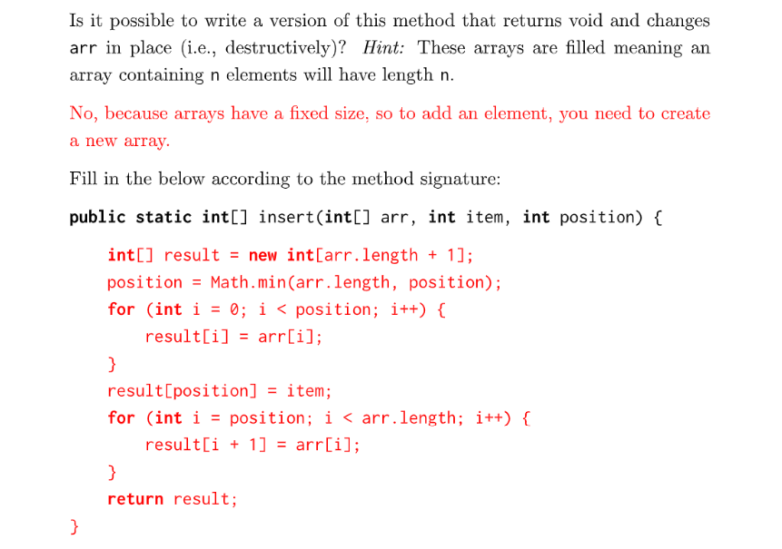


### Q2b Array replicate
:::info
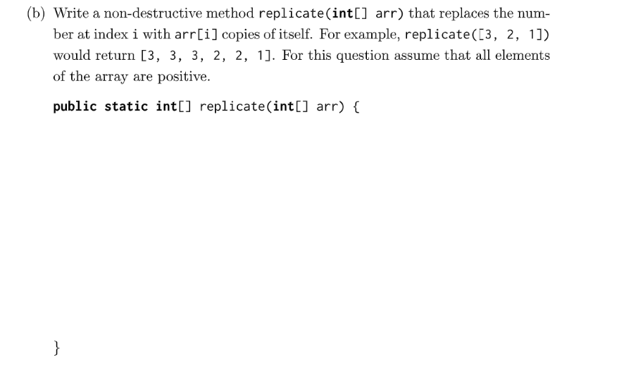
:::
```java
public static int[] replicate(int[] arr){
    // 计算新的array的长度
    int newLength = 0;
    for(int x: arr){
        newLength += x;
    }
    int[] newArr = new int[newLength];
    int index = 0;
    for(int x: arr){
        for(int count =0 ; count < x; count++){
            newArr[index] = x;
            index ++;
        }
    }
    return newArr;
}

```
**Alternate Solution**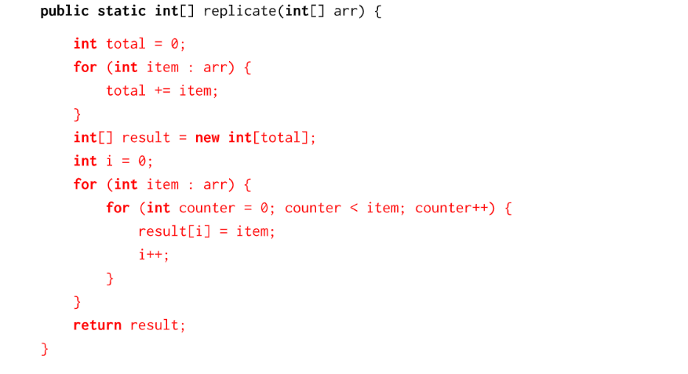


# 2 Exam Prep 03
:::info
**Prereq: **Lab 03 Testing, Debugging, where we define enhanced IntList class with `equals` mtehod
:::
[examprep03.pdf](https://www.yuque.com/attachments/yuque/0/2023/pdf/12393765/1673838558492-4375b040-f4bf-4d31-b640-9683bdf9b665.pdf)
[examprep03sol.pdf](https://www.yuque.com/attachments/yuque/0/2023/pdf/12393765/1673838558491-1b945e39-9804-4a0c-8a4a-c94927350da8.pdf)
[Exam Prep 03 Slides.pdf](https://www.yuque.com/attachments/yuque/0/2023/pdf/12393765/1673838550469-e9d43ebf-de67-42d4-bc83-12cfe851e206.pdf)


## Q1 Flatten 2D Array
:::info
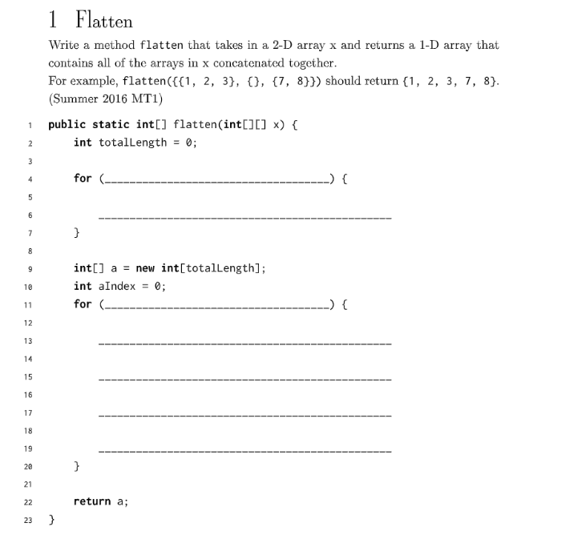
:::
```java
/**
 * Created by AlexMan
 */
public class Flatten {
    
    
    public static int[] flatten(int[][] x) {
        int totalLength = 0;
        
        for (____________________________________) {
            _______________________________________________
        }
        int[] a = new int[totalLength];
        int aIndex = 0;
        for (____________________________________) {
            _______________________________________________
            _______________________________________________
            _______________________________________________
            _______________________________________________
            }
        return a;
    }
}

```
```java
/**
 * Created by AlexMan
 */
public class Flatten {


    public static int[] flatten(int[][] x) {
        int totalLength = 0;

        for (int[] subarray: x) {
            totalLength += subarray.length;
        }
        int[] a = new int[totalLength];
        int aIndex = 0;
        for (int i=0; i < x.length; i ++) {
            int[] currArr = x[i];
            for(int j =0; j < currArr.length; j++){
                a[aIndex] = currArr[j];
                aIndex ++;
            }
        }
        return a;
    }
}
```
```java
import org.junit.Test;
import static org.junit.Assert.*;
/**
 * Created by AlexMan
 */
public class FlattenTest {

    @Test
    public void testFlatten(){
        int[][] a = new int[][] {{1,2},{3,4}};
        int[] flattened = Flatten.flatten(a);
        int[] exp = new int[] {1,2,3,4};
        assertArrayEquals(exp, flattened);
    }
}

```


## Q2 Skippify IntList⭐⭐⭐
:::info
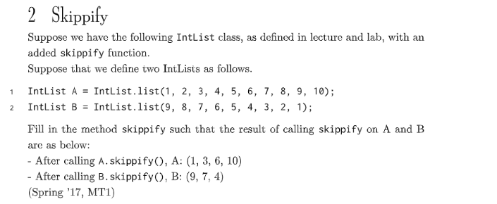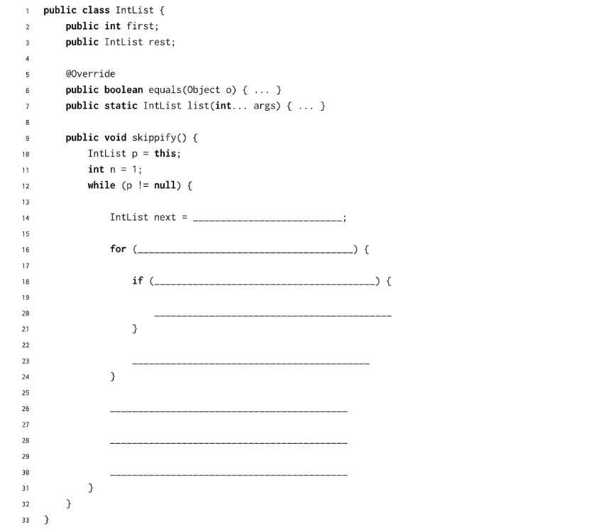
:::
```java
import java.util.Formatter;

/**
 * A naked recursive list of integers, similar to what we saw in lecture 3, but
 * with a large number of additional methods.
 *
 * @author P. N. Hilfinger, with some modifications by Josh Hug and melaniecebula
 *         [Do not modify this file.]
 */
public class IntList {
    /**
     * First element of list.
     */
    public int first;
    /**
     * Remaining elements of list.
     */
    public IntList rest;

    /**
     * A List with first FIRST0 and rest REST0.
     */
    public IntList(int first0, IntList rest0) {
        first = first0;
        rest = rest0;
    }

    /**
     * A List with null rest, and first = 0.
     */
    public IntList() {
    /* NOTE: public IntList () { }  would also work. */
        this(0, null);
    }

    /**
     * Returns a list equal to L with all elements squared. Destructive.
     */
    public static void dSquareList(IntList L) {

        while (L != null) {
            L.first = L.first * L.first;
            L = L.rest;
        }
    }

    /**
     * Returns a list equal to L with all elements squared. Non-destructive.
     */
    public static IntList squareListIterative(IntList L) {
        if (L == null) {
            return null;
        }
        IntList res = new IntList(L.first * L.first, null);
        IntList ptr = res;
        L = L.rest;
        while (L != null) {
            ptr.rest = new IntList(L.first * L.first, null);
            L = L.rest;
            ptr = ptr.rest;
        }
        return res;
    }

    /**
     * Returns a list equal to L with all elements squared. Non-destructive.
     */
    public static IntList squareListRecursive(IntList L) {
        if (L == null) {
            return null;
        }
        return new IntList(L.first * L.first, squareListRecursive(L.rest));
    }

    /** DO NOT MODIFY ANYTHING ABOVE THIS LINE! */

    
    /**
     * Returns a list consisting of the elements of A followed by the
     * *  elements of B.  May modify items of A. Don't use 'new'. Recursive
     */
    public static IntList dcatenate(IntList A, IntList B) {
        //TODO:  fill in method
        if(A == null){
            return B;
        }else if(A.rest == null){
            A.rest = B;
            return A;
        }else{
            dcatenate(A.rest, B);
            return A;
        }
    }


    /**
     * Returns a list consisting of the elements of A followed by the
     * * elements of B.  May NOT modify items of A.  Use 'new'.
     */
    public static IntList catenate(IntList A, IntList B) {
        //TODO:  fill in method
        if(A == null){
            return B;
        }else{
            IntList start = new IntList(A.first, null);
            IntList prev = start;
            IntList A1 = A.rest;
            IntList B1 = B;
            while(A1!=null){
                prev.rest = new IntList(A1.first, null);
                prev = prev.rest;
                A1 = A1.rest;
            }
            while(B1!=null){
                prev.rest = new IntList(B1.first, null);
                prev = prev.rest;
                B1 = B1.rest;
            }
            return start;
        }
    }
    

    /**
     * DO NOT MODIFY ANYTHING BELOW THIS LINE! Many of the concepts below here
     * will be introduced later in the course or feature some form of advanced
     * trickery which we implemented to help make your life a little easier for
     * the lab.
     */

    @Override
    public int hashCode() {
        return first;
    }

    /**
     * Returns a new IntList containing the ints in ARGS. You are not
     * expected to read or understand this method.
     */
    public static IntList of(Integer... args) {
        IntList result, p;

        if (args.length > 0) {
            result = new IntList(args[0], null);
        } else {
            return null;
        }

        int k;
        for (k = 1, p = result; k < args.length; k += 1, p = p.rest) {
            p.rest = new IntList(args[k], null);
        }
        return result;
    }

    /**
     * Returns true iff X is an IntList containing the same sequence of ints
     * as THIS. Cannot handle IntLists with cycles. You are not expected to
     * read or understand this method.
     */
    public boolean equals(Object x) {
        if (!(x instanceof IntList)) {
            return false;
        }
        IntList L = (IntList) x;
        IntList p;

        for (p = this; p != null && L != null; p = p.rest, L = L.rest) {
            if (p.first != L.first) {
                return false;
            }
        }
        if (p != null || L != null) {
            return false;
        }
        return true;
    }

    /**
     * If a cycle exists in the IntList, this method
     * returns an integer equal to the item number of the location where the
     * cycle is detected.
     * <p>
     * If there is no cycle, the number 0 is returned instead. This is a
     * utility method for lab2. You are not expected to read, understand, or
     * even use this method. The point of this method is so that if you convert
     * an IntList into a String and that IntList has a loop, your computer
     * doesn't get stuck in an infinite loop.
     */

    private int detectCycles(IntList A) {
        IntList tortoise = A;
        IntList hare = A;

        if (A == null) {
            return 0;
        }

        int cnt = 0;


        while (true) {
            cnt++;
            if (hare.rest != null) {
                hare = hare.rest.rest;
            } else {
                return 0;
            }

            tortoise = tortoise.rest;

            if (tortoise == null || hare == null) {
                return 0;
            }

            if (hare == tortoise) {
                return cnt;
            }
        }
    }

    @Override
    /** Outputs the IntList as a String. You are not expected to read
     * or understand this method. */
    public String toString() {
        Formatter out = new Formatter();
        String sep;
        sep = "(";
        int cycleLocation = detectCycles(this);
        int cnt = 0;

        for (IntList p = this; p != null; p = p.rest) {
            out.format("%s%d", sep, p.first);
            sep = ", ";

            cnt++;
            if ((cnt > cycleLocation) && (cycleLocation > 0)) {
                out.format("... (cycle exists) ...");
                break;
            }
        }
        out.format(")");
        return out.toString();
    }
}
```
```java
public void skippify(){
    IntList p = this;
    int n = 1;
    while (p != null){
        IntList next = p.rest;
        for (int i = 0; i < n; i++) {
            // 注意一定要判断一下
            if (next == null) {
                break;
            }
            next = next.rest;
        }
        p.rest = next;
        p = p.rest;
        n ++;
    }
}

```
```java
import org.junit.Test;
import static org.junit.Assert.*;
/**
 * Created by AlexMan
 */
public class IntListTest {


    @Test
    public void testSkippify(){
        IntList p = IntList.of(1,2,3,4,5,6,7,8,9,10);
        p.skippify();
        IntList exp = IntList.of(1,3,6,10);
        assertEquals(exp, p);
    }

}

```
**Solution**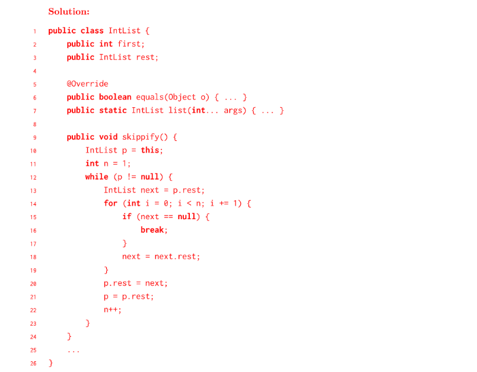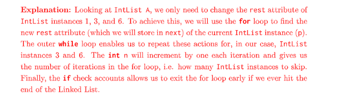


## Q3 IntList - evenOdd⭐⭐⭐⭐⭐
:::info
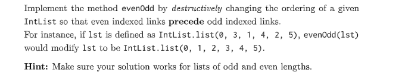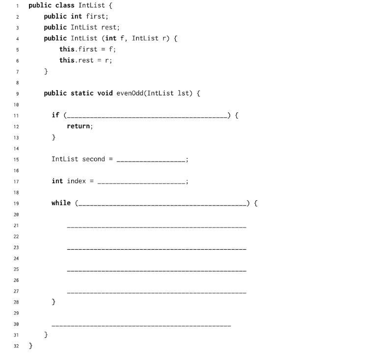
:::
```java
/**
 * Created by AlexMan
 */
public class IntList {
    public int first;
    public IntList rest;

    public IntList(int f, IntList r){
        this.first = f;
        this.rest = r;
    }

    public static void evenOdd(IntList lst){
        // 常规操作
        if(lst == null || lst.rest == null){
            return;
        }
        IntList second = lst.rest;
        // 判断条件的含义
        // lst.rest!=null 表示偶数节点没有结束
        // lst.rest.rest!=null 表示奇数节点还没有结束
        // 但凡有一个结束了我们就把偶数链表连接到奇数链表上去
        while (lst.rest!= null && lst.rest.rest!=null) {
            // 获得下一个节点，即奇数节点
            IntList temp = lst.rest;
            // 将偶数节点连接到下一个偶数节点
            lst.rest = temp.rest;
            // 过渡到下一个偶数节点
            lst = lst.rest;
            // 奇数节点连接到下一个奇数节点
            temp.rest = lst.rest;
        }
        lst.rest = second;
    }

}
```
**Solution 2 & Explanation**开头的判断条件的第三个条件`lst.rest.rest == null`实际上是可以省略的。
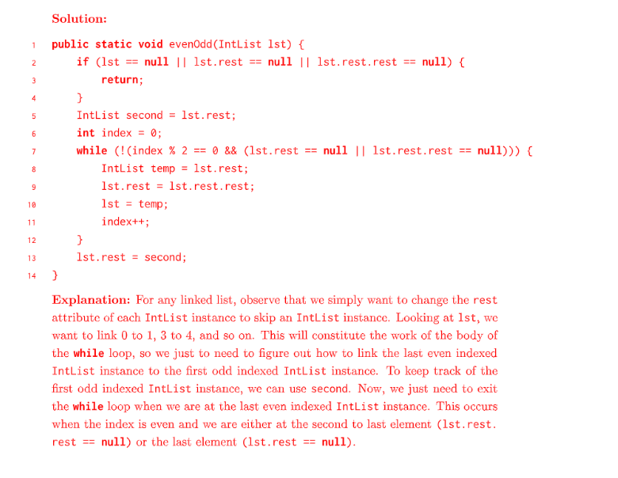
```java
import org.junit.Test;
import static org.junit.Assert.*;
/**
 * Created by AlexMan
 */
public class IntList2Test {

    @Test
    public void testIntList2(){
        IntList2 t4 = new IntList2(30, null);
        IntList2 t3 = new IntList2(20, t4);
        IntList2 t2 = new IntList2(10, t3);
        IntList2 t1 = new IntList2(5, t2);

        IntList2 tm4 = new IntList2(30, null);
        IntList2 tm3 = new IntList2(10, tm4);
        IntList2 tm2 = new IntList2(20, tm3);
        IntList2 tm1 = new IntList2(5, tm2);

        IntList2.evenOdd(t1);

        assertEquals(tm1.toString(),t1.toString());
    }
}
```
```java
@Override
public int hashCode() {
    return first;
}


public boolean equals(Object x) {
    if (!(x instanceof IntList)) {
        return false;
    }
    IntList2 L = (IntList2) x;
    IntList2 p;

    for (p = this; p != null && L != null; p = p.rest, L = L.rest) {
        if (p.first != L.first) {
            return false;
        }
    }
    if (p != null || L != null) {
        return false;
    }
    return true;
}


private int detectCycles(IntList2 A) {
    IntList2 tortoise = A;
    IntList2 hare = A;

    if (A == null) {
        return 0;
    }

    int cnt = 0;


    while (true) {
        cnt++;
        if (hare.rest != null) {
            hare = hare.rest.rest;
        } else {
            return 0;
        }

        tortoise = tortoise.rest;

        if (tortoise == null || hare == null) {
            return 0;
        }

        if (hare == tortoise) {
            return cnt;
        }
    }
}

@Override
/** Outputs the IntList as a String. You are not expected to read
 * or understand this method. */
public String toString() {
    Formatter out = new Formatter();
    String sep;
    sep = "(";
    int cycleLocation = detectCycles(this);
    int cnt = 0;

    for (IntList2 p = this; p != null; p = p.rest) {
        out.format("%s%d", sep, p.first);
        sep = ", ";

        cnt++;
        if ((cnt > cycleLocation) && (cycleLocation > 0)) {
            out.format("... (cycle exists) ...");
            break;
        }
    }
    out.format(")");
    return out.toString();
}
```
