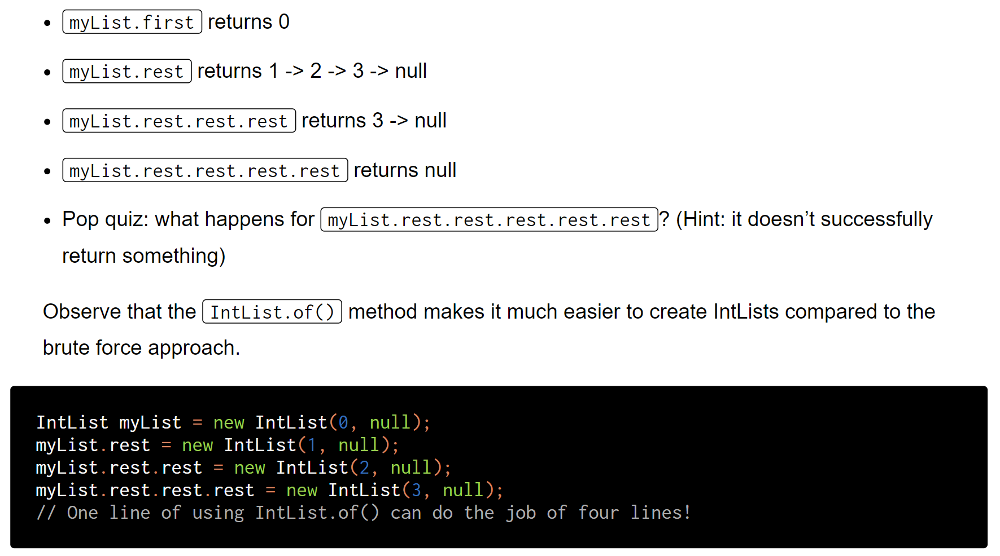

[Lab 2 setup_ Setting Up IntelliJ _ CS 61B Spring 2018.pdf](https://www.yuque.com/attachments/yuque/0/2023/pdf/12393765/1673617434866-6b786b18-9603-40fb-8ba3-c97ce62eb650.pdf)
[Lab 2_ Unit Testing with JUnit and IntLists _ CS 61B Spring 2018.pdf](https://www.yuque.com/attachments/yuque/0/2023/pdf/12393765/1673617434547-b3735115-dfde-49fc-b965-839fd2397e74.pdf)
[lab2.zip](https://www.yuque.com/attachments/yuque/0/2023/zip/12393765/1673746666051-dd37657f-07fc-4584-9f75-ac02b84b579a.zip)


# Including Java Library(Important)
:::info
**library-sp18: **[https://github.com/Berkeley-CS61B/library-sp18/tree/d39149194a077373f18e2f43a2a691df1306ee0e](https://github.com/Berkeley-CS61B/library-sp18/tree/d39149194a077373f18e2f43a2a691df1306ee0e)

:::


# Debugging Basics&Plugins
## Java Visualizer
:::info
**Java Visualizer Plugin:** [https://sp18.datastructur.es/materials/guides/plugin.html#using-the-plugin](https://sp18.datastructur.es/materials/guides/plugin.html#using-the-plugin)

当设置了`breakpoint`之后才有效。
:::


## Debugging Exercises
### E1 - Step Over
:::info


:::
```java
/**
 * Exercise for learning how the debug, breakpoint, and step-into
 * feature work.
 */
public class DebugExercise1 {
    public static int divideThenRound(int top, int bottom) {
        int quotient = top / bottom;
        int result = Math.round(quotient);
        return result;
    }

    public static void main(String[] args) {
        int t = 10;
        int b = 2;
        int result = divideThenRound(t, b);
        System.out.println("round(" + t + "/" + b + ")=" + result);

        int t2 = 9;
        int b2 = 4;
        int result2 = divideThenRound(t2, b2);
        System.out.println("round(" + t2 + "/" + b2 + ")=" + result2);

        int t3 = 3;
        int b3 = 4;
        int result3 = divideThenRound(t3, b3);
        System.out.println("round(" + t3 + "/" + b3 + ")=" + result3);
    }
}

```

### E2 - Step Out
:::info

:::
```java
/**
 * Exercise to showcase the step over button.
 * Code adapted from https://stackoverflow.com/questions/4895173/bitwise-multiply-and-add-in-java and https://stackoverflow.com/questions/1533131/what-useful-bitwise-operator-code-tricks-should-a-developer-know-about
 */
public class DebugExercise2 {
    /** Returns the max of a and b. Do not step into this function. 
      * This function may have a bug, but if it does, you should find it
      * by stepping over, not into. */
    public static int max(int a, int b) {
        int w = (b - a) >> 31;
        /* If you're stepping into this function, click the
           step out button because you're not going to learn anything. */
        int z = ~(b - a) >> 31;

        int max = b & w | a & z;
        return max;
    }


    /** Returns the sum of a and b. Do not step into this function. 
      * This function may have a bug, but if it does, you should find it
      * by stepping over, not into. */    
    public static int add(int a, int b) {
        int x = a, y = b;
        /* If you're stepping into this function, click the
           step out button because you're not going to learn anything. */
        int xor, and, temp;
        and = x & y;
        xor = x ^ y;

        while (and != 0) {
            and <<= 1;
            temp = xor ^ and;
            and &= xor;
            xor = temp;
        }
        return xor;
    }

    /** Returns a new array where entry i is the max of
     * a[i] and b[i]. For example, if a = {1, -10, 3}
     * and b = {0, 20, 5}, this function will return {1, 20, 5}.
     * */
    public static int[] arrayMax(int[] a, int[] b) {
        if (a.length != b.length) {
            System.out.println("ERROR! Arrays don't match");
            return null;
        }
        int[] returnArray = new int[a.length];
        for (int i = 0; i < a.length; i += 1) {
            int biggerValue = max(a[i], b[i]);
            returnArray[i] = biggerValue;
        }

        return returnArray;
    }

    /** Returns the sum of all elements in x. */
    public static int arraySum(int[] x) {
        int i = 0;
        int sum = 0;
        while (i < x.length) {
            sum = sum + add(sum, x[i]);
            i = i + 1;
        }
        return sum;
    }

    /** Returns the sum of the element-wise max of a and b.
     *  For example if a = {2, 0, 10, 14} and b = {-5, 5, 20, 30},
     *  the result should be 57.
     * */
    public static int sumOfElementwiseMaxes(int[] a, int[] b) {
        int[] maxes = arrayMax(a, b);
        int sumofMaxes = arraySum(maxes);
        return sumofMaxes;
    }


    public static void main(String[] args) {
        int[] a = {1, 11, -1, -11};
        int[] b = {3, -3, 2, -1};

        int sumOfElementwiseMaxes = sumOfElementwiseMaxes(a, b);
        System.out.println(sumOfElementwiseMaxes);
    }
}

```


### E3 - Conditional Breakpoints and Resume⭐⭐⭐
:::info

:::
:::info
确保我们已经导入了`library-sp18/javalib`否则无法引入`In Class`去读取文件信息。
另外记得把`food.csv`文件所在的根目录标记成`source root`, `Java`默认会去这个根目录下找`food.csv`, 如果仅仅把`lab2`设置成根目录是找不到`food.csv`的（需要改代码，改成`food.csv`的绝对路径）


 Resume Button
Conditional Breakpoint:

:::
```java
import edu.princeton.cs.algs4.In;

/**
 * Created by jug on 1/22/18.
 */

public class DebugExercise3 {
    public static int countTurnips(In in) {
        int totalTurnips = 0;
        while (!in.isEmpty()) {
            String vendor = in.readString();
            String foodType = in.readString();
            double cost = in.readDouble();
            int numAvailable = in.readInt();
            if (foodType.equals("turnip")) {
                int newTotal = totalTurnips + numAvailable;
                totalTurnips = newTotal;
            }
            in.readLine();
        }
        return totalTurnips;
    }

    public static void main(String[] args) {
        In in = new In("foods.csv");
        System.out.println(countTurnips(in));
    }
}

```


# Application: IntLists
## Recap on IntList
:::info

:::
```java
package Intlist;

import java.util.Formatter;

/**
 * A naked recursive list of integers, similar to what we saw in lecture 3, but
 * with a large number of additional methods.
 *
 * @author P. N. Hilfinger, with some modifications by Josh Hug and melaniecebula
 *         [Do not modify this file.]
 */
public class IntList {
    /**
     * First element of list.
     */
    public int first;
    /**
     * Remaining elements of list.
     */
    public IntList rest;

    /**
     * A List with first FIRST0 and rest REST0.
     */
    public IntList(int first0, IntList rest0) {
        first = first0;
        rest = rest0;
    }

    /**
     * A List with null rest, and first = 0.
     */
    public IntList() {
    /* NOTE: public IntList () { }  would also work. */
        this(0, null);
    }

    /**
     * Returns a list equal to L with all elements squared. Destructive.
     */
    public static void dSquareList(IntList L) {

        while (L != null) {
            L.first = L.first * L.first;
            L = L.rest;
        }
    }

    /**
     * Returns a list equal to L with all elements squared. Non-destructive.
     */
    public static IntList squareListIterative(IntList L) {
        if (L == null) {
            return null;
        }
        IntList res = new IntList(L.first * L.first, null);
        IntList ptr = res;
        L = L.rest;
        while (L != null) {
            ptr.rest = new IntList(L.first * L.first, null);
            L = L.rest;
            ptr = ptr.rest;
        }
        return res;
    }

    /**
     * Returns a list equal to L with all elements squared. Non-destructive.
     */
    public static IntList squareListRecursive(IntList L) {
        if (L == null) {
            return null;
        }
        return new IntList(L.first * L.first, squareListRecursive(L.rest));
    }

    /** DO NOT MODIFY ANYTHING ABOVE THIS LINE! */


    /**
     * Returns a list consisting of the elements of A followed by the
     * *  elements of B.  May modify items of A. Don't use 'new'.
     */

    public static IntList dcatenate(IntList A, IntList B) {
        //TODO:  fill in method
        return null;
    }

    /**
     * Returns a list consisting of the elements of A followed by the
     * * elements of B.  May NOT modify items of A.  Use 'new'.
     */
    public static IntList catenate(IntList A, IntList B) {
        //TODO:  fill in method
        return null;
    }


    /**
     * DO NOT MODIFY ANYTHING BELOW THIS LINE! Many of the concepts below here
     * will be introduced later in the course or feature some form of advanced
     * trickery which we implemented to help make your life a little easier for
     * the lab.
     */

    @Override
    public int hashCode() {
        return first;
    }

    /**
     * Returns a new IntList containing the ints in ARGS. You are not
     * expected to read or understand this method.
     */
    public static IntList of(Integer... args) {
        IntList result, p;

        if (args.length > 0) {
            result = new IntList(args[0], null);
        } else {
            return null;
        }

        int k;
        for (k = 1, p = result; k < args.length; k += 1, p = p.rest) {
            p.rest = new IntList(args[k], null);
        }
        return result;
    }

    /**
     * Returns true iff X is an IntList containing the same sequence of ints
     * as THIS. Cannot handle IntLists with cycles. You are not expected to
     * read or understand this method.
     */
    public boolean equals(Object x) {
        if (!(x instanceof IntList)) {
            return false;
        }
        IntList L = (IntList) x;
        IntList p;

        for (p = this; p != null && L != null; p = p.rest, L = L.rest) {
            if (p.first != L.first) {
                return false;
            }
        }
        if (p != null || L != null) {
            return false;
        }
        return true;
    }

    /**
     * If a cycle exists in the IntList, this method
     * returns an integer equal to the item number of the location where the
     * cycle is detected.
     * <p>
     * If there is no cycle, the number 0 is returned instead. This is a
     * utility method for lab2. You are not expected to read, understand, or
     * even use this method. The point of this method is so that if you convert
     * an IntList into a String and that IntList has a loop, your computer
     * doesn't get stuck in an infinite loop.
     */

    private int detectCycles(IntList A) {
        IntList tortoise = A;
        IntList hare = A;

        if (A == null) {
            return 0;
        }

        int cnt = 0;


        while (true) {
            cnt++;
            if (hare.rest != null) {
                hare = hare.rest.rest;
            } else {
                return 0;
            }

            tortoise = tortoise.rest;

            if (tortoise == null || hare == null) {
                return 0;
            }

            if (hare == tortoise) {
                return cnt;
            }
        }
    }

    @Override
    /** Outputs the IntList as a String. You are not expected to read
     * or understand this method. */
    public String toString() {
        Formatter out = new Formatter();
        String sep;
        sep = "(";
        int cycleLocation = detectCycles(this);
        int cnt = 0;

        for (IntList p = this; p != null; p = p.rest) {
            out.format("%s%d", sep, p.first);
            sep = ", ";

            cnt++;
            if ((cnt > cycleLocation) && (cycleLocation > 0)) {
                out.format("... (cycle exists) ...");
                break;
            }
        }
        out.format(")");
        return out.toString();
    }
}


```

## Destructive vs Non-Destructive
:::info

:::


## Implement (Non-)destructive Methods
:::info

:::
### dcatenate - Destructive
:::info
注意`dcatenate`仍然需要返回头结点，用于通过测试
:::
```java
/**
 * Returns a list consisting of the elements of A followed by the
 * *  elements of B.  May modify items of A. Don't use 'new'. Recursive
 */
public static IntList dcatenate(IntList A, IntList B) {
    //TODO:  fill in method
    if(A == null){
        return B;
    }else if(A.rest == null){
        A.rest = B;
        return A;
    }else{
        dcatenate(A.rest, B);
        return A;
    }
}
```
```java
/**
     * Returns a list consisting of the elements of A followed by the
     * *  elements of B.  May modify items of A. Don't use 'new'.
     */

    public static IntList dcatenate(IntList A, IntList B) {
        //TODO:  fill in method
        if(A == null){
            return B;
        }else{
            IntList dA = A;
            while(A.rest != null){
                A = A.rest;
            }
            A.rest = B;
            return dA;
        }
    }
```


### catenate - Non destructive
```java
 /**
     * Returns a list consisting of the elements of A followed by the
     * * elements of B.  May NOT modify items of A.  Use 'new'. Recursive
     */
public static IntList catenate(IntList A, IntList B) {
    //TODO:  fill in method
    if(A == null){
        // 这里要注意判断B是否为null, 因为后面else if 我们要访问B.rest, 此时B不能为null.
        if(B == null){
            return null;
        } else if(B.rest == null){
            return new IntList(B.first, null);
        }else{
            return new IntList(B.first, catenate(null, B.rest));
        }
    }else{
        return new IntList(A.first, catenate(A.rest, B));
    }
}
```
```java
 /**
     * Returns a list consisting of the elements of A followed by the
     * * elements of B.  May NOT modify items of A.  Use 'new'. Iterative
     */
    public static IntList catenate(IntList A, IntList B) {
        //TODO:  fill in method
        if(A == null){
            return B;
        }else{
            IntList start = new IntList(A.first, null);
            IntList prev = start;
            IntList A1 = A.rest;
            IntList B1 = B;
            while(A1!=null){
                prev.rest = new IntList(A1.first, null);
                prev = prev.rest;
                A1 = A1.rest;
            }
            while(B1!=null){
                prev.rest = new IntList(B1.first, null);
                prev = prev.rest;
                B1 = B1.rest;
            }
            return start;
        }
    }
```


## LocalTests - Add Null Arguments Testing
```java
import static org.junit.Assert.*;
import org.junit.Test;

public class IntListTest {

    /**
     * Example test that verifies correctness of the IntList.of static
     * method. The main point of this is to convince you that
     * assertEquals knows how to handle IntLists just fine.
     */

    @Test
    public void testList() {
        IntList one = new IntList(1, null);
        IntList twoOne = new IntList(2, one);
        IntList threeTwoOne = new IntList(3, twoOne);

        IntList x = IntList.of(3, 2, 1);
        assertEquals(threeTwoOne, x);
    }

    @Test
    public void testdSquareList() {
        IntList L = IntList.of(1, 2, 3);
        IntList.dSquareList(L);
        assertEquals(IntList.of(1, 4, 9), L);
    }

    /**
     * Do not use the new keyword in your tests. You can create
     * lists using the handy IntList.of method.
     * <p>
     * Make sure to include test cases involving lists of various sizes
     * on both sides of the operation. That includes the empty of, which
     * can be instantiated, for example, with
     * IntList empty = IntList.of().
     * <p>
     * Keep in mind that dcatenate(A, B) is NOT required to leave A untouched.
     * Anything can happen to A.
     */

    @Test
    public void testSquareListRecursive() {
        IntList L = IntList.of(1, 2, 3);
        IntList res = IntList.squareListRecursive(L);
        assertEquals(IntList.of(1, 2, 3), L);
        assertEquals(IntList.of(1, 4, 9), res);
    }

    @Test
    public void testDcatenate() {
        IntList A = IntList.of(1, 2, 3);
        IntList B = IntList.of(4, 5, 6);
        IntList exp = IntList.of(1, 2, 3, 4, 5, 6);
        assertEquals(exp, IntList.dcatenate(A, B));
        assertEquals(IntList.of(1, 2, 3, 4, 5, 6), A);
    }

    @Test
    public void testDcatenateNullArguments(){
        IntList A = null;
        IntList B = null;
        IntList exp = null;
        assertEquals(exp, IntList.dcatenate(A, B));
        assertEquals(null, A);
    }


    @Test
    public void testCatenate() {
        IntList A = IntList.of(1, 2, 3);
        IntList B = IntList.of(4, 5, 6);
        IntList exp = IntList.of(1, 2, 3, 4, 5, 6);
        assertEquals(exp, IntList.catenate(A, B));
        assertEquals(IntList.of(1, 2, 3), A);
    }

    @Test
    public void testCatenateNullArguments(){
        IntList A = null;
        IntList B = null;
        IntList exp = null;
        assertEquals(exp, IntList.catenate(A, B));
        assertEquals(null, A);
    }

}

```


# Submission
:::info

:::
