[Lab 3_ Unit Testing with JUnit, Debugging _ CS 61B Spring 2018.pdf](https://www.yuque.com/attachments/yuque/0/2023/pdf/12393765/1673847994877-4d5d8f1a-ade8-41b9-8b71-63f9568b23e5.pdf)
[lab3.zip](https://www.yuque.com/attachments/yuque/0/2023/zip/12393765/1673848030476-15ad5b66-1c25-466a-a3d6-6dd776cbc69f.zip)

# Running JUnit Tests in IntelliJ
:::info
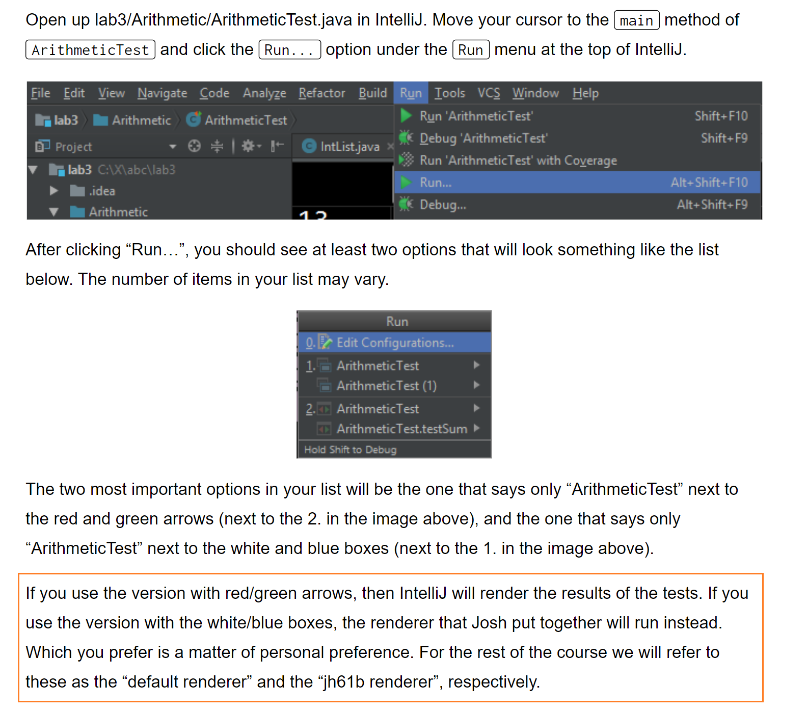
**Default:**
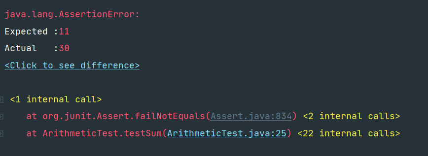
**Jh61b:**
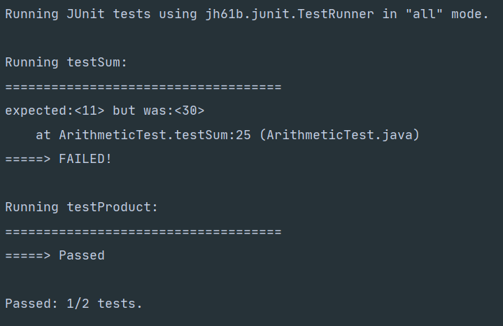
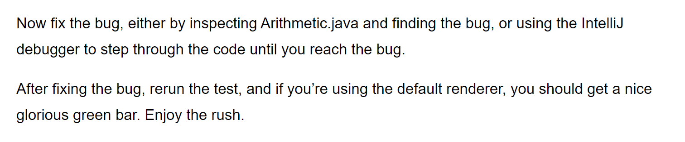
:::
```java
public class Arithmetic {
    /** Computes product of two ints */

    public static int product(int a, int b) {
        return a * b;
    }

    /** Computes sum of two ints (incorrectly) */

    public static int sum(int a, int b) {
        return a * b;
    }   
}
```
```java
public class Arithmetic {
    /** Computes product of two ints */

    public static int product(int a, int b) {
        return a * b;
    }

    /** Computes sum of two ints (incorrectly) */

    public static int sum(int a, int b) {
        return a + b;  // Here is the bug!
    }   
}

```
**Program Output**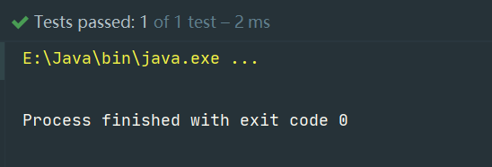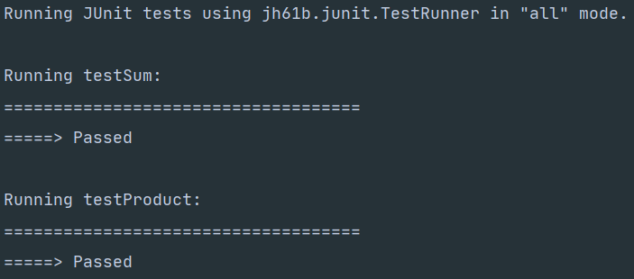

# IntLists
>**Coreq:** Discussion 03&Project 1A

## Goal
>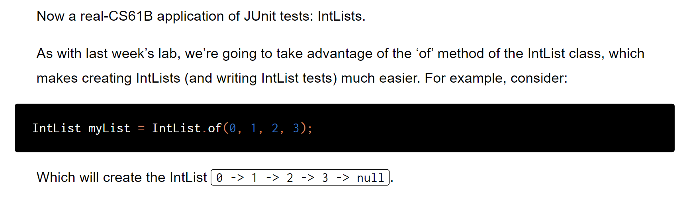


## Writing a Reverse Method⭐⭐⭐
>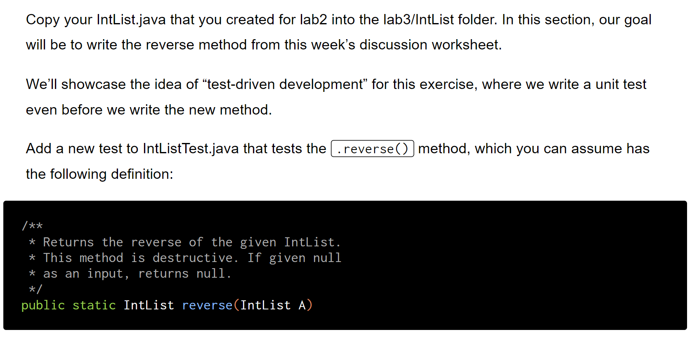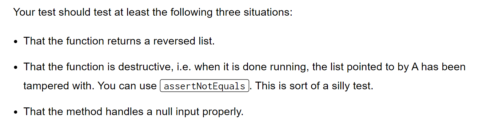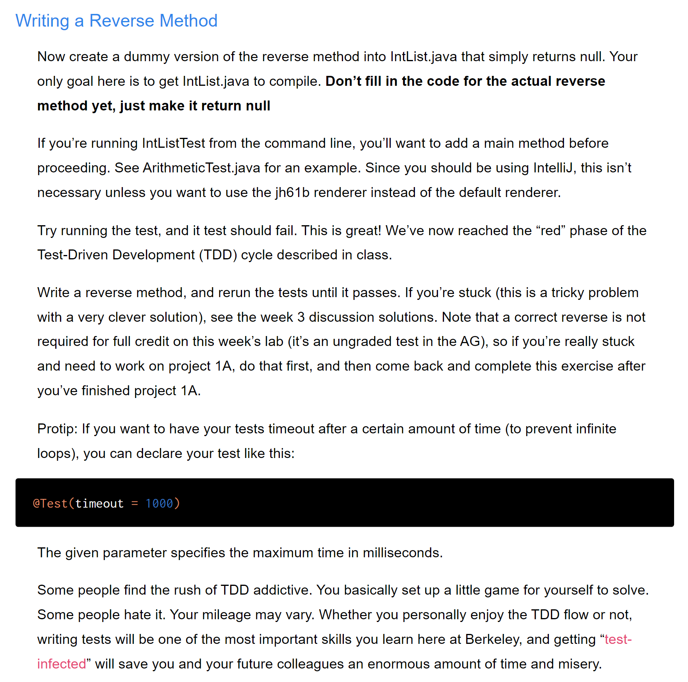
```java
import java.util.Formatter;

/**
 * A naked recursive list of integers, similar to what we saw in lecture 3, but
 * with a large number of additional methods.
 *
 * @author P. N. Hilfinger, with some modifications by Josh Hug and melaniecebula
 *         [Do not modify this file.]
 */
public class IntList {
    /**
     * First element of list.
     */
    public int first;
    /**
     * Remaining elements of list.
     */
    public IntList rest;

    /**
     * A List with first FIRST0 and rest REST0.
     */
    public IntList(int first0, IntList rest0) {
        first = first0;
        rest = rest0;
    }

    /**
     * A List with null rest, and first = 0.
     */
    public IntList() {
    /* NOTE: public IntList () { }  would also work. */
        this(0, null);
    }

    /**
     * Returns a list equal to L with all elements squared. Destructive.
     */
    public static void dSquareList(IntList L) {

        while (L != null) {
            L.first = L.first * L.first;
            L = L.rest;
        }
    }

    /**
     * Returns a list equal to L with all elements squared. Non-destructive.
     */
    public static IntList squareListIterative(IntList L) {
        if (L == null) {
            return null;
        }
        IntList res = new IntList(L.first * L.first, null);
        IntList ptr = res;
        L = L.rest;
        while (L != null) {
            ptr.rest = new IntList(L.first * L.first, null);
            L = L.rest;
            ptr = ptr.rest;
        }
        return res;
    }

    /**
     * Returns a list equal to L with all elements squared. Non-destructive.
     */
    public static IntList squareListRecursive(IntList L) {
        if (L == null) {
            return null;
        }
        return new IntList(L.first * L.first, squareListRecursive(L.rest));
    }

    /** DO NOT MODIFY ANYTHING ABOVE THIS LINE! */

    /**
     * Returns a list consisting of the elements of A followed by the
     * *  elements of B.  May modify items of A. Don't use 'new'. Recursive
     */
    public static IntList dcatenate(IntList A, IntList B) {
        //TODO:  fill in method
        if(A == null){
            return B;
        }else if(A.rest == null){
            A.rest = B;
            return A;
        }else{
            dcatenate(A.rest, B);
            return A;
        }
    }


    /**
     * Returns a list consisting of the elements of A followed by the
     * * elements of B.  May NOT modify items of A.  Use 'new'.
     */
    public static IntList catenate(IntList A, IntList B) {
        //TODO:  fill in method
        if(A == null){
            return B;
        }else{
            IntList start = new IntList(A.first, null);
            IntList prev = start;
            IntList A1 = A.rest;
            IntList B1 = B;
            while(A1!=null){
                prev.rest = new IntList(A1.first, null);
                prev = prev.rest;
                A1 = A1.rest;
            }
            while(B1!=null){
                prev.rest = new IntList(B1.first, null);
                prev = prev.rest;
                B1 = B1.rest;
            }
            return start;
        }
    }

    /**
     * DO NOT MODIFY ANYTHING BELOW THIS LINE! Many of the concepts below here
     * will be introduced later in the course or feature some form of advanced
     * trickery which we implemented to help make your life a little easier for
     * the lab.
     */

    @Override
    public int hashCode() {
        return first;
    }

    /**
     * Returns a new IntList containing the ints in ARGS. You are not
     * expected to read or understand this method.
     */
    public static IntList of(Integer... args) {
        IntList result, p;

        if (args.length > 0) {
            result = new IntList(args[0], null);
        } else {
            return null;
        }

        int k;
        for (k = 1, p = result; k < args.length; k += 1, p = p.rest) {
            p.rest = new IntList(args[k], null);
        }
        return result;
    }

    /**
     * Returns true iff X is an IntList containing the same sequence of ints
     * as THIS. Cannot handle IntLists with cycles. You are not expected to
     * read or understand this method.
     */
    public boolean equals(Object x) {
        if (!(x instanceof IntList)) {
            return false;
        }
        IntList L = (IntList) x;
        IntList p;

        for (p = this; p != null && L != null; p = p.rest, L = L.rest) {
            if (p.first != L.first) {
                return false;
            }
        }
        if (p != null || L != null) {
            return false;
        }
        return true;
    }

    /**
     * If a cycle exists in the IntList, this method
     * returns an integer equal to the item number of the location where the
     * cycle is detected.
     * <p>
     * If there is no cycle, the number 0 is returned instead. This is a
     * utility method for lab2. You are not expected to read, understand, or
     * even use this method. The point of this method is so that if you convert
     * an IntList into a String and that IntList has a loop, your computer
     * doesn't get stuck in an infinite loop.
     */

    private int detectCycles(IntList A) {
        IntList tortoise = A;
        IntList hare = A;

        if (A == null) {
            return 0;
        }

        int cnt = 0;


        while (true) {
            cnt++;
            if (hare.rest != null) {
                hare = hare.rest.rest;
            } else {
                return 0;
            }

            tortoise = tortoise.rest;

            if (tortoise == null || hare == null) {
                return 0;
            }

            if (hare == tortoise) {
                return cnt;
            }
        }
    }

    @Override
    /** Outputs the IntList as a String. You are not expected to read
     * or understand this method. */
    public String toString() {
        Formatter out = new Formatter();
        String sep;
        sep = "(";
        int cycleLocation = detectCycles(this);
        int cnt = 0;

        for (IntList p = this; p != null; p = p.rest) {
            out.format("%s%d", sep, p.first);
            sep = ", ";

            cnt++;
            if ((cnt > cycleLocation) && (cycleLocation > 0)) {
                out.format("... (cycle exists) ...");
                break;
            }
        }
        out.format(")");
        return out.toString();
    }
}
```
```java
public static IntList reverse(IntList A){
    if(A == null || A.rest == null){
        return A;
    }

    IntList prevNode = A;
    IntList currNode = A.rest;
    prevNode.rest = null;
    while(currNode != null){
        IntList nextNode = currNode.rest;
        currNode.rest = new IntList(prevNode.first, prevNode.rest);
        prevNode = currNode;
        currNode = nextNode;
    }
    return prevNode;
}
```


## A Debugging Mystery - Integer⭐⭐⭐
:::info
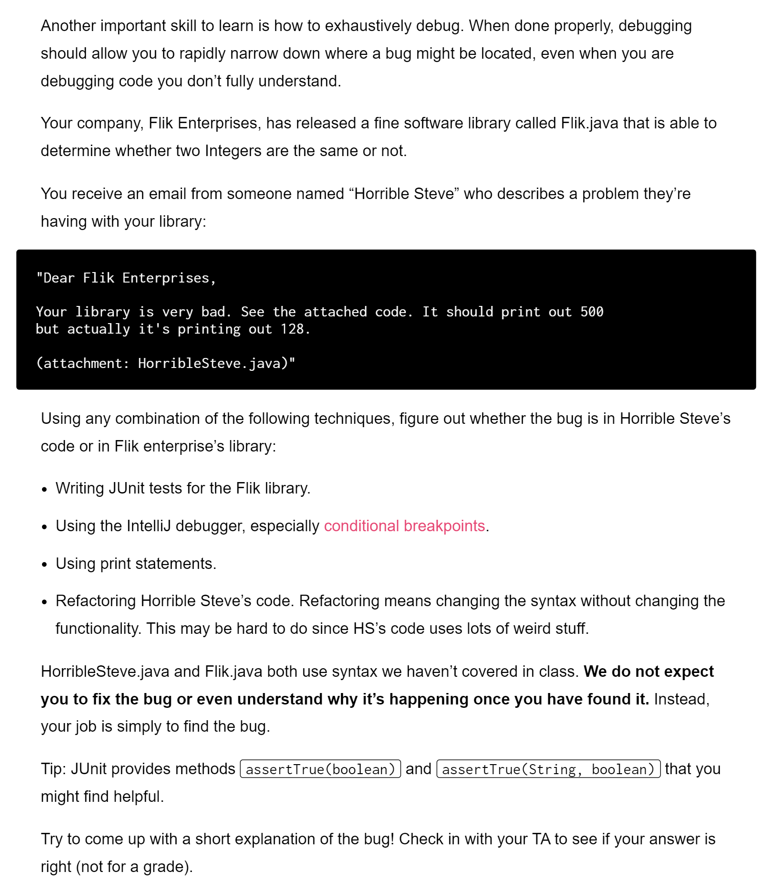
:::
```java
/** An Integer tester created by Flik Enterprises. */
public class Flik {
    public static boolean isSameNumber(Integer a, Integer b) {
        return a == b;
    }
}

public class HorribleSteve {
    public static void main(String [] args) {
        int i = 0;
        for (int j = 0; i < 500; ++i, ++j) {
            if (!Flik.isSameNumber(i, j)) {
                break; // break exits the for loop!
            }
        }
        System.out.println("i is " + i);
    }
}

```
**Solution**[https://blog.csdn.net/chengzhezhijian/article/details/9628251](https://blog.csdn.net/chengzhezhijian/article/details/9628251)
在-128~127的Integer值并且以Integer x = value;的方式赋值的Integer值在进行==和equals比较时，都会返回true，因为Java里面对处在在-128~127之间的Integer值，用的是原生数据类型int，会在内存里供重用，也就是说这之间的Integer值进行==比较时只是进行int原生数据类型的数值比较，而超出-128~127的范围，进行==比较时是进行地址及数值比较。
```java
Integer a = 127;
Integer b = 127;
System.out.println(a == b); // true
Integer a = 128;
Integer b = 128;
System.out.println(a == b); // false
```

## Running the CS61B Style Checker
>[https://sp18.datastructur.es/materials/guides/style-guide](https://sp18.datastructur.es/materials/guides/style-guide)
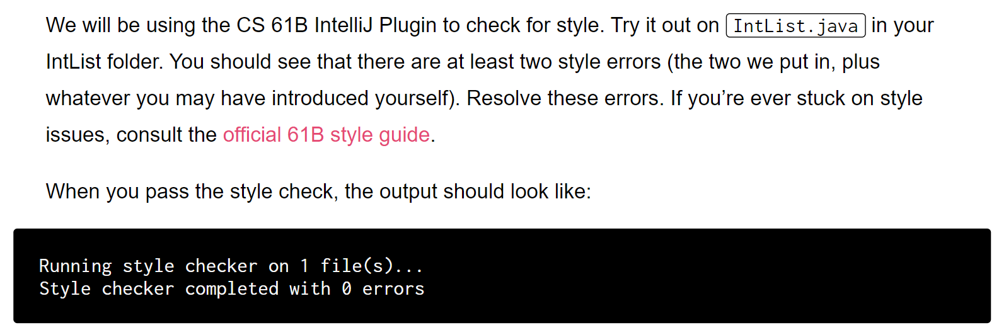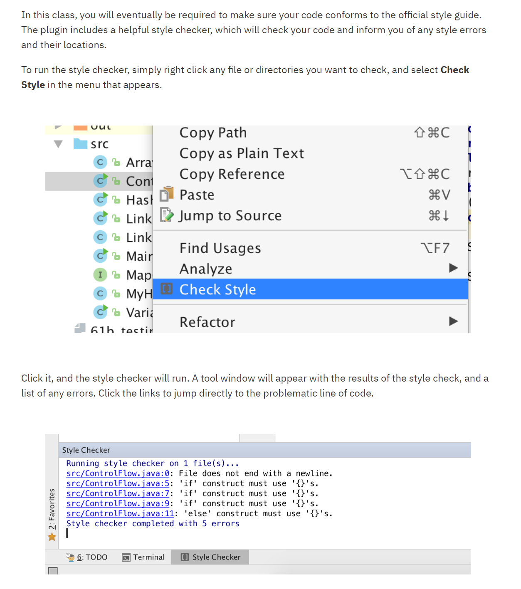


# Submission
>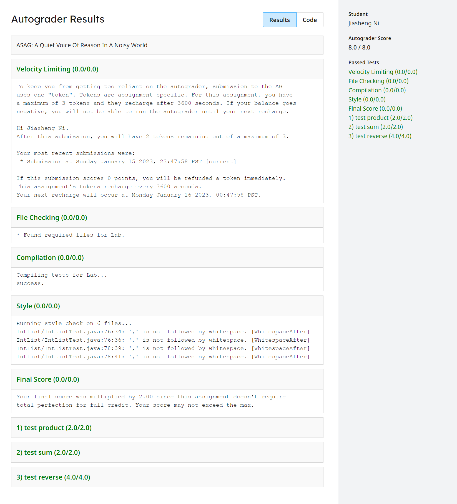


