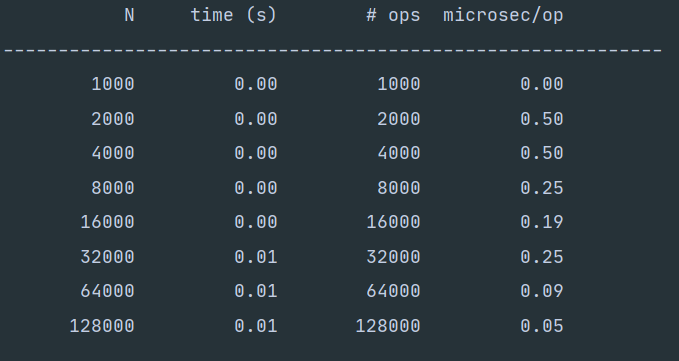

[Lab 3_ Timing Tests and Randomized Comparison Tests _ CS 61B Spring 2021.pdf](https://www.yuque.com/attachments/yuque/0/2023/pdf/12393765/1673875251939-68bcbf37-222e-4dd7-aa92-9d9f466493ed.pdf)
[lab3.zip](https://www.yuque.com/attachments/yuque/0/2023/zip/12393765/1673875274155-66978170-2d18-4aa9-bdbd-a89fa5015247.zip)
:::info
**Recap:** [AList Resizing Efficiency](https://www.yuque.com/alexman/ac5oth/iv95ny4xk6hf7ebg#Ld3Gq)
**Prereq:** P1801A
:::


# Timing the bad AList Resizing
```java
package timingtest;

/** Array based list.
 *  @author Josh Hug
 */

//         0 1  2 3 4 5 6 7
// items: [6 9 -1 2 0 0 0 0 ...]
// size: 5

/* Invariants:
 addLast: The next item we want to add, will go into position size
 getLast: The item we want to return is in position size - 1
 size: The number of items in the list should be size.
*/

public class AList<Item> {
    private Item[] items;
    private int size;

    /** Creates an empty list. */
    public AList() {
        items = (Item[]) new Object[100];
        size = 0;
    }

    /** Resizes the underlying array to the target capacity. */
    private void resize(int capacity) {
        Item[] a = (Item[]) new Object[capacity];
        System.arraycopy(items, 0, a, 0, size);
        items = a;
    }

    /** Inserts X into the back of the list. */
    public void addLast(Item x) {
        if (size == items.length) {
            resize(size + 1);
        }

        items[size] = x;
        size = size + 1;
    }

    /** Returns the item from the back of the list. */
    public Item getLast() {
        return items[size - 1];
    }
    /** Gets the ith item in the list (0 is the front). */
    public Item get(int i) {
        return items[i];
    }

    /** Returns the number of items in the list. */
    public int size() {
        return size;
    }

    /** Deletes item from back of the list and
      * returns deleted item. */
    public Item removeLast() {
        Item x = getLast();
        items[size - 1] = null;
        size = size - 1;
        return x;
    }
}
```
## Basics
:::info

**Desc:**

- The first column `N` gives the size of the data structure (how many elements it contains). 
- The second column `time (s)` gives the time required to complete all operations. 
- The third column `# ops` gives the number of calls to addLast made during the timing experiment. 
- The fourth column `microsec/op` gives the number of microseconds it took on average to complete each call to `addLast`. 

**Remarks:**

1. Note that for this experiment, `N` and `# ops` is redundant, since the result of making 128,000 calls to addLast will result in an N of 128,000.
2. The **important thing** to notice here is that **addLast is not “constant time”.** That is, the time it takes each addLast call to complete varies significantly with the size of the list: 374.30 microseconds when the list is long, and only 0.20 microseconds when the list is short
3. You might notice that the time per addLast operation is the same for `N = 1000` and `N = 2000`. This is **common for timing tests. **For small inputs, results are unreliable for two reasons: 
   1. The variance in runtime is high (due to issues like caching, process switching, branch prediction, etc. which you’ll learn about if you take 61C) 
   2. The accuracy of our timer (milliseconds) is insufficient to resolve the difference between `N = 1000` and `N = 2000`. This can even lead to the runtime for `N = 1000` being greater than that of `N = 2000`. 
4. **For this reason, when we run empirical timing tests, we want to focus on the behavior for large N, e.g. N = 32000 vs N = 64000.**
5. Another thing you may notice is that the times you get from this table for your machine may be much different than what is written above. That’s okay, as long as the _general trend_ is the same.** In 61C, you will see exactly why the same code may take vastly different amounts of time on different hardware.** In 61B (and in most theory-based classes) we are only concerned with general trends, which mask non-idealities like the type of processor you are using. While reasoning about “general trends” may seem tricky, we will learn a formalism for this later in the course (asymptotics). For now, use your intuition!
:::


## Task
:::info

`StopWatch`本质上和`Python`中的`time.time()`的用法类似:

:::
```java
package timingtest;
import edu.princeton.cs.algs4.Stopwatch;

/**
 * Created by hug.
 */
public class TimeAList {
    private static void printTimingTable(AList<Integer> Ns, AList<Double> times, AList<Integer> opCounts) {
        System.out.printf("%12s %12s %12s %12s\n", "N", "time (s)", "# ops", "microsec/op");
        System.out.printf("------------------------------------------------------------\n");
        for (int i = 0; i < Ns.size(); i += 1) {
            int N = Ns.get(i);
            double time = times.get(i);
            int opCount = opCounts.get(i);
            double timePerOp = time / opCount * 1e6;
            System.out.printf("%12d %12.2f %12d %12.2f\n", N, time, opCount, timePerOp);
        }
    }

    public static void main(String[] args) {
        timeAListConstruction();
    }

    public static void timeAListConstruction() {
        // TODO: YOUR CODE HERE
    }
}

```
```java
 public static void timeAListConstruction() {
        // TODO: YOUR CODE HERE
        int[] Nparameters = new int[]{1000,2000,4000,8000,16000,32000,64000,128000};
        AList<Integer> tested = new AList<>();
        AList<Integer> Ns = new AList<>();
        AList<Double> times = new AList<>();
        AList<Integer> opCounts = new AList<>();
        for(int x: Nparameters){
            Ns.addLast(x);
            opCounts.addLast(x);
            Stopwatch sw = new Stopwatch();
            for(int i=0; i< x; i++){
                tested.addLast(1);
            }
            double es = sw.elapsedTime();
            times.addLast(es);
        }
        printTimingTable(Ns, times, opCounts);
    }
```
**Program Output**


# Timing the good AList Resizing 
## Task
:::info

:::
```java
package timingtest;

/** Array based list.
 *  @author Josh Hug
 */

//         0 1  2 3 4 5 6 7
// items: [6 9 -1 2 0 0 0 0 ...]
// size: 5

/* Invariants:
 addLast: The next item we want to add, will go into position size
 getLast: The item we want to return is in position size - 1
 size: The number of items in the list should be size.
*/

public class AList<Item> {
    private Item[] items;
    private int size;
    private int REFACTOR = 2;

    /** Creates an empty list. */
    public AList() {
        items = (Item[]) new Object[100];
        size = 0;
    }

    /** Resizes the underlying array to the target capacity. */
    private void resize(int capacity) {
        Item[] a = (Item[]) new Object[capacity];
        System.arraycopy(items, 0, a, 0, size);
        items = a;
    }

    /** Inserts X into the back of the list. */
    public void addLast(Item x) {
        if (size == items.length) {
            resize(size * REFACTOR); //TODO: change the code here
        }

        items[size] = x;
        size = size + 1;
    }

    /** Returns the item from the back of the list. */
    public Item getLast() {
        return items[size - 1];
    }
    /** Gets the ith item in the list (0 is the front). */
    public Item get(int i) {
        return items[i];
    }

    /** Returns the number of items in the list. */
    public int size() {
        return size;
    }

    /** Deletes item from back of the list and
      * returns deleted item. */
    public Item removeLast() {
        Item x = getLast();
        items[size - 1] = null;
        size = size - 1;
        return x;
    }
}
```
```java
package timingtest;

/** Array based list.
 *  @author Josh Hug
 */

//         0 1  2 3 4 5 6 7
// items: [6 9 -1 2 0 0 0 0 ...]
// size: 5

/* Invariants:
 addLast: The next item we want to add, will go into position size
 getLast: The item we want to return is in position size - 1
 size: The number of items in the list should be size.
*/

public class AList<Item> {
    private Item[] items;
    private int size;
    private double REFACTOR = 2.3; //TODO add the refactor

    /** Creates an empty list. */
    public AList() {
        items = (Item[]) new Object[100];
        size = 0;
    }

    /** Resizes the underlying array to the target capacity. */
    private void resize(int capacity) {
        Item[] a = (Item[]) new Object[capacity];
        System.arraycopy(items, 0, a, 0, size);
        items = a;
    }

    /** Inserts X into the back of the list. */
    public void addLast(Item x) {
        if (size == items.length) {
            resize((int) Math.round(size * REFACTOR)); //TODO: change the code here
        }

        items[size] = x;
        size = size + 1;
    }

    /** Returns the item from the back of the list. */
    public Item getLast() {
        return items[size - 1];
    }
    /** Gets the ith item in the list (0 is the front). */
    public Item get(int i) {
        return items[i];
    }

    /** Returns the number of items in the list. */
    public int size() {
        return size;
    }

    /** Deletes item from back of the list and
      * returns deleted item. */
    public Item removeLast() {
        Item x = getLast();
        items[size - 1] = null;
        size = size - 1;
        return x;
    }
}

```
**Test Result**Refactor = 2

Refactor = 2.3


# Timing the getLast method of SLList
## Task
:::info

:::
```java
package timingtest;
import edu.princeton.cs.algs4.Stopwatch;

/**
 * Created by hug.
 */
public class TimeSLList {
    private static void printTimingTable(AList<Integer> Ns, AList<Double> times, AList<Integer> opCounts) {
        System.out.printf("%12s %12s %12s %12s\n", "N", "time (s)", "# ops", "microsec/op");
        System.out.printf("------------------------------------------------------------\n");
        for (int i = 0; i < Ns.size(); i += 1) {
            int N = Ns.get(i);
            double time = times.get(i);
            int opCount = opCounts.get(i);
            double timePerOp = time / opCount * 1e6;
            System.out.printf("%12d %12.2f %12d %12.2f\n", N, time, opCount, timePerOp);
        }
    }

    public static void main(String[] args) {
        timeGetLast();
    }

    public static void timeGetLast() {
        // TODO: YOUR CODE HERE
    }

}

```
```java
public static void timeGetLast() {
        // TODO: YOUR CODE HERE
        int[] Nparameters = new int[]{1000,2000,4000,8000,16000,32000,64000,128000};
        SLList<Integer> tested = new SLList<>();
        AList<Integer> Ns = new AList<>();
        AList<Double> times = new AList<>();
        AList<Integer> opCounts = new AList<>();
        int opCountN = 10000;
        for(int x: Nparameters){
            Ns.addLast(x);
            opCounts.addLast(opCountN);
            for(int i=0; i<x; i++){
                tested.addLast(1);
            }
            Stopwatch sw = new Stopwatch();
            for(int i=0; i< opCountN; i++){
                tested.getLast();
            }
            double es = sw.elapsedTime();
            times.addLast(es);
        }
        printTimingTable(Ns, times, opCounts);
    }
```
**Program Output**


# Randomized Comparison Tests
## Simple Comparison Test
### Basics
:::info

:::

### Task
:::info

:::
```java
package randomizedtest;

import edu.princeton.cs.algs4.StdRandom;
import org.junit.Test;
import static org.junit.Assert.*;

/**
 * Created by hug.
 */
public class TestBuggyAList {
  // YOUR TESTS HERE
    
}
```
```java
package randomizedtest;

import edu.princeton.cs.algs4.StdRandom;
import org.junit.Test;
import static org.junit.Assert.*;

/**
 * Created by hug.
 */
public class TestBuggyAList {
  // YOUR TESTS HERE
    @Test
    public void testThreeAddThreeRemove(){
        AListNoResizing<Integer> alist = new AListNoResizing<>();
        BuggyAList<Integer> blist = new BuggyAList<>();


        // Add for both
        for(int i=0; i<100;i++){
            alist.addLast(i);
            blist.addLast(i);
        }


        // remove for both
        assertEquals(alist.removeLast(), blist.removeLast());
        assertEquals(alist.removeLast(), blist.removeLast());
    }
}
```
```java
@Test
public void testThreeAddThreeRemove2() {
    AListNoResizing<Integer> correct = new AListNoResizing<>();
    BuggyAList<Integer> broken = new BuggyAList<>();

    correct.addLast(5);
    correct.addLast(10);
    correct.addLast(15);

    broken.addLast(5);
    broken.addLast(10);
    broken.addLast(15);

    assertEquals(correct.size(), broken.size());

    assertEquals(correct.removeLast(), broken.removeLast());
    assertEquals(correct.removeLast(), broken.removeLast());
    assertEquals(correct.removeLast(), broken.removeLast());
}
```


## Randomized Function Calls
:::info

:::
```java
@Test
public void randomizedTest(){
    AListNoResizing<Integer> L = new AListNoResizing<>();

    int N = 500;
    for (int i = 0; i < N; i += 1) {
        int operationNumber = StdRandom.uniform(0, 2);
        if (operationNumber == 0) {
            // addLast
            int randVal = StdRandom.uniform(0, 100);
            L.addLast(randVal);
            System.out.println("addLast(" + randVal + ")");
        } else if (operationNumber == 1) {
            // size
            int size = L.size();
            System.out.println("size: " + size);
        }
    }
}
```


## Conditional Breakpoints(Skipped)
:::info

:::


## Adding More Randomized Calls
:::info

:::
```java
@Test
public void randomizedTest(){
    AListNoResizing<Integer> L = new AListNoResizing<>();

    int N = 500;
    for (int i = 0; i < N; i += 1) {
        int operationNumber = StdRandom.uniform(0, 4);
        if (operationNumber == 0) {
            // addLast
            int randVal = StdRandom.uniform(0, 100);
            L.addLast(randVal);
            System.out.println("addLast(" + randVal + ")");
        } else if (operationNumber == 1) {
            // size
            int size = L.size();
            System.out.println("size: " + size);
        }  else if (operationNumber == 2 && L.size() > 0) {
            // last
            int last = L.removeLast();
            System.out.println("removelast: " + last);
        } else if (operationNumber == 3 && L.size() > 0) {
            // last
            int last = L.getLast();
            System.out.println("getlast: " + last);
        }
    }
}
```


## Adding Randomized Comparisons
:::info

:::
```java
@Test
public void randomizedTest(){
    AListNoResizing<Integer> L = new AListNoResizing<>();
    BuggyAList<Integer> B = new BuggyAList<>();

    int N = 500;  // set to 5000 later
    for (int i = 0; i < N; i += 1) {
        int operationNumber = StdRandom.uniform(0, 4);
        if (operationNumber == 0) {
            // addLast
            int randVal = StdRandom.uniform(0, 100);
            L.addLast(randVal);
            B.addLast(randVal);
            System.out.println("addLast A(" + randVal + ")");
            System.out.println("addLast B(" + randVal + ")");
        } else if (operationNumber == 1) {
            // size
            int sizeA = L.size();
            int sizeB = B.size();
            System.out.println("sizeA: " + sizeA);
            System.out.println("sizeB: " + sizeB);
            assertEquals(sizeA, sizeB);
        }  else if (operationNumber == 2 && L.size() > 0) {
            // last
            int lastA = L.removeLast();
            int lastB = B.removeLast();
            System.out.println("removelastA: " + lastA);
            System.out.println("removelastB: " + lastB);
            assertEquals(lastA, lastB);
        } else if (operationNumber == 3 && L.size() > 0) {
            // last
            int lastA = L.getLast();
            int lastB = B.getLast();
            System.out.println("getlastA: " + lastA);
            System.out.println("getlastB: " + lastB);
            assertEquals(lastA, lastB);
        }
    }
```


## Running our Randomized Test
:::info

**Debate:** [https://news.ycombinator.com/item?id=24349522](https://news.ycombinator.com/item?id=24349522)
:::
**Program Output**


## Fixing the Bug and Execution Breakpoints
**Guidelines**
**Program Output**
**Execution Breakpoints&Output**
The reason is that the paramter we pass into the resize function. It should be `items.length / 4`instead of `size / 4`。


# Submission
:::info

:::

