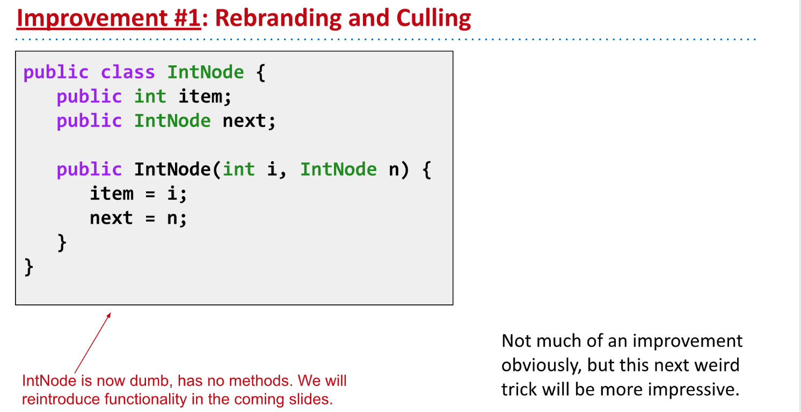
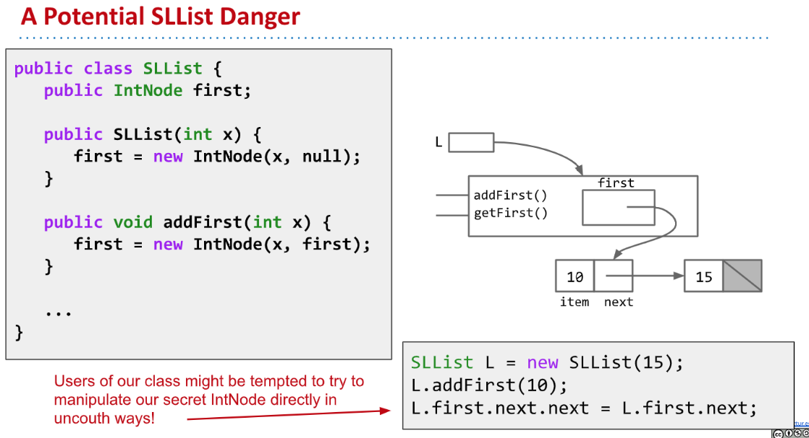
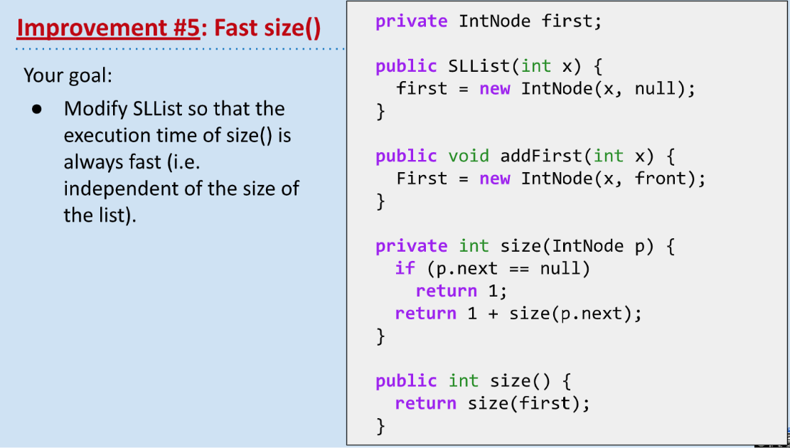
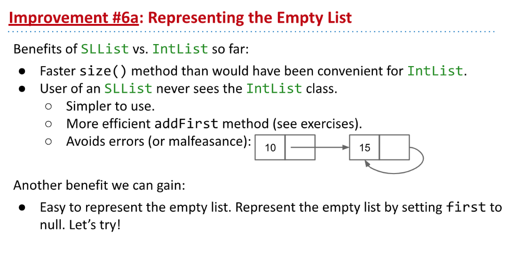
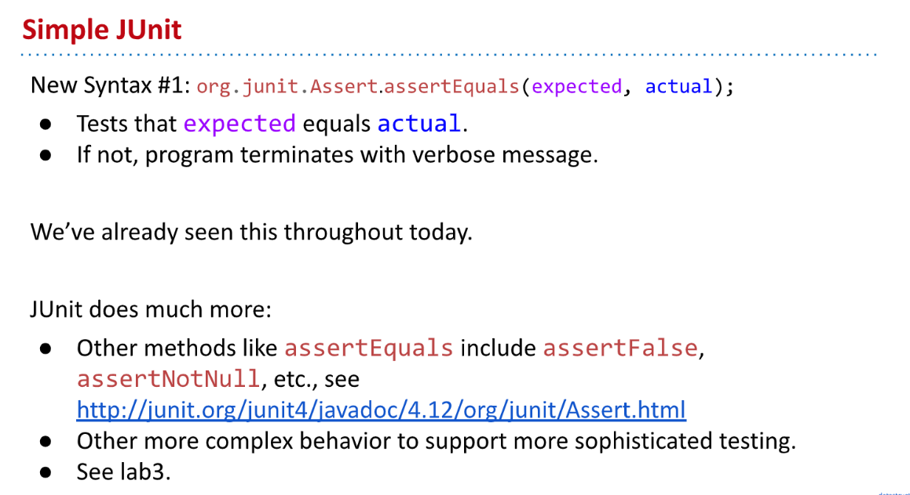

> Ch 2.1 ~2.5
> **Java Visualizer:** [Java Visualizer](https://cscircles.cemc.uwaterloo.ca//java_visualize/#mode=display)


# 1 Mystery of the Walrus
[cs61b 2018 lec3 lists1, references and recursion.pdf](https://www.yuque.com/attachments/yuque/0/2023/pdf/12393765/1673610297977-576d0f39-affb-46ec-9d7c-645909819003.pdf)
## Primitives and References
### Primitive Types
> 

```java
public class PollQuestions {
   public static void main(String[] args) {
      Walrus a = new Walrus(1000, 8.3);
      Walrus b;
      b = a;
      b.weight = 5;
      System.out.println(a);
      System.out.println(b);      

      int x = 5;
      int y;
      y = x;
      x = 2;
      System.out.println("x is: " + x);
      System.out.println("y is: " + y);      
   }
   
   public static class Walrus {
      public int weight;
      public double tuskSize;
      
      public Walrus(int w, double ts) {
         weight = w;
         tuskSize = ts;
      }

      public String toString() {
         return String.format("weight: %d, tusk size: %.2f", weight, tuskSize);
      }
   }
}
```
**Output**


### Bits
> 


### GROE for Primitives
> [https://cscircles.cemc.uwaterloo.ca//java_visualize/#mode=display](https://cscircles.cemc.uwaterloo.ca//java_visualize/#mode=display)


### Reference Types & Class Instantiation
> 


### Reference Type Declarations
> 
> `Reference Type`在初始化的时候都会被分配`64 bits`的空间(用来存放指向堆内存中的对象的指针)。
> When we _declare_ a variable of any reference type (Walrus, Dog, Planet, array, etc.), Java allocates a box of 64 bits, no matter what type of object.


### GROE for References
> 


## Parameter Passing
> 


## Summary on GROE
### Summary
> 


### Exercise
> 

```java
public class PassByValueFigure {
    public static void main(String[] args) {
           Walrus walrus = new Walrus(3500, 10.5);
           int x = 9;

           doStuff(walrus, x);
           System.out.println(walrus);
           System.out.println(x);
    }

    public static void doStuff(Walrus W, int x) {
           W.weight = W.weight - 100;
           x = x - 5;
    }
}
```
**Output**


## Instantiation of Arrays
### Declarations
> 


### Assignments
> 


## IntList& Linked Data Structures
> **Recap from CS61A：**[Recursive Objects](https://www.yuque.com/alexman/ac5oth/vhufybtlmzu58gop#HKEpH)

### Basics& Implementations
> 

```java
/**
 * Created by AlexMan
 */
public class IntList {
    public int first;
    public IntList rest;

    public IntList(int f, IntList r){
        first = f;
        rest = r;
    }

    public static void main(String[] args) {
        IntList L = new IntList(5, null);
        L.rest = new IntList(10, null);
        L.rest.rest = new IntList(15, null);
//        IntList L = new IntList(15, null);
//        L = new IntList(10, L);
//        L = new IntList(5, L);
    }
}
```


### Null Values
> 


### Size and IterativeSize Methods
> 

```java
/**
 * Created by AlexMan
 */
public class IntList {
    public int first;
    public IntList rest;

    /**
     * Constructor
     * @param f element
     * @param r IntList
     */
    public IntList(int f, IntList r){
        first = f;
        rest = r;
    }

    /**
     * Recursive implementation of linked list size
     * @return the size of the list
     */
    public int size(){
        if(this.rest == null){
            return 1;
        }else{
            return 1 + this.rest.size();
        }
    }

    /**
     * Iterative implementation of linked list size
     * @return the size of the list
     */
    public int iterativeSize(){
        IntList p = this;
        int size = 0;
        while (p != null){
            size += 1;
            p = p.rest;
        }
        return size;
    }


    public static void main(String[] args) {
        IntList L = new IntList(5, null);
        L.rest = new IntList(10, null);
        L.rest.rest = new IntList(15, null);
        System.out.println(L.size());
        System.out.println(L.iterativeSize());
    }
}

```


### get Method Exercises
> 

```java
package Chapter_2_1;

/**
 * Created by AlexMan
 */
public class IntList {
    public int first;
    public IntList rest;

    /**
     * Constructor
     * @param f element
     * @param r IntList
     */
    public IntList(int f, IntList r){
        first = f;
        rest = r;
    }

    /**
     * Recursive implementation of linked list size
     * @return the size of the list
     */
    public int size(){
        if(this.rest == null){
            return 1;
        }else{
            return 1 + this.rest.size();
        }
    }

    /**
     * Iterative implementation of linked list size
     * @return the size of the list
     */
    public int iterativeSize(){
        IntList p = this;
        int size = 0;
        while (p != null){
            size += 1;
            p = p.rest;
        }
        return size;
    }

    /**
     * Recursive Implementation
     * @param i
     * @return size of linked list
     */
    public int get(int i){
        if(this.rest == null){
            return -1;
        }else if(i == 0){
            return this.first;
        }else{
            return this.rest.get(i-1);
        }
    }

    /**
     * Iterative Implementation
     * @param i
     * @return size of linked list
     */
    public int getIterative(int i){
         IntList p = this;
        while(i > 0){
            if(p == null){
                break;
            }else{
                p = p.rest;
                i --;
            }
        }
        if(p == null){
            return -1;
        }
        return p.first;
    }


    public static void main(String[] args) {
        IntList L = new IntList(5, null);
        L.rest = new IntList(10, null);
        L.rest.rest = new IntList(15, null);
        System.out.println(L.size());  // 3
        System.out.println(L.iterativeSize()); // 3
        System.out.println(L.get(1));  // 10
        System.out.println(L.getIterative(1)); //10
        System.out.println(L.get(3));  // -1
        System.out.println(L.getIterative(3));  // -1
    }
}
```


### Extra Exercises
> 

```java
/**
 * Created by AlexMan
 */
public class IntList {
    public int first;
    public IntList rest;

    /**
     * Constructor
     * @param f element
     * @param r IntList
     */
    public IntList(int f, IntList r){
        first = f;
        rest = r;
    }

    /**
     * Recursive implementation of linked list size
     * @return the size of the list
     */
    public int size(){
        if(this.rest == null){
            return 1;
        }else{
            return 1 + this.rest.size();
        }
    }

    /**
     * Iterative implementation of linked list size
     * @return the size of the list
     */
    public int iterativeSize(){
        IntList p = this;
        int size = 0;
        while (p != null){
            size += 1;
            p = p.rest;
        }
        return size;
    }

    /**
     * Recursive Implementation
     * @param i
     * @return size of linked list
     */
    public int get(int i){
        if(this.rest == null){
            return -1;
        }else if(i == 0){
            return this.first;
        }else{
            return this.rest.get(i-1);
        }
    }

    /**
     * Iterative Implementation
     * @param i
     * @return size of linked list
     */
    public int getIterative(int i){
        IntList p = this;
        while(i > 0){
            if(p == null){
                break;
            }else{
                p = p.rest;
                i --;
            }
        }
        if(p == null){
            return -1;
        }
        return p.first;
    }

    /**
     * Returns an IntList identical to L, but with all values incremented by x.(Non Mutated)
     * @param L
     * @param x
     * @return An IntList identical to L, but with all values incremented by x.
     */
    public static IntList incrList(IntList L, int x){
        if(L == null){
            return L;
        }else{
            return new IntList(L.first + x, incrList(L.rest, x));
        }
    }


    /**
     * Returns an IntList identical to L, but with all values incremented by x.(Mutated)
     * @param L
     * @param x
     * @return
     */
    public static IntList dincriList(IntList L, int x){
        if(L == null){
            return L;
        }
        L.first -= x;
        dincriList(L.rest, x);
        return L;
    }


    /**
     * Helper Function to print the linked list.
     * @return
     */
    public String strLinkedList(){
        if(this.rest == null){
            return String.valueOf(this.first);
        }else{
            return String.valueOf(this.first) + "->" + this.rest.strLinkedList();
        }
    }


    public static void main(String[] args) {
        IntList L = new IntList(5, null);
        L.rest = new IntList(10, null);
        L.rest.rest = new IntList(15, null);
        System.out.println(L.strLinkedList());
        IntList L1 = IntList.incrList(L, 2);
        System.out.println(L1.strLinkedList());
        IntList.dincriList(L1, 3);
        System.out.println(L1.strLinkedList());
    }
}

```


# 2 SLLists⭐⭐⭐
[cs61b lec4 2018 lists2, sllists.pdf](https://www.yuque.com/attachments/yuque/0/2023/pdf/12393765/1673662944455-96bfea96-ce65-41b1-8e83-dbb582d5e56f.pdf)


## Naked Recursive DS
> 
> Java doesn't favor naked recursive essence of data structure.


## Improvements Upon IntList
### Rebranding
> 

```java
/**
 * Created by AlexMan
 */
public class IntNode {
    public int item;
    public IntNode next;

    public IntNode(int i, IntNode n){
        item = i;
        next = n;
    }
}
```


### Bureaucracy
> 


### addFirst& getFirst
> 

```java
/**
 * Created by AlexMan
 * An SLList is a list of integers, which hides the terrible truth
 * of the nakedness within.
 */
public class SLList {
    public IntNode first;

    public SLList(int x){
        first = new IntNode(x, null);
    }

    /**
     * Append a new node at the front of the SLList
     * @param i
     */
    public void addFirst(int i){
        IntNode newHead = new IntNode(i, first);
        first = newHead;
    }

    /**
     * Return the first item.
     * @return
     */
    public int getFirst(){
        return first.item;
    }


    /**
     * Return the string representation of the SLList
     * @return
     */
    public String printList(){
        IntNode s = first;
        String res = "";
        while(s != null){
            if(s.next !=null){
                res += String.valueOf(s.item) + "->";
            }else{
                res += String.valueOf(s.item);
            }
            s = s.next;
        }
        return res;
    }


    public static void main(String[] args) {
        /* Create a list of one integer, namely 10*/
        SLList L = new SLList(10);
        L.addFirst(20);
        L.addFirst(30);
        System.out.println(L.printList());  // 30 -> 20 -> 10
        System.out.println(L.getFirst());  // 30
    }


}

```
### 

## SLLists vs IntLists
> 


## Improvements - Access Control
### SLList Danger
> 


### Private Keyword
:::info

:::
```java
/**
 * Created by AlexMan
 * An SLList is a list of integers, which hides the terrible truth
 * of the nakedness within.
 */
public class SLList {
    private IntNode first;

    public SLList(int x){
        first = new IntNode(x, null);
    }

    /**
     * Append a new node at the front of the SLList
     * @param i
     */
    public void addFirst(int i){
        IntNode newHead = new IntNode(i, first);
        first = newHead;
    }

    /**
     * Return the first item.
     * @return
     */
    public int getFirst(){
        return first.item;
    }


    /**
     * Return the string representation of the SLList
     * @return
     */
    public String printList(){
        IntNode s = first;
        String res = "";
        while(s != null){
            if(s.next !=null){
                res += String.valueOf(s.item) + "->";
            }else{
                res += String.valueOf(s.item);
            }
            s = s.next;
        }
        return res;
    }


    public static void main(String[] args) {
        /* Create a list of one integer, namely 10*/
        SLList L = new SLList(10);
        L.addFirst(20);
        L.addFirst(30);
        System.out.println(L.printList());  // 30 -> 20 -> 10
        System.out.println(L.getFirst());  // 30
    }
}
```


## Improvements - Nested Class⭐⭐⭐
### Nested Class
:::info

:::
```java
/**
 * Created by AlexMan
 * An SLList is a list of integers, which hides the terrible truth
 * of the nakedness within.
 */
public class SLList {
    private IntNode first;

    /**
	 * 这里IntNode不需要访问SLList实例化对象中的任何属性和方法，所以推荐使用static
	*/
    private static class IntNode {
        public int item;
        public IntNode next;

        public IntNode(int i, IntNode n){
            item = i;
            next = n;
        }
    }

    public SLList(int x){
        first = new IntNode(x, null);
    }

    /**
     * Append a new node at the front of the SLList
     * @param i
     */
    public void addFirst(int i){
        IntNode newHead = new IntNode(i, first);
        first = newHead;
    }

    /**
     * Return the first item.
     * @return
     */
    public int getFirst(){
        return first.item;
    }


    /**
     * Return the string representation of the SLList
     * @return
     */
    public String printList(){
        IntNode s = first;
        String res = "";
        while(s != null){
            if(s.next !=null){
                res += String.valueOf(s.item) + "->";
            }else{
                res += String.valueOf(s.item);
            }
            s = s.next;
        }
        return res;
    }


    public static void main(String[] args) {
        /* Create a list of one integer, namely 10*/
        SLList L = new SLList(10);
        L.addFirst(20);
        L.addFirst(30);
        System.out.println(L.printList());  // 30 -> 20 -> 10
        System.out.println(L.getFirst());  // 30
    }
}
```


### addLast()& size()
:::info

:::
```java
  /**
     * Append an item at the end of the SLList
     * @param i
     */
    public void addLast(int i){
        IntNode p = first;
        while(p.next != null){
            p = p.next;
        }
        p.next = new IntNode(i, null);
    }

```
```java
 /**
     * Return the size 
     */
    public int size(){
        IntNode p = first;
        int size = 0;
        while(p!=null){
            size += 1;
            p = p.next;
        }
        return size;
    }
```
```java
   /** Returns the size of the list starting at IntNode p. */
    private static int size(IntNode p) {
        if (p.next == null) {
            return 1;
        }

        return 1 + size(p.next);
    }

    public int size() {
        return size(first);
    }
```
**Remark on overloading**


## Improvements - Caching
:::info
以上所有的`Improvements`对于`SLList`实际的数据存取都没有效率上的提升，仅仅是优化了实现结构，尤其是上面的`addLast()`和`size()`, 都需要遍历完整个`SLList`才能得出结果，而下面的`Improvements`将注重这些方法执行的`Efficiency`。
:::


### Efficiency of size() method
:::info

时间成线性增长，于是选$c$, 参考`CS61A`中的介绍：

:::


### Fast size
:::info

:::
```java
/**
 * Created by AlexMan
 * An SLList is a list of integers, which hides the terrible truth
 * of the nakedness within.
 */
public class SLList {
    private IntNode first;
    private int size;

    private static class IntNode {
        public int item;
        public IntNode next;

        public IntNode(int i, IntNode n){
            item = i;
            next = n;
        }
    }

    public SLList(int x){
        first = new IntNode(x, null);
        size = 1;
    }

    /**
     * Append a new node at the front of the SLList
     * @param i
     */
    public void addFirst(int i){
        IntNode newHead = new IntNode(i, first);
        first = newHead;
        size += 1;
    }

    /**
     * Return the first item.
     * @return
     */
    public int getFirst(){
        return first.item;
    }


    /**
     * Return the string representation of the SLList
     * @return
     */
    public String printList(){
        IntNode s = first;
        String res = "";
        while(s != null){
            if(s.next !=null){
                res += String.valueOf(s.item) + "->";
            }else{
                res += String.valueOf(s.item);
            }
            s = s.next;
        }
        return res;
    }

    /**
     * Append an item at the end of the SLList
     * @param i
     */
    public void addLast(int i){
        IntNode p = first;
        while(p.next != null){
            p = p.next;
        }
        p.next = new IntNode(i, null);
        size += 1;
    }

    
    public int size() {
        return size;
    }

    public static void main(String[] args) {
        /* Create a list of one integer, namely 10*/
        SLList L = new SLList(10);
        L.addFirst(20);
        L.addFirst(30);
        System.out.println(L.printList());  // 30 -> 20 -> 10
        System.out.println(L.getFirst());  // 30
        System.out.println(L.size());  // 3
    }
}

```


## Improvements - The Empty List
### Modify the addLast Logic
:::info

:::
```java
   /**
     * Modified addLast, starting from null list
     * @param i
     */
    public void addLast(int i){
        IntNode p = first;
    	// Fixing the logic
        if(p == null) {
            first = new IntNode(i, null);
        }else{
            while(p.next != null){
                p = p.next;
            }
            p.next = new IntNode(i, null);
        }
        size += 1;
    }
```


### Using Sentinel Nodes
:::info

`Josh Hog says: "Sentinel thinks, I didn't contain anything, so just access my .next, pretty fun here!"`
:::
```java
/**
 * Created by AlexMan
 * An SLList is a list of integers, which hides the terrible truth
 * of the nakedness within.
 */
public class SLList {
    private IntNode sentinel;
    private int size;

    private static class IntNode {
        public int item;
        public IntNode next;

        public IntNode(int i, IntNode n){
            item = i;
            next = n;
        }
    }

    /**
     * Non-parametric constructor
     */
    public SLList(){
        // Any initialized value will do, just pick -5
        sentinel = new IntNode(-5, null);
        size = 0;
    }


    public SLList(int x){
        // Create arbitrary sentinel node
        sentinel = new IntNode(-5, null);
        // Link the first element
        sentinel.next =  new IntNode(x, null);
        size = 1;
    }

    /**
     * Append a new node at the front of the SLList
     * @param i
     */
    public void addFirst(int i){
        IntNode newHead = new IntNode(i, sentinel.next);
        sentinel.next = newHead;
        size += 1;
    }

    /**
     * Return the first item.
     * @return
     */
    public int getFirst(){
        if(size == 0){
            return -1;
        }
        return sentinel.next.item;
    }


    /**
     * Return the string representation of the SLList
     * @return
     */
    public String printList(){
        IntNode s = sentinel.next;
        String res = "";
        while(s != null){
            if(s.next !=null){
                res += String.valueOf(s.item) + "->";
            }else{
                res += String.valueOf(s.item);
            }
            s = s.next;
        }
        return res;
    }

    /**
     * Append an item at the end of the SLList, with sentinel, no modifications!
     * @param i
     */
    public void addLast(int i){
        IntNode p = sentinel;
        while(p.next != null){
            p = p.next;
        }
        p.next = new IntNode(i, null);
        size += 1;
    }


    public int size() {
        return size;
    }

    public static void main(String[] args) {
        /* Create a list of one integer, namely 10*/
        SLList L = new SLList(10);
        L.addFirst(20);
        L.addFirst(30);
        System.out.println(L.printList());  // 30 -> 20 -> 10
        System.out.println(L.getFirst());  // 30
        System.out.println(L.size());
    }
}
```


## SLList Invariants&Summary&Codes
:::info

:::
```java
/**
 * Created by AlexMan
 * An SLList is a list of integers, which hides the terrible truth
 * of the nakedness within.
 */
public class SLList {
    private IntNode sentinel;
    private int size;

    private static class IntNode {
        public int item;
        public IntNode next;

        public IntNode(int i, IntNode n){
            item = i;
            next = n;
        }
    }

    /**
     * Non-parametric constructor
     */
    public SLList(){
        // Any initialized value will do, just pick -5
        sentinel = new IntNode(-5, null);
        size = 0;
    }


    public SLList(int x){
        // Create arbitrary sentinel node
        sentinel = new IntNode(-5, null);
        // Link the first element
        sentinel.next =  new IntNode(x, null);
        size = 1;
    }

    /**
     * Append a new node at the front of the SLList
     * @param i
     */
    public void addFirst(int i){
        IntNode newHead = new IntNode(i, sentinel.next);
        sentinel.next = newHead;
        size += 1;
    }

    /**
     * Return the first item.
     * @return
     */
    public int getFirst(){
        if(size == 0){
            return -1;
        }
        return sentinel.next.item;
    }


    /**
     * Return the string representation of the SLList
     * @return
     */
    public String printList(){
        IntNode s = sentinel.next;
        String res = "";
        while(s != null){
            if(s.next !=null){
                res += String.valueOf(s.item) + "->";
            }else{
                res += String.valueOf(s.item);
            }
            s = s.next;
        }
        return res;
    }

    /**
     * Append an item at the end of the SLList, with sentinel, no modifications!
     * @param i
     */
    public void addLast(int i){
        IntNode p = sentinel;
        while(p.next != null){
            p = p.next;
        }
        p.next = new IntNode(i, null);
        size += 1;
    }


    public int size() {
        return size;
    }

    public static void main(String[] args) {
        /* Create a list of one integer, namely 10*/
        SLList L = new SLList(10);
        L.addFirst(20);
        L.addFirst(30);
        System.out.println(L.printList());  // 30 -> 20 -> 10
        System.out.println(L.getFirst());  // 30
        System.out.println(L.size());
    }
}
```


## Study Guide Exercises
:::info
**Lecture Code:** [https://github.com/Berkeley-CS61B/lectureCode-sp18/tree/master/lists2](https://github.com/Berkeley-CS61B/lectureCode-sp18/tree/master/lists2)
:::
### Complete Lecture Codes
```java
public class IntList {
	public int first;
	public IntList rest;

	public IntList(int f, IntList r) {
		first = f;
		rest = r;
	}

	/** Return the size of the list using... recursion! */
	public int size() {
		if (rest == null) {
			return 1;
		}
		return 1 + this.rest.size();
	}

	/** Return the size of the list using no recursion! */
	public int iterativeSize() {
		IntList p = this;
		int totalSize = 0;
		while (p != null) {
			totalSize += 1;
			p = p.rest;
		}
		return totalSize;
	}

	/** Returns the ith item of this IntList. */
	public int get(int i) {
		if (i == 0) {
			return first;
		}
		return rest.get(i - 1);
	}

	public static void main(String[] args) {
		IntList L = new IntList(15, null);
		L = new IntList(10, L);
		L = new IntList(5, L);

		System.out.println(L.get(100));
	}
} 
```
```java
/**
 * Created by AlexMan
 */
public class IntNode {
    public int item;
    public IntNode next;

    public IntNode(int i, IntNode n){
        item = i;
        next = n;
    }
}
```
```java
 /** An SLList is a list of integers, which hides the terrible truth
   * of the nakedness within. */
public class SLList {	
	private static class IntNode {
		public int item;
		public IntNode next;

		public IntNode(int i, IntNode n) {
			item = i;
			next = n;
			System.out.println(size);
		}
	} 

	/* The first item (if it exists) is at sentinel.next. */
	private IntNode sentinel;
	private int size;

	private static void lectureQuestion() {
		SLList L = new SLList();
		IntNode n = IntNode(5, null);
	}

	/** Creates an empty SLList. */
	public SLList() {
		sentinel = new IntNode(63, null);
		size = 0;
	}

	public SLList(int x) {
		sentinel = new IntNode(63, null);
		sentinel.next = new IntNode(x, null);
		size = 1;
	}

 	/** Adds x to the front of the list. */
 	public void addFirst(int x) {
 		sentinel.next = new IntNode(x, sentinel.next);
 		size = size + 1;
 	}

 	/** Returns the first item in the list. */
 	public int getFirst() {
 		return sentinel.next.item;
 	}

 	/** Adds x to the end of the list. */
 	public void addLast(int x) {
 		size = size + 1; 		

 		IntNode p = sentinel;

 		/* Advance p to the end of the list. */
 		while (p.next != null) {
 			p = p.next;
 		}

 		p.next = new IntNode(x, null);
 	}
 	
 	/** Returns the size of the list. */
 	public int size() {
 		return size;
 	}

	public static void main(String[] args) {
 		/* Creates a list of one integer, namely 10 */
 		SLList L = new SLList();
 		L.addLast(20);
 		System.out.println(L.size());
 	}
}
```

### Level C - Recap
#### IntList addFirst
:::info

`IntList`是通过创建了一整个原来的`IntList`, 赋值给`rest`， 这样会浪费很多空间。
:::
```java
 /**
     * Add first
     * @param i
     */
    public void addFirst(int i){
        rest = new IntList(first, rest);
        first = i;
    }
```
**Visualizer**

```java
 /**
     * Add first
     * @param i
     */
    public void addFirst(int i){
        rest = this;
        first = i;
    }
```
**Visualizer**


#### Static Keyword
:::info

判断依据就是`Nested Class`内部有没有访问外部的`Enclosing Class`中的任何属性或者方法，如果有则去掉`static`让程序通过编译器编译。
:::
```java
/** A rather contrived exercise to test your understanding of when
 nested classes may be made static. This is NOT an example of good
 class design, even after you fix the bug.

 The challenge with this file is to delete the keyword static the
 minimum number of times so that the code compiles.

 Guess before TRYING to compile, otherwise the compiler will spoil
 the problem.*/
public class Government {
    private int treasury = 5;

    private void spend() {
        treasury -= 1;
    }

    private void tax() {
        treasury += 1;
    }

    public void report() {
        System.out.println(treasury);
    }

    public static Government greaterTreasury(Government a, Government b) {
        if (a.treasury > b.treasury) {
            return a;
        }
        return b;
    }

    public static class Peasant {
        public void doStuff() {
            System.out.println("hello");
        }
    }

    public static class King {
        public void doStuff() {
            spend();
        }
    }

    public static class Mayor {
        public void doStuff() {
            tax();
        }
    }

    public static class Accountant {
        public void doStuff() {
            report();
        }
    }

    public static class Thief {
        public void doStuff() {
            treasury = 0;
        }
    }

    public static class Explorer {
        public void doStuff(Government a, Government b) {
            Government favorite = Government.greaterTreasury(a, b);
            System.out.println("The best government has treasury " + favorite.treasury);
        }
    }
}
```
```java
/** A rather contrived exercise to test your understanding of when
 nested classes may be made static. This is NOT an example of good
 class design, even after you fix the bug.

 The challenge with this file is to delete the keyword static the
 minimum number of times so that the code compiles.

 Guess before TRYING to compile, otherwise the compiler will spoil
 the problem.*/
public class Government {
    private int treasury = 5;

    private void spend() {
        treasury -= 1;
    }

    private void tax() {
        treasury += 1;
    }

    public void report() {
        System.out.println(treasury);
    }

    // No need to remove static
    public static Government greaterTreasury(Government a, Government b) {
        if (a.treasury > b.treasury) {
            return a;
        }
        return b;
    }

    // No need to remove static
    public static class Peasant {
        public void doStuff() {
            System.out.println("hello");
        }
    }

    // Remove static
    public class King {
        public void doStuff() {
            spend();
        }
    }

    // Remove static
    public class Mayor {
        public void doStuff() {
            tax();
        }
    }

    // Remove static
    public class Accountant {
        public void doStuff() {
            report();
        }
    }

    // Remove static
    public class Thief {
        public void doStuff() {
            treasury = 0;
        }
    }

    // No need to remove static
    public static class Explorer {
        public void doStuff(Government a, Government b) {
            Government favorite = Government.greaterTreasury(a, b);
            System.out.println("The best government has treasury " + favorite.treasury);
        }
    }
}
```


#### Sentinel Node
:::info

:::
**Sample Solution**Sentinel Node functions serve as an improvement on our Singly Linked Data Structure in that it saves time for us to include a corner case in `addFirst/addLast()` when the initial list is empty.
Sentinel Node is not a necessary component of our IntList since it is recursively defined and Sentinel Node is not of `IntList` class type(hard to make compatible), but is strongly recommended for `SLList`class. 

#### size
:::info

:::
**Sample Solution**Remember we have to traverse through the whole lists in order to calculate its length, which takes linear time. But having a caching variable `size` can distribute the calculation time among each `add/remove/insert` operation, making the time complexity of `size()` $O(1)$.


### Level B - SLList
#### deleteFirst
:::info

:::
```java
/**
 * Delete the first element in your SLList.
 */
public void deleteFirst(){
    if(sentinel.next == null){
        return;
    }else if(sentinel.next.next == null){
        sentinel.next = null;
    }else{
        sentinel.next = sentinel.next.next;
    }
}
```


#### instantiate from array
:::info

:::
```java
public SLList(int[] array){
    sentinel = new IntNode(-5, null);
    IntNode p = sentinel;
    for(int x: array){
        p.next = new IntNode(x, null);
        p = p.next;
        size += 1;
    }
}
```


#### Sentinel Node
:::info

:::
**Sample Solution**No. Since `null.next` would not be able to function if we want to access the first element and thus any element from the `SLList`


### Level A - IntList
#### Merge IntList⭐⭐⭐⭐⭐
:::info

:::
```java
/**
 * If 2 numbers in a row are the same, we add them together and make one large node.
 * Destructive
 */
public void dAddAdjacent(){
    if(size() == 0 || size() == 1 ){
        return;
    }else{
        IntList prev = this;
        IntList curr = this.rest;
        while(curr != null){
            // 如果相同，则合并, prev不动，curr 往后移动
            if(prev.first == curr.first){
                IntList next = curr.rest;
                prev.first += curr.first;
                prev.rest = next;
                curr = next;
            }else{
                prev = prev.rest;
                curr = curr.rest;
            }
        }
    }
}
```
```java
import org.junit.Test;
import static org.junit.Assert.*;
/**
 * Created by AlexMan
 */
public class TestIntList {


    @Test
    public void testdAddAdjacent(){
        IntList L6 = new IntList(4, null);
        IntList L5 = new IntList(3, L6);
        IntList L4 = new IntList(3, L5);
        IntList L3 = new IntList(2, L4);
        IntList L2 = new IntList(1, L3);
        IntList L1 = new IntList(1, L2);
        L1.dAddAdjacent();

        IntList M3 = new IntList(4, null);
        IntList M2 = new IntList(6, M3);
        IntList M1 = new IntList(4, M2);
        String t1 = L1.strLinkedList();
        String t2 = M1.strLinkedList();

        System.out.println(t1);
        System.out.println(t2);

        assertEquals(true, t1.equals(t2));
    }
}

```


#### *Modify IntList
:::info

:::
```java
/**
 * Modify the Intlist class so that every time you add a value
 * you “square” the IntList. For example, upon the insertion of 5,
 * the below IntList would transform from:
 *
 * 1 => 2 to 1 => 1 => 2 => 4 => 5
 * and if 7 was added to the latter IntList, it would become
 * 1 => 1 => 1 => 1 => 2 => 4 => 4 => 16 => 5 => 25 => 7
 *
 * Additionally, you are provided the constraint that you can only access
 * the size() function one time during the entire process of adding a node.
 */
public void squareList(){
    int size = size();
    if(size == 0){
        return;
    }else{
        IntList p = this;
        while(p.rest != null ){
            IntList next = p.rest;
            IntList t = new IntList(p.first * p.first, p.rest);
            p.rest = t;
            p = next;
        }
        p.rest = new IntList(p.first * p.first, null);
    }
}
```

# 3 DLLists&Arrays⭐⭐⭐⭐
[cs61b lec5 2018 lists3, dllists and arrays.pdf](https://www.yuque.com/attachments/yuque/0/2023/pdf/12393765/1673663052177-22bd671d-5c93-49c1-add9-0d9bdd80c55a.pdf)

## Recap on SLList
:::info

:::


## Improvements - AddLast&Sentinel
### Problems
:::info

:::


### Navie DLList - Drawback
:::info

:::


### Double Sentinel
:::info

:::


### Circular Sentinel
:::info

:::


## Summary on DLLists
:::info

:::

## Generic Lists - Customized Types
:::info

:::
**Remarks**⭐⭐⭐


## Arrays ⭐⭐
### Recap on memory
:::info

:::

### What is Array?
:::info

:::


### Array Creation
:::info

`new`关键字返回的是`64 bits`的`address`。
`default value`for `int` is `0`
`default value`for `reference type` is `null`
:::
**Remarks - Default Values**


### Array Access and Modification
:::info

:::
```java
/** ArrayBasics
 *  @author Josh Hug
 */

public class ArrayBasics {
    /** ArrayBasics */
    public static void main(String[] args) {
        int[] z = null;
        int[] x, y;

        x = new int[]{1, 2, 3, 4, 5};   // return the address
        y = x;                          // copy the address bits by bits (64 bit address)
        x = new int[]{-1, 2, 5, 4, 99}; // Garbage collect the original x(an address)
        y = new int[3];  // Garbage collect the original y(an address), create new arrays
                         // with default values 0.
        z = new int[0];                 // Empty Array(length 0)

        String[] s = new String[6];     // Array of String objects, default value is null
        s[4] = "ketchup";               // Assign
        s[x[3] - x[1]] = "muffins";     // Assign

        int[] b = {9, 10, 11}; 
        System.arraycopy(b, 0, x, 3, 2); // arraycopy, detailed later
    }
}
```


### ArrayCopy
:::info

:::
**Comparison with Python**
**Runtime Error on index**


## 2D Arrays in Java⭐⭐⭐⭐
:::info

`matrix = new int[4][]`创建四个`memory box`(在一个`array`中), 每个都是`64 bit address that can reference to an array to be specified.`
`matrix = new int[4][4]`创建四个`memory box`(在一个`array`中)，之后马上创建**四个**长度为`4`, 且`default value`为`0`的`array`， 并把`new`返回的`64 bit address`赋值到每一个`memory box`中。一共创建了`5`个`array`。
:::
```java
/** ArrayBasics
 *  @author Josh Hug
 */

public class ArrayBasics2 {
	/** ArrayBasics
	 */

	public static void main(String[] args) {
		int[][] pascalsTriangle;
		pascalsTriangle = new int[4][];
		int[] rowZero = pascalsTriangle[0];

		pascalsTriangle[0] = new int[]{1};
		pascalsTriangle[1] = new int[]{1, 1};
		pascalsTriangle[2] = new int[]{1, 2, 1};
		pascalsTriangle[3] = new int[]{1, 3, 3, 1};
		int[] rowTwo = pascalsTriangle[2];
		rowTwo[1] = -5;

		int[][] matrix;
		matrix = new int[4][];
		matrix = new int[4][4]; 

		int[][] pascalAgain = new int[][]{{1}, {1, 1}, 
		{1, 2, 1}, {1, 3, 3, 1}};
	}
} 
```
**Visualizer**


## Arrays vs Classes
:::info

:::

## Reflection(Optional)
:::info
[https://docs.oracle.com/javase/tutorial/reflect/member/fieldValues.html](https://docs.oracle.com/javase/tutorial/reflect/member/fieldValues.html)
:::


## Study Guide Exercises
:::info
**Lecture Codes:** [https://github.com/Berkeley-CS61B/lectureCode-sp18/tree/master/lists3](https://github.com/Berkeley-CS61B/lectureCode-sp18/tree/master/lists3)
:::
### Level C
#### .last
:::info

:::
**Solution**

#### Speed up removeLast()
:::info

:::
**Solution**Using Double/Circular Sentinel

#### 2D Array of different types
:::info

:::
**Sample Solution**[https://stackoverflow.com/questions/10063354/two-dimensional-array-of-different-types](https://stackoverflow.com/questions/10063354/two-dimensional-array-of-different-types)
Basically we can, by utilizing the auto casting feature of Java, but normally we won't do that and tend to declare 2D array of only a single type.
```java
/**
 * Created by AlexMan
 */
public class SubArray {
    public static void main(String[] args) {
        Object[][] o = new Object[10][10];

        o[0][0] = 1;
        o[0][1] ="hello";

        System.out.println(o[0][0]);
        System.out.println(o[0][1]);
    }
}

```

#### Arraycopy
:::info

:::
**Solution**[https://cscircles.cemc.uwaterloo.ca//java_visualize/#mode=display](https://cscircles.cemc.uwaterloo.ca//java_visualize/#mode=display)


### Level B
#### WWPD
:::info

:::
```java
import java.util.Arrays;

/**
 * Created by AlexMan
 */
public class Deck {
    public static int[] cards;
    Deck(){
        cards = new int[]{1,3,4,10};
    }

    public static void main(String[] args) {
        Deck dingle= new Deck();
        dingle.cards[3] = 3;  // {1, 3, 4, 3}
        System.out.println(Arrays.toString(dingle.cards));
        Deck pilates = new Deck();
        pilates.cards[1] = 2; // {1, 2, 4, 10}
        System.out.println(Arrays.toString(pilates.cards));

        int[] newArrWhoDis = {2, 3, 4, 1, 3};
        dingle.cards = pilates.cards;  // {1， 2， 4， 10}
        System.out.println(Arrays.toString(dingle.cards));
        pilates.cards = newArrWhoDis; // {2, 3, 4, 1, 3}
        System.out.println(Arrays.toString(pilates.cards));
        newArrWhoDis = null;  // 仅仅是把newArrWhoDis这个memory box中储存的东西设置为null
        System.out.println(Arrays.toString(pilates.cards)); // {2, 3, 4, 1, 3}
    }
}

```


#### *DLList
:::info
**Prereq: Project 1A&Week 3**

:::


### Level A
#### IntList Testing
:::info

:::
```java
import org.junit.Test;
import static org.junit.Assert.*;
/**
 * Created by AlexMan
 */
public class TestIntList {

    @Test
    public void testDreaming(){
        int[] temp = {1, 2, 3, 4, 5};
        IntList L1 = IntList.list(1, 2, 3, 4, 5);
        IntList L2 = new IntList(temp);

        String t1 = L1.strLinkedList();
        String t2 = L2.strLinkedList();
        System.out.println(t1);
        System.out.println(t2);

        assertEquals(true, t1.equals(t2));
    }
}

```
```java
/**
 * Created by AlexMan
 */
public class IntList {
    public int first;
    public IntList rest;

    /**
     * Constructor
     * @param f element
     * @param r IntList
     */
    public IntList(int f, IntList r){
        first = f;
        rest = r;
    }

    /**
     * Helper Function: Construct the array
     * @param array
     */
    public IntList(int[] array){
        IntList curr = this;
        for(int i = 0; i < array.length - 1; i++){
            curr.first = array[i];
            curr.rest = new IntList(-1, null);
            curr = curr.rest;
        }
        curr.first = array[array.length - 1];
        curr.rest = null;
    }

    /**
     * Recursive implementation of linked list size
     * @return the size of the list
     */
    public int size(){
        if(this.rest == null){
            return 1;
        }else{
            return 1 + this.rest.size();
        }
    }

    /**
     * Iterative implementation of linked list size
     * @return the size of the list
     */
    public int iterativeSize(){
        IntList p = this;
        int size = 0;
        while (p != null){
            size += 1;
            p = p.rest;
        }
        return size;
    }

    /**
     * Recursive Implementation
     * @param i
     * @return size of linked list
     */
    public int get(int i){
        if(this.rest == null){
            return -1;
        }else if(i == 0){
            return this.first;
        }else{
            return this.rest.get(i-1);
        }
    }

    /**
     * Iterative Implementation
     * @param i
     * @return size of linked list
     */
    public int getIterative(int i){
        IntList p = this;
        while(i > 0){
            if(p == null){
                break;
            }else{
                p = p.rest;
                i --;
            }
        }
        if(p == null){
            return -1;
        }
        return p.first;
    }


    /**
     * Add first
     * @param i
     */
    public void addFirst(int i){
        this.squareList();
        rest = new IntList(first, rest);
        first = i;
    }

    /**
     * Returns an IntList identical to L, but with all values incremented by x.(Non Mutated)
     * @param L
     * @param x
     * @return An IntList identical to L, but with all values incremented by x.
     */
    public static IntList incrList(IntList L, int x){
        if(L == null){
            return L;
        }else{
            return new IntList(L.first + x, incrList(L.rest, x));
        }
    }


    /**
     * Returns an IntList identical to L, but with all values incremented by x.(Mutated)
     * @param L
     * @param x
     * @return
     */
    public static IntList dincriList(IntList L, int x){
        if(L == null){
            return L;
        }
        L.first -= x;
        dincriList(L.rest, x);
        return L;
    }


    /**
     * Helper Function to print the linked list.
     * @return
     */
    public String strLinkedList(){
        if(this.rest == null){
            return String.valueOf(this.first);
        }else{
            return String.valueOf(this.first) + "->" + this.rest.strLinkedList();
        }
    }


    /**
     * If 2 numbers in a row are the same, we add them together and make one large node.
     * Destructive
     */
    public void addAdjacent(){
        if(size() == 0 || size() == 1 ){
            return;
        }else{
            IntList prev = this;
            IntList curr = this.rest;
            while(curr != null){
                if(prev.first == curr.first){
                    IntList next = curr.rest;
                    prev.first += curr.first;
                    prev.rest = next;
                    curr = next;
                }else{
                    prev = prev.rest;
                    curr = curr.rest;
                }
            }
        }
    }

    /**
     * Modify the Intlist class so that every time you add a value
     * you “square” the IntList. For example, upon the insertion of 5,
     * the below IntList would transform from:
     *
     * 1 => 2 to 1 => 1 => 2 => 4 => 5
     * and if 7 was added to the latter IntList, it would become
     * 1 => 1 => 1 => 1 => 2 => 4 => 4 => 16 => 5 => 25 => 7
     *
     * Additionally, you are provided the constraint that you can only access
     * the size() function one time during the entire process of adding a node.
     */
    public void squareList(){
        int size = size();
        if(size == 0){
            return;
        }else{
            IntList p = this;
            while(p.rest != null ){
                IntList next = p.rest;
                IntList t = new IntList(p.first * p.first, p.rest);
                p.rest = t;
                p = next;
            }
            p.rest = new IntList(p.first * p.first, null);
        }
    }


    /**
     * Create an IntList from array
     * @param array
     * @return
     */
    public static IntList list(Object... array){
        if(array.length == 0){
            return null;
        }
        IntList curr = new IntList(-1, null);
        IntList prev = curr;
        for(int i = 0; i < array.length - 1; i++){
            curr.first = (int)array[i];
            curr.rest = new IntList(-1, null);
            curr = curr.rest;
        }
        curr.first = (int)array[array.length - 1];
        curr.rest = null;
        return prev;
    }
}

```


#### *HOF - Midterm 1 sp15
:::info
**Prereq: Project 1B& Week 4**
:::
:::info

:::


### *Level A+
:::info

:::


# 4 ALists
[cs61b lec6 2018 lists4, alists.pdf](https://www.yuque.com/attachments/yuque/0/2023/pdf/12393765/1673764262969-5866c7ad-72f8-4a9a-9015-fa9bb630a362.pdf)
```java
/**
 * Created by AlexMan
 */
public class AList {
    /** Creates an empty list. */
    public AList() {
    }

    /** Inserts X into the back of the list. */
    public void addLast(int x) {
    }

    /** Returns the item from the back of the list. */
    public int getLast() {
        return 0;
    }
    /** Gets the ith item in the list (0 is the front). */
    public int get(int i) {
        return 0;
    }

    /** Returns the number of items in the list. */
    public int size() {
        return 0;
    }

    /** Deletes item from back of the list and
     * returns deleted item. */
    public int removeLast() {
        return 0;
    }
} 

```
```java

import org.junit.Test;
import static org.junit.Assert.*;

/** Tests the AList class.
 *  @author Josh Hug
 */

public class AListTest {
    @Test
    public void testEmptySize() {
        AList L = new AList();
        assertEquals(0, L.size());
    }

    @Test
    public void testAddAndSize() {
        AList L = new AList();
        L.addLast(99);
        L.addLast(99);
        assertEquals(2, L.size());
    }

    
    @Test
    public void testAddAndGetLast() {
        AList L = new AList();
        L.addLast(99);
        assertEquals(99, L.getLast());        
        L.addLast(36);
        assertEquals(36, L.getLast());        
    }

    
    @Test
    public void testGet() {
        AList L = new AList();
        L.addLast(99);
        assertEquals(99, L.get(0));        
        L.addLast(36);
        assertEquals(99, L.get(0));        
        assertEquals(36, L.get(1));        
    }


    @Test
    public void testRemove() {
        AList L = new AList();
        L.addLast(99);
        assertEquals(99, L.get(0));        
        L.addLast(36);
        assertEquals(99, L.get(0));
        L.removeLast(); 
        assertEquals(99, L.getLast());
        L.addLast(100);
        assertEquals(100, L.getLast());
        assertEquals(2, L.size());
    }

    /** Tests insertion of a large number of items.*/
    @Test
    public void testMegaInsert() {
        AList L = new AList();
        int N = 1000000;
        for (int i = 0; i < N; i += 1) {
            L.addLast(i);
        }

        for (int i = 0; i < N; i += 1) {
            L.addLast(L.get(i));
        }
    }

    public static void main(String[] args) {
        jh61b.junit.TestRunner.runTests("all", AListTest.class);
    }
} 
```

## Doubly Linked List Recap
### Basics
:::info

:::


### Slow Arbitrary Retrival
:::info

:::


## Random Access
### Goals
:::info

Self-Implementations in the study guide
:::

### Naive AList
:::info

:::
```java
package live;

/** Array based list.
 *  @author Josh Hug
 */

//         0 1  2 3 4 5 6 7
// items: [6 9 -1 2 0 0 0 0 ...]
// size: 5

/* Invariants:
 addLast: The next item we want to add, will go into position size
 getLast: The item we want to return is in position size - 1
 size: The number of items in the list should be size.
*/

public class AList<Item> {
    private Item[] items;
    private int size;

    /** Creates an empty list. */
    public AList() {
        items = (Item[]) new Object[100];
        size = 0;
    }

    /** Resizes the underlying array to the target capacity. */
    private void resize(int capacity) {
        Item[] a = (Item[]) new Object[capacity];
        System.arraycopy(items, 0, a, 0, size);
        items = a;
    }

    /** Inserts X into the back of the list. */
    public void addLast(Item x) {
        if (size == items.length) {
            resize(size + 1);
        }

        items[size] = x;
        size = size + 1;
    }

    /** Returns the item from the back of the list. */
    public Item getLast() {
        return items[size - 1];
    }
    /** Gets the ith item in the list (0 is the front). */
    public Item get(int i) {
        return items[i];
    }

    /** Returns the number of items in the list. */
    public int size() {
        return size;
    }

    /** Deletes item from back of the list and
      * returns deleted item. */
    public Item removeLast() {
        Item x = getLast();
        items[size - 1] = null;
        size = size - 1;
        return x;
    }
} 
```


## Naive Resizing Arrays
### One Larger Resizing
:::info

:::
**Sample Solution Codes**


### Resizing Efficiency Analysis
:::info

$101+102+\cdots + 1100=600500$

:::

## Generic Resizing⭐⭐⭐
### Time Efficiency
:::info

:::
```java
/**  @author Josh Hug
 */

//         0 1  2 3 4 5 6 7
// items: [6 9 -1 2 0 0 0 0 ...]
// size: 5

/* Invariants:
 addLast: The next item we want to add, will go into position size
 getLast: The item we want to return is in position size - 1
 size: The number of items in the list should be size.
*/

public class AList {
    private int[] items;
    private int size;

    /** Creates an empty list. */
    public AList() {
        items = new int[100];
        size = 0;
    }

    /** Resizes the underlying array to the target capacity. */
    private void resize(int capacity) {
        int[] a = new int[capacity];
        System.arraycopy(items, 0, a, 0, size);
        items = a;
    }

    /** Inserts X into the back of the list. */
    public void addLast(int x) {
        if (size == items.length) {
            resize((int) (size * 1.1));
        }

        items[size] = x;
        size = size + 1;
    }

    /** Returns the item from the back of the list. */
    public int getLast() {
        return items[size - 1];
    }
    /** Gets the ith item in the list (0 is the front). */
    public int get(int i) {
        return items[i];
    }

    /** Returns the number of items in the list. */
    public int size() {
        return size;
    }

    /** Deletes item from back of the list and
      * returns deleted item. */
    public int removeLast() {
        int x = getLast();
        size = size - 1;
        return x;
    }
} 
```


### Memory Efficiency
:::info

:::


## Generic ALists⭐⭐⭐
### Creating Generic Alists
:::info

:::


### Loitering - Garbage Collection
:::info

:::


## Study Guide Exercises
[Lists4 Study Guide _ CS 61B Spring 2018.pdf](https://www.yuque.com/attachments/yuque/0/2023/pdf/12393765/1673764297148-077beaae-1297-4e99-a8ed-c401fca8d381.pdf)
:::info
**Lecture Code:** [https://github.com/Berkeley-CS61B/lectureCode-sp17/tree/master/lists4](https://github.com/Berkeley-CS61B/lectureCode-sp17/tree/master/lists4)
:::

### Level C
#### Naive AList Resizing
:::info

:::
```java
/**
 * Created by AlexMan
 */
public class AList {
    public static final int MAX_SIZE = 50;
    public int[] array;
    public int size;

    /** Creates an empty list. */
    public AList() {
        array = new int[MAX_SIZE];
        size = 0;
    }

    /** Inserts X into the back of the list. */
    public void addLast(int x) {
        array[size] = x;
        size += 1;
    }

    /** Returns the item from the back of the list. */
    public int getLast() {
        if(size > 0){
            return array[size - 1];
        }else{
            return -1;
        }
    }
    /** Gets the ith item in the list (0 is the front). */
    public int get(int i) {
        if(i >= 0 && i < size - 1){
            return array[i];
        }else{
            return -1;
        }

    }

    /** Returns the number of items in the list. */
    public int size() {
        return size;
    }

    /** Deletes item from back of the list and
     * returns deleted item. */
    public int removeLast() {
        int last =  array[size];
        array[size - 1] = 0; // Clear out
        size -= 1;
        return last;
    }
}
```
:::info

:::
**Solution**

:::info

:::
```java
/**
 * Created by AlexMan
 */
public class AList {
    public static int MAX_SIZE = 50;
    public int[] array;
    public int size;
    public String resizeOption = "one";

    /** Creates an empty list. */
    public AList() {
        array = new int[MAX_SIZE];
        size = 0;
    }

    /** Creates an empty list. */
    public AList(String option) {
        array = new int[MAX_SIZE];
        size = 0;
        this.resizeOption = option;
    }


    /** Inserts X into the back of the list. */
    public void addLast(int x) {
        array[size] = x;
        size += 1;
        if(size == MAX_SIZE){
            resize(resizeOption);
        }
    }

    /** Returns the item from the back of the list. */
    public int getLast() {
        if(size > 0){
            return array[size - 1];
        }else{
            return -1;
        }
    }
    /** Gets the ith item in the list (0 is the front). */
    public int get(int i) {
        if(i >= 0 && i < size - 1){
            return array[i];
        }else{
            return -1;
        }

    }

    /** Returns the number of items in the list. */
    public int size() {
        return size;
    }

    /** Deletes item from back of the list and
     * returns deleted item. */
    public int removeLast() {
        int last =  array[size];
        array[size - 1] = 0; // Clear out
        size -= 1;
        return last;
    }

    /**
     * Resize if the size is too big - one larger
     */
    public void resize(String option){
        switch (option) {
            case "one":
                resizeOne();
                break;
            case "double":
                resizeDouble();
                break;
            default:
                break;
        }
    }


    public void resizeOne(){
        MAX_SIZE += 1;
        int[] newArray = new int[MAX_SIZE];
        System.arraycopy(array, 0, newArray, 0, size);
       array = newArray;
    }

    public void resizeDouble(){
        MAX_SIZE *= 2;
        int[] newArray = new int[MAX_SIZE];
        System.arraycopy(array, 0, newArray, 0, size);
        array = newArray;
    }

}
```

### Level B
#### addFirst
:::info

:::

#### Garbage Collection Resizing
:::info

:::
**Sample Solution**The maximum number is `999+1000 = 1999` since we need to keep track of the `source` and `target` arrays.


# 5 Testing&Selection Sort
:::info
Lecture Videos are much more important.
Optional Readings:

- [https://dhh.dk/2014/tdd-is-dead-long-live-testing.html](https://dhh.dk/2014/tdd-is-dead-long-live-testing.html)
- [https://rbcs-us.com/documents/Why-Most-Unit-Testing-is-Waste.pdf](https://rbcs-us.com/documents/Why-Most-Unit-Testing-is-Waste.pdf)
- [https://henrikwarne.com/2014/09/04/a-response-to-why-most-unit-testing-is-waste/](https://henrikwarne.com/2014/09/04/a-response-to-why-most-unit-testing-is-waste/)
:::
[cs61b 2018 lec7 testing.pdf](https://www.yuque.com/attachments/yuque/0/2023/pdf/12393765/1673851357434-eb11fc78-ae3a-4ae5-9039-1fd115970834.pdf)


## Ad-hoc Test & Content Comparison
:::info


在比较两个`Array`的时候，我们可以:

- 使用`java.util.Arrays.equals(array1, array2)`来比较`array`的内容
- 使用`array1 == array2`比较地址。


**总结:** 使用`junit`进行测试代码更精简，可移植性更强, 代码可读性更好。
:::


## Junit Testing⭐⭐⭐
:::info
使用`assertArrayEquals(array1, array2)`

- 用于比较两个`Object[]`形式的内容（不要使用`assertEquals`对`array`的重载形式，因为这个方法已经被`deprecated`了）。

使用`assertEquals(...,...)`，多用于比较对象:

- 比较`primitive type`的`value`是否相同。
- 对象: 先判断两个对象的引用是否相等，如果不相等，调用对象的`equals()`方法。


:::
```java
public class Sort {
	/** Sorts strings destructively. */
	public static void sort(String[] x) {
        sort(x, 0);
	}

	/** Sorts x starting at position start. */
	private static void sort(String[] x, int start) {
	    if (start == x.length) {
	        return;
        }
	    int smallestIndex = findSmallest(x, start);
	    swap(x, start, smallestIndex);
	    sort(x, start + 1);
    }

	/** Swap item a with b. */
	public static void swap(String[] x, int a, int b) {
	    String temp = x[a];
	    x[a] = x[b];
	    x[b] = temp;
    }

	/** Return the index of the smallest String in x, starting at start. */
	public static int findSmallest(String[] x, int start) {
        int smallestIndex = start;
        for (int i = start; i < x.length; i += 1) {
            int cmp = x[i].compareTo(x[smallestIndex]);
            // from the internet, if x[i] < x[smallestIndex], cmp will be -1.
            if (cmp < 0) {
                smallestIndex = i;
            }
        }
        return smallestIndex;
    }
}
```
```java
import org.junit.Test;
import static org.junit.Assert.*;

/** Tests the the Sort class. */
public class TestSort {
    /** Test the Sort.sort method. */
    @Test
    public void testSort() {
        String[] input = {"i", "have", "an", "egg"};
        String[] expected = {"an", "egg", "have", "i"};

        Sort.sort(input);


        // 推荐使用assertArrayEquals而不是assertEquals来比较array的内容。
        assertArrayEquals(expected, input);
    }

    /** Test the Sort.findSmallest method. */
    @Test
    public void testFindSmallest() {
        String[] input = {"i", "have", "an", "egg"};
        int expected = 2;

        int actual = Sort.findSmallest(input, 0);
        // 使用assertEquals 进行值的比较
        assertEquals(expected, actual);

        String[] input2 = {"there", "are", "many", "pigs"};
        int expected2 = 2;

        int actual2 = Sort.findSmallest(input2, 2);
        assertEquals(expected2, actual2);
    }

    /** Test the Sort.swap method. */
    @Test
    public void testSwap() {
        String[] input = {"i", "have", "an", "egg"};
        int a = 0;
        int b = 2;
        String[] expected = {"an", "have", "i", "egg"};

        Sort.swap(input, a, b);
        assertArrayEquals(expected, input);
    }
}

```


## Selection Sort&Testing⭐⭐⭐⭐
### PseudoAlg
:::info

:::
```java
public class Sort {
    /** Sorts strings destructively. */
    public static void sort(String[] x) { 
           // find the smallest item
           // move it to the front
           // selection sort the rest (using recursion?)
    }
}
```

### 1. findSmallest(array, start)
:::info
`findsmallest(array, start)`:

1. `array`表示待操作的`array`
2. `start`表示我们要从第`start`个开始找最小值，因为我们的`selection sort`是这样工作的。

在比较字符串的时候，使用`string1.compareTo(string2)`, 如果返回`<0`, 则`string1 < string2`, 如果`== 0`，则`string1 == string2`，否则`string1 > string2`
:::
```java
/**
 * Return the smallest string (alphabetically) starting from index <start>
 * @param x
 * @return
 */
public static int findSmallest(String[] x, int start){
    int smallestIndex = start;
    for(int i=0;i < x.length; i++){
        // String Comparison
        if(x[i].compareTo(x[smallestIndex]) < 0){
            smallestIndex = i;
        }
    }
    return smallestIndex;
}
```
```java
@Test
public void testFindSmallest(){
    String[] input = {"i", "have", "an", "egg"};
    int expected = 2;

    int actual = Sort.findSmallest(input, 0);
    assertEquals(expected, actual);

    String[] input2 = {"there", "are", "many", "pigs"};
    int expected2 = 2;

    int actual2 = Sort.findSmallest(input2, 2);
    assertEquals(expected2, actual2);
}
```

### 2. move front - swap
:::info
注意不要犯下面的错误:

:::
```java
/**
 * Swap the value of x at index1 and index2
 * @param x
 * @param index1
 * @param index2
 */
public static void swap(String[] x, int index1, int index2){
    String temp = x[index1];
    x[index1] = x[index2];
    x[index2] = temp;
}
```
```java
/** Test the Sort.swap method. */
@Test
public void testSwap() {
    String[] input = {"i", "have", "an", "egg"};
    int a = 0;
    int b = 2;
    String[] expected = {"an", "have", "i", "egg"};

    Sort.swap(input, a, b);
    assertArrayEquals(expected, input);
}
```

### 3. same to the rest - sort
:::info

其中`start`可以看做是我们`recursion`时的状态变量，用于告诉`Java`什么时候停止递归。
同时这种实现方式比起`subslicing`来说更好，更接近我们在`CS61A`中学习的`Tail Recursion`，函数执行更高效。
:::
```java
 /** Sorts strings destructively. */
public static void sort(String[] x) {
    // find the smallest item
    // move it to the front
    // selection sort the rest (using recursion?)
    sort(x, 0);
}

/**
 * Helper Method for sort(String[] x), overloaded.
 * @param x  array
 * @param start starting index
 */
public static void sort(String[] x, int start){
    if(start == x.length -1){
        return;
    }
    int smallestIndex = findSmallest(x, start);
    swap(x, start, smallestIndex);
    sort(x, start+1);
}

```


### Complete Solution
```java
public class Sort {
	/** Sorts strings destructively. */
	public static void sort(String[] x) {
        sort(x, 0);
	}

	/** Sorts x starting at position start. */
	private static void sort(String[] x, int start) {
	    if (start == x.length) {
	        return;
        }
	    int smallestIndex = findSmallest(x, start);
	    swap(x, start, smallestIndex);
	    sort(x, start + 1);
    }

	/** Swap item a with b. */
	public static void swap(String[] x, int a, int b) {
	    String temp = x[a];
	    x[a] = x[b];
	    x[b] = temp;
    }

	/** Return the index of the smallest String in x, starting at start. */
	public static int findSmallest(String[] x, int start) {
        int smallestIndex = start;
        for (int i = start; i < x.length; i += 1) {
            int cmp = x[i].compareTo(x[smallestIndex]);
            // from the internet, if x[i] < x[smallestIndex], cmp will be -1.
            if (cmp < 0) {
                smallestIndex = i;
            }
        }
        return smallestIndex;
    }
}
```


### Recap on development process
:::info

`Refactor`: 代码重构
:::


## Testing Phyilosophy
### Autograder&ADD
:::info

:::


### Unit Tests&TDD
:::info

:::


### Integration Testing
:::info

:::


## More on Junit - Annotation
:::info

:::


## Study Guides Exercises
[Testing Study Guide _ CS 61B Spring 2018.pdf](https://www.yuque.com/attachments/yuque/0/2023/pdf/12393765/1673851357453-4ae8fb89-fd41-45ab-a22f-753527ebc08a.pdf)

### Level C
:::info

:::
**Sample Solution**No, piecewise, progressive testing paradigm is preferred. Helper functions should be tested once they are done instead of when all the functions are implemented.

### Level B
:::info

:::


:::info

:::

