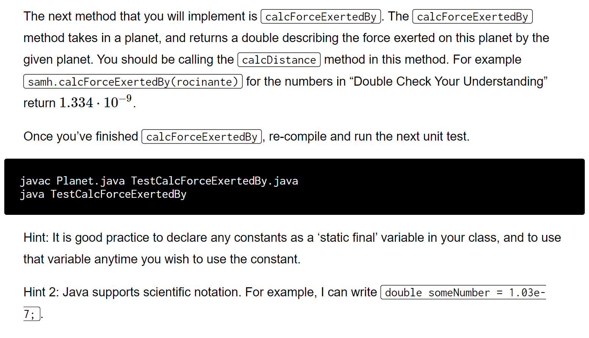
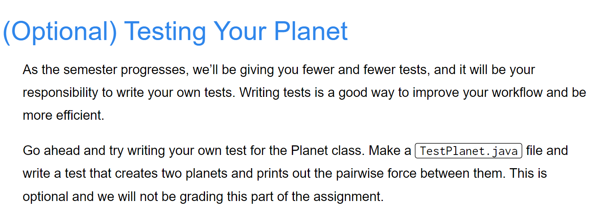
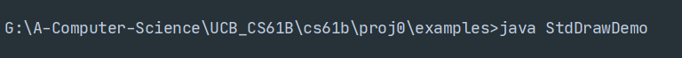

[NBody Simulation _ CS 61B Spring 2018.pdf](https://www.yuque.com/attachments/yuque/0/2023/pdf/12393765/1673343818220-f3e5fa13-f485-4487-becf-93b807f0744e.pdf)
[proj0.zip](https://www.yuque.com/attachments/yuque/0/2023/zip/12393765/1673343912536-ef7277f6-8460-4700-961e-a42862d96174.zip)

# 1 The Planet Class 
## Instance Attributes
> 


## Constructor with parameters
> 


## Constructor without parameters
> 


## Test the Validity
> 

```java
/* Created by AlexMan
*/
public class Planet {
    public double xxPos;
    public double yyPos;
    public double xxVel;
    public double yyVel;
    public double mass;
    public String imgFileName;

    public Planet(double xP, double yP, double xV,
                  double yV, double m, String img){
        this.xxPos = xP;
        this.yyPos = yP;
        this.xxVel = xV;
        this.yyVel = yV;
        this.mass = m;
        this.imgFileName = img;
    }

    public Planet(Planet p){
        this(p.xxPos, p.yyPos, p.xxVel, p.yyVel, p.mass, p.imgFileName);
    }

}
```
**Test Output**


# 2 Understanding the Physics
:::info

:::
**Example**

:::info

:::
**Solution**$r_{SA}=\sqrt{(3-1)^2+(3-0)^2}=\sqrt{13}$, $d_{SAx}=3-1=2, d_{SAy}=3-0=3$
$r_{SR}=\sqrt{(5-1)^2+(-3-0)^2}=5$, $d_{SRx}=5-1=4, d_{SRy}=|-3-0|=3$
$F_{net,x}=F_{netA,x}+F_{netR,x}=\frac{Gm_Sm_A}{r_{SA}^2}\cdot \frac{d_{SAx}}{r_{SA}}+\frac{Gm_Sm_R}{r_{SR}^2}\cdot \frac{d_{SRx}}{r_{SR}}\approx 1.20950\times 10^{-9} N$
$F_{net, y}=F_{netA,y}+F_{netR,y}=\frac{Gm_Sm_A}{r_{SA}^2}\cdot \frac{d_{SAy}}{r_{SA}}-\frac{Gm_Sm_R}{r_{SR}^2}\cdot \frac{d_{SRy}}{r_{SR}}\approx -5.86947\times 10^{-10}N$


# 3 Writing the Planet Class(Planet.java)
## calcDistance
:::info

:::
```java
 /**
     * Calculate the distance between two planets.
     * @param other
     * @return
     */
    public double calcDistance(Planet other){
        return Math.pow(Math.pow(this.xxPos - other.xxPos, 2)
                + Math.pow( this.yyPos - other.yyPos, 2) , 0.5);
    }
```


## calcForceExertedBy⭐⭐
:::info

本例中出现了两个`Java`的重要语法，`static final`关键字和`scientific notation`。
注意`double/double`是不会出现诸如`int/int`会出现的`truncated int`的问题，所以我们可以放心使用`/`。
在设置万有引力常数的时候，注意权限控制符要设置成`private`而不能是`public`否则`Autograder`会扣分, 即`private static final double G = 6.67e-11;`
:::
```java
/**
     * Calculate the force exerted by other planet
     * @param other
     * @return
     */
public double calcForceExertedBy(Planet other){
    double numerator = G * this.mass * other.mass;
    double denominator = Math.pow(calcDistance(other), 2);
//        return numerator * Math.pow(denominator, -1);
    return numerator / denominator;
}
```


## calcForceExertedByX/Y
:::info

正负号来自于`dx`和`dy`的运算。
:::
```java
/**
 * Compute the total force exerted in the X directions by the given planet
 * @param other
 * @return
 */
public double calcForceExertedByX(Planet other){
    double totalForce = calcForceExertedBy(other);
    return totalForce * (other.xxPos - this.xxPos) / calcDistance(other);
}


/**
 * Compute the total force exerted in the Y directions by the given planet
 * @param other
 * @return
 */
public double calcForceExertedByY(Planet other){
    double totalForce = calcForceExertedBy(other);
    return totalForce * (other.yyPos - this.yyPos) / calcDistance(other);
}
```


## calcNetForceExertedByX/Y
:::info

:::
```java
/**
 * Calculate the net X force exerted by all planets in that array upon the current Planet
 * @param allPlanets an array of Planets
 * @return
 */
public double calcNetForceExertedByX(Planet[] allPlanets){
    double netForceX = 0.0;
    for(Planet planet: allPlanets){
        if(!planet.equals(this)){
            netForceX += calcForceExertedByX(planet);
        }
    }
    return netForceX;
}


/**
 * Calculate the net Y force exerted by all planets in that array upon the current Planet
 * @param allPlanets an array of Planets
 * @return
 */
public double calcNetForceExertedByY(Planet[] allPlanets){
    double netForceY = 0.0;
    for(Planet planet: allPlanets){
        if(!planet.equals(this)){
            netForceY += calcForceExertedByY(planet);
        }
    }
    return netForceY;
}
```


## update
:::info

:::
**Example**
:::info

:::
```java
/**
 * Calculate how much the forces exerted on the planet will cause that planet to accelerate,
 * and the resulting change in the planet’s velocity and position in a small period of time dt
 * @param dt a fixed amount time during which the force X and force Y are exerted
 * @param fX force in the X direction
 * @param fY force in the Y direction
 */
public void update(double dt, double fX, double fY){
    double aNetX = fX / this.mass;
    double aNetY = fY / this.mass;
    xxVel += dt * aNetX;
    yyVel += dt * aNetY;
    xxPos += dt * xxVel;
    yyPos += dt * yyVel;
}
```

# 4 Testing Your Planet(Optional)
:::info

:::
```java
/**
 * Created by AlexMan
 */
public class TestPlanet {

    /**
     *  Checks whether or not two Doubles are equal and prints the result.
     *
     *  @param  expected    Expected double
     *  @param  actual      Double received
     *  @param  label       Label for the 'test' case
     *  @param  eps         Tolerance for the double comparison.
     */
    private static void checkEquals(double actual, double expected, String label, double eps) {
        if (Math.abs(expected - actual) <= eps * Math.max(expected, actual)) {
            System.out.println("PASS: " + label + ": Expected " + expected + " and you gave " + actual);
        } else {
            System.out.println("FAIL: " + label + ": Expected " + expected + " and you gave " + actual);
        }
    }

    private static void checkCalcDistance(){
        System.out.println("Checking the distance");
        Planet Samh = new Planet(1, 0, 0, 0, 10, "jupiter.gif");
        Planet Aegir = new Planet(1, 0, 0, 0, 10, "jupiter.gif");
        Planet Rocinante = new Planet(1, 0, 0, 0, 10, "jupiter.gif");
        // ... 
    }

    public static void main(String[] args) {
        checkCalcDistance();
    }
}
```


# 5 Getting Started with the Simulator(NBody.java)
:::info

:::


## ReadRadius - In Class
:::info

:::
**Explanations on In.java Class**`InDemo.java`
本质上`in.read...`会读取以空格为分隔的字符，比如`in.readInt()`会返回下一个`int`类的变量，`int.readString()`会返回下一个`String`类的变量(空格分割的)。同时在读取完之后会将当前的文本指针向后移动，下次调用的时候就不会重读读取。
```java
/**
 * Created by AlexMan
 */
public class NBody {

    public static double readRadius(String fileName){
        In in = new In(fileName);
        int numberOfPlanets = in.readInt();
        return in.readDouble();
    }
}

```


## ReadPlanets
:::info

:::
```java
/**
 * Created by AlexMan
 */
public class NBody {

    public static double readRadius(String fileName){
        In in = new In(fileName);
        int numberOfPlanets = in.readInt();
        return in.readDouble();
    }

    public static Planet[] readPlanets(String fileName){
        In in = new In(fileName);
        int numberOfPlanets = in.readInt();
        Planet[] allPlanets = new Planet[numberOfPlanets];
        double radius = in.readDouble();
        int count = 0;
        while(!in.isEmpty()){
            if(count == numberOfPlanets){
                break;
            }
            double xxPos = in.readDouble();
            double yyPos = in.readDouble();
            double xxVel = in.readDouble();
            double yyVel = in.readDouble();
            double mass = in.readDouble();
            String imgPath = in.readString();
            allPlanets[count] = new Planet(xxPos, yyPos, xxVel, yyVel, mass, imgPath);
            count ++;
        }
        return allPlanets;
    }
}
```


# 6 Drawing the Initial Universe State (main)
## Collecting All Needed Input
:::info

:::


## Drawing the Background⭐⭐⭐⭐⭐
:::info

[Standard Drawing APIs](https://introcs.cs.princeton.edu/java/15inout/)⭐⭐⭐⭐⭐很像是`Python`的`Turtle`包。
注意在编译的时候要将`Java Compiler`的版本调成`Java 8`, 否则会报兼容性错误。
同时，我们需要使用`javac -encoding utf-8 <filename>.java`进行编译，否则会出现乱码。
几个重点关注的方法：

1. `StdDraw.setScale(min,max)`: 设置画板的边界（比例）。 
2. `StdDraw.clear()`, 清空画板。
3. `StdDraw.picture(x,y,filepath)`, 以`x,y`为`center`绘制储存在`filepath`处的图像文件。
4. `StdShow()`展示图像。
5. `StdDraw.pause()`不立即退出`cmd`。
:::
**StdDrawDemo**


## Drawing One Planet
:::info

:::
```java
 /**
     * Uses the StdDraw API mentioned above to
     * draw the Planet’s image at the Planet’s position
     */
    public void draw(){
        StdDraw.picture(xxPos, yyPos, "images/"+imgFileName);
    }
```


## Drawing All of the Planets
:::info

:::


## Code Implementation&Running
:::info
`Java Compiler`版本设置成`1.8`， 然后运行:

- `javac -encoding utf-8 NBody.java`
- `java NBody`
:::
```java
/**
 * Created by AlexMan
 */
public class NBody {

    public static double readRadius(String fileName){
        In in = new In(fileName);
        int numberOfPlanets = in.readInt();
        return in.readDouble();
    }

    public static Planet[] readPlanets(String fileName){
        In in = new In(fileName);
        int numberOfPlanets = in.readInt();
        Planet[] allPlanets = new Planet[numberOfPlanets];
        double radius = in.readDouble();
        int count = 0;
        while(!in.isEmpty()){
            if(count == numberOfPlanets){
                break;
            }
            double xxPos = in.readDouble();
            double yyPos = in.readDouble();
            double xxVel = in.readDouble();
            double yyVel = in.readDouble();
            double mass = in.readDouble();
            String imgPath = in.readString();
            allPlanets[count] = new Planet(xxPos, yyPos, xxVel, yyVel, mass, imgPath);
            count ++;
        }
        return allPlanets;
    }

    public static void main(String[] args) {
        /* Collecting All Needed Input */
        double T = Double.parseDouble(args[0]);
        double dt = Double.parseDouble(args[1]);
        String filename = args[2];
        double radius = readRadius(filename);
        Planet[] allPlanets = readPlanets(filename);

        /* Drawing the Background */
        double x = 0.0;
        double y = 0.0;
        StdDraw.setScale(-radius,radius);
        StdDraw.clear();
        StdDraw.picture(x, y, "images/starfield.jpg");

        /* Drawing All of the Planets */
        for(Planet planet: allPlanets){
            planet.draw();
        }
        StdDraw.pause(5000);
    }
}

```
**Program Output**

# 7 Creating an Animation
**Requirements**
**StdDraw Animation**
```java
/******************************************************************************
 *  Compilation:  javac-introcs BouncingBall.java
 *  Execution:    java-introcs BouncingBall
 *  Dependencies: StdDraw.java
 *
 *  Implementation of a 2-d bouncing ball in the box from (-1, -1) to (1, 1).
 *
 *  % java BouncingBall
 *
 ******************************************************************************/

public class BouncingBall {
    public static void main(String[] args) {

        // set the scale of the coordinate system
        StdDraw.setXscale(-1.0, 1.0);
        StdDraw.setYscale(-1.0, 1.0);
        StdDraw.enableDoubleBuffering();

        // initial values
        double rx = 0.480, ry = 0.860;     // position
        double vx = 0.015, vy = 0.023;     // velocity
        double radius = 0.05;              // radius

        // main animation loop
        while (true)  {

            // bounce off wall according to law of elastic collision
            if (Math.abs(rx + vx) > 1.0 - radius) vx = -vx;
            if (Math.abs(ry + vy) > 1.0 - radius) vy = -vy;

            // update position
            rx = rx + vx;
            ry = ry + vy;

            // clear the background
            StdDraw.clear(StdDraw.LIGHT_GRAY);

            // draw ball on the screen
            StdDraw.setPenColor(StdDraw.BLACK);
            StdDraw.filledCircle(rx, ry, radius);

            // copy offscreen buffer to onscreen
            StdDraw.show();

            // pause for 20 ms
            StdDraw.pause(20);

        }
    }
}
```
```java
/**
 * Created by AlexMan
 */
public class NBody {

    public static double readRadius(String fileName){
        In in = new In(fileName);
        int numberOfPlanets = in.readInt();
        return in.readDouble();
    }

    public static Planet[] readPlanets(String fileName){
        In in = new In(fileName);
        int numberOfPlanets = in.readInt();
        Planet[] allPlanets = new Planet[numberOfPlanets];
        double radius = in.readDouble();
        int count = 0;
        while(!in.isEmpty()){
            if(count == numberOfPlanets){
                break;
            }
            double xxPos = in.readDouble();
            double yyPos = in.readDouble();
            double xxVel = in.readDouble();
            double yyVel = in.readDouble();
            double mass = in.readDouble();
            String imgPath = in.readString();
            allPlanets[count] = new Planet(xxPos, yyPos, xxVel, yyVel, mass, imgPath);
            count ++;
        }
        return allPlanets;
    }

    public static void main(String[] args) {
        /* Collecting All Needed Input */
        double T = Double.parseDouble(args[0]);
        double dt = Double.parseDouble(args[1]);
        String filename = args[2];
        double radius = readRadius(filename);
        Planet[] allPlanets = readPlanets(filename);
        int planetsNumber = allPlanets.length;

        /* Drawing the Background */
        double x = 0.0;
        double y = 0.0;
        StdDraw.setScale(-radius,radius);
        StdDraw.clear();
        StdDraw.picture(x, y, "images/starfield.jpg");

        /* Drawing All of the Planets */
        for(Planet planet: allPlanets){
            planet.draw();
        }
        StdDraw.pause(1000);

        /* Creating Animation */
        StdDraw.enableDoubleBuffering();
        double timestamp = 0;
        while(timestamp < T){
            double[] xForces = new double[planetsNumber];
            double[] yForces = new double[planetsNumber];
            for(int i = 0; i < planetsNumber; i++){
                double netForceX = allPlanets[i].calcNetForceExertedByX(allPlanets);
                double netForceY = allPlanets[i].calcNetForceExertedByY(allPlanets);
                xForces[i] = netForceX;
                yForces[i] = netForceY;
            }
            for(int i = 0; i < planetsNumber; i++){
                allPlanets[i].update(dt, xForces[i], yForces[i]);
            }
            StdDraw.picture(x, y, "images/starfield.jpg");
            for(Planet planet: allPlanets){
                planet.draw();
            }
            StdDraw.show();
            StdDraw.pause(10);
            timestamp += dt;
        }


```
**Program Output**


# 8 Print the Universe
:::info

:::
```java
/**
 * Created by AlexMan
 */
public class NBody {

    public static double readRadius(String fileName){
        In in = new In(fileName);
        int numberOfPlanets = in.readInt();
        return in.readDouble();
    }

    public static Planet[] readPlanets(String fileName){
        In in = new In(fileName);
        int numberOfPlanets = in.readInt();
        Planet[] allPlanets = new Planet[numberOfPlanets];
        double radius = in.readDouble();
        int count = 0;
        while(!in.isEmpty()){
            if(count == numberOfPlanets){
                break;
            }
            double xxPos = in.readDouble();
            double yyPos = in.readDouble();
            double xxVel = in.readDouble();
            double yyVel = in.readDouble();
            double mass = in.readDouble();
            String imgPath = in.readString();
            allPlanets[count] = new Planet(xxPos, yyPos, xxVel, yyVel, mass, imgPath);
            count ++;
        }
        return allPlanets;
    }

    public static void main(String[] args) {
        /* Collecting All Needed Input */
        double T = Double.parseDouble(args[0]);
        double dt = Double.parseDouble(args[1]);
        String filename = args[2];
        double radius = readRadius(filename);
        Planet[] allPlanets = readPlanets(filename);
        int planetsNumber = allPlanets.length;

        /* Drawing the Background */
        double x = 0.0;
        double y = 0.0;
        StdDraw.setScale(-radius,radius);
        StdDraw.clear();
        StdDraw.picture(x, y, "images/starfield.jpg");

        /* Drawing All of the Planets */
        for(Planet planet: allPlanets){
            planet.draw();
        }
        StdDraw.pause(1000);

        /* Creating Animation */
        StdDraw.enableDoubleBuffering();
        double timestamp = 0;
        while(timestamp < T){
            double[] xForces = new double[planetsNumber];
            double[] yForces = new double[planetsNumber];
            for(int i = 0; i < planetsNumber; i++){
                double netForceX = allPlanets[i].calcNetForceExertedByX(allPlanets);
                double netForceY = allPlanets[i].calcNetForceExertedByY(allPlanets);
                xForces[i] = netForceX;
                yForces[i] = netForceY;
            }
            for(int i = 0; i < planetsNumber; i++){
                allPlanets[i].update(dt, xForces[i], yForces[i]);
            }
            StdDraw.picture(x, y, "images/starfield.jpg");
            for(Planet planet: allPlanets){
                planet.draw();
            }
            StdDraw.show();
            StdDraw.pause(10);
            timestamp += dt;
        }

        /* Print the final result */
        StdOut.printf("%d\n", planetsNumber);
        StdOut.printf("%.2e\n", radius);
        for (int i = 0; i < planetsNumber; i++) {
            StdOut.printf("%11.4e %11.4e %11.4e %11.4e %11.4e %12s\n",
                    allPlanets[i].xxPos, allPlanets[i].yyPos, allPlanets[i].xxVel,
                    allPlanets[i].yyVel, allPlanets[i].mass, allPlanets[i].imgFileName);
        }

    }
}

```
```java
/**
 * Created by AlexMan
 */
public class Planet {
    public double xxPos;
    public double yyPos;
    public double xxVel;
    public double yyVel;
    public double mass;
    public String imgFileName;

    // Gravitational Constant, use
    private static final double G = 6.67e-11;

    public Planet(double xP, double yP, double xV,
                  double yV, double m, String img){
        this.xxPos = xP;
        this.yyPos = yP;
        this.xxVel = xV;
        this.yyVel = yV;
        this.mass = m;
        this.imgFileName = img;
    }

    public Planet(Planet p){
        this(p.xxPos, p.yyPos, p.xxVel, p.yyVel, p.mass, p.imgFileName);
    }

    /**
     * Calculate the distance between two planets.
     * @param other
     * @return
     */
    public double calcDistance(Planet other){
        return Math.pow(Math.pow(this.xxPos - other.xxPos, 2)
                + Math.pow( this.yyPos - other.yyPos, 2) , 0.5);
    }

    /**
     * Calculate the force exerted by other planet
     * @param other
     * @return
     */
    public double calcForceExertedBy(Planet other){
        double numerator = G * this.mass * other.mass;
        double denominator = Math.pow(calcDistance(other), 2);
//        return numerator * Math.pow(denominator, -1);
        return numerator / denominator;
    }


    /**
     * Compute the total force exerted in the X directions by the given planet
     * @param other
     * @return
     */
    public double calcForceExertedByX(Planet other){
        double totalForce = calcForceExertedBy(other);
        return totalForce * (other.xxPos - this.xxPos) / calcDistance(other);
    }


    /**
     * Compute the total force exerted in the Y directions by the given planet
     * @param other
     * @return
     */
    public double calcForceExertedByY(Planet other){
        double totalForce = calcForceExertedBy(other);
        return totalForce * (other.yyPos - this.yyPos) / calcDistance(other);
    }


    /**
     * Calculate the net X force exerted by all planets in that array upon the current Planet
     * @param allPlanets an array of Planets
     * @return
     */
    public double calcNetForceExertedByX(Planet[] allPlanets){
        double netForceX = 0.0;
        for(Planet planet: allPlanets){
            if(!planet.equals(this)){
                netForceX += calcForceExertedByX(planet);
            }
        }
        return netForceX;
    }


    /**
     * Calculate the net Y force exerted by all planets in that array upon the current Planet
     * @param allPlanets an array of Planets
     * @return
     */
    public double calcNetForceExertedByY(Planet[] allPlanets){
        double netForceY = 0.0;
        for(Planet planet: allPlanets){
            if(!planet.equals(this)){
                netForceY += calcForceExertedByY(planet);
            }
        }
        return netForceY;
    }

    /**
     * Calculate how much the forces exerted on the planet will cause that planet to accelerate,
     * and the resulting change in the planet’s velocity and position in a small period of time dt
     * @param dt a fixed amount time during which the force X and force Y are exerted
     * @param fX force in the X direction
     * @param fY force in the Y direction
     */
    public void update(double dt, double fX, double fY){
        double aNetX = fX / this.mass;
        double aNetY = fY / this.mass;
        xxVel += dt * aNetX;
        yyVel += dt * aNetY;
        xxPos += dt * xxVel;
        yyPos += dt * yyVel;
    }

    /**
     * Uses the StdDraw API mentioned above to
     * draw the Planet’s image at the Planet’s position
     */
    public void draw(){
        StdDraw.picture(xxPos, yyPos, "images/"+imgFileName);
    }
}

```


# 9 Submission
:::info

:::


# *10 Extra for Experts
## Adding Audio
:::info

[StdDraw Audio APIs](https://introcs.cs.princeton.edu/java/15inout/)
:::


## Gold Points
:::info

:::


