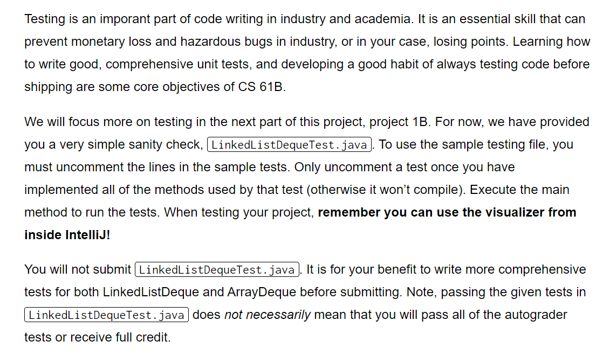

[Project 1A_ Data Structures _ CS 61B Spring 2018.pdf](https://www.yuque.com/attachments/yuque/0/2023/pdf/12393765/1673770960458-4d0f0785-cc81-4bc1-a4e2-74a8caed6a67.pdf)
[cs61b sp19-sp22 proj1 slides.pdf](https://www.yuque.com/attachments/yuque/0/2023/pdf/12393765/1673867241295-6808e330-8bed-4520-aaee-d6afe831ee3b.pdf)
[proj1a.zip](https://www.yuque.com/attachments/yuque/0/2023/zip/12393765/1673770927738-3c3773e0-d820-4eb0-9161-23ae0e39c9e2.zip)

# Deque API
:::info

:::
```java
/**
 * Created by AlexMan
 */
public interface Deque<T> {

    // Adds an item of type T to the front of the deque.
    public void addFirst(T item);


    // Adds an item of type T to the back of the deque.
    public void addLast(T item);


    // Returns true if deque is empty, false otherwise.
    public boolean isEmpty();


    // Return the number of items in the deque.
    public int size();


    // Prints the items in the deque from first to last, separated by a space.
    public void printDeque();


    // Removes and returns the item at the front of the deque. If no such item exists, returns null.
    public T removeFirst();


    // Removes and returns the item at the back of the deque. If no such item exists, returns null.
    public T removeLast();


    // Gets the item at the given index, where 0 is the front, 1 is the next item, and so forth.
    // If no such item exists, returns null. Must not alter the deque!
    public T get(int index);
}
```

# Linked List Deque
:::info
Refer to [DLList](https://www.yuque.com/alexman/ac5oth/iv95ny4xk6hf7ebg#Zohsn) before move on.

:::
```java
/**
 * Created by AlexMan
 */
public class LinkedListDeque<T> {

    private DequeNode sentinel;
    private int size;


    // Nested Class Definition with reference to T, so no static keyword here
    private class DequeNode {
        T item;
        DequeNode next;
        DequeNode prev;


        // Constructor
        DequeNode(T i, DequeNode n, DequeNode p) {
            this.item = i;
            this.next = n;
            this.prev = p;
        }
    }

    // Constructor
    public LinkedListDeque() {
        // default for empty deque
        sentinel = new DequeNode(null, null, null);
        sentinel.next = sentinel;
        sentinel.prev = sentinel;
        size = 0;
    }

    public void addFirst(T item) {
        if (isEmpty()) {
            DequeNode newNode = new DequeNode(item, sentinel.next, sentinel);
            sentinel.next = newNode;
            sentinel.prev = newNode;
        } else {
            DequeNode nextNode = sentinel.next;
            sentinel.next = new DequeNode(item, nextNode, sentinel);
            nextNode.prev = sentinel.next;
        }
        size += 1;
    }


    public void addLast(T item) {
        if (isEmpty()) {
            DequeNode newNode = new DequeNode(item, sentinel, sentinel.prev);
            sentinel.next = newNode;
            sentinel.prev = newNode;
        } else {
            DequeNode lastNode = sentinel.prev;
            sentinel.prev = new DequeNode(item, sentinel, lastNode);
            lastNode.next = sentinel.prev;
        }
        size += 1;
    }

    public boolean isEmpty() {
        return size == 0;
    }

    public int size() {
        return size;
    }

    public void printDeque() {
        if (size > 0) {
            DequeNode first = sentinel.next;
            while (first.next != sentinel) {
                System.out.print(first.item + "");
            }
            System.out.println(first.item);
        } else {
            System.out.println("");
        }
    }

    public T removeFirst() {
        if (isEmpty()) {
            return null;
        } else {
            size -= 1;
            DequeNode nextNext = sentinel.next.next;
            T res = sentinel.next.item;
            // Garbage Collection, 要让指向这个节点的节点放弃对该节点的引用
            // Delete the node
            sentinel.next = nextNext;
            nextNext.prev = sentinel;
            return res;
        }
    }

    public T removeLast() {
        if (isEmpty()) {
            return null;
        } else {
            size -= 1;
            DequeNode prevPrev = sentinel.prev.prev;
            T res = sentinel.prev.item;
            // Garbage Collection
            // Delete the node
            sentinel.prev = prevPrev;
            prevPrev.next = sentinel;
            return res;
        }
    }

    public T get(int index) {
        if (size == 0 || index >= size) {
            return null;
        } else {
            DequeNode first = sentinel.next;
            while (index > 0) {
                index--;
                first = first.next;
            }
            return first.item;
        }
    }

    // Same as get, but uses recursion.
    public T getRecursive(int index) {
        return getRecursiveHelper(index, sentinel.next);
    }

    private T getRecursiveHelper(int index, DequeNode node) {
        if (size == 0 || index >= size) {
            return null;
        } else if (index == 0) {
            return node.item;
        }
        return getRecursiveHelper(index - 1, node.next);
    }

//    @Override
//    public String toString() {
//        if (size == 0) {
//            return "[]";
//        } else {
//            StringBuilder res = new StringBuilder();
//            res.append("[");
//            DequeNode first = sentinel.next;
//            while (first.next!= sentinel){
//                res.append(first.item);
//                first = first.next;
//                res.append(", ");
//            }
//            res.append(first.item);
//            res.append("]");
//            return res.toString();
//        }
//    }
}

```

# *Array Deque
:::info

:::
**Circular Implementation Tips**[https://docs.google.com/presentation/d/1XBJOht0xWz1tEvLuvOL4lOIaY0NSfArXAvqgkrx0zpc/edit#slide=id.g1094ff4355_0_35](https://docs.google.com/presentation/d/1XBJOht0xWz1tEvLuvOL4lOIaY0NSfArXAvqgkrx0zpc/edit#slide=id.g1094ff4355_0_35)
**Generic Array Tips**[https://www.yuque.com/alexman/ac5oth/iv95ny4xk6hf7ebg#AXGph](https://www.yuque.com/alexman/ac5oth/iv95ny4xk6hf7ebg#AXGph)
```java
/**
 * Created by AlexMan
 */
public class ArrayDeque<T> {

    private static int MAXCAPACITY = 8;
    private static double LOADING_FACTOR = 0.25;
    private T[] items;
    private int size;
    private int front = 0; // The pointer to the front of the deque


    // Constructor
    public ArrayDeque() {
        items = (T[]) new Object[MAXCAPACITY];
        size = 0;
    }

    public void addFirst(T item) {
        if (size == MAXCAPACITY) {
            incResize();
        }
        if (isEmpty()) {
            items[front] = item;
        } else {
            // Loop back to the end
            int newFront = (front + MAXCAPACITY - 1) % MAXCAPACITY;
            items[newFront] = item;
            front = newFront;
        }
        size += 1;
    }

    public void addLast(T item) {
        if (size == MAXCAPACITY) {
            incResize();
        }
        items[(front + size) % MAXCAPACITY] = item;
        size += 1;
    }

    public boolean isEmpty() {
        return size == 0;
    }

    public int size() {
        return size;
    }

    public void printDeque() {
        for (int i = 0; i < size - 1; i++) {
            System.out.print(items[i] + " ");
        }
        System.out.println(items[size - 1]);
    }

    public T removeFirst() {
        if (isEmpty()) {
            return null;
        }
        int newFront = (front + MAXCAPACITY + 1) % MAXCAPACITY;
        T res = items[front];
        // Garbage Collection
        items[front] = null;
        front = newFront;
        size -= 1;
        decResize();
        return res;
    }

    public T removeLast() {
        if (isEmpty()) {
            return null;
        }
        T res = items[(front + size - 1) % MAXCAPACITY];
        // Garbage Collection
        items[(front + size - 1) % MAXCAPACITY] = null;
        size -= 1;
        decResize();
        return res;
    }

    public T get(int index) {
        if (index >= size || isEmpty()) {
            return null;
        }
        return items[(front + index) % MAXCAPACITY];
    }


    private void resize(int newSize) {
        T[] newItems = (T[]) new Object[newSize];
        for (int i = 0; i < size; i++) {
            int oldIndex = (front + i) % MAXCAPACITY;
            int newIndex = (i) % newSize;
            newItems[newIndex] = items[oldIndex];
        }
        MAXCAPACITY = newSize;
        items = newItems;
        // Set the new front
        front = 0;
    }

    // Resize the arraydeque
    private void incResize() {
        int newSize = MAXCAPACITY * 2;
        resize(newSize);
    }

    // Downsize the arraydeque
    private void decResize() {
        if (MAXCAPACITY >= 16 && size < Math.round(MAXCAPACITY * LOADING_FACTOR)) {
            resize(MAXCAPACITY / 2);
        }
    }

//    @Override
//    public String toString() {
//        if (isEmpty()) {
//            return "[]";
//        }
//        StringBuilder res = new StringBuilder();
//        res.append("[");
//        for (int i = 0; i < size - 1; i++) {
//            res.append(items[(front + i) % MAXCAPACITY]);
//            res.append(", ");
//        }
//        res.append(items[(front + size - 1) % MAXCAPACITY]);
//        res.append("]");
//        return res.toString();
//    }
}
```


# Testing
:::info

:::
```java
import edu.princeton.cs.algs4.StdRandom;
import org.junit.Test;

import static org.junit.Assert.*;


/**
 * Created by AlexMan
 */
public class ArrayDequeTest {

    @Test
    public void testAddFirst() {
        ArrayDeque<Integer> aDeque = new ArrayDeque<>();
        for (int i = 0; i < 100; i++) {
            aDeque.addFirst(i);
        }
        System.out.println(aDeque);
    }


    @Test
    public void testAddLast() {
        ArrayDeque<Integer> aDeque = new ArrayDeque<>();
        for (int i = 0; i < 100; i++) {
            aDeque.addLast(i);
        }
        System.out.println(aDeque);
    }


    @Test
    public void testRemoveFirst() {
        ArrayDeque<Integer> aDeque = new ArrayDeque<>();
        for (int i = 0; i < 100; i++) {
            aDeque.addLast(i);
        }
        System.out.println(aDeque);
        for (int i = 0; i < 99; i++) {
            aDeque.removeFirst();
        }
        System.out.println(aDeque.get(0));
        System.out.println(aDeque.size());
        System.out.println(aDeque.isEmpty());
    }

    @Test
    public void testRemoveLast() {
        System.out.println(Math.round(3.2));
        ArrayDeque<Integer> aDeque = new ArrayDeque<>();
        for (int i = 0; i < 100; i++) {
            aDeque.addLast(i);
        }
        System.out.println(aDeque);
        for (int i = 0; i < 99; i++) {
            aDeque.removeLast();
        }
        System.out.println(aDeque.get(0));
        System.out.println(aDeque.size());
        System.out.println(aDeque.isEmpty());
    }

    @Test
    public void randomizedTest() {
        ArrayDeque<Integer> aDeque = new ArrayDeque<>();
        int N = 5000;
        int operationNumber = StdRandom.uniform(0, 4);
        for (int i = 0; i < N; i++) {
            int randomNumber = StdRandom.uniform(1, 11);
            if (operationNumber == 0) {
                aDeque.addFirst(randomNumber);
            } else if (operationNumber == 1) {
                aDeque.removeFirst();
            } else if (operationNumber == 2) {
                aDeque.addLast(randomNumber);
            } else {
                aDeque.removeLast();
            }
        }
        System.out.println(aDeque);
    }

    public static void main(String[] args) {
        ArrayDeque<Integer> aDeque = new ArrayDeque<>();
        for (int i = 0; i < 30; i++) {
            aDeque.addFirst(i);
        }

        for (int i = 0; i < 25; i++) {
            aDeque.removeFirst();
        }
        System.out.println(aDeque);
    }

}

```
```java
import edu.princeton.cs.algs4.StdRandom;
import org.junit.Test;
import static org.junit.Assert.*;

/** Performs some basic linked list tests. */
public class LinkedListDequeTest { /* Utility method for printing out empty checks. */
    public static boolean checkEmpty(boolean expected, boolean actual) {
        if (expected != actual) {
            System.out.println("isEmpty() returned " + actual + ", but expected: " + expected);
            return false;
        }
        return true;
    }

    /* Utility method for printing out empty checks. */
    public static boolean checkSize(int expected, int actual) {
        if (expected != actual) {
            System.out.println("size() returned " + actual + ", but expected: " + expected);
            return false;
        }
        return true;
    }

    /* Prints a nice message based on whether a test passed.
    * The \n means newline. */
    public static void printTestStatus(boolean passed) {
        if (passed) {
            System.out.println("Test passed!\n");
        } else {
            System.out.println("Test failed!\n");
        }
    }

    /** Adds a few things to the list, checking isEmpty() and size() are correct,
    * finally printing the results.
    *
    * && is the "and" operation. */
    public static void addIsEmptySizeTest() {
        System.out.println("Running add/isEmpty/Size test.");
        System.out.println("Make sure to uncomment the lines below (and delete this"
            + " print statement).");

        LinkedListDeque<String> lld1 = new LinkedListDeque<String>();

        boolean passed = checkEmpty(true, lld1.isEmpty());

        lld1.addFirst("front");

        // The && operator is the same as "and" in Python.
        // It's a binary operator that returns true if both arguments true, and false otherwise.
        passed = checkSize(1, lld1.size()) && passed;
        passed = checkEmpty(false, lld1.isEmpty()) && passed;

        lld1.addLast("middle");
        passed = checkSize(2, lld1.size()) && passed;

        lld1.addLast("back");
        passed = checkSize(3, lld1.size()) && passed;

        System.out.println("Printing out deque: ");
        lld1.printDeque();

        printTestStatus(passed); }

    /** Adds an item, then removes an item, and ensures that dll is empty afterwards. */
    public static void addRemoveTest() {

        System.out.println("Running add/remove test.");

        System.out.println("Make sure to uncomment the lines below (and delete this"
            + "print statement).");

        LinkedListDeque<Integer> lld1 = new LinkedListDeque<Integer>();
        // should be empty
        boolean passed = checkEmpty(true, lld1.isEmpty());

        lld1.addFirst(10);
        // should not be empty
        passed = checkEmpty(false, lld1.isEmpty()) && passed;

        lld1.removeFirst();
        // should be empty
        passed = checkEmpty(true, lld1.isEmpty()) && passed;

        printTestStatus(passed);
    }

    @Test
    public void randomizedTEST() {
        LinkedListDeque<Integer> ld = new LinkedListDeque<Integer>();
        int N = 5000;
        int operationNumber = StdRandom.uniform(0, 4);
        for (int i = 0; i < N; i++) {
            int randomNumber = StdRandom.uniform(1, 11);
            if (operationNumber == 0) {
                ld.addFirst(randomNumber);
            } else if (operationNumber == 1) {
                ld.removeFirst();
            } else if (operationNumber == 2) {
                ld.addLast(randomNumber);
            } else {
                ld.removeLast();
            }
        }
        System.out.println(ld);
    }


    public static void main(String[] args) {
        System.out.println("Running tests.\n");
        addIsEmptySizeTest();
        addRemoveTest();
    }
}

```

# FAQs
:::info

:::


# Submission
:::info
Run Style Checker before submission.

遇到文件制表符`Tab`的问题，只能手动将`Tabs`全部替换成`Whitespaces`

:::


