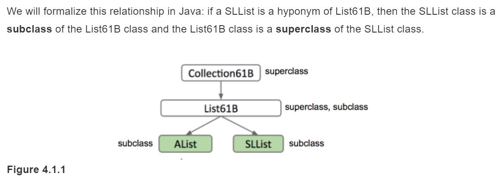
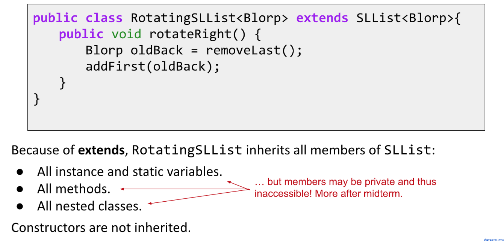
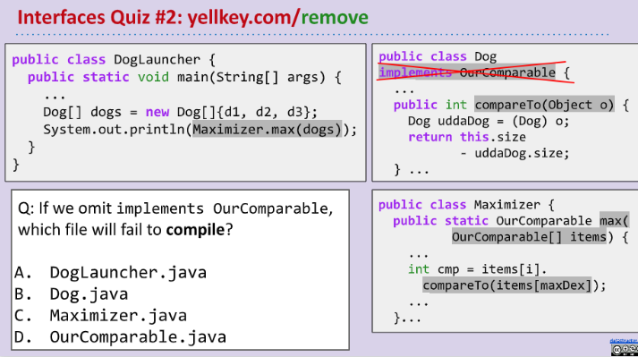

:::info
Ch 4.1 ~ 4.4
:::

# 1 Interfaces
>[cs61b 2018 lec8 - inheritance1.pdf](https://www.yuque.com/attachments/yuque/0/2023/pdf/12393765/1673832111232-99b7b768-7e23-43b1-874c-ba1846440c72.pdf)
>Prereq: [DE1803__Linked_Lists__Arrays](../2_List_Testing/DE1803__Linked_Lists__Arrays.md)

## Longest Word - Overloading
:::info

:::
```java
/**
 * Created by AlexMan
 */
public class WordUtils {
    // SLList imported at the lecture/Chapter_4_1/self
    public static String longest(SLList<String> list){
        // TODO
        return null;
    }
}
```
```java
/**
* Created by AlexMan
*/
public class WordUtils {
    public static String longest(SLList<String> list){
        // TODO
        int maxIndex = 0;
        for(int i = 0; i < list.size(); i++){
            if(list.get(i).length() > list.get(maxIndex).length()){
                maxIndex = i;
            }
        }
        return list.get(maxIndex);
    }
}
```
**Solution Code**
:::info
但是上述方法仅仅对`SLList`的数据结构有效，如果我们要对`AList`也有效，就需要再定义一个方法，可能叫做`longestAList(...)`，但是实际上`Java`支持同名但不同参数的方法重载(`Overloading`)。

:::


## Hypernyms&Hyponyms&Interfaces
:::info

:::


## Interfaces&Implements
:::info

:::
```java
public interface List61B<Item> {
    public void addFirst(Item x);
    public void add Last(Item y);
    public Item getFirst();
    public Item getLast();
    public Item removeLast();
    public Item get(int i);
    public void insert(Item x, int position);
    public int size();
}
```
:::info

:::


## Overriding vs Overloading
:::info

`**superclass**`**中的**`**private method**`**如果使用了**`**@override**`**, 会报编译错误。因为**`**private**`**不能被重写。 **
**如果我们**`**override**`**了一个**`**superclass**`**中不存在的方法，也会报编译错误。**
**所以**`**override**`**关键字可以帮助我们了解父类的同名同参数方法是否存在，是否可以被重写。**

上面列出了一些`override`的好处。
:::


## GRoE - Copying the Bits
:::info

:::
**Exercise**


## Inheritance Types
### Interface Inheritance
:::info

**注意**`**sub-class**`**必须重写**`**interface**`**中的未被实现的方法。**

:::


### Implementation Inheritance - Default
:::info

:::
```java
package lectures;

public interface List61B<Item> {
    /**
     * Inserts X into the back of the list.
     */
    public void addLast(Item x);

    /**
     * Returns the item from the back of the list.
     */
    public Item getLast();

    /**
     * Gets the ith item in the list (0 is the front).
     */
    public Item get(int i);

    /**
     * Returns the number of items in the list.
     */
    public int size();

    /**
     * Deletes item from back of the list and
     * returns deleted item.
     */
    public Item removeLast();

    /**
     * Inserts item into given position.
     * Code from discussion #3
     */
    public void insert(Item x, int position);

    /**
     * Inserts an item at the front.
     */
    public void addFirst(Item x);

    /**
     * Gets an item from the front.
     */
    public Item getFirst();

    /** Prints the list. Works for ANY kind of list. */
    // Implementation Inheritance
    default public void print() {
        for (int i = 0; i < size(); i = i + 1) {
            System.out.print(get(i) + " ");
        }
    }
}
```
**Exercise**

:::info
为了解决`SLList`调用`get(i)`仍需要`Linear Time`的效率低下的问题，我们可以分别对子类的同名方法进行重写达到效率最优化。

:::


### Summary
:::info

:::


## Dynamic Method Selection
### DMS - Works for Override
:::info

:::


### DMS - Not for Overload
:::info
我们需要特别注意`Overloaded`方法的调用选择问题, 上面的`peek`方法被`overloaded`, 参数因为`Static Type`的不同而不同。此时选择哪一个`peek`调用完全取决于传输参数的`Static Type`(`most specific one`), `SP`的`Static Type`是`SLList`, 尽管`peek(List61B<String> list)`也是可以接受的，但是`List61B`显然没有`SLList`更接近传入参数的`Static Type`，所以调用的是`peek(SLList<String> list`。
下面我们总结一下`Overloading`和`Overriding`的差异:

:::


### Overriden&Overloaded Methods
:::info

:::

## Study Guide Exercises
[Inheritance1 Study Guide _ CS 61B Spring 2019.pdf](https://www.yuque.com/attachments/yuque/0/2023/pdf/12393765/1673832227133-aa662aeb-b0b2-4572-a922-4f8092387cf8.pdf)
### Level A
:::info

:::


## What to do next?
:::info

- **L2103: **Randomized Testing
- **D1804**: Inheritance
:::

# 2 Inheritance & HOFs
[cs61b 2021 lec9 inheritance2.pdf](https://www.yuque.com/attachments/yuque/0/2023/pdf/12393765/1674219544788-59c70ef1-c83e-4dd4-92b1-5bd2d181373b.pdf)
[inheritance2.zip](https://www.yuque.com/attachments/yuque/0/2023/zip/12393765/1674220767043-0996b741-efa1-466e-b336-0502bf1b5e89.zip)
:::info
**Prereq: **Project 1A
:::

## Extends Keyword
### Inherit Methods
:::info

如果我们要定义一个新的`RotatingSLList`, 他拥有所有`SLList`拥有的方法，且我们不想使用`implements`(因为使用`implements`实现一个接口往往意味着我们需要手动实现所有接口暴露的方法。)，那我们可以使用`extends`关键字来偷懒。因为`extends`会继承所有`SLList`类中已经实现好的方法并且在这个基础上做`@Override`或者添加新的方法。
现在`RotatingSLList`中需要有一个新的`rotateRight`方法, 具体的效果在上面已经展示了，我们要做的就是利用我们`extends`继承来的方法来实现这个`rotateRight()`, 实现思路也很简单，就是把尾部删掉，然后在头部插入即可，代码如下:
:::
```java
/* SLList, but with additional rotateRight operation. */
public class RotatingSLList<Item> extends SLList<Item> {

	/** To do: Implement RotatingSLList such that code compiles and outputs correct result. */

	/** Rotates list to the right. */
	public void rotateRight() {
	    Item x = removeLast();
	    addFirst(x);
    }

	public static void main(String[] args) {
		RotatingSLList<Integer> rsl = new RotatingSLList<>();
		/* Creates SList: [10, 11, 12, 13] */
		rsl.addLast(10);
		rsl.addLast(11);
		rsl.addLast(12);
		rsl.addLast(13);

		/* Should be: [13, 10, 11, 12] */
		rsl.rotateRight();
		rsl.print();
	}
} 
```


### What it cannot inherit?
:::info
但是要注意，使用`extends`的子类并不能实例化访问父类当中的`private methods`(但是能够继承)，但是不能继承父类的`Constructor`, 这和`Python`是不同的。`Python`中子类直接继承父类的`__init__`方法，并且在实例化子类的时候自动调用父类的`__init__`构造方法。

:::


### Super() - decorator 
:::info
假设现在我们想在`Override`的一些方法中既保留父类方法的全部逻辑，又增加子类的一些新逻辑，就可以使用`super.<method_call>`关键字来实现，这和`python`中的`super()`的作用类似，都是获取父类的引用。
假设我们现在要定义一个`VengefulSLList`类，他里面有一个需要重写的方法`removeLast`, 逻辑是在我们删除某个节点的时候，把这个节点保存在一个新的数据结构中。同时另一个方法`printLostItems()`, 返回我们通过`removeLast()`删除的所有节点。由于我们不能`extends`到一些`private methods`, 比如`getLastNode`:

而`extends`可以继承`public methods`, 于是我们可以在我们的`removeLast`中通过`super.removeLast()`调用父类的方法。
同时，注意到子类无法继承父类的`Constructor`，所以我们需要提供一下。`VengefulSLList`的完整代码如下:
:::
```java
/** SList with additional operation printLostItems() which prints all items
  * that have ever been deleted. */
public class VengefulSLList<Item> extends SLList<Item> {
    SLList<Item> deletedItems;

    public VengefulSLList() {
        super();  // Must call it to instantiate
        deletedItems = new SLList<Item>();
    }

    public VengefulSLList(Item x) {
        deletedItems = new SLList<Item>();
    }

    @Override
    public Item removeLast() {
        Item x = super.removeLast();
        deletedItems.addLast(x);
        return x;
    }

    /** Prints deleted items. */
    public void printLostItems() {
        deletedItems.print();
    }

    public static void main(String[] args) {

		VengefulSLList<Integer> vs1 = new VengefulSLList<Integer>(0);
		vs1.addLast(1);
		vs1.addLast(5);
		vs1.addLast(10);
		vs1.addLast(13);
		// vs1 is now: [1, 5, 10, 13] 


		vs1.removeLast();
		vs1.removeLast();
		// After deletion, vs1 is: [1, 5]

		// Should print out the numbers of the fallen, namely 10 and 13.
		System.out.print("The fallen are: ");
		vs1.printLostItems();
	}
} 
```


### Constructors are not inherited
:::info

如果子类构造器中需要调用父类的有参构造，则必须显式地通过`super(x)`调用，其中`x`是参数。
而如果仅仅需要调用父类的无参构造，则要么显式地通过`super()`调用，要么就省略不写，`Java `会自动调用`super()`。
:::


## Extends and Static
:::info
对于父类中定义的`static variables`, 子类继承之后在`constructor`中使用`super(...)`来实例化变量的时候**会**影响之前通过父类构造器创建的对象的`static variables`。
对于父类中定义的`instance variables`, 子类继承之后在`constructor`中使用`super(...)`来实例化变量的时候**不会**影响之前通过父类构造器创建的对象的`instance variables`。
我们看下面的例子:
`private instance variables`:

解决方法就是在子类中加入同样的`private static <variable_name>`字段，在构造器中不使用`super()`方法。
:::
```java

/**
 * Created by AlexMan
 */
public class Space implements Comparable<Space>{
    private Integer size;
    private Integer distance;

    public Space() {
        size = 0;
        distance = 0;
    }

    public Space(Integer size, Integer distance) {
        this.size = size;
        this.distance = distance;
    }

    public Integer getSize(){
        return size;
    }

    public Integer getDistance() {
        return distance;
    }
}
```
```java
package ParkingLot;

/**
 * Created by AlexMan
 */
public class RegularSpace extends Space{

    public RegularSpace() {
    }

    public RegularSpace(Integer size, Integer distance) {
        super(size, distance);
    }
}
```
```java
package ParkingLot;

/**
 * Created by AlexMan
 */
public class Client {
    public static void main(String[] args) {
        Space ts = new Space(3,3);
        System.out.println(ts.getSize());
        System.out.println(ts.getDistance());

        // Won't affect the class variables
        RegularSpace rs = new RegularSpace(2,4);
        System.out.println(ts.getSize());
        System.out.println(ts.getDistance());
    }
}
```
:::info
`private static variable`:

:::
```java

/**
 * Created by AlexMan
 */
public class Space implements Comparable<Space>{
    private static Integer size;
    private static Integer distance;

    public Space() {
        size = 0;
        distance = 0;
    }

    public Space(Integer size, Integer distance) {
        this.size = size;
        this.distance = distance;
    }

    public Integer getSize(){
        return size;
    }

    public Integer getDistance() {
        return distance;
    }
}
```
```java
package ParkingLot;

/**
 * Created by AlexMan
 */
public class RegularSpace extends Space{

    public RegularSpace() {
    }

    public RegularSpace(Integer size, Integer distance) {
        super(size, distance);
    }
}
```
```java
package ParkingLot;

/**
 * Created by AlexMan
 */
public class Client {
    public static void main(String[] args) {
        Space ts = new Space(3,3);
        System.out.println(ts.getSize());
        System.out.println(ts.getDistance());
        // Affect the class variables
        RegularSpace rs = new RegularSpace(2,4);
        System.out.println(ts.getSize());
        System.out.println(ts.getDistance());
    }
}
```


## The Object Class
:::info

:::


## Encapsulation
:::info

:::


### Module
:::info

:::

### Abstraction Barriers
:::info

:::


### Break of Abstraction Barriers
:::info
Implementation Inheritance can break abstraction barriers. 

As you have seen, using the first implementation, the output is A, while using the second implementation, the program gets caught in an infinite loop. The call to `bark()` will call `barkMany(1)`, which makes a call to `bark()`, repeating the process infinitely many times.
问题本质就是`bark()`完全对用户是不透明的，我们不知道我们继承来的`bark()`内部是怎么实现的，但恰恰是我们对于`bark()`内部逻辑的一无所知，所以会导致向上面一样的后果。
:::


## Type Checking and Casting
### Compile-Time Types Checking
:::info

:::
**Walkthrough**
:::info

总的来说，`Static Type`会告知`Compiler`那些方法是可以被调用的, 在`Compile`期间，`Compiler`会顺着类的继承关系找到这个类是否具有某个`method signature`, 如果没有就会报`Compliation Error`
如果父类没有的方法但是子类有，我们就应该使用子类`Static Type`和子类的实例化对象来调用。
同时，`Static Type`会在声明变量的时候用于判断`ISA Relationship`是否成立，即赋值是否成功。
:::


### Compile-time Expression
:::info

:::


### Casting
:::info

It's tricking the compiler!
`maxDog()`返回的是`Static Type``Dog`类，如果`maxDog`的`return`语句返回的也是`Dog`类的实例化对象的话，那么使用`Poodle`(`Dog`的子类)进行转型的话会丢失信息，导致`RunTime Error`。
在`Type Casting`的时候，两种情况会导致`Compilation Error`:

1. 左侧的`Static Type`不能储存右侧的`Dynamic Type`
2. 在没有`Hierarchical Relations`的类之间`Casting`

一种情况可能会导致`Runtime Error`:

1. 在不确定`Dynamic Type`的情况下向下转型。
:::


### Exercises
#### Overriding or Overloading?
:::info

:::


## Higher Order Functions
### HOFs in Python
:::info

:::

### HOFs in Java
#### Java 7 or Earlier
:::info

:::


#### Java 8 or Later
:::info

:::


## Summary
:::info

:::


## Study Guide Exercises
[Inheritance 2 Lecture Guide _ CS 61B Spring 2021.pdf](https://www.yuque.com/attachments/yuque/0/2023/pdf/12393765/1674219614674-859f7f25-18b1-40d2-9159-80233ab9f279.pdf)


# 3 Polymorphism & HOFs
[cs61b 2021 lec10 inheritance3.pdf](https://www.yuque.com/attachments/yuque/0/2023/pdf/12393765/1674226276231-91ecdb7d-13ec-4298-8fa8-0efa04223f5e.pdf)
[inheritance3.zip](https://www.yuque.com/attachments/yuque/0/2023/zip/12393765/1674226290685-d1851df9-2304-459d-ada8-c4d13b845873.zip)

## Warmup Exercises
:::info

:::
**Explanations**我们逐行分析:

1. 实例化了一个`ShowDog`对象，放入`Object`容器中，合理。
2. 告诉编译器我们的`o2`的`Static Type`是`ShowDog`, 并放入`ShowDog`容器，合理。
3. 告诉编译器我们的`o2`的`Static Type`是`Dog`, 并放入`Dog`容器，向上转型，合理，不报编译错误。
4. 和上一行一样。
5. 报编译错误，原因是此时`o3`的`Static Type`(`Compile-Time Type`)是`Object`, 而`Object`类中没有声明`bark()`方法，所以后续通过`o3.bark()`试图调用`bark()`的时候就会报`Compile-time error`。


:::info
**Upcasting&Downcasting:**

1. **Upcasting: 默认行为**
2. **Downcasting: 可能会报**`**Runtime Error**`


:::

## Subtype Polymorphism & HOF
:::info

:::


## Comparable⭐⭐⭐⭐⭐
:::info
一般而言自定义对象是无法直接比较大小的，所以我们需要借用一些借口来实现，这个借口就是`Comparable`接口。

如果我们要比较两个同类对象(都是`Class`类)的话，我们可以使这个对象`implements``Comparable<Class>`接口，然后覆盖接口中的`compareTo(Class other)`方法，然后返回值有所规定：

1. 返回值小于零，则当前对象小于`other`对象。
2. 返回值等于零，对象相等。
3. 返回值大于零，则当前对象大于`other`对象。

如果`implement Comparable`的子类没有`implement compareTo()`方法，那么`Java Compiler`会报错，因为作为一个子类，却没有实现接口规定的所有非默认方法，就会和`is-a relationship`产生冲突。
:::
```java
public class Dog implements Comparable<Dog> {
    public String name;
    private int size;

    public Dog(String n, int s) {
        name = n;
        size = s;
    }

    @Override
    public int compareTo(Dog uddaDog) {
        //assume nobody is messing up and giving us
        //something that isn't a dog.
        return size - uddaDog.size;
    }


    public void bark() {
        System.out.println(name + " says: bark");
    }
}
```
:::info
在为对象实现了`compareTo`方法后，我们可以定义一个求对象数组的最大值的方法，代码如下:
:::
```java
public class Maximizer {
	public static Comparable max(Comparable[] items) {
		int maxDex = 0;
		for (int i = 0; i < items.length; i += 1) {
		    int cmp = items[i].compareTo(items[maxDex]);

			if (cmp > 0) {
				maxDex = i;
			}
		}
		return items[maxDex];
	}
} 
```
**Quizzes**⭐⭐⭐
很多学生会认为`Problem 2`中，`Maximizer`文件会报编译错误，但实际情况是，`Dog Launcher`会报错。因为`Maximizer`文件中一切都很合理，我们确实定义了`OurComparable`接口，且`Comparable`接口中也确实声明了`compareTo`方法，于是编译不会报错。反倒是在`DogLauncher`中我们传递参数时，传递的`dogs`的`Compile-time Type`是`Dog[]`, 而`Dog`类由于没有`implement OurComparable`接口，所以没有`is-a`的关系出现，所以报错。


## Comparator⭐⭐⭐
:::info
一个类如果`implement`了`Comparable<Dog>`, 我们需要实现一个`compareTo(Dog other)`方法，来说明我们要根据Dog实例上的声明属性进行比较。但是由于一个类中只能有一个`comparTo`方法，也就是说通过`compareTo`只能实现一种比较逻辑，比如比较`Dog`的`size`属性的大小。如果我们要能够在一个类中同时加入多种比较规则的话，我们可以使用`Comparator`接口来实现:

我们要注意，在实现`compare`的时候我们要注意，`compareTo(Class o)`的`Class`一定得是`reference Type`（而不是`primitive type`）, 因为只有这样，我们才能调用`compareTo`方法来比较。

代码实现如下：
:::
```java
public class Dog implements Comparable<Dog> {
    public String name;
    private int size;

    public Dog(String n, int s) {
        name = n;
        size = s;
    }

    @Override
    public int compareTo(Dog uddaDog) {
        //assume nobody is messing up and giving us
        //something that isn't a dog.
        return size - uddaDog.size;
    }

    // Comparator using name
    public static class NameComparator implements Comparator<Dog> {

        @Override
        public int compare(Dog x1, Dog x2) {
            // Use the String built-in compareTo method
            return x1.name.compareTo(x2.name);
        }

    }

    public static Comparator<Dog> getNameComparator() {
        return new NameComparator();
    }


    // Comparator using size
    public static class SizeComparator implements Comparator<Dog> {

        @Override
        public int compare(Dog x1, Dog x2) {
            // Use the default size comparable's compareTo
            return x1.compareTo(x2);
        }

    }

    public static Comparator<Dog> getSizeComparator() {
        return new SizeComparator();
    }

    public void bark() {
        System.out.println(name + " says: bark");
    }
}
```


## Study Guide Exercises
[Inheritance3 Study Guide _ CS 61B Spring 2021.pdf](https://www.yuque.com/attachments/yuque/0/2023/pdf/12393765/1674226342376-65bc6823-7e39-4be6-9f97-fc1bc7307a8e.pdf)


