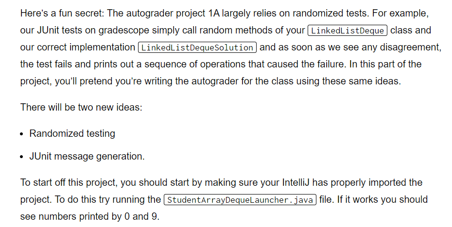
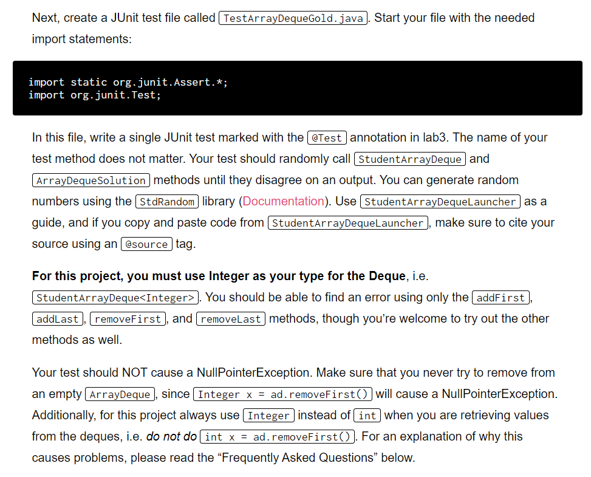
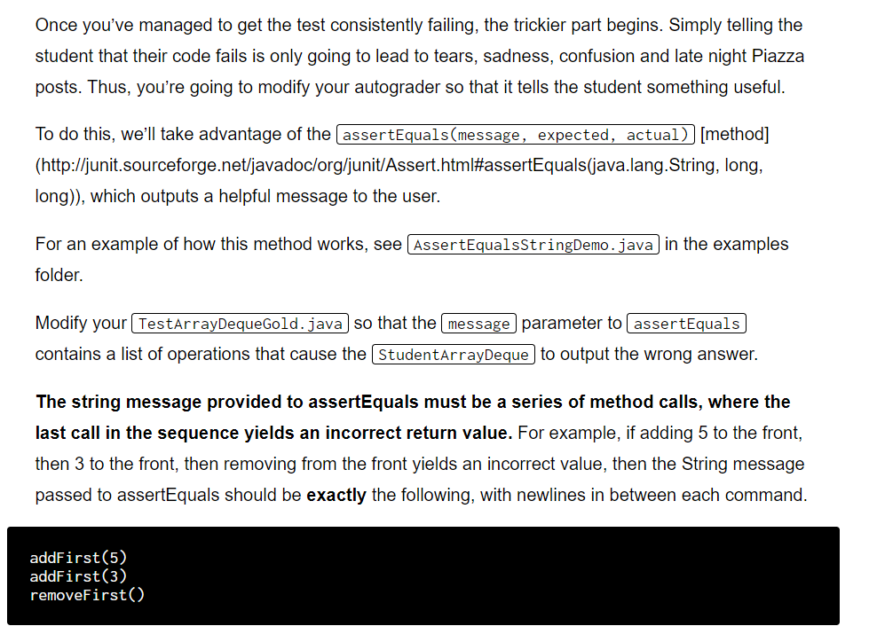
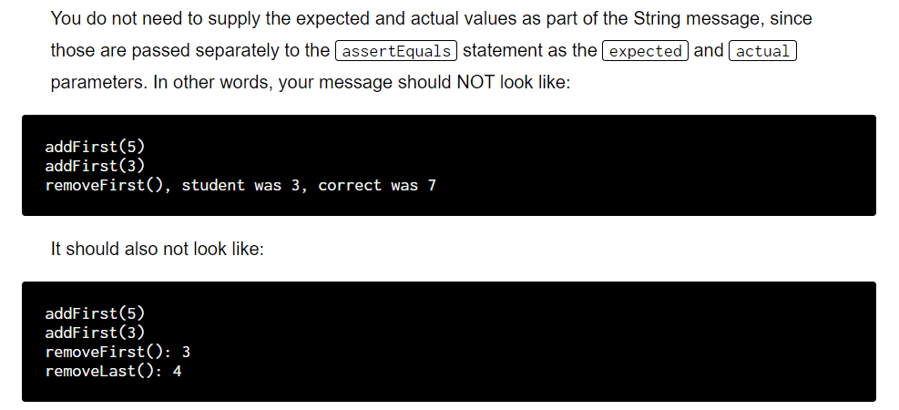
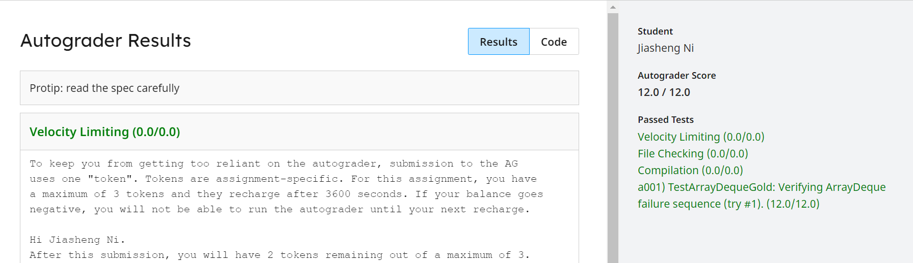

# Heads-up
:::info

:::


# Task I
:::info

Solution see task II
:::


# Task II
:::info

:::
**Hint**可以使用`StringBuilder`将当前操作的结果的字符串都保存下来知道某个操作出错，然后`sb.toString()`转换成字符串。
```java
import edu.princeton.cs.algs4.StdRandom;
import org.junit.Test;
import static org.junit.Assert.*;

/**
 * Created by AlexMan
 */
public class TestArrayDequeGold {

    @Test
    public void randomizedTest() {
        StringBuilder sb = new StringBuilder();
        ArrayDequeSolution<Integer> ads = new ArrayDequeSolution<>();
        StudentArrayDeque<Integer> sad = new StudentArrayDeque<>();
        int N = 10000;
        for (int i = 0; i < N; i++) {
            double randomInt = StdRandom.uniform();
            int rand = StdRandom.uniform(10);
            if (randomInt > 0.75) {
                ads.addFirst(rand);
                sad.addFirst(rand);
                sb.append("addFirst(" + rand + ")\n");
            } else if (randomInt > 0.5) {
                ads.addLast(i);
                sad.addLast(i);
                sb.append("addLast(" + rand + ")\n");
            } else if (randomInt > 0.25) {
                // Use Integer instead of int to prevent NullPointerException
                Integer first = ads.removeFirst();
                Integer first2 = sad.removeFirst();
                sb.append("removeFirst()\n");
                assertEquals(sb.toString(), first, first2);
            } else {
                Integer last = ads.removeLast();
                Integer last2 = sad.removeLast();
                sb.append("removeLast()\n");
                assertEquals(sb.toString(), last, last2);
            }
        }
    }
}

```


# Submission
:::info

:::


