[HW 1_ Packages, Interfaces, Generics, Exceptions, Iteration _ CS 61B Spring 2018.pdf](https://www.yuque.com/attachments/yuque/0/2023/pdf/12393765/1674707306545-43022305-3066-498a-befa-0fdbe938f567.pdf)
[hw1.zip](https://www.yuque.com/attachments/yuque/0/2023/zip/12393765/1674707345838-2bc4445e-c575-4224-b6c7-ff427cc39fcd.zip)
> **Prereq: **Project 1A & Pre-Lab6 in Project 2 (StdDraw)


# Introduction
**Overview**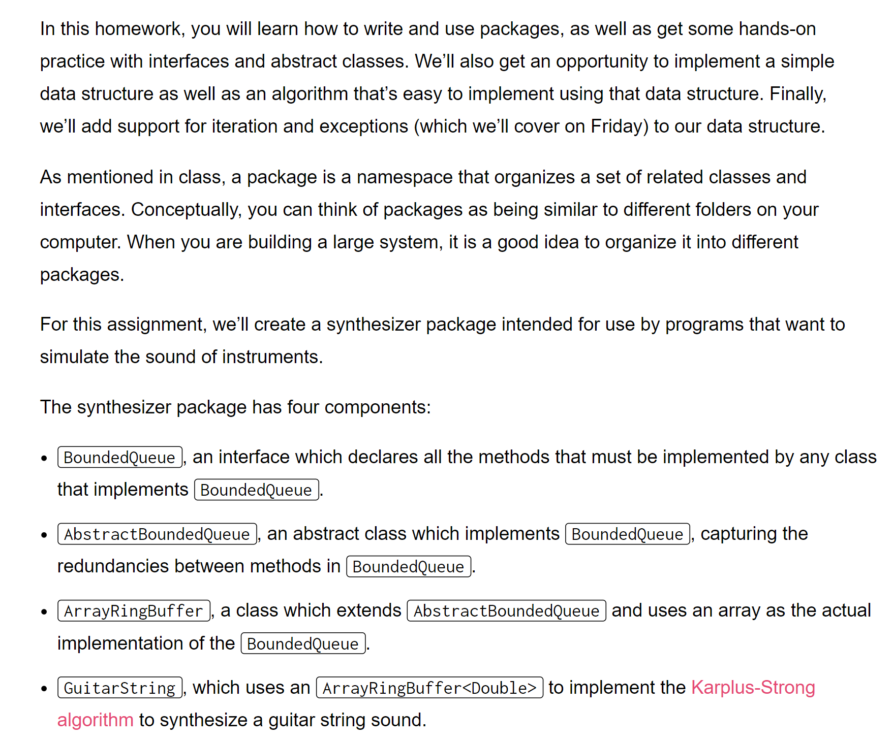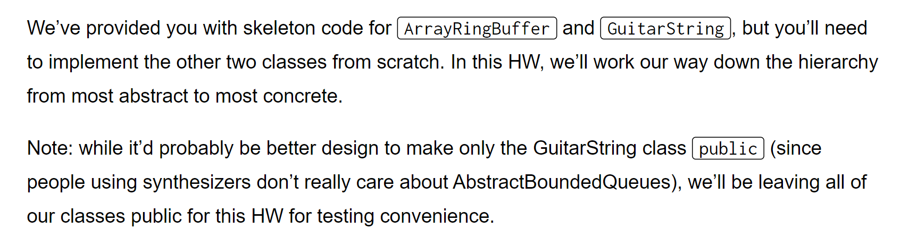


# Task1: BoundedQueue
> 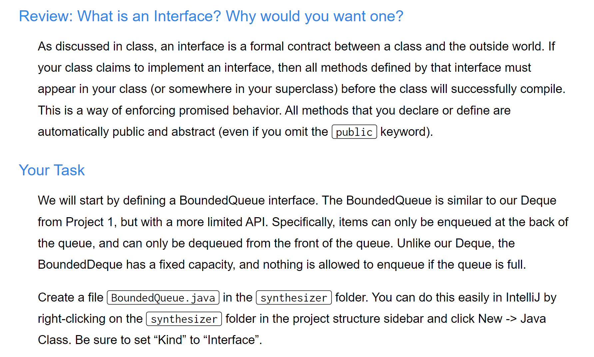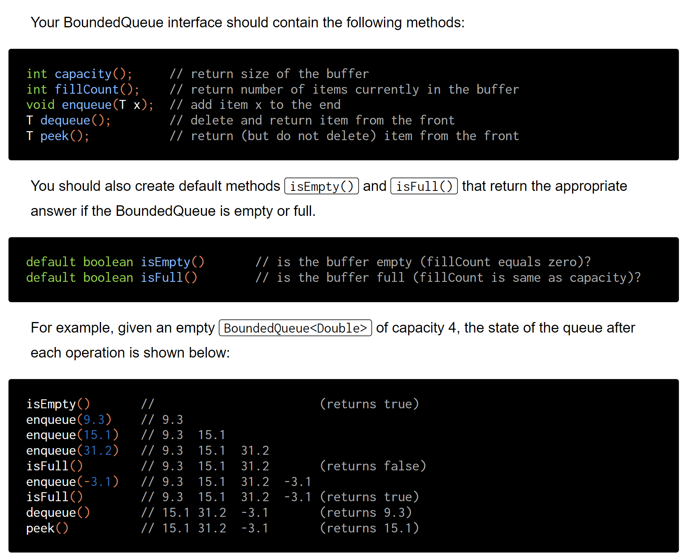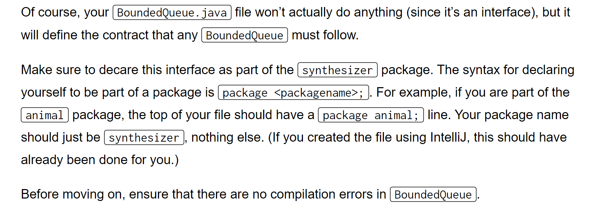

```java
package synthesizer;

/**
 * Created by AlexMan
 */
public interface BoundedQueue<T> {

    int capacity();     // return size of the buffer
    int fillCount();    // return number of items currently in the buffer
    void enqueue(T x);  // add item x to the end
    T dequeue();        // delete and return item from the front
    T peek();           // return (but do not delete) item from the front

    // is the buffer empty (fillCount equals zero)?
    default boolean isEmpty() {
        return fillCount() == 0;
    }


    // is the buffer full (fillCount is same as capacity)?
    default boolean isFull() {
        return capacity() == fillCount();
    }
}

```


# Task2 AbstractBoundedQueue
> 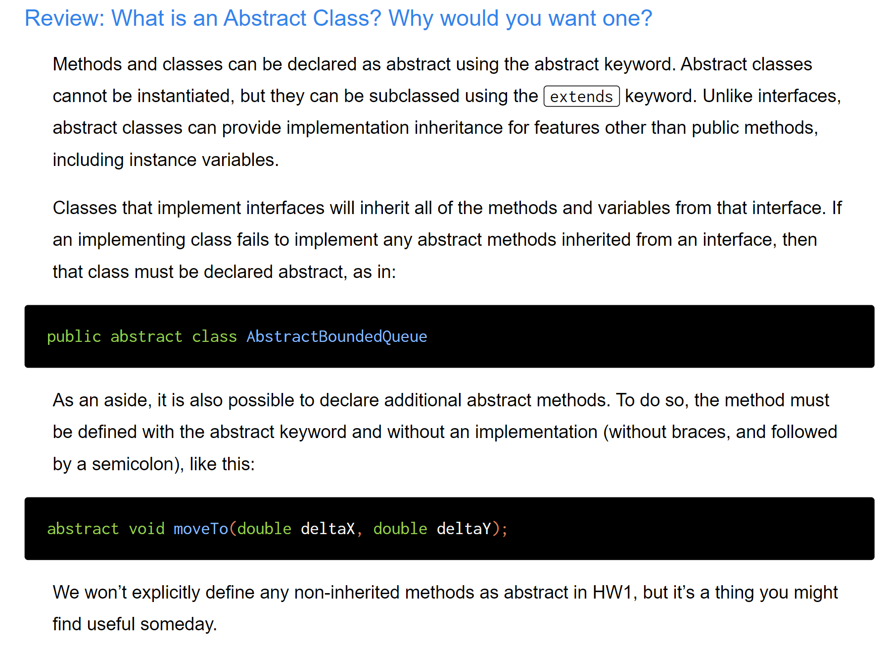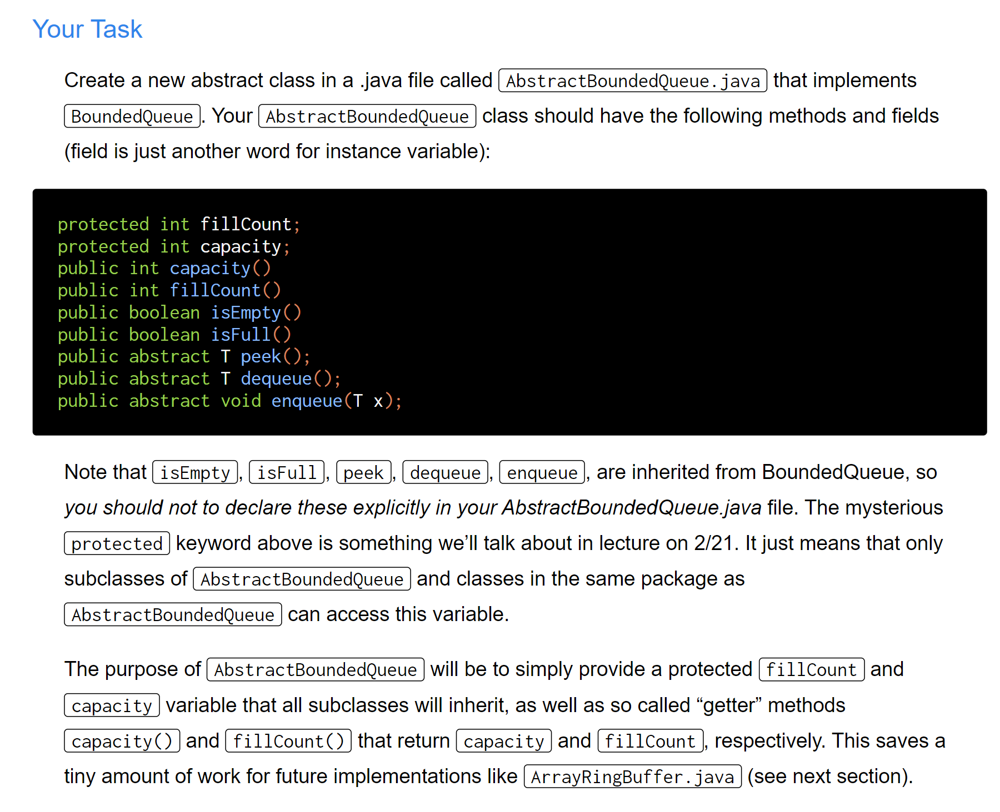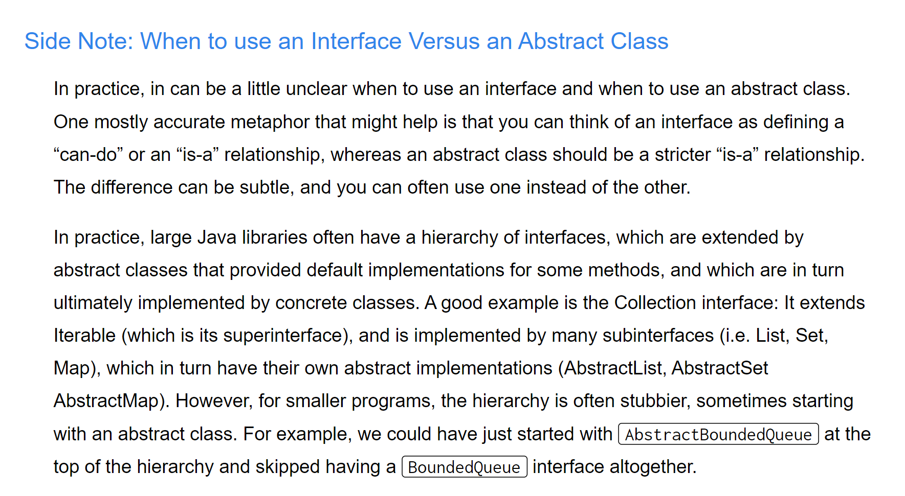
> `Abstract Class`在`implements`了一个`interface`之后，可以不实现`interface`中的所有方法，因为`abstract class`本身反正不能被实例化。

```java
package synthesizer;

/**
 * Created by AlexMan
 */
public abstract class AbstractBoundedQueue<T> implements BoundedQueue<T> {
    protected int fillCount;
    protected int capacity;

    @Override
    public int capacity() {
        return capacity;
    }
    @Override
    public int fillCount() {
        return fillCount;
    }
}


```

# Task3 ArrayRingBuffer
> 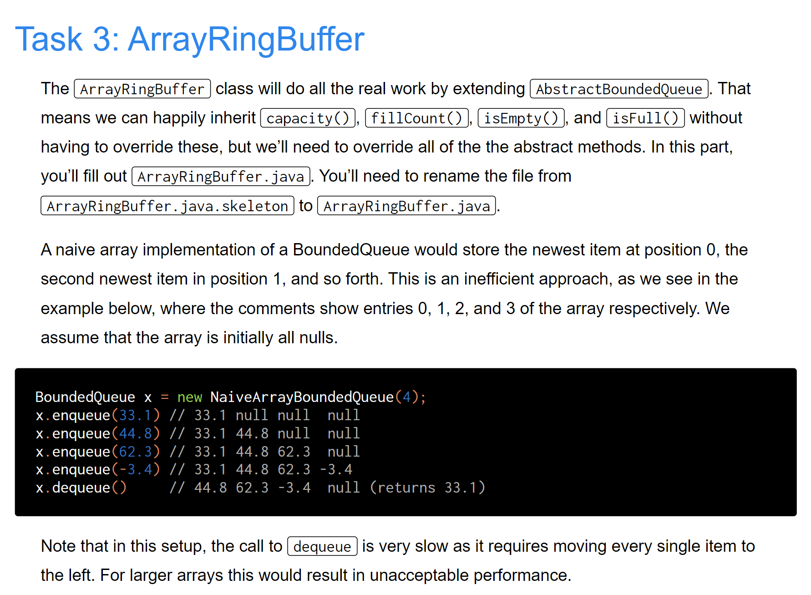

**Graphical Explanations of the data structure**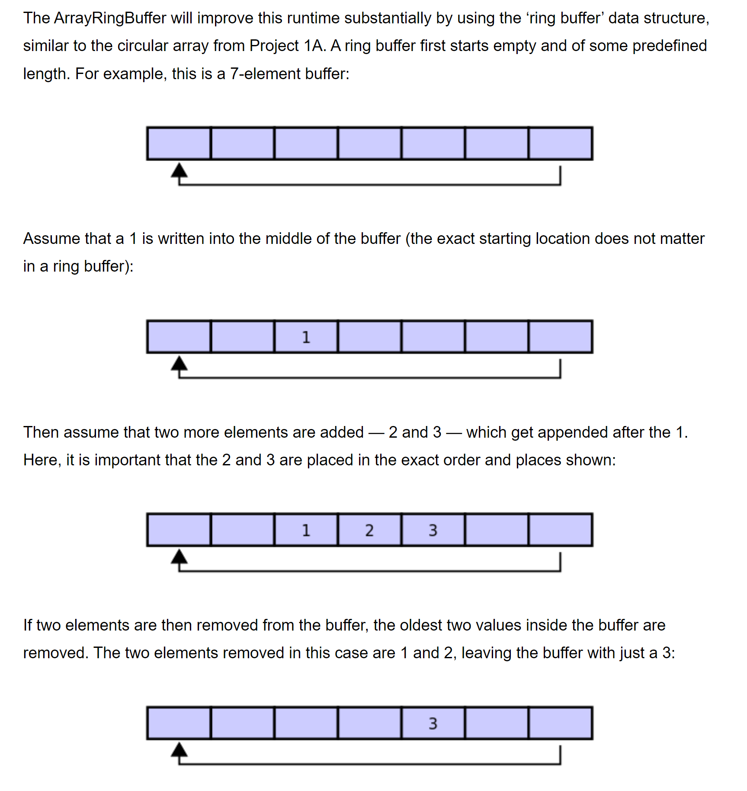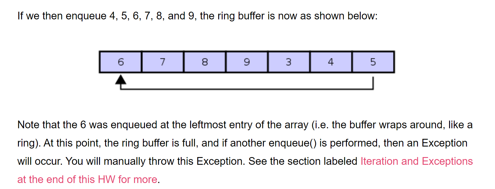
> 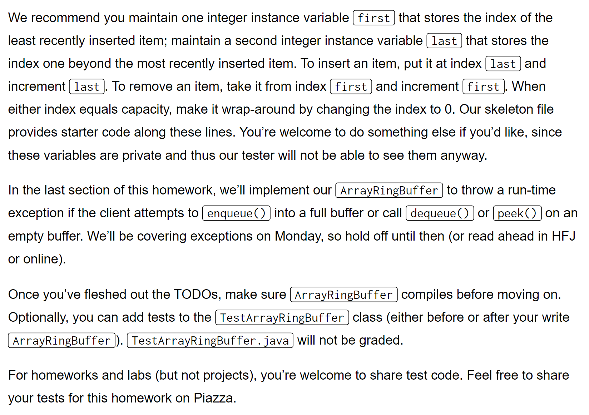

```java
// TODO: Make sure to make this class a part of the synthesizer package
// package <package name>;
import java.util.Iterator;

//TODO: Make sure to make this class and all of its methods public
//TODO: Make sure to make this class extend AbstractBoundedQueue<t>
public class ArrayRingBuffer<T>  {
    /* Index for the next dequeue or peek. */
    private int first;            // index for the next dequeue or peek
    /* Index for the next enqueue. */
    private int last;
    /* Array for storing the buffer data. */
    private T[] rb;

    /**
     * Create a new ArrayRingBuffer with the given capacity.
     */
    public ArrayRingBuffer(int capacity) {
        // TODO: Create new array with capacity elements.
        //       first, last, and fillCount should all be set to 0.
        //       this.capacity should be set appropriately. Note that the local variable
        //       here shadows the field we inherit from AbstractBoundedQueue, so
        //       you'll need to use this.capacity to set the capacity.
    }

    /**
     * Adds x to the end of the ring buffer. If there is no room, then
     * throw new RuntimeException("Ring buffer overflow"). Exceptions
     * covered Monday.
     */
    public void enqueue(T x) {
        // TODO: Enqueue the item. Don't forget to increase fillCount and update last.
    }

    /**
     * Dequeue oldest item in the ring buffer. If the buffer is empty, then
     * throw new RuntimeException("Ring buffer underflow"). Exceptions
     * covered Monday.
     */
    public T dequeue() {
        // TODO: Dequeue the first item. Don't forget to decrease fillCount and update 
    }

    /**
     * Return oldest item, but don't remove it.
     */
    public T peek() {
        // TODO: Return the first item. None of your instance variables should change.
    }

    // TODO: When you get to part 5, implement the needed code to support iteration.
}

```
```java
// TODO: Make sure to make this class a part of the synthesizer package
package synthesizer;
import synthesizer.AbstractBoundedQueue;

import java.util.Iterator;

//TODO: Make sure to make this class and all of its methods public
//TODO: Make sure to make this class extend AbstractBoundedQueue<t>
public class ArrayRingBuffer<T> extends AbstractBoundedQueue<T> {
    /* Index for the next dequeue or peek. */
    private int first;            // index for the next dequeue or peek
    /* Index for the next enqueue. */
    private int last;
    /* Array for storing the buffer data. */
    private T[] rb;

    /**
     * Create a new ArrayRingBuffer with the given capacity.
     */
    public ArrayRingBuffer(int capacity) {
        // TODO: Create new array with capacity elements.
        //       first, last, and fillCount should all be set to 0.
        //       this.capacity should be set appropriately. Note that the local variable
        //       here shadows the field we inherit from AbstractBoundedQueue, so
        //       you'll need to use this.capacity to set the capacity.
        first = 0;
        last = 0;
        this.capacity = capacity;
        this.fillCount = 0;
        rb = (T[]) new Object[capacity()];
    }

    /**
     * Adds x to the end of the ring buffer. If there is no room, then
     * throw new RuntimeException("Ring buffer overflow"). Exceptions
     * covered Monday.
     */
    @Override
    public void enqueue(T x) {
        // TODO: Enqueue the item. Don't forget to increase fillCount and update last.
        if (isFull()) {
            throw new RuntimeException("Cannot enqueue when the queue is full!");
        }
        rb[last] = x;
        last = (last + 1) % capacity();
        this.fillCount++;
    }

    /**
     * Dequeue oldest item in the ring buffer. If the buffer is empty, then
     * throw new RuntimeException("Ring buffer underflow"). Exceptions
     * covered Monday.
     */
    @Override
    public T dequeue() {
        // TODO: Dequeue the first item. Don't forget to decrease fillCount and update
        if (isEmpty()) {
            throw new RuntimeException("Cannot dequeue when the queue is empty!");
        }
        T res = rb[first];
        first = (first + capacity() - 1) % capacity();
        this.fillCount--;
        return res;
    }

    /**
     * Return oldest item, but don't remove it.
     */
    @Override
    public T peek() {
        // TODO: Return the first item. None of your instance variables should change.
        if (isEmpty()) {
            throw new RuntimeException("Cannot dequeue when the queue is empty!");
        }
        return rb[first];
    }

    // TODO: When you get to part 5, implement the needed code to support iteration.
}

```
```java
@Test
public void testEnQeQueue() {
    ArrayRingBuffer arb = new ArrayRingBuffer(10);
    System.out.println("enqueue()");
    for (int i = 0; i < 10; i++) {
        System.out.println(i);
        arb.enqueue(i);
    }

    System.out.println("dequeue()");
    for (int i = 0; i < 11; i++) {
        System.out.println(i);
        arb.dequeue();
    }
}
```

# Task4 GuitarString
> 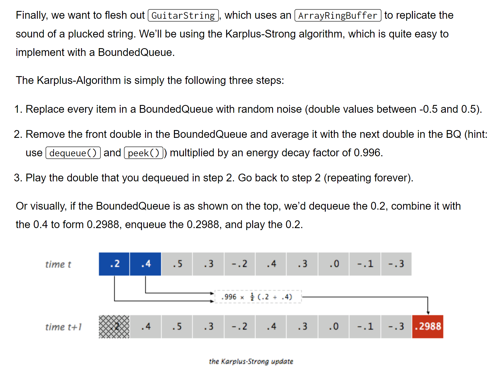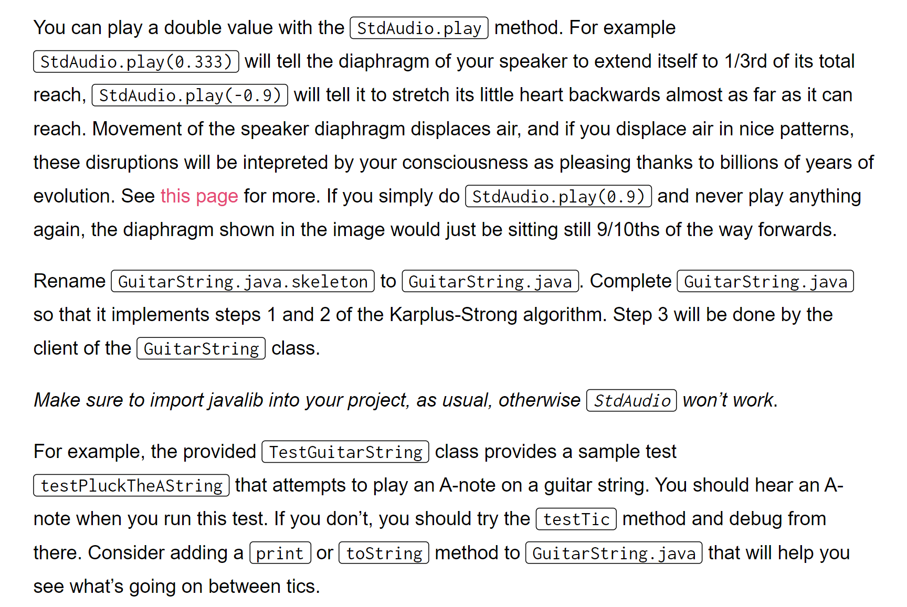

```java
// TODO: Make sure to make this class a part of the synthesizer package
//package <package name>;

import synthesizer.BoundedQueue;

//Make sure this class is public
public class GuitarString {
    /** Constants. Do not change. In case you're curious, the keyword final means
     * the values cannot be changed at runtime. We'll discuss this and other topics
     * in lecture on Friday. */
    private static final int SR = 44100;      // Sampling Rate
    private static final double DECAY = .996; // energy decay factor

    /* Buffer for storing sound data. */
    private BoundedQueue<Double> buffer;

    /* Create a guitar string of the given frequency.  */
    public GuitarString(double frequency) {
        // TODO: Create a buffer with capacity = SR / frequency. You'll need to
        //       cast the result of this divsion operation into an int. For better
        //       accuracy, use the Math.round() function before casting.
        //       Your buffer should be initially filled with zeros.
    }


    /* Pluck the guitar string by replacing the buffer with white noise. */
    public void pluck() {
        // TODO: Dequeue everything in the buffer, and replace it with random numbers
        //       between -0.5 and 0.5. You can get such a number by using:
        //       double r = Math.random() - 0.5;
        //
        //       Make sure that your random numbers are different from each other.
    }

    /* Advance the simulation one time step by performing one iteration of
     * the Karplus-Strong algorithm. 
     */
    public void tic() {
        // TODO: Dequeue the front sample and enqueue a new sample that is
        //       the average of the two multiplied by the DECAY factor.
        //       Do not call StdAudio.play().
    }

    /* Return the double at the front of the buffer. */
    public double sample() {
        // TODO: Return the correct thing.
        return 0;
    }
}

```
```java
// TODO: Make sure to make this class a part of the synthesizer package
package synthesizer;

import synthesizer.BoundedQueue;

//Make sure this class is public
public class GuitarString {
    /** Constants. Do not change. In case you're curious, the keyword final means
     * the values cannot be changed at runtime. We'll discuss this and other topics
     * in lecture on Friday. */
    private static final int SR = 44100;      // Sampling Rate
    private static final double DECAY = .996; // energy decay factor

    /* Buffer for storing sound data. */
    private BoundedQueue<Double> buffer;

    /* Create a guitar string of the given frequency.  */
    public GuitarString(double frequency) {
        // TODO: Create a buffer with capacity = SR / frequency. You'll need to
        //       cast the result of this divsion operation into an int. For better
        //       accuracy, use the Math.round() function before casting.
        //       Your buffer should be initially filled with zeros.
        buffer = new ArrayRingBuffer<>((int) Math.round(SR / frequency));
        // Fill with zero
        for (int i = 0; i < buffer.capacity(); i++) {
            buffer.enqueue(0.0);
        }
    }


    /* Pluck the guitar string by replacing the buffer with white noise. */
    public void pluck() {
        // TODO: Dequeue everything in the buffer, and replace it with random numbers
        //       between -0.5 and 0.5. You can get such a number by using:
        //       double r = Math.random() - 0.5;
        //
        //       Make sure that your random numbers are different from each other.
        double prevDouble = -4.0;  // Any number that is not in the range [-0.5, 0.5]
        for (int i = 0; i< buffer.capacity(); i++) {
            buffer.dequeue();
            double currentDouble = Math.random() - 0.5;
            while (currentDouble == prevDouble) {
                currentDouble = Math.random() - 0.5;
            }
            buffer.enqueue( currentDouble);
            prevDouble = currentDouble;
        }
    }

    /* Advance the simulation one time step by performing one iteration of
     * the Karplus-Strong algorithm. 
     */
    public void tic() {
        // TODO: Dequeue the front sample and enqueue a new sample that is
        //       the average of the two multiplied by the DECAY factor.
        //       Do not call StdAudio.play().

        // 注意不能在乘法中写 (1 / 2), 这样由于1和2都是整数，Java中的整数除法会自动将
        // 小数点后的精度truncate掉，导致结果是0.0
        buffer.enqueue(DECAY * (buffer.dequeue() + buffer.peek()) / 2);
    }

    /* Return the double at the front of the buffer. */
    public double sample() {
        // TODO: Return the correct thing.
        return buffer.peek();
    }

    @Override
    public String toString() {
        StringBuilder sb = new StringBuilder();
        for (int i = 0; i < buffer.capacity(); i++) {
            double temp = buffer.dequeue();
            sb.append(temp);
            sb.append(" ");
            buffer.enqueue(temp);
        }
        return sb.toString();
    }

    public void printBuffer() {
        System.out.println(this);
    }
}

```


# TTFAF
> 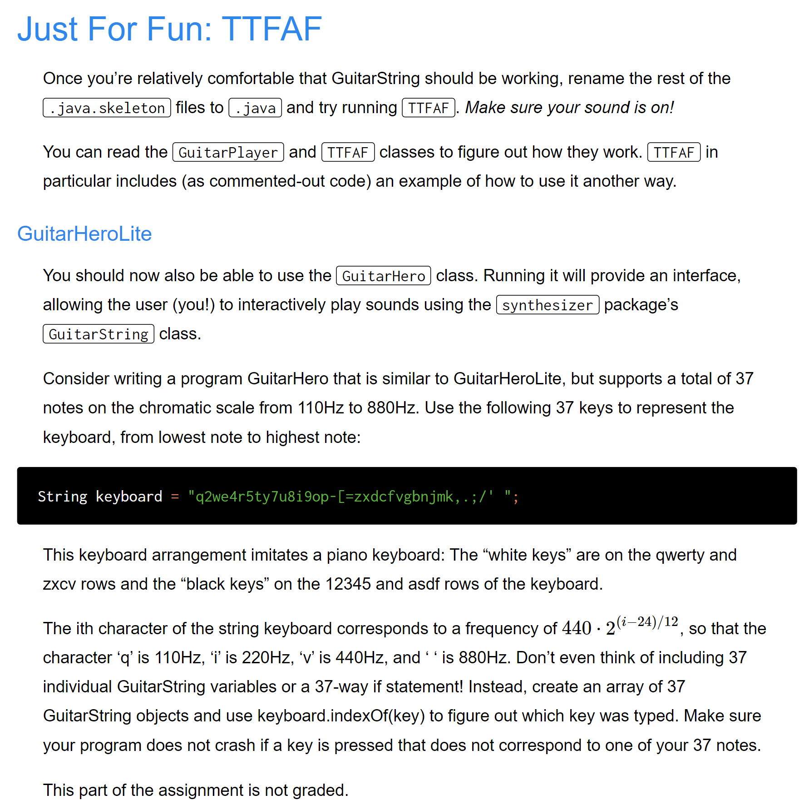

```java
/**
 * Created by AlexMan
 */
public class GuitarHero {
    private static final double CONCERT_A = 440.0;
    private static final String KEYBOARD = "q2we4r5ty7u8i9op-[=zxdcfvgbnjmk,.;/' ";

    // Simulate the keyboard
    public static void main(String[] args) {
        synthesizer.GuitarString[] guitarStrings = new synthesizer.GuitarString[KEYBOARD.length()];
        for (double i = 0; i < KEYBOARD.length(); i++) {
            synthesizer.GuitarString gs = new synthesizer.GuitarString(CONCERT_A * Math.pow(2, (i - 24) / 12));
            guitarStrings[(int) i] = gs;
        }

        // Listening Loop
        while (true) {
            if (StdDraw.hasNextKeyTyped()) {
                char c = StdDraw.nextKeyTyped();
                double i = KEYBOARD.indexOf(c);
                if ((int) i == -1) {
                    System.out.println("Invalid Keyboard Input!");
                    continue;
                }
                guitarStrings[(int) i].pluck();
            }

            /* compute the superposition of samples */
            double sample = 0.0;
            for (synthesizer.GuitarString gs: guitarStrings) {
                sample += gs.sample();
            }

            /* play the sample on standard audio */
            StdAudio.play(sample);

            /* advance the simulation of each guitar string by one step */
            for (synthesizer.GuitarString gs: guitarStrings) {
                gs.tic();
            }
        }
    }
}
```


# Even More Fun/Why it works?
> 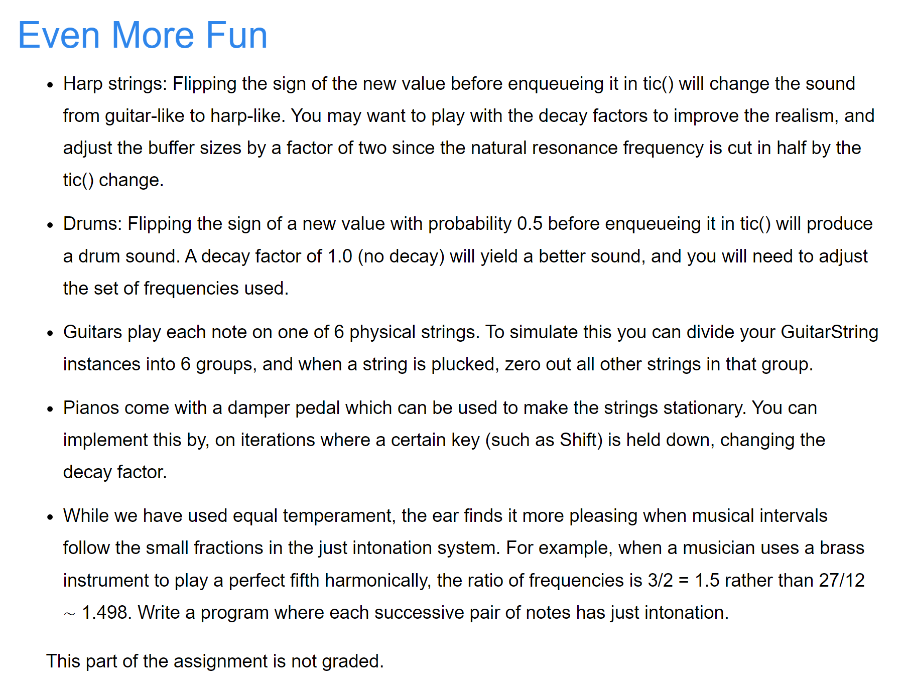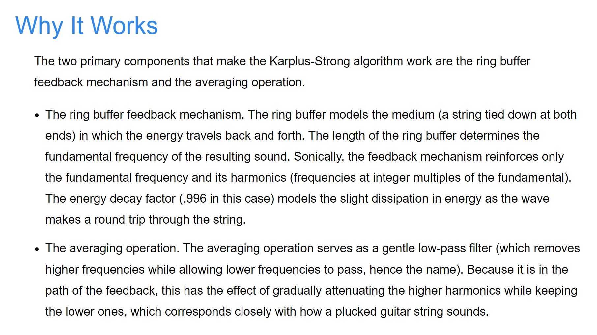


# Task5 Iteration and Exceptions
> 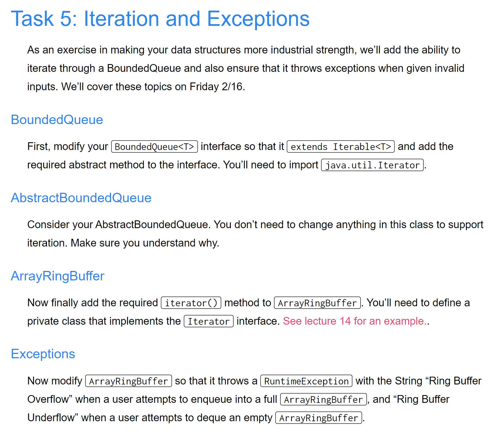

```java
package synthesizer;

import java.util.Iterator;

/**
 * Created by AlexMan
 */
public interface BoundedQueue<T> extends Iterable<T> {

    int capacity();     // return size of the buffer
    int fillCount();    // return number of items currently in the buffer
    void enqueue(T x);  // add item x to the end
    T dequeue();        // delete and return item from the front
    T peek();           // return (but do not delete) item from the front
    @Override
    Iterator<T> iterator();
    
    
    // is the buffer empty (fillCount equals zero)?
    default boolean isEmpty() {
        return fillCount() == 0;
    }
    

    // is the buffer full (fillCount is same as capacity)?
    default boolean isFull() {
        return capacity() == fillCount();
    }
}

```
```java
package synthesizer;

/**
 * Created by AlexMan
 */
public abstract class AbstractBoundedQueue<T> implements BoundedQueue<T> {
    protected int fillCount;
    protected int capacity;

    @Override
    public int capacity() {
        return capacity;
    }
    @Override
    public int fillCount() {
        return fillCount;
    }
}

```
```java
package synthesizer;
import java.util.Iterator;

public class ArrayRingBuffer<T> extends AbstractBoundedQueue<T> {
    /* Index for the next dequeue or peek. */
    private int first;            // index for the next dequeue or peek
    /* Index for the next enqueue. */
    private int last;
    /* Array for storing the buffer data. */
    private T[] rb;

    /**
     * Create a new ArrayRingBuffer with the given capacity.
     */
    public ArrayRingBuffer(int capacity) {
        // Create new array with capacity elements.
        //    first, last, and fillCount should all be set to 0.
        //    this.capacity should be set appropriately. Note that the local variable
        //    here shadows the field we inherit from AbstractBoundedQueue, so
        //    you'll need to use this.capacity to set the capacity.
        first = 0;
        last = 0;
        this.capacity = capacity;
        fillCount = 0;
        rb = (T[]) new Object[capacity];
    }

    /**
     * Adds x to the end of the ring buffer. If there is no room, then
     * throw new RuntimeException("Ring buffer overflow"). Exceptions
     * covered Monday.
     */
    @Override
    public void enqueue(T x) {
        // Enqueue the item. Don't forget to increase fillCount and update last.
        if (isFull()) {
            throw new RuntimeException("Ring Buffer Overflow");
        }
        rb[last] = x;
        last = (last + 1) % capacity;
        fillCount++;
    }

    /**
     * Dequeue oldest item in the ring buffer. If the buffer is empty, then
     * throw new RuntimeException("Ring buffer underflow"). Exceptions
     * covered Monday.
     */
    @Override
    public T dequeue() {
        // Dequeue the first item. Don't forget to decrease fillCount and update
        if (isEmpty()) {
            throw new RuntimeException("Ring Buffer Underflow");
        }
        T res = rb[first];
        first = (first + capacity - 1) % capacity;
        fillCount--;
        return res;
    }

    /**
     * Return oldest item, but don't remove it.
     */
    @Override
    public T peek() {
        // Return the first item. None of your instance variables should change.
        if (isEmpty()) {
            throw new RuntimeException("Ring Buffer Underflow");
        }
        return rb[first];
    }

    // When you get to part 5, implement the needed code to support iteration.

    @Override
    public Iterator<T> iterator() {
        return new GuitarIterator();
    }


    private class GuitarIterator implements Iterator<T> {
        protected int index;

        GuitarIterator() {
            index = 0;
        }

        @Override
        public boolean hasNext() {
            return index < fillCount;
        }

        @Override
        public T next() {
            T res = rb[(first + index) % capacity];
            index++;
            return res;
        }
    }
}

```

# Submission
> 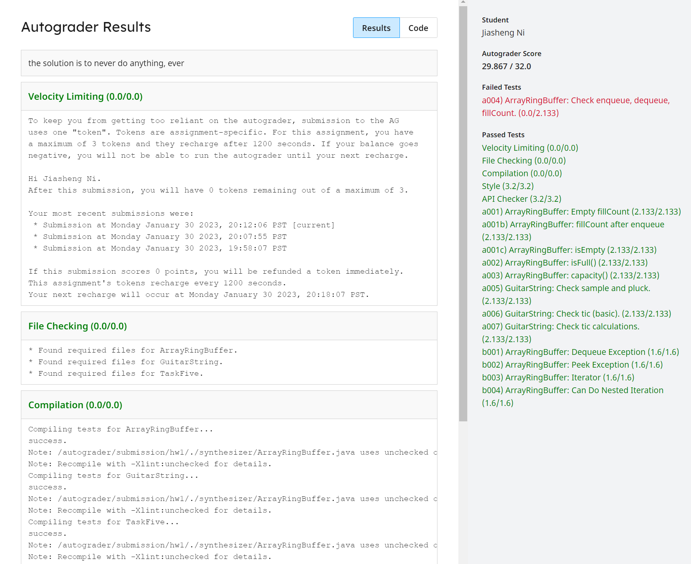


