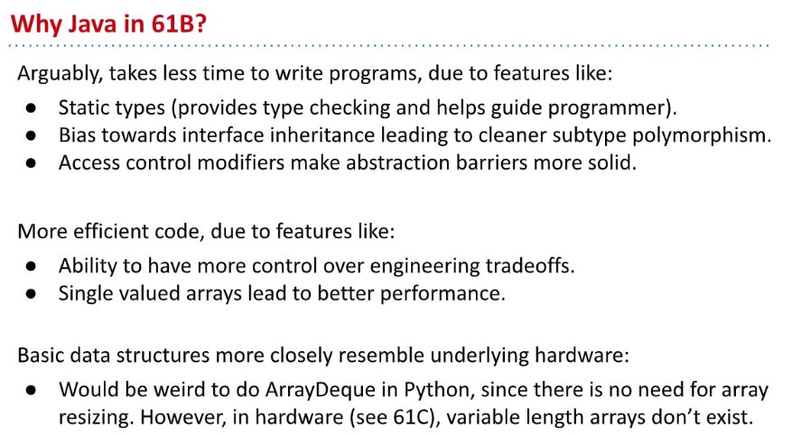
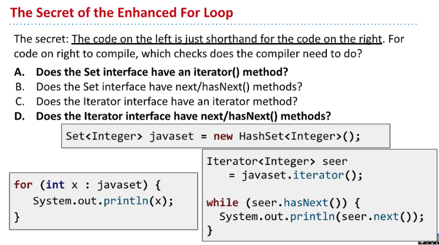

# 1 ADTs&Java libraries&Packages
[cs61b 2018 lec11 inheritance4.pdf](https://www.yuque.com/attachments/yuque/0/2023/pdf/12393765/1674302530055-3a51e171-6b6e-40dc-89f7-426e574d299d.pdf)
[cs61b 2018 lec15 syntax3 access control, objects.pdf](https://www.yuque.com/attachments/yuque/0/2023/pdf/12393765/1674371250170-5cce2888-a18f-4801-b036-830f3c62081b.pdf)
## ADTs
:::info

:::


### Stack ADT
:::info

:::


### GrabBag ADT
:::info

:::


## Java Libaraies
### Collection
:::info

:::

### Class Exercises
:::info

:::
```java
import java.util.*;

/**
 * Created by AlexMan
 */
public class DemoCollection {

    /**
     *  Returns a lower case version of the string with
     *  all characters except letters removed
     * @param s
     * @return
     */
    public static String cleanString(String s) {
        return s.toLowerCase().replaceAll("[^a-z]", "");
    }


    /**
     * Get a list of all words in the file.
     * @param inputFilename
     * @return
     */
    public static List<String> getWords(String inputFilename) {
        List<String> words = new ArrayList<>();
        In in = new In(inputFilename);
        // 判断是否到了文件的尾部, see proj0
        while(!in.isEmpty()){
            String word = in.readString();
            word = DemoCollection.cleanString(word);
            words.add(word);
        }
        return words;
    }


    /**
     * Returns the count of the number of unique words in words
     * @param words
     * @return
     */
    public static int countUniqueWords(List<String> words) {
        // Construct set from List
//        HashSet wordset = new HashSet(words);
//        return wordset.size();


        // Start from empty set
        HashSet wordset = new HashSet();
        int count = 0;
        for (String word: words) {
            if (! wordset.contains(word)) {
                wordset.add(word);
                count ++ ;
            }
        }
        return count;
    }

    /**
     * Returns a map that tracks the count of all
     * unique word
     * @param wordsList
     * @return
     */
    public static Map<String, Integer> collectWordCount(List<String> wordsList) {
        HashMap<String, Integer> wordsMap = new HashMap<>();
        // Make sure all the words are in the map.
        for (String word: wordsList) {
            wordsMap.put(word, 0);
        }

        // Count the word, creating the wordsCountMap
        for (String word: wordsList) {
            if (wordsMap.containsKey(word)) {
                wordsMap.put(word, wordsMap.get(word) + 1);
            }
        }
        return wordsMap;
    }

    public static void main(String[] args) {
        List<String> w = getWords("libraryOfBabylon.txt");
        System.out.println(w);
    }
}
```
```java
import org.junit.Test;

import java.util.HashMap;
import java.util.List;
import java.util.Map;

/**
 * Created by AlexMan
 */
public class DemoCollectionTest {

    @Test
    public void testGetWords() {
        DemoCollection dc = new DemoCollection();
        String filename = "libraryOfBabylon.txt";
        System.out.println(dc.getWords(filename));
    }

    @Test
    public void testUniqueWords() {
        DemoCollection dc = new DemoCollection();
        String filename = "libraryOfBabylon.txt";
        List<String> words = dc.getWords(filename);
        int uniqueCount = dc.countUniqueWords(words);
        System.out.println(uniqueCount);
    }

    @Test
    public void tesdWordsCountMap() {
        DemoCollection dc = new DemoCollection();
        String filename = "libraryOfBabylon.txt";
        List<String> words = dc.getWords(filename);
        Map<String, Integer> wordsCountMap = dc.collectWordCount(words);
        System.out.println(wordsCountMap);
    }
}

```


### Java vs Python
:::info

:::


## Abstract Classes
### More on Interfaces
:::info

:::


### Intro on Abstract Classes
:::info

:::
**Exercises**
必须要重写`shred()`和`connectToWifi()`方法(`2`个)才能实例化`DCX9000`，否则`DCX9000`类也必须是抽象类。


### Abstract Classes in Java
:::info

:::


## Packages
### Canonicalization
:::info

:::


### Creating Packages
:::info

:::
**Detailed Steps**


### Import Packages
:::info

:::

### Using Packages
:::info

`Dog`类不能直接导入`DogLauncher`类。
:::


### Default Packages
:::info

:::
**Textbook**


## JAR Files
:::info

:::
**Remarks**


## Access Control⭐⭐⭐⭐⭐
### Private
:::info

:::

### Package Private - Default
:::info

:::

### Protected 
:::info

:::

### Public
:::info

:::

### At the Top Level
:::info

不能在一个`java`文件刚开始定义类的时候就使用`private`关键字或者`protected`关键字。
但是`public`或者`default`(也就是省略不写)可以。
:::

### Summary
:::info

:::


### Exercises
:::info

:::


## Study Guide Exercises
[Libraries Study Guide _ CS 61B Spring 2018.pdf](https://www.yuque.com/attachments/yuque/0/2023/pdf/12393765/1674302530069-a9a6c82c-73f2-48d7-9401-b03f08d22c8d.pdf)


# 2 Autoboxing & Immuntability & Generics
[cs61b 2018 lec13 syntax1.pdf](https://www.yuque.com/attachments/yuque/0/2023/pdf/12393765/1674311831401-43e7939f-745c-443e-aeb4-4bdbb61f27a3.pdf)

## Types
### Primitive Types
:::info

:::


### Reference Types
:::info

:::


## Automatic Autoboxing/Unboxing
### How?
:::info

:::
**Caveats**

### Memory Performance
:::info

:::


### Primitive Widening
:::info

:::


## Immutability
:::info

:::


## Generic Classes - ArrayMap
### Goals
:::info

:::
```java
package Map61B;
import java.util.List;

public interface Map61B<K, V> {
    /* Returns true if this map contains a mapping for the specified key. */
    boolean containsKey(K key);

    /* Returns the value to which the specified key is mapped. No defined
     * behavior if the key doesn't exist (ok to crash). */
    V get(K key);

    /* Returns the number of key-value mappings in this map. */
    int size();

    /* Associates the specified value with the specified key in this map. */
    void put(K key, V value);

    /* Returns a list of the keys in this map. */
    List<K> keys();
}
```
```java
package Map61B;

import org.junit.Assert.*;
import java.util.List;
import java.util.ArrayList;
import org.junit.Test;


import static org.junit.Assert.*;

/**
 * An array based implementation of the Map61B class.
 */
public class ArrayMap<K, V> implements Map61B<K, V> {
    public ArrayMap() {
    }

    /** Returns the index of the given key if it exists,
     *  -1 otherwise. */
    private int keyIndex(K key) {
        return 0;
    }


    public boolean containsKey(K key) {
        return false;
    }

    public void put(K key, V value) {
        
    }

    public V get(K key) {
        return false;
    }

    public int size() {
        return 0;
    }

    public List<K> keys() {
        return null;
    }

    /*@Test
    public void test() {
        ArrayMap<Integer, Integer> am = new ArrayMap<Integer, Integer>();
        am.put(2, 5);
        int expected = 5;
        assertEquals(expected, am.get(2));
    }*/

    public static void main(String[] args) {
        ArrayMap<String, Integer> m = new ArrayMap<String, Integer>();
        m.put("horse", 3);
        m.put("fish", 9);
        m.put("house", 10);
    }
}

```


### Step1 Creating Generic Classes
:::info

:::
```java
private K[] keys;
private V[] values;
private int size;
private int MAXCAPACITY = 100;

public ArrayMap() {
    keys = (K[]) new Object[MAXCAPACITY];
    values = (V[]) new Object[MAXCAPACITY];
    size = 0;
}
```

### Step2 Basic member methods
:::info

:::
```java
/** Returns the index of the given key if it exists,
 *  -1 otherwise. */
private int keyIndex(K key) {
    // the upper bound may better be "size", because we don't want to
    // traverse all the empty keys
    for(int i = 0; i < size; i++){
        // might not use ==, instead we should use .equals()
        // equals is similar to assertEquals
        // If two objects point to the same address, equals returns true
        // If not, then equals invoke the "equals()" method on the
        // object, and let user define how equal objects should be
        // like, more on this later.
        if (keys[i].equals(key)) {
            return i;
        }
    }
    return -1;
}


/**
 * Judge if we have a specified key
 * @param key
 * @return
 */
public boolean containsKey(K key) {
    int index = keyIndex(key);
    return index > -1;
}


// Without resizing
public void put(K key, V value) {
    int index = keyIndex(key);
    if (index == -1) {
        // If DNE
        keys[size] = key;
        values[size] = value;
        size++; // Don't forget.
    } else {
        // If exists
        values[index] = value;
    }
}


/**
 * Get the value by a key
 * @param key
 * @return
 */
public V get(K key) {
    int index = keyIndex(key);
    if (index > -1) {
        return values[index];
    }
    return null;
}

public int size() {
    return size;
}


/**
 * Get all keys, and return a List
 * @return
 */
public List<K> keys() {
    List<K> keyList = new ArrayList<>();
    for (int i = 0; i < size; i++) {
        keyList.add(keys[i]);
    }
    return keyList;
}
```

### Autoboxing Puzzle - assertEquals
:::info
**我们看到下面的代码:**

编译器报了一个错。

`assertEquals`需要接受两个`Object`, 而不是`primitive types`, 所以需要转型。

:::
**Widening Exercises**


## Generic Methods - MapHelper
### Goals
:::info

:::
```java
package Map61B;

import static org.junit.Assert.*;
import org.junit.Test;
import java.util.List;

/**
 * Class to demonstrate how generic methods work in Java.
 */
public class MapHelper {
    /* Write the following three methods:
    /* get(Key) : Return item in map if it exists. */
    /* maxKey() : Returns max of all keys. Works only if x and y have comparable data. */
    /* allBark(): Makes all keys bark, but only works for Dogs. */

    @Test
    public void testGet() {
        Map61B<String, Integer> m = new ArrayMap<String, Integer>();
        m.put("horse", 3);
        m.put("fish", 9);
        m.put("house", 10);

        /*Integer actual = MapHelper.get(m, "fish");
        Integer expected = 9;
        assertEquals(expected, actual);*/
    }

    @Test
    public void testMaxKey() {
        Map61B<String, Integer> m = new ArrayMap<String, Integer>();
        m.put("horse", 3);
        m.put("fish", 9);
        m.put("house", 10);

        /*String actual = MapHelper.maxKey(m);
        String expected = "house";
        assertEquals(expected, actual);*/
    }    
}

```


### Generic Get() - <generic>
:::info
**Hint:**

:::
```java
/* get(Key) : Return item in map if it exists. */
public static <K,V> V get(Map<K,V> sim, K key) {
    if (sim.containsKey(key)) {
        return sim.get(key);
    }
    return null;
}
```


### Generic mapKey() - Type Upper Bounds
:::info

:::
```java
/* maxKey() : Returns max of all keys. Works only if x and y have comparable data. */
public static <K extends Comparable<K>,V> K maxKey(Map61B<K,V> map) {
    List<K> keylist = map.keys();
    K largest = keylist.get(0);
    for (K k: keylist) {
        if (k.compareTo(largest) > 0) {
            largest = k;
        }
    }
    return largest;
}
```
**Remarks about extends - constraint rather than power**


## Generic Summary
:::info

:::


## Study Guide Exercises
[Generics Study Guide _ CS 61B Spring 2018.pdf](https://www.yuque.com/attachments/yuque/0/2023/pdf/12393765/1674311798933-0c22fd8f-a829-423c-87a9-90899b681a2e.pdf)


# 3 Real Codes&Iterations&Exceptions
[cs61b 2021 lec11 inheritance4 equals, exceptions, iterations, lists, sets, maps.pdf](https://www.yuque.com/attachments/yuque/0/2023/pdf/12393765/1674353454584-f88e574f-aa44-4a58-8dc8-186f5456792c.pdf)

## Real Java Codes 
:::info

:::


## ArraySet - Exceptions
### Goals
:::info

:::


### Basic Implemenation
:::info
**Video link here:** [https://www.youtube.com/watch?v=gX9KFdZBg-k](https://www.youtube.com/watch?v=gX9KFdZBg-k)

:::
```java
public class ArraySet<T> {

    private T[] items;
    private int MAXCAPACITY = 100;
    private int size;

    public ArraySet() {
        items = (T[]) new Object[MAXCAPACITY];
        size = 0;
    }

    /* Returns true if this map contains a mapping for the specified key.
     */
    public boolean contains(T x) {
        for (int i = 0; i < size; i++) {
            if (items[i].equals(x)) {
                return true;
            }
        }
        return false;
    }

    /* Associates the specified value with the specified key in this map. 
       Throws an IllegalArgumentException if the key is null. */
    public void add(T x) {
        if (!contains(x)) {
            items[size] = x;
            size++;
        }
    }

    /* Returns the number of key-value mappings in this map. */
    public int size() {
        return size;
    }

    public static void main(String[] args) {
        ArraySet<String> s = new ArraySet<>();
        s.add(null);
        s.add("horse");
        s.add("fish");
        s.add("house");
        s.add("fish");
        System.out.println(s.contains("horse"));
        System.out.println(s.size());
    }

    /* Also to do:
    1. Make ArraySet implement the Iterable<T> interface.
    2. Implement a toString method.
    3. Implement an equals() method.
    */
}
```
:::info

上面的测试用例不会导致报错，但是下面我们将分析上述`ArraySet`代码实现中出现的一些比较严重的错误。
:::


### Throw Explicit Exceptions
:::info

:::
```java
/* Associates the specified value with the specified key in this map.
   Throws an IllegalArgumentException if the key is null. */
public void add(T x) {
    if (x == null) {
        throw new IllegalArgumentException("can't add null");
    }
    if (contains(x)) {
        return;
    }
    items[size] = x;
    size += 1;
}
```


## Iteration⭐⭐⭐
### How it works?
:::info

`next()`将指针指向后面一个`index`
`hasNext()`判断当前指针是否指向一个元素。
:::
**Exercises**


### Implementing Iterables⭐⭐⭐
:::info

如果我们想要我们的数据结构支持`enhanced for loop`，我们需要做下面几步:

1. 在类中实现一个`iterator()`方法，这个方法返回一个`Iterator<T>`
2. 在类中嵌套定义一个`ObjIterator implements Iterator<T>`, 并且重写`next()`和`hasNext()`方法，并添加`Constructor`方法。到这里我们就可以使用右上方的`Ugly Iteration`了。
3. 最后让这个类`implements Iterables<T>`(**就是告知**`**Java**`**我们要让这个类支持**`**Enhanced For Loop**`), 就可以使用`Enhanced For Loop Iteration`的逻辑了。


:::
```java
import java.util.Iterator;

public class ArraySet<T> {

    private T[] items;
    private int MAXCAPACITY = 100;
    private int size;

    public ArraySet() {
        items = (T[]) new Object[MAXCAPACITY];
        size = 0;
    }

    /* Returns true if this map contains a mapping for the specified key.
     */
    public boolean contains(T x) {
        for (int i = 0; i < size; i++) {
            if (items[i].equals(x)) {
                return true;
            }
        }
        return false;
    }

    /* Associates the specified value with the specified key in this map. 
       Throws an IllegalArgumentException if the key is null. */
    public void add(T x) {
        if (x == null) {
            throw new IllegalArgumentException("Cannot add null!");
        }
        if (!contains(x)) {
            items[size] = x;
            size++;
        }
    }

    /* Returns the number of key-value mappings in this map. */
    public int size() {
        return size;
    }


    public Iterator<T> iterator() {
        return new ArraySetIterator();
    }

    // Nested CLass, cannot be static, since we need the generic type T
    // And if declare it to be static, then even if we don't need to invoke
    // the iterator() method, this nested class will still take up some
    // memory, and this is not what we want
    // We want it to be lazily loaded, so non-static is preferred.
    // Also we want to refer to the size variables of outer class, non-static
    // is thus definitely a better choice.
    private class ArraySetIterator implements Iterator<T> {

        int indexPos;

        // Since we have to new ... and set the indexPos = 0, so self-defined constructor is needed.
        public ArraySetIterator() {
            indexPos = 0;
        }


        @Override
        public boolean hasNext() {
            return indexPos < size;
        }

        @Override
        public T next() {
            T res = items[indexPos];
            indexPos++;
            return res;
        }
    }

    public static void main(String[] args) {
        ArraySet<String> s = new ArraySet<>();
//        s.add(null);
        s.add("horse");
        s.add("fish");
        s.add("house");
        s.add("fish");
//        System.out.println(s.contains("horse"));
        System.out.println(s.size());  // 3

        Iterator<String> asser = s.iterator();
        while(asser.hasNext()) {
            System.out.println(asser.next());
        }
    }
}
```


### Iteration Summary
:::info

本质上`hasNext()`用于判断当前的元素是否满足迭代要求，也可以用于移动指针。
`next()`用于返回当前元素并将元素指针向后移动。
:::


## Object Methods⭐⭐⭐⭐
### toString()
:::info

:::
```java
public String toString() {
    String returnString = "{";
    for (int i = 0; i < size; i += 1) {
        returnString += keys[i];
        returnString += ", ";
    }
    returnString += "}";
    return returnString;
}
```
```java
public String toString() {
    StringBuilder returnSB = new StringBuilder("{");
    for (int i = 0; i < size - 1; i += 1) {
        returnSB.append(items[i].toString());
        returnSB.append(", ");
    }
    returnSB.append(items[size - 1]);
    returnSB.append("}");
    return returnSB.toString();
}
```


### equals()
:::info

:::
```java
public boolean equals(Object other) {
    // Canconical codes
    // 1. If other and this points to the 
    // same memory address, then definietely true
    if (this == other) {
        return true;
    }
	// 2. If other is null, then definitely false.
    if (other == null) {
        return false;
    }
    // If other is the same class as this
    if (other.getClass() != this.getClass()) {
        return false;
    }
	// Fine since we have already known that
	// other is the same class type by the 
	// previous if statements
    ArraySet<T> o = (ArraySet<T>) other;
    if (o.size() != this.size()) {
        return false;
    }
    for (T item : this) {
        if (!o.contains(item)) {
            return false;
        }
    }
    return true;
}
```
:::info

:::


### Summary
:::info

:::


## Better toString()&ArraySet.of
```java

import java.util.Iterator;

public class ArraySet<T> implements Iterable<T> {
    private T[] items;
    private int size; // the next item to be added will be at position size

    public ArraySet() {
        items = (T[]) new Object[100];
        size = 0;
    }

    /* Returns true if this map contains a mapping for the specified key.
     */
    public boolean contains(T x) {
        for (int i = 0; i < size; i += 1) {
            if (items[i].equals(x)) {
                return true;
            }
        }
        return false;
    }

    /* Associates the specified value with the specified key in this map.
       Throws an IllegalArgumentException if the key is null. */
    public void add(T x) {
        if (x == null) {
            throw new IllegalArgumentException("can't add null");
        }
        if (contains(x)) {
            return;
        }
        items[size] = x;
        size += 1;
    }

    /* Returns the number of key-value mappings in this map. */
    public int size() {
        return size;
    }

    /** returns an iterator (a.k.a. seer) into ME */
    public Iterator<T> iterator() {
        return new ArraySetIterator();
    }

    private class ArraySetIterator implements Iterator<T> {
        private int wizPos;

        public ArraySetIterator() {
            wizPos = 0;
        }

        public boolean hasNext() {
            return wizPos < size;
        }

        public T next() {
            T returnItem = items[wizPos];
            wizPos += 1;
            return returnItem;
        }
    }

    @Override
    public String toString() {
        StringBuilder returnSB = new StringBuilder("{");
        for (int i = 0; i < size - 1; i += 1) {
            returnSB.append(items[i].toString());
            returnSB.append(", ");
        }
        returnSB.append(items[size - 1]);
        returnSB.append("}");
        return returnSB.toString();
    }

    // EXTRA VIDEO CODE
    @Override
    public String toString() {
        List<String> listOfItems = new ArrayList<>();
        for (T x : this) {
            listOfItems.add(x.toString());
        }
        return "{" + String.join(", ", listOfItems) + "}";
    } */

    // EXTRA VIDEO CODE
    public static <Glerp> ArraySet<Glerp> of(Glerp... stuff) {
        ArraySet<Glerp> returnSet = new ArraySet<Glerp>();
        for (Glerp x : stuff) {
            returnSet.add(x);
        }
        return returnSet;
    } 


    @Override
    public boolean equals(Object other) {
        if (this == other) {
            return true;
        }
        if (other == null) {
            return false;
        }
        if (other.getClass() != this.getClass()) {
            return false;
        }
        ArraySet<T> o = (ArraySet<T>) other;
        if (o.size() != this.size()) {
            return false;
        }
        for (T item : this) {
            if (!o.contains(item)) {
                return false;
            }
        }
        return true;
    }

    public static void main(String[] args) {
        ArraySet<Integer> aset = new ArraySet<>();
        aset.add(5);
        aset.add(23);
        aset.add(42);

        //iteration
        for (int i : aset) {
            System.out.println(i);
        }

        //toString
        System.out.println(aset);

        //equals
        ArraySet<Integer> aset2 = new ArraySet<>();
        aset2.add(5);
        aset2.add(23);
        aset2.add(42);

        System.out.println(aset.equals(aset2));
        System.out.println(aset.equals(null));
        System.out.println(aset.equals("fish"));
        System.out.println(aset.equals(aset));

        //EXTRA VIDEO CODE
        //ArraySet<String> asetOfStrings = ArraySet.of("hi", "I'm", "here");
        //System.out.println(asetOfStrings);
    }

    /* Also to do:
    1. Make ArraySet implement the Iterable<T> interface.
    2. Implement a toString method.
    3. Implement an equals() method.
    */
}
```


## Study Guide Exercises
[Exceptions, Iterators, Iterables _ CS 61B Spring 2021.pdf](https://www.yuque.com/attachments/yuque/0/2023/pdf/12393765/1674353376799-33c6992e-138d-48b9-b361-67f56775d08d.pdf)
