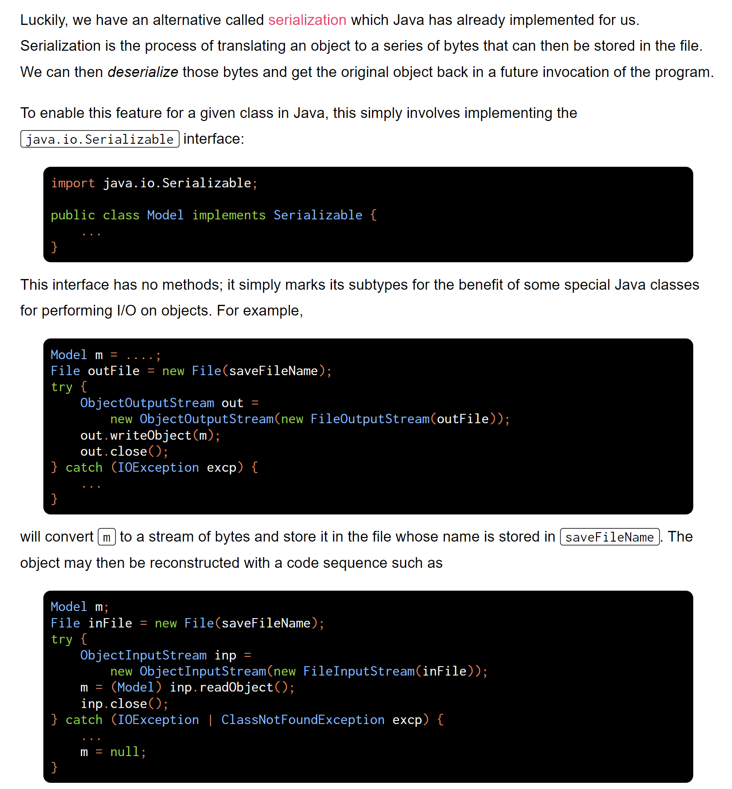
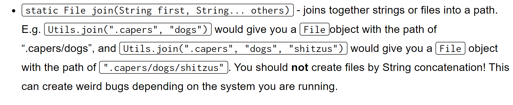
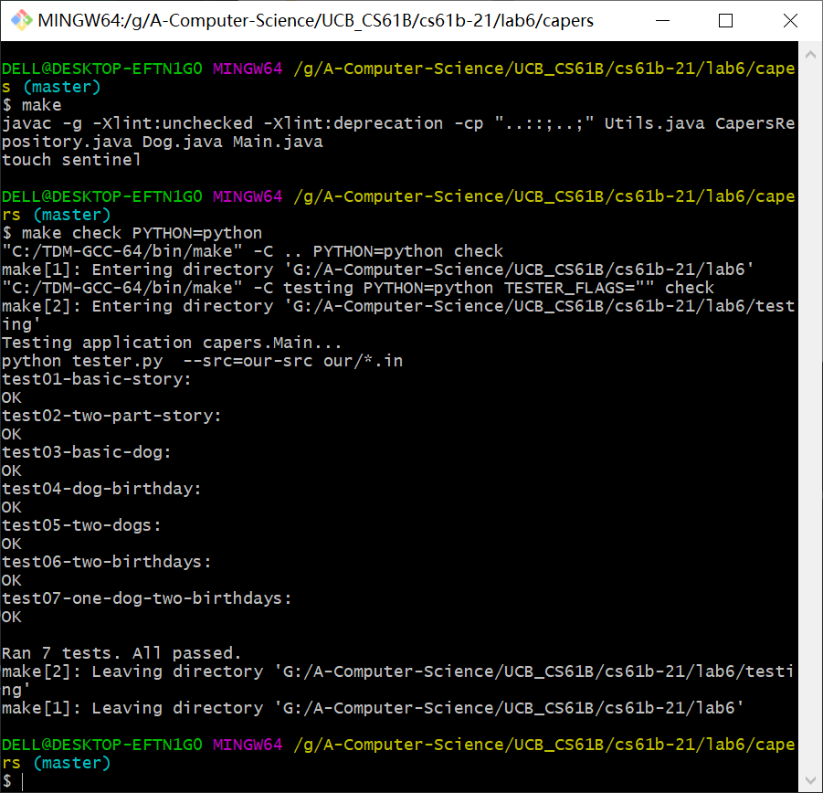

[Lab 6_ Getting Started on Project 2 _ CS 61B Spring 2021.pdf](https://www.yuque.com/attachments/yuque/0/2023/pdf/12393765/1676791373299-0c4be628-03a7-4748-92ee-7a46e5519124.pdf)
[Make Installation Instructions _ CS 61B Spring 2021.pdf](https://www.yuque.com/attachments/yuque/0/2023/pdf/12393765/1676792707303-9c8caf1e-54ba-4e68-8760-22991a989c70.pdf)
[lab6.zip](https://www.yuque.com/attachments/yuque/0/2023/zip/12393765/1676791373302-a72f97fe-4c74-4f21-b758-83a5504e1361.zip)
# Introduction
> 


# Persistence
> 


# Java Compilation
## Command Line Programming
> 


## Makefile
> 
> [https://sp21.datastructur.es/materials/guides/make-install.html](https://sp21.datastructur.es/materials/guides/make-install.html)


## Run Make
> 

**Permission Problem**
> 


## Run make check
> 

**Program Output**


# Files and Directories in Java
## Current Working Directory
### Windows
> 


### Max & Linux
> 


### IntellJ
> 


### Terminal
> 


### 
## Absolute and Relative Paths
> 


## File&Diectory Manipulation in Java
> 


### Files
> 


### Directories
> [https://docs.oracle.com/javase/7/docs/api/java/io/File.html](https://docs.oracle.com/javase/7/docs/api/java/io/File.html)


### Summary
> 


# Serializable - Another Way
## Why we need it?
> 


## Java Serializable
> 


## Helper Methods
> 


# Coding Specification: Canine Capers
## Files Structure
> 


## Goal
> 

**Program Output Example**


## Hidden File Storage⭐⭐⭐⭐⭐
> 


## Useful Util Functions⭐⭐⭐⭐⭐
> 

```java
package capers;

import java.io.BufferedOutputStream;
import java.io.ByteArrayOutputStream;
import java.io.File;
import java.io.FileInputStream;
import java.io.FilenameFilter;
import java.io.IOException;
import java.io.ObjectInputStream;
import java.io.ObjectOutputStream;
import java.io.Serializable;
import java.nio.file.Files;
import java.nio.file.Paths;
import java.nio.charset.StandardCharsets;
import java.security.MessageDigest;
import java.security.NoSuchAlgorithmException;
import java.util.Arrays;
import java.util.Formatter;
import java.util.List;


/** Assorted utilities.
 *  @author P. N. Hilfinger
 */
class Utils {

    /* READING AND WRITING FILE CONTENTS */

    /** Return the entire contents of FILE as a byte array.  FILE must
     *  be a normal file.  Throws IllegalArgumentException
     *  in case of problems. */
    static byte[] readContents(File file) {
        if (!file.isFile()) {
            throw new IllegalArgumentException("must be a normal file");
        }
        try {
            return Files.readAllBytes(file.toPath());
        } catch (IOException excp) {
            throw new IllegalArgumentException(excp.getMessage());
        }
    }

    /** Return the entire contents of FILE as a String.  FILE must
     *  be a normal file.  Throws IllegalArgumentException
     *  in case of problems. */
    static String readContentsAsString(File file) {
        return new String(readContents(file), StandardCharsets.UTF_8);
    }

    /** Write the result of concatenating the bytes in CONTENTS to FILE,
     *  creating or overwriting it as needed.  Each object in CONTENTS may be
     *  either a String or a byte array.  Throws IllegalArgumentException
     *  in case of problems. */
    static void writeContents(File file, Object... contents) {
        try {
            if (file.isDirectory()) {
                throw
                        new IllegalArgumentException("cannot overwrite directory");
            }
            BufferedOutputStream str =
                    new BufferedOutputStream(Files.newOutputStream(file.toPath()));
            for (Object obj : contents) {
                if (obj instanceof byte[]) {
                    str.write((byte[]) obj);
                } else {
                    str.write(((String) obj).getBytes(StandardCharsets.UTF_8));
                }
            }
            str.close();
        } catch (IOException | ClassCastException excp) {
            throw new IllegalArgumentException(excp.getMessage());
        }
    }

    /** Return an object of type T read from FILE, casting it to EXPECTEDCLASS.
     *  Throws IllegalArgumentException in case of problems. */
    static <T extends Serializable> T readObject(File file,
                                                 Class<T> expectedClass) {
        try {
            ObjectInputStream in =
                    new ObjectInputStream(new FileInputStream(file));
            T result = expectedClass.cast(in.readObject());
            in.close();
            return result;
        } catch (IOException | ClassCastException
                | ClassNotFoundException excp) {
            throw new IllegalArgumentException(excp.getMessage());
        }
    }

    /** Write OBJ to FILE. */
    static void writeObject(File file, Serializable obj) {
        writeContents(file, serialize(obj));
    }


    /* OTHER FILE UTILITIES */

    /** Return the concatentation of FIRST and OTHERS into a File designator,
     *  analogous to the {@link java.nio.file.Paths.#get(String, String[])}
     *  method. */
    static File join(String first, String... others) {
        return Paths.get(first, others).toFile();
    }

    /** Return the concatentation of FIRST and OTHERS into a File designator,
     *  analogous to the {@link java.nio.file.Paths.#get(String, String[])}
     *  method. */
    static File join(File first, String... others) {
        return Paths.get(first.getPath(), others).toFile();
    }


    /* SERIALIZATION UTILITIES */

    /** Returns a byte array containing the serialized contents of OBJ. */
    static byte[] serialize(Serializable obj) {
        try {
            ByteArrayOutputStream stream = new ByteArrayOutputStream();
            ObjectOutputStream objectStream = new ObjectOutputStream(stream);
            objectStream.writeObject(obj);
            objectStream.close();
            return stream.toByteArray();
        } catch (IOException excp) {
            throw error("Internal error serializing commit.");
        }
    }


    /* MESSAGES AND ERROR REPORTING */

    /**
     * Prints out MESSAGE and exits with error code -1.
     * Note:
     *     The functionality for erroring/exit codes is different within Gitlet
     *     so DO NOT use this as a reference.
     *     Refer to the spec for more information.
     * @param message message to print
     */
    public static void exitWithError(String message) {
        if (message != null && !message.equals("")) {
            System.out.println(message);
        }
        System.exit(-1);
    }

    /** Return a RuntimeException whose message is composed from MSG and ARGS as
     *  for the String.format method. */
    static RuntimeException error(String msg, Object... args) {
        return new RuntimeException(String.format(msg, args));
    }

}

```

# Coding Implementations⭐⭐⭐⭐⭐
## First delete some codes
> 


## Set Up Persistence
> 
> **Hint：**
> 
> 本质上`CAPERS_FOLDER/DOG_FOLDER`这两个`static variables`使用来标记不同类产出的序列化文件应该存放的位置。
> 仔细查看`CapersRepository.java`文件，发现有几个方法:
> 1. `setupPersistence`: 
> 

> 2. `writeStory`: 
> 

> 3. `makeDog`:
> 

> 这几个方法就是和`Persistence`直接相关的，是需要创建文件路径的，文件路径就需要定义在`CapersRepository.java`和`Dog.java`的`static variable`中，而具体实现`Persistence`的逻辑就在`setUpPersistence`方法中:

**File/Directories Creation&Operations**
```java
/** A repository for Capers 
 * @author Ni Jiasheng
 * The structure of a Capers Repository is as follows:
 *
 * .capers/ -- top level folder for all persistent data in your lab12 folder
 *    - dogs/ -- folder containing all of the persistent data for dogs
 *    - story -- file containing the current story
 *
 * Change the above structure if you do something different.
 */
public class CapersRepository {
    /** Current Working Directory. */
    static final File CWD = new File(System.getProperty("user.dir"));

    /** Main metadata folder. */
    static final File CAPERS_FOLDER = join(CWD, ".capers"); // Hint: look at the `join`
                                            //      function in Utils

    /**
     * Does required filesystem operations to allow for persistence.
     * (creates any necessary folders or files)
     * Remember: recommended structure (you do not have to follow):
     *
     * .capers/ -- top level folder for all persistent data in your lab12 folder
     *    - dogs/ -- folder containing all of the persistent data for dogs
     *    - story -- file containing the current story
     */
    public static void setupPersistence() {
        // TODO
        // Create the .caper and dogs folder and all the necessary files
        if (!CAPERS_FOLDER.exists()) {
            // According to java implementation details, we have to surround it with try-catch
            // In other words, we want to handle the exception in this function.
            try {
                // Careful, the CAPERS_FOLDER should be a folder, so we use mkdir()
                CAPERS_FOLDER.mkdir();
                // Careful, the CAPERS_FOLDER/dogs/ should be a folder, so we use mkdir()
                join(CAPERS_FOLDER, "dogs").mkdir();
                // Careful, the CAPERS_FOLDER/story.txt should be a file, so we use createNewFile()
                join(CAPERS_FOLDER, "story.txt").createNewFile();
            } catch (IOException e) {
                e.printStackTrace();
            }
        }
    }
}

public class Dog { // 

    /** Folder that dogs live in. */
    static final File DOG_FOLDER = join(CapersRepository.CAPERS_FOLDER, "dogs"); // TODO (hint: look at the `join`
                                         //      function in Utils)

    /** Age of dog. */
    private int age;
    /** Breed of dog. */
    private String breed;
    /** Name of dog. */
    private String name;
```


## Main.java
> 


### make a dog
> 
> 可以看到，`dog`分支有`4`个参数，第一个是`dog`, 后面三个就是用来实例化`Dog`类的参数，分别对应`name->args[1], breed->args[2], age->args[3]`。
> 
> 由于`main(String[] args)`接收到的参数列表都是`String`类型的，所以为了能够成功初始化`Dog`类，在转换成`int`类型的时候需要使用`Integer.parseInt()`

```java
case "dog":
    validateNumArgs("dog", args, 4);
    // TODO: make a dog
    String name = args[1];
    String breed = args[2];
    int age = Integer.parseInt(args[3]);
    CapersRepository.makeDog(name, breed, age);
    break;
```


### celebrate birthday
> 
> 这个分支就是要调用`CapersRepository.celebrateBirthday(name)`

```java
case "birthday":
    validateNumArgs("birthday", args, 2);
    // TODO: celebrate this dog's birthday
    String nameB = args[1];
    CapersRepository.celebrateBirthday(nameB);
    break;
```


## writeStory
> **Goal:**
> 
> **Requirement:**
> 

```java
/**
 * Appends the first non-command argument in args
 * to a file called `story` in the .capers directory.
 * @param text String of the text to be appended to the story
 */
public static void writeStory(String text) {
    // TODO
    setupPersistence();
    File storyFile = join(CAPERS_FOLDER, "story.txt");
    String contents = readContentsAsString(storyFile) + text + "\n";
    System.out.println(contents);
    writeContents(storyFile, contents);
}
```
**Program Output**


## saveDog/fromFile
> 
> `saveDog`比较简单，我们只需要调用`writeObject`方法，并传入合适的参数即可。
> `fromFile`有点意思，本质是要调用`readObject(File, Class<T>)`, `File`很好确定，但是`Class<T>`要传入什么呢？ 我们观察`Utils.readObject()`:
> 
> 注意到`T`必须是一个`Serializable`的对象，所以我们的`Dog`必须`implements Serializable`才能被`writeObject`写入一个序列文件中。
> 另外`Class<T>`这里我们实际上要传入的是`Dog`对应的`Class`二进制字节码文件，通过`Dog.class`可以获取到，作为参数传入即可，代码如下:

```java
/**
 * Reads in and deserializes a dog from a file with name NAME in DOG_FOLDER.
 *
 * @param name Name of dog to load
 * @return Dog read from file
 */
public static Dog fromFile(String name) {
    // TODO (hint: look at the Utils file)
    return readObject(join(DOG_FOLDER, name), Dog.class);
}

 /**
 * Saves a dog to a file for future use.
 */
public void saveDog() {
    // TODO (hint: don't forget dog names are unique)
    writeObject(join(DOG_FOLDER, this.name), this);
}

```


## makeDog/celebrate Birthday
> 

```java
/**
 * Creates and persistently saves a dog using the first
 * three non-command arguments of args (name, breed, age).
 * Also prints out the dog's information using toString().
 */
public static void makeDog(String name, String breed, int age) {
    // TODO
    Dog dog = new Dog(name, breed, age);
    dog.haveBirthday();
    dog.saveDog();
}


/**
 * Advances a dog's age persistently and prints out a celebratory message.
 * Also prints out the dog's information using toString().
 * Chooses dog to advance based on the first non-command argument of args.
 * @param name String name of the Dog whose birthday we're celebrating.
 */
public static void celebrateBirthday(String name) {
    // TODO
    Dog dog = Dog.fromFile(name);
    dog.haveBirthday();
    dog.saveDog();
}
```
**Program Output**


## Run make check
> 

**Make Check Output(All Passed)**


# Testing the Codes
## Compilation
> 

## 
## Ad-hoc Testing
> 


## Integration Testing
> 


# Submission
> 


# Remote Debugging⭐⭐⭐⭐⭐
[Lab 6 Capers Debugging walkthrough.mp4](https://www.yuque.com/attachments/yuque/0/2023/mp4/12393765/1676984972451-354dc607-d584-40e7-b33f-8402f60c8207.mp4)
> Prereq: Lab1 Setup REPO_DIR

## Checkout 
> 
> 


## Remote JVM Test
> 


## Start Debugging
> 


### 'n' command
> 


### Link with IntellJ
> 


## Checkout back
> `git checkout 81235b2d5011927481d2c09a456ac07662ad4f33` 
> 

