[disc06_21.pdf](https://www.yuque.com/attachments/yuque/0/2023/pdf/12393765/1676345823120-2dc02364-7223-42f8-9079-f69d1167b38e.pdf)
[disc06sol_21.pdf](https://www.yuque.com/attachments/yuque/0/2023/pdf/12393765/1676345823101-93fdc8a0-d70a-4d2d-97c2-5c794594f176.pdf)
# 1 Discussion
> 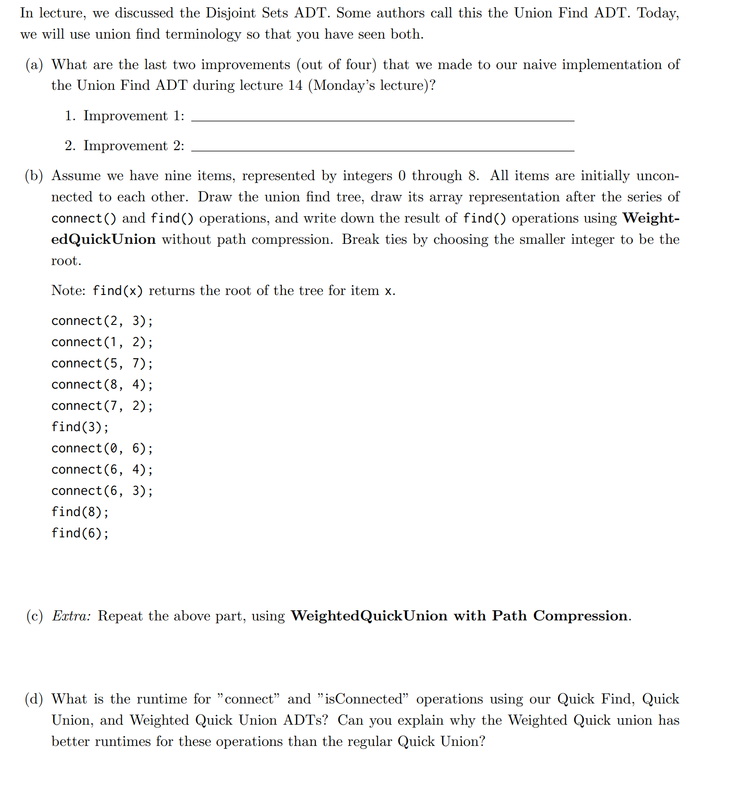

**Solution (a)**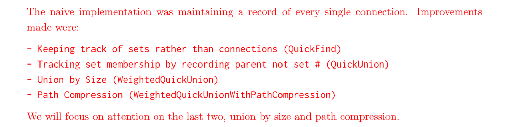
**Solution (b)**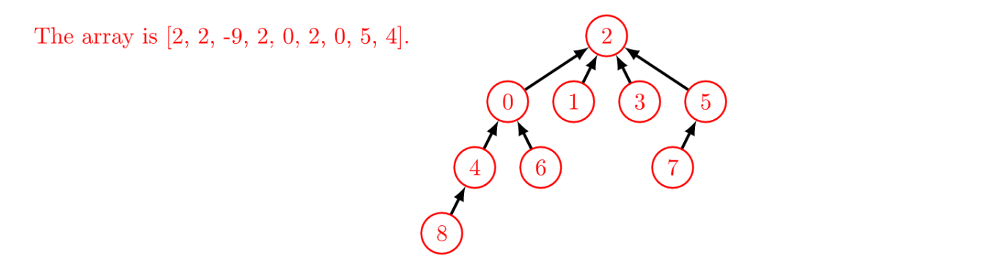
**Solution (c)**⭐⭐⭐⭐⭐`Path Compression`在`find()`中进行。
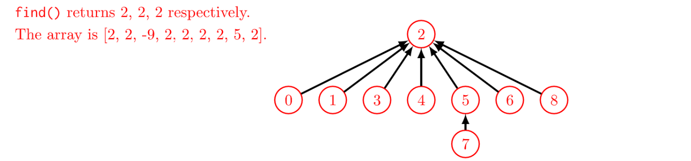
**Solution (d)**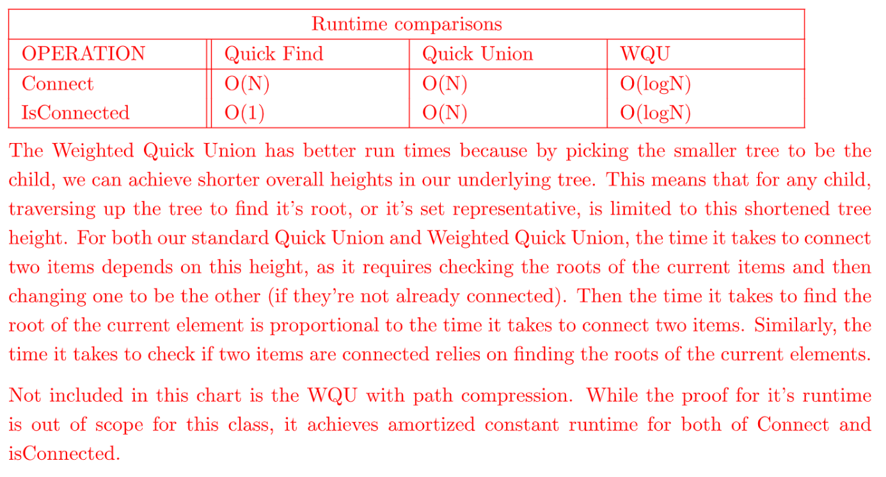

# 2 Exam Preparations
[examprep06_19.pdf](https://www.yuque.com/attachments/yuque/0/2023/pdf/12393765/1675947001078-8719d94f-b1a9-42c6-9ecb-afd4ce504b39.pdf)
[examprep06sol_19.pdf](https://www.yuque.com/attachments/yuque/0/2023/pdf/12393765/1675947001048-10eb2bc1-6bb3-4b87-bc87-925812e73959.pdf)

## WQUPC-Disjoint Set Basics⭐⭐⭐⭐⭐
> 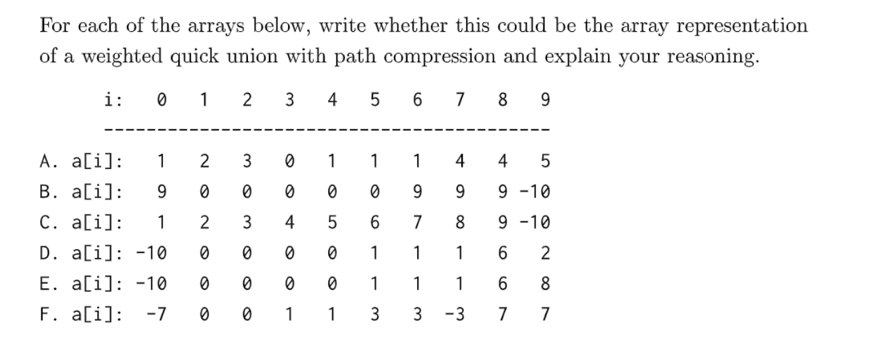

**Solution**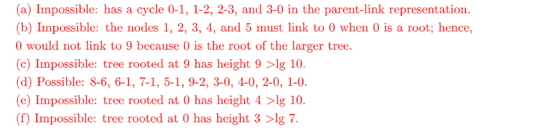

## WQU-Reverse Disjoint Set⭐⭐⭐
> 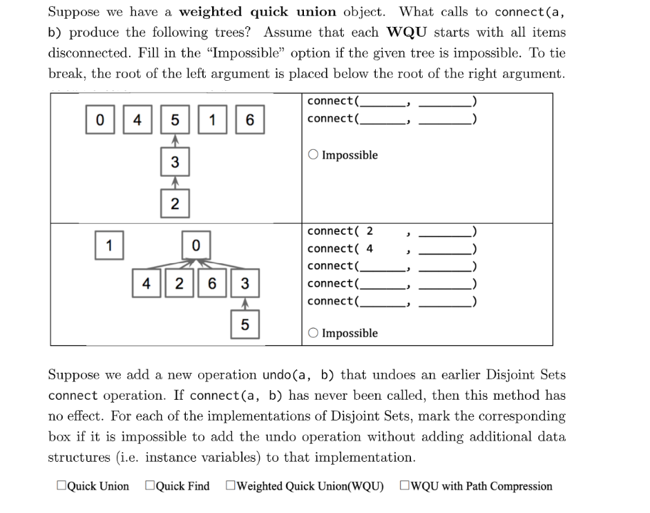

**Solution (1)**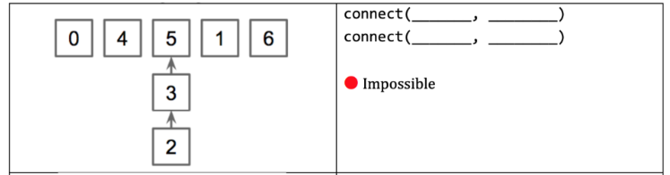
原因就是我们在进行第二个`connect`操作的时候会触发`Weighted`机制，会将较小数量节点的子树的根部连接到较大数量节点的子树的根部，所以是不可能的。这其实也是一个直觉判断，在`Lecture Notes`中我们知道`WQU`算法构建的`Disjoint Tree`的最大高度是$log_2N$, 题目中有三个节点在树中，于是最大高度应该是$log_23< log_24=2$, 而不可能出现高度是$2$的情况，所以是`Impossible`的。
**Solution (2)**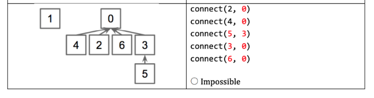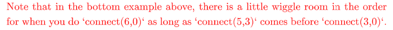
**Solution (3)**⭐⭐⭐⭐⭐对于`Quick Find`, 他通过`array elem`来区分元素所在的集合编号。在我们调用`connect(a,b)`的时候，我们会将`a`所在的集合`A`的编号修改成`b`所在的集合`B`的编号，同时所有属于集合`A`的元素的集合编号都要被修改(不光是`a`本身)。但是这个过程是不可逆的，因为站在修改后的视角，我们是不知道哪些节点所在的集合是被修改过的，有点类似于`many-to-one function`的感觉，所以不能实现`undo(a,b)`
先是`Quick Union`系列, 他通过`Array Tree`和`parent`的概念来实现。因为在`union(a,b)`的过程中，`a`所在子树的根节点会和`b`所在子树的根节点连接，导致`a`所在子树的原有的根节点信息丢失（因为我们在`union(a,b)`后通过`find(a)`找到的是新的根节点，也就是`b`所在子树的根节点），所以我们需要一个`instance variable`来记录`a`子树的根节点来实现`undo(a,b)`操作。
综上，我们无法在不增加新的变量的前提下就完成`undo`操作。
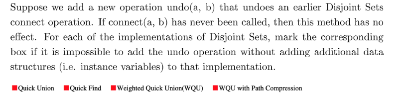

