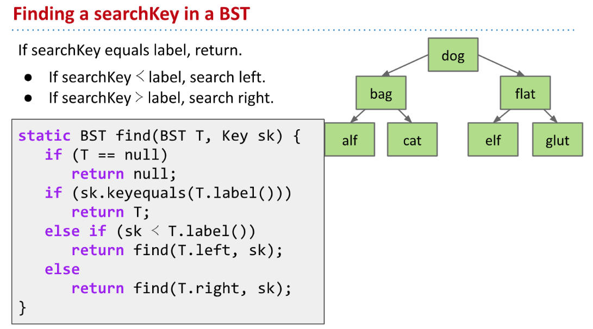

# Lectures&Readings
[cs61b 2018 lec21 ds2 binary search trees.pdf](https://www.yuque.com/attachments/yuque/0/2023/pdf/12393765/1675817602116-9eea42ae-324f-4359-bfaa-a36afe2bb82c.pdf)
[cs61b 2019 lec16 ds2 adts, sets, maps, binary search trees.pdf](https://www.yuque.com/attachments/yuque/0/2023/pdf/12393765/1675950045660-5239783d-4b7b-42f9-b391-09d04ee4a045.pdf)
## From SLL to BST
### Problem Setting
> 
> We want to speed up the time to search for an item even if the list is sorted. But what if the item is at the end of the list? That would take linear time! Take a look at the linked list below and convince yourself that this is true.

### Improvement 1: Extra Links
> 

### Improvement 2: Change the Entry Point
> One optimization we can implement is to have a reference to the middle node. This way, we can get to the middle in constant time. Then, if we flip the nodes' pointers, which allows us to traverse to both the left and right halves, we can decrease our runtime by half!

### Improvement 3: Recursive Entry
> But, we can do better than that. We can further optimize by adding pointers to the middle of each recursive half like so.
> 

## Tree Definition
### Nodes&Edges
> 

### Rooted Tree
> 

## BST Definition
> 

## BST Operations
### findKey
> 

**Runtime Analysis Exercise**

### insertKey⭐⭐⭐
> 

**Sample Solution to 10.2.4**如果我们要插入`1,2,3,4,5`:
如果插入的顺序是`3->2->1->4->5`, 那么树的高度将会是`2`
如果插入顺序是`1->2->3->4->5`, 那么树的高度将会是`4`
所以对于`Size-N Tree`来说，树的高度在$\lfloor log_2N\rfloor\leq H\leq N-1$

### deleteKey⭐⭐⭐⭐⭐
> 

#### Case 1 Key with no children
> 

#### Case 2 Key with one Child
> 

#### Case 3 Key with two Children
> 

**Challenge Problem**

## BST Performance
### Tree Height
> 

**Exercise**

### BST Height
> 

### Height&Depth
> 

**Exercise**

### Randomized Insertion⭐⭐⭐⭐⭐
> 

## BST Implementation Tips
> 

## Summary
> 

# Study Guide Exercises
[BST Study Guide _ CS 61B Spring 2018.pdf](https://www.yuque.com/attachments/yuque/0/2023/pdf/12393765/1675817602121-1990a96a-751b-4b52-a4e6-163a32b8e8f7.pdf)

