# 1 Discussion
## Is this a BST? 
> Sp18_disc09
> 
> **本题有两种思路:**
> 1. 写两个`Helper Functions`, 第一个`findSmallest(TreeNode T)`用于查找以当前节点为根节点的二叉树中的最小节点。第二个`findBiggest(TreeNode T)`用于查找以当前节点为根节点的二叉树中的最大节点。然后在主函数中，对每一个节点递归判断其值是否大于左子树中的最大值并且小于右子树中的最小值。
> 2. 写一个`Helper Function`, 逻辑是对于每个节点来说，假设其值为`N`, 则其左子树中所有节点的值不能大于`N`, 也就是说左子树节点的取值范围为$[-\infty, N]$, 同理其右子树中所有节点的取值范围为$[N, \infty]$。
> 
本题的`isBSTBad`方法有错误，其实这个方法的本意是想按照上述第一中思路进行，但是实现的过程中考虑的不够全面。本质上`isBSTBad`递归算法只能检测当前节点和左右子节点之间的大小关系而不能考虑到子孙节点, 下面是一个例子，其实我们只要构造一种二叉树，他的左右子节点都满足`BST`性质，但是他的左子树中的节点不都满足`BST`性质即可，比如下图中的`12`。
> 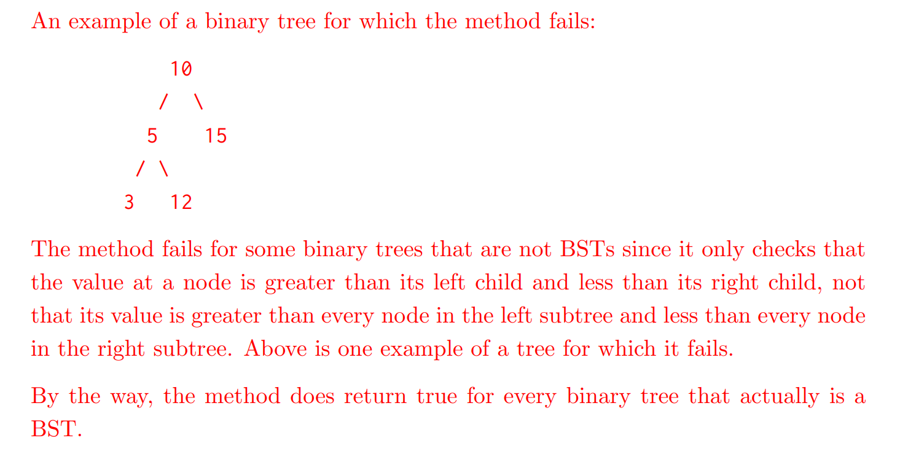
> 本题要求我们使用第二种方式，代码如下:

```java
public static boolean isBSTGood(TreeNode T){
    return isBSTHelper(T, Integer.MIN_VALUE, Integer.MAX_VALUE);
}


public static boolean isBSTHelper(TreeNode T, int minValue, int maxValue){
    if (T == null) {
        return true;
    }

    if (T.val <= minValue || T.val >= maxValue) {
        return false;
    }

    return isBSTHelper(T.left, minValue, T.val) && isBSTHelper(T.right,  T.val, maxValue);

}
```


## 2-3 Trees and LLRB's
> 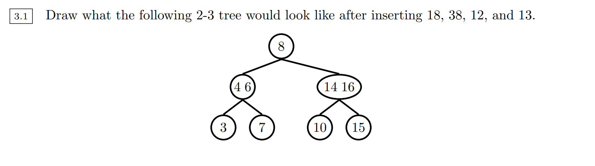
> 回顾一下`2-3 Tree`, 本质上`2-3`代表的任何一个节点内的元素个数最多为`2`个，且其子节点数量为`0`(未发生`split`时)或者`2-3`个(发生了`split`之后)。
> 对于一棵`L=K`的`B-Tree`, 每个节点内最多有`L`个元素，每个节点的子节点有`0`个(未发生`split`)或者`2~L+1`个(发生了`split`之后)。
> 本题插入节点之后结果如下:
> 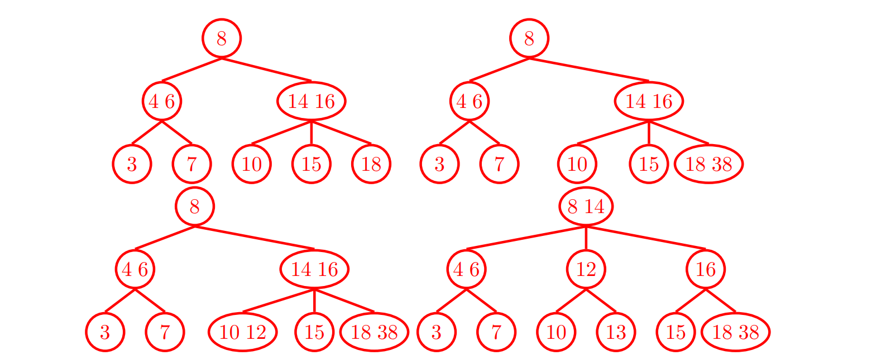
> 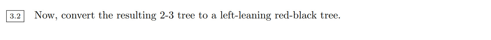
> 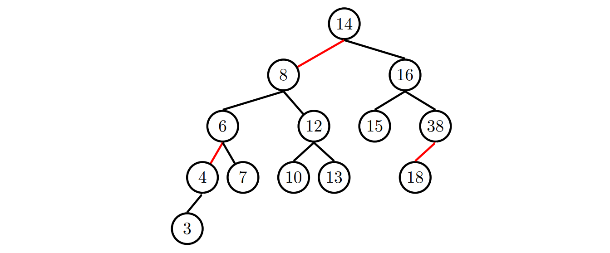
> 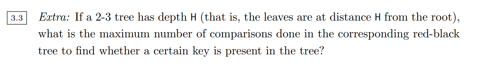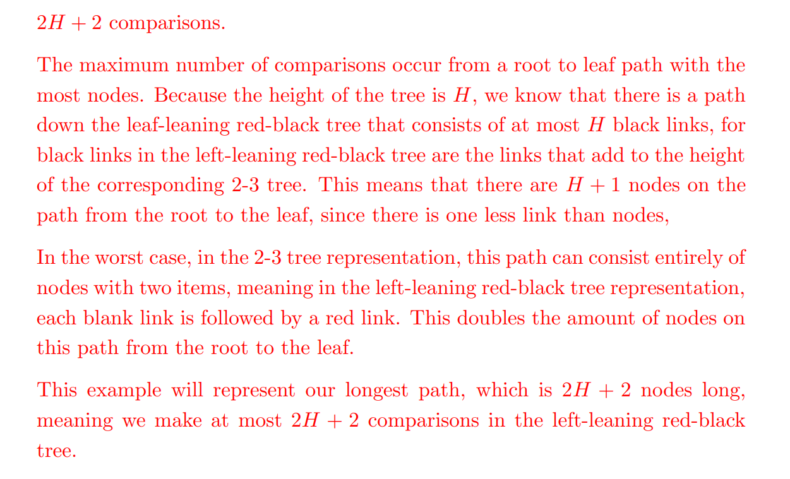


# 2 Exam Preparation
## LLRB Insertions⭐⭐⭐
### Takeaways⭐⭐⭐⭐
> 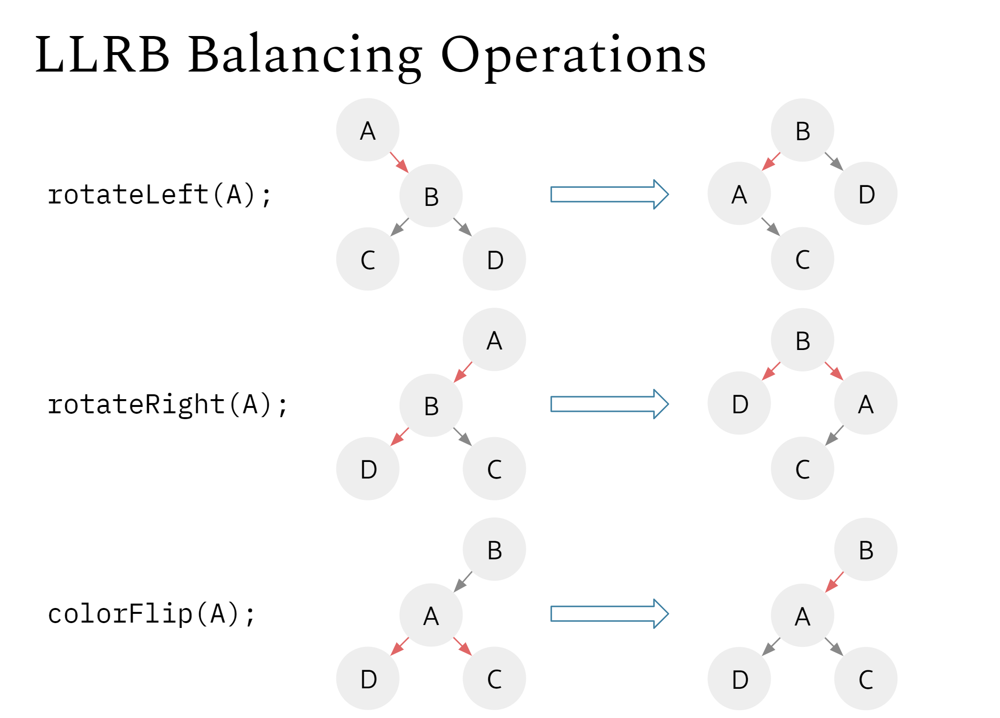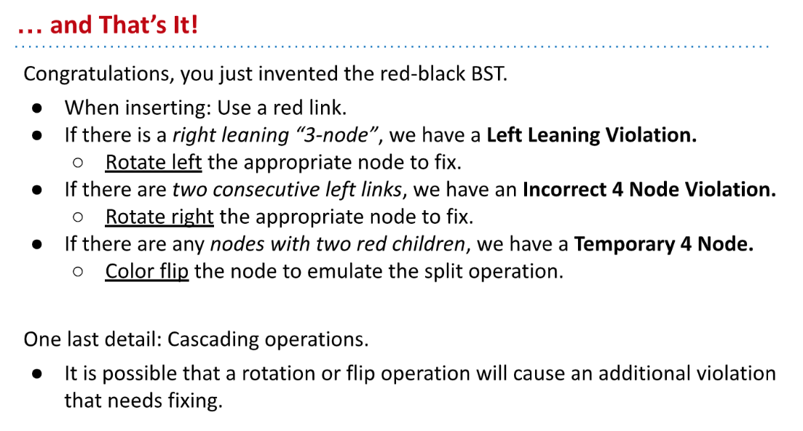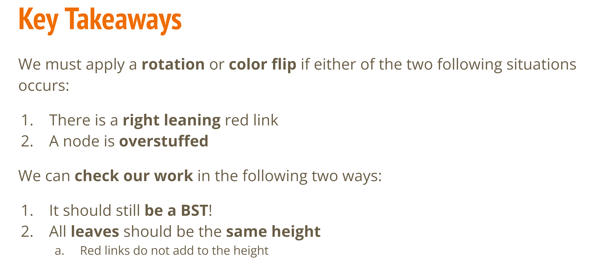


### Insertions&Rotations I⭐⭐
> Sp21 examprep08
> 要注意，当我们往一个`Node`中插入元素的时候，如果元素小于`Node`中的任意一个元素，则会在左子树插入一个`Red Link`。如果元素大于`Node`中的任意一个元素，则会在右子树中插入一个`Red Link`。（其实就是）
> 本质上, `Red Link`的方向取决于待插入元素与`Node`中已有元素的相对大小。
> 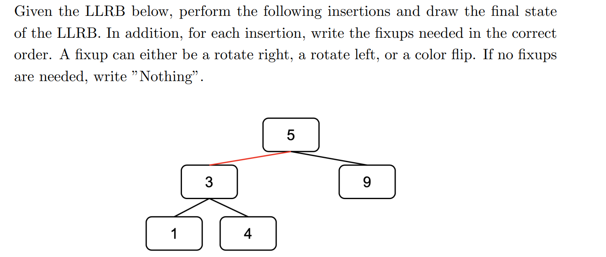
> 🔔: `LLRB`和`2-3 Tree`之间是一一对应的关系。

[FA20 - Balanced Search Trees.pdf](https://www.yuque.com/attachments/yuque/0/2023/pdf/12393765/1679623003391-89164111-7a74-4aaa-ab48-992fab31c35e.pdf)
**Solutions**[https://docs.google.com/presentation/d/1uWEnm4L2cNTmFNeT4qqATHWRA9tbYbcV78uJRFIZtqw/edit#slide=id.g8336e82847_0_2900](https://docs.google.com/presentation/d/1uWEnm4L2cNTmFNeT4qqATHWRA9tbYbcV78uJRFIZtqw/edit#slide=id.g8336e82847_0_2900)

1. `Insert 7`, 插入`9`节点的左枝，因为本来就是`Left Leaning`, 所以不需要`Rotate`或者`Color Flip`操作。

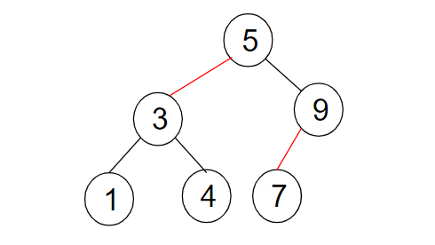

2. `Insert 6`, 插入`9`节点的左枝，构成`Double Left Insertion`

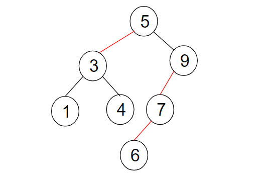

   1.  此时我们首先需要`RotateRight(9)`, 得到:

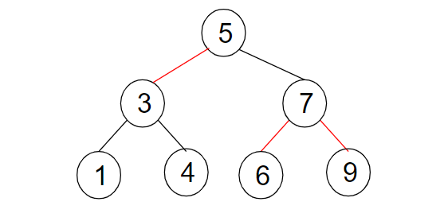

   2. 然后注意到我们有一个`Temporary 4-Node`, 所以我们需要`Color Flip`:

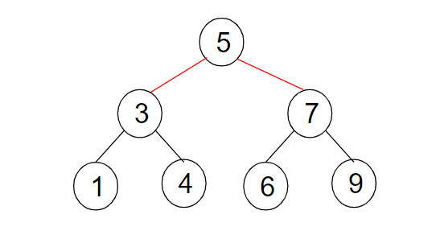

   3. 然后我们发现根节点的左右`Link`也都是红色(Temporary 4-Node Again), 我们又需要一次`Color Flip`:

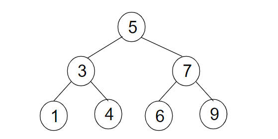

3. `Insert 2`, 插入`Node 1`的右枝, 需要对`Node 1`进行`RotateLeft(1)`：

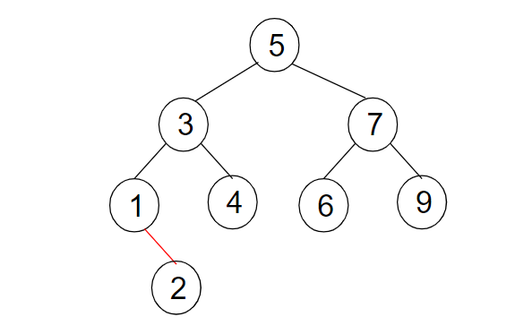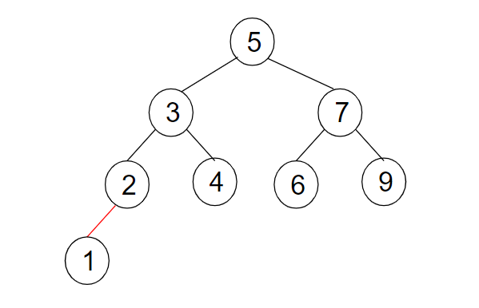

4. `Insert 8`, 插入`Node 9`的左枝，无需额外操作:

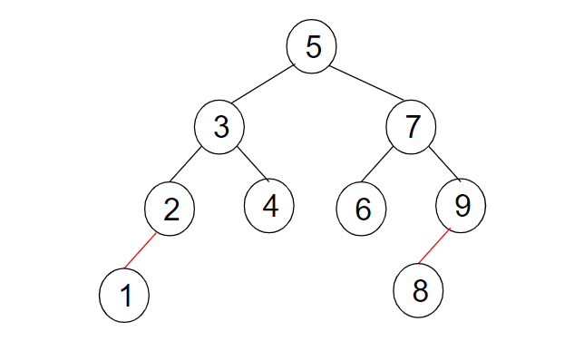

5. `Insert 8.5`, 插入`Node 8`的右枝:

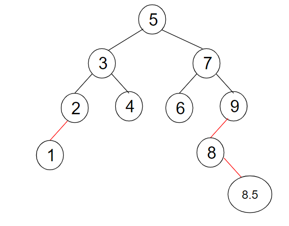

   1. 首先需要`RotateLeft(8)`:

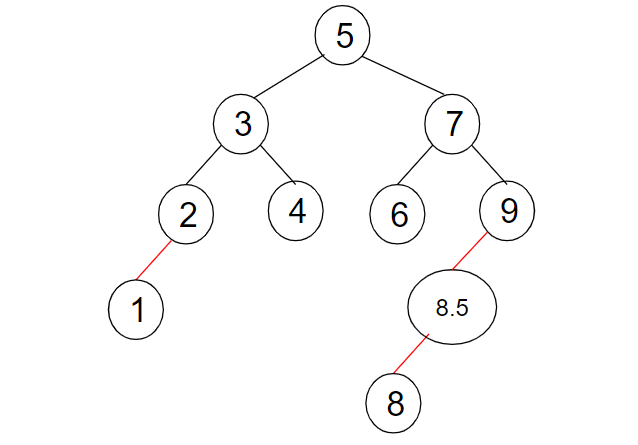

   2. 然后需要`RotateRight(9)`:

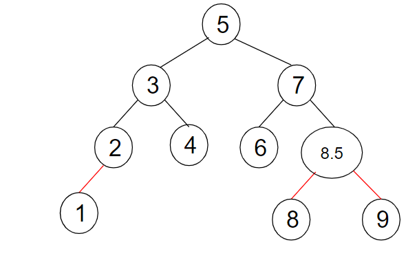

   3. 然后需要`Color Flip`，发现仍然不满足`Left Leaning`的性质，需要`RotateLeft(7)`

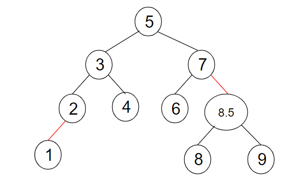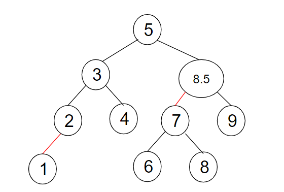


### Insertions&Rotations II⭐⭐
> Sp21 examprep08
> 本题是上题的`Reverse Engineering`, 我们需要找到一种插入，使得这个插入导致一种`Cascading Effect`, 且这个`Cascading Effect`包括六个`Fixups`。
> 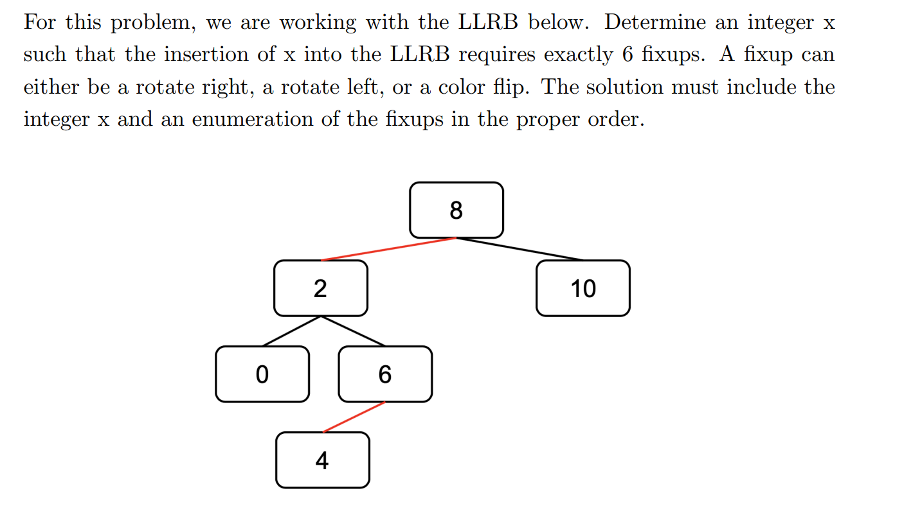

**Solution**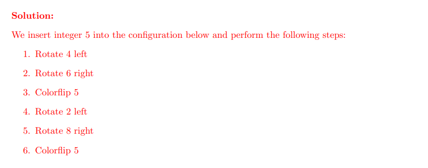


