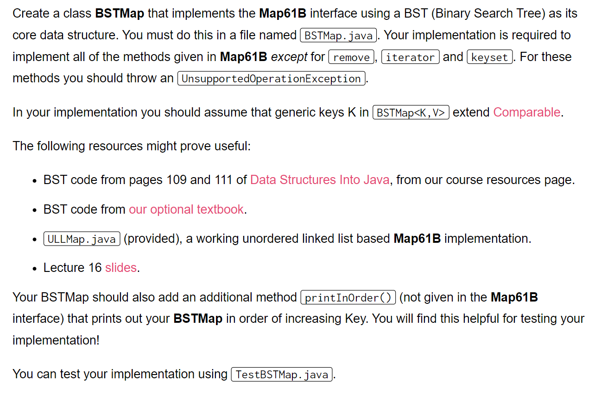
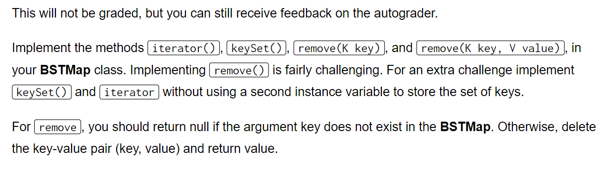
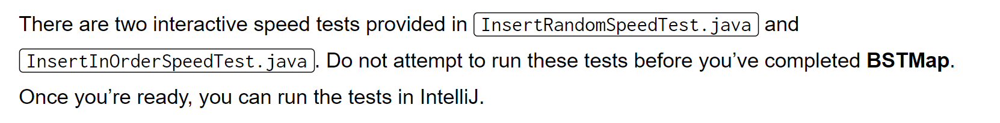
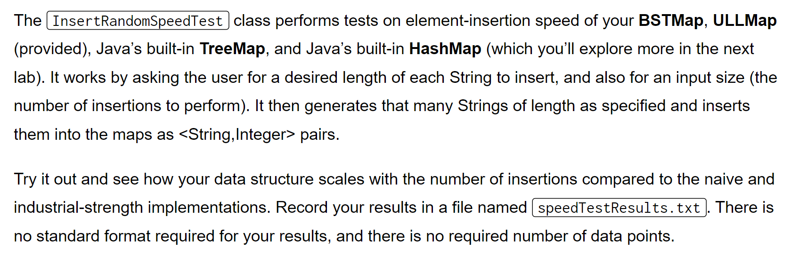
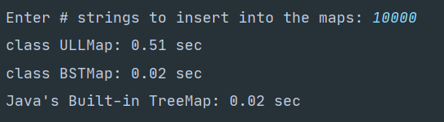
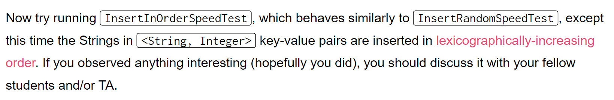
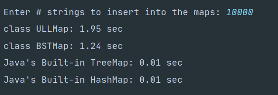
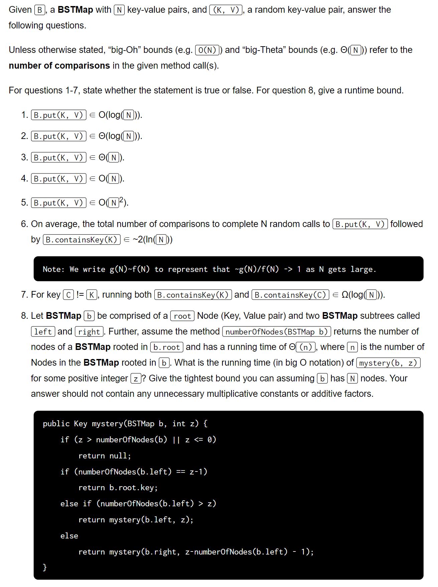
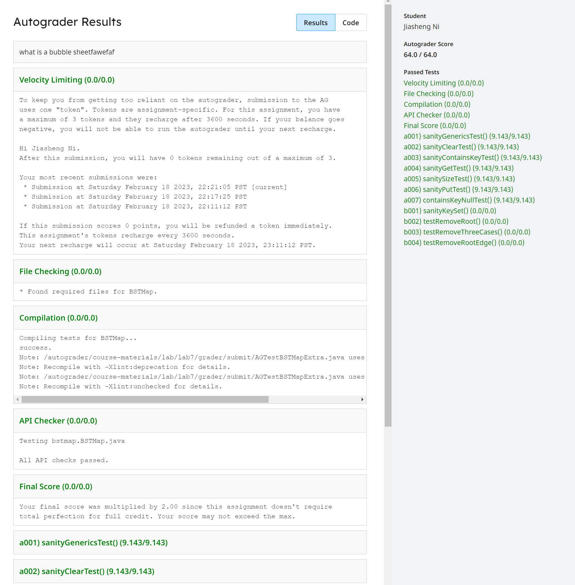

[Lab 7_ BSTMap _ CS 61B Spring 2021.pdf](https://www.yuque.com/attachments/yuque/0/2023/pdf/12393765/1676786849667-92b0981d-0599-46a6-9c5b-8c51794f155b.pdf)

# BSTMap
> 
> 详细的分析在`Lab 1809`中，这里只新增了一个`printInOrder()`方法。

```java
package bstmap;


import java.util.*;

/**
 * Implementation of interface Map61B with BST as core data structure.
 *
 * @author Your name here
 */
public class BSTMap<K extends Comparable<K>, V> implements Map61B<K, V> {

    private class Node {
        /* (K, V) pair stored in this Node. */
        private K key;
        private V value;

        /* Children of this Node. */
        private Node left;
        private Node right;

        private Node(K k, V v) {
            key = k;
            value = v;
        }
    }

    private Node root;  /* Root node of the tree. */
    private int size; /* The number of key-value pairs in the tree */

    /* Creates an empty BSTMap. */
    public BSTMap() {
        this.clear();
    }

    /* Removes all of the mappings from this map. */
    @Override
    public void clear() {
        root = null;
        size = 0;
    }

    @Override
    public boolean containsKey(K key) {
        if (key == null) {
            throw new IllegalArgumentException("calls get() with a null key");
        }

        return keySet().contains(key);
    }

    /** Returns the value mapped to by KEY in the subtree rooted in P.
     *  or null if this map contains no mapping for the key.
     */
    private V getHelper(K key, Node p) {
        if (key == null) {
            throw new IllegalArgumentException("calls get() with a null key");
        }
        if (p == null) {
            return null;
        }

        int cmp = key.compareTo(p.key);
        if (cmp > 0) {
            return getHelper(key, p.right);
        } else if (cmp < 0) {
            return getHelper(key, p.left);
        } else {
            return p.value;
        }
    }

    /** Returns the value to which the specified key is mapped, or null if this
     *  map contains no mapping for the key.
     */
    @Override
    public V get(K key) {
        return getHelper(key, root);
    }

    /** Returns a BSTMap rooted in p with (KEY, VALUE) added as a key-value mapping.
      * Or if p is null, it returns a one node BSTMap containing (KEY, VALUE).
     */
    private Node putHelper(K key, V value, Node p) {
        if (p == null) {
            // Update the size!
            size += 1;
            return new Node(key, value);
        }

        int cmp = key.compareTo(p.key);
        if (cmp < 0) {
            p.left = putHelper(key, value, p.left);
        } else if (cmp > 0) {
            p.right = putHelper(key, value, p.right);
        } else {
            p.value = value;
        }
        return p;
    }

    /** Inserts the key KEY
     *  If it is already present, updates value to be VALUE.
     */
    @Override
    public void put(K key, V value) {
        if (key == null) {
            throw new IllegalArgumentException("calls get() with a null key");
        }
        // Don't forget to update the root
        root = putHelper(key, value, root);
    }

    /* Returns the number of key-value mappings in this map. */
    @Override
    public int size() {
        return size;
    }

    //////////////// EVERYTHING BELOW THIS LINE IS OPTIONAL ////////////////

    /* Returns a Set view of the keys contained in this map. */
    @Override
    public Set<K> keySet() {
        Set<K> res = new HashSet<>();
        // Traverse the tree
        keySetHelper(root, res);
        return res;
    }

    private void keySetHelper(Node p, Set<K> s) {
        if (p == null) {
            return;
        }
        // DFS Traversal
        s.add(p.key);
        keySetHelper(p.left, s);
        keySetHelper(p.right, s);
    }

    /** Removes KEY from the tree if present
     *  returns VALUE removed,
     *  null on failed removal.
     */
    @Override
    public V remove(K key) {
        if (key == null) {
            throw new IllegalArgumentException();
        }
        V v = get(key);
        if (v != null) {
            return remove(key, v);
        }
        return null;
    }


    /** Removes the key-value entry for the specified key only if it is
     *  currently mapped to the specified value.  Returns the VALUE removed,
     *  null on failed removal.
     **/
    @Override
    public V remove(K key, V value) {
        if (key == null) {
            throw new IllegalArgumentException();
        }
        V v = get(key);
        if (v != null) {
            root = removeHelper(key, value, root);
            size = sizeT(root);
        }
        return v;
    }


    private Node removeHelper(K key, V value, Node p) {
        int cmp = key.compareTo(p.key);
        if (cmp > 0) {
            p.right = removeHelper(key, value, p.right);
        } else if (cmp < 0) {
            p.left = removeHelper(key, value, p.left);
        } else {
            if (p.value.equals(value)) {
                if (p.left == null) {
                    return p.right;
                }
                if (p.right == null) {
                    return p.left;
                }
                // Two children
                // 1. Find successor(or predecessor)
                Node successor = findMin(p.right);
//                Node predecessor = findMax(p.left);

                // 2. Exchange the value of the successor and the node to be deleted.
                K sKey = successor.key;
                V sValue = successor.value;
                p.key = sKey;
                p.value = sValue;
                p.right = removeHelper(sKey, sValue, p.right);
                return p;
            }
        }
        return p;
    }

    /**
     * Find the smallest element in the tree rooted at p
     * @param p
     * @return
     */
    private Node findMin(Node p) {
        if (p.left == null) {
            return p;
        }
        return findMin(p.left);
    }

    /**
     * Find the maximum element in the tree rooted at p
     * @param p
     * @return
     */
    private Node findMax(Node p) {
        if (p.right == null) {
            return p;
        }
        return findMax(p.right);
    }

    /**
     * Return the size of the tree rooted at p
     * @return
     */
    private int sizeT(Node p) {
        if (p == null) {
            return 0;
        }
        return sizeT(p.left) + sizeT(p.right) + 1;
    }


    @Override
    public Iterator<K> iterator() {
        List<K> allKeys;
        allKeys = new ArrayList<>();
        getAllKeys(allKeys, root);
        return allKeys.iterator();
    }


    private void getAllKeys(List<K> container, Node p) {
        if (p == null) {
            return;
        }
        // Pre-DFS Traversal
        container.add(p.key);
        getAllKeys(container, p.left);
        getAllKeys(container, p.right);
    }

    // Helper Method in visualizing trees, should be commented when submitted
    private List<Node> branches(Node p) {
        List<Node> childNodes = new ArrayList<>();
        if (p == null) {
            return childNodes;
        }
        if (p.left != null) {
            childNodes.add(p.left);
        }
        if (p.right != null) {
            childNodes.add(p.right);
        }
        return childNodes;
    }

    private void printTreeStructure() {
        printTreeStructure(root, 0);
    }

    private void printTreeStructure(Node p, int indent) {
        StringBuilder sb = new StringBuilder();
        for (int i = 0; i < indent; i++) {
            sb.append(" ");
        }
        sb.append(p.key);
        System.out.println(sb.toString());
        List<Node> allChildren = branches(p);
        for (Node n: allChildren) {
            printTreeStructure(n, indent + 1);
        }
    }

    public void printInOrder() {
        printInOrderHelper(root);
    }

    private void printInOrderHelper(Node p) {
        if (p == null) {
            return;
        }
        printInOrderHelper(p.left);
        System.out.println(p.key);
        printInOrderHelper(p.right);
    }
}

```
```java
import static org.junit.Assert.*;
import org.junit.Test;

/** Tests by Brendan Hu, Spring 2015, revised for 2016 by Josh Hug */
public class TestBSTMap {

	@Test
    public void sanityGenericsTest() {
    	try {
    		BSTMap<String, String> a = new BSTMap<String, String>();
	    	BSTMap<String, Integer> b = new BSTMap<String, Integer>();
	    	BSTMap<Integer, String> c = new BSTMap<Integer, String>();
	    	BSTMap<Boolean, Integer> e = new BSTMap<Boolean, Integer>();
	    } catch (Exception e) {
	    	fail();
	    }
    }

    //assumes put/size/containsKey/get work
	@Test
    public void sanityClearTest() {
    	BSTMap<String, Integer> b = new BSTMap<String, Integer>();
        for (int i = 0; i < 455; i++) {
            b.put("hi" + i, 1+i);
            //make sure put is working via containsKey and get
            assertTrue( null != b.get("hi" + i) && (b.get("hi"+i).equals(1+i))
                        && b.containsKey("hi" + i));
        }
        assertEquals(455, b.size());
        b.clear();
        assertEquals(0, b.size());
        for (int i = 0; i < 455; i++) {
            assertTrue(null == b.get("hi" + i) && !b.containsKey("hi" + i));
        }
    }

    // assumes put works
    @Test
    public void sanityContainsKeyTest() {
    	BSTMap<String, Integer> b = new BSTMap<String, Integer>();
        assertFalse(b.containsKey("waterYouDoingHere"));
        b.put("waterYouDoingHere", 0);
        assertTrue(b.containsKey("waterYouDoingHere"));
    }

    // assumes put works
    @Test
    public void sanityGetTest() {
    	BSTMap<String, Integer> b = new BSTMap<String, Integer>();
        assertEquals(null,b.get("starChild"));
        assertEquals(0, b.size());
        b.put("starChild", 5);
        assertTrue(((Integer) b.get("starChild")).equals(5));
        b.put("KISS", 5);
        assertTrue(((Integer) b.get("KISS")).equals(5));
        assertNotEquals(null,b.get("starChild"));
        assertEquals(2, b.size());
    }

    // assumes put works
    @Test
    public void sanitySizeTest() {
    	BSTMap<String, Integer> b = new BSTMap<String, Integer>();
        assertEquals(0, b.size());
        b.put("hi", 1);
        assertEquals(1, b.size());
        for (int i = 0; i < 455; i++)
            b.put("hi" + i, 1);
        assertEquals(456, b.size());
    }

    //assumes get/containskey work
    @Test
    public void sanityPutTest() {
    	BSTMap<String, Integer> b = new BSTMap<String, Integer>();
        b.put("hi", 1);
        assertTrue(b.containsKey("hi") && b.get("hi") != null);
    }

    @Test
    public void testPrintInOrder() {
        BSTMap<Integer, Integer> b = new BSTMap<>();
        b.put(4, 1);
        b.put(2, 1);
        b.put(1, 1);
        b.put(3, 1);
        b.put(6, 1);
        b.put(5, 1);
        b.put(7, 1);
        b.printInOrder();
    }

    public static void main(String[] args) {
        jh61b.junit.TestRunner.runTests(TestBSTMap.class);
    }
}
```
```java
import java.util.Set;
import java.util.HashSet;
import static org.junit.Assert.*;
import org.junit.Test;

/** Tests of optional parts of lab 8. */
public class TestBSTMapExtra {

    /*
    * Sanity test for keySet, only here because it's optional
    */
    @Test
    public void sanityKeySetTest() {
    	BSTMap<String, Integer> b = new BSTMap<String, Integer>();
        HashSet<String> values = new HashSet<String>();
        for (int i = 0; i < 455; i++) {
            b.put("hi" + i, 1);
            values.add("hi" + i);
        }
        assertEquals(455, b.size()); //keys are there
        Set<String> keySet = b.keySet();
        assertTrue(values.containsAll(keySet));
        assertTrue(keySet.containsAll(values));
    }

    /* Remove Test
     *
     * Note for testRemoveRoot:
     *
     * Just checking that c is gone (perhaps incorrectly)
     * assumes that remove is BST-structure preserving.
     *
     * More exhaustive tests could be done to verify
     * implementation of remove, but that would require doing
     * things like checking for inorder vs. preorder swaps,
     * and is unnecessary in this simple BST implementation.
     */
    @Test
    public void testRemoveRoot() {
        BSTMap<String,String> q = new BSTMap<String,String>();
        q.put("c","a");
        q.put("b","a");
        q.put("a","a");
        q.put("d","a");
        q.put("e","a"); // a b c d e
        assertTrue(null != q.remove("c"));
        assertFalse(q.containsKey("c"));
        assertTrue(q.containsKey("a"));
        assertTrue(q.containsKey("b"));
        assertTrue(q.containsKey("d"));
        assertTrue(q.containsKey("e"));
    }

    /* Remove Test 2
     * test the 3 different cases of remove
     */
    @Test
    public void testRemoveThreeCases() {
        BSTMap<String,String> q = new BSTMap<String,String>();
        q.put("c","a");
        q.put("b","a");
        q.put("a","a");
        q.put("d","a");
        q.put("e","a");                         // a b c d e
        assertTrue(null != q.remove("e"));      // a b c d
        assertTrue(q.containsKey("a"));
        assertTrue(q.containsKey("b"));
        assertTrue(q.containsKey("c"));
        assertTrue(q.containsKey("d"));
        assertTrue(null != q.remove("c"));      // a b d
        assertTrue(q.containsKey("a"));
        assertTrue(q.containsKey("b"));
        assertTrue(q.containsKey("d"));
        q.put("f","a");                         // a b d f
        assertTrue(null != q.remove("d"));      // a b f
        assertTrue(q.containsKey("a"));
        assertTrue(q.containsKey("b"));
        assertTrue(q.containsKey("f"));
    }

    /* Remove Test 3
    *  Checks that remove works correctly on root nodes
    *  when the node has only 1 or 0 children on either side. */
    @Test
    public void testRemoveRootEdge() {
        BSTMap rightChild = new BSTMap();
        rightChild.put('A', 1);
        rightChild.put('B', 2);
        Integer result = (Integer) rightChild.remove('A');
        assertTrue(result.equals(new Integer(1)));
        for (int i = 0; i < 10; i++) {
            rightChild.put((char) ('C'+i), 3+i);
        }
        rightChild.put('A', 100);
        assertTrue(((Integer) rightChild.remove('D')).equals(new Integer(4)));
        assertTrue(((Integer) rightChild.remove('G')).equals(new Integer(7)));
        assertTrue(((Integer) rightChild.remove('A')).equals(new Integer(100)));
        assertTrue(rightChild.size()==9);

        BSTMap leftChild = new BSTMap();
        leftChild.put('B', 1);
        leftChild.put('A', 2);
        assertTrue(((Integer) leftChild.remove('B')).equals(1));
        assertEquals(1, leftChild.size());
        assertEquals(null, leftChild.get('B'));

        BSTMap noChild = new BSTMap();
        noChild.put('Z', 15);
        assertTrue(((Integer) noChild.remove('Z')).equals(15));
        assertEquals(0, noChild.size());
        assertEquals(null, noChild.get('Z'));
    }

    public static void main(String[] args) {
        jh61b.junit.TestRunner.runTests(TestBSTMapExtra.class);
    }
}

```

# SpeedTest
> 


## InsertionRandomSpeedTest
> 


## InsertInOrderSpeedTest
> 
> 


# Optional Asymptotics Problems
> 


# Submission
> 

