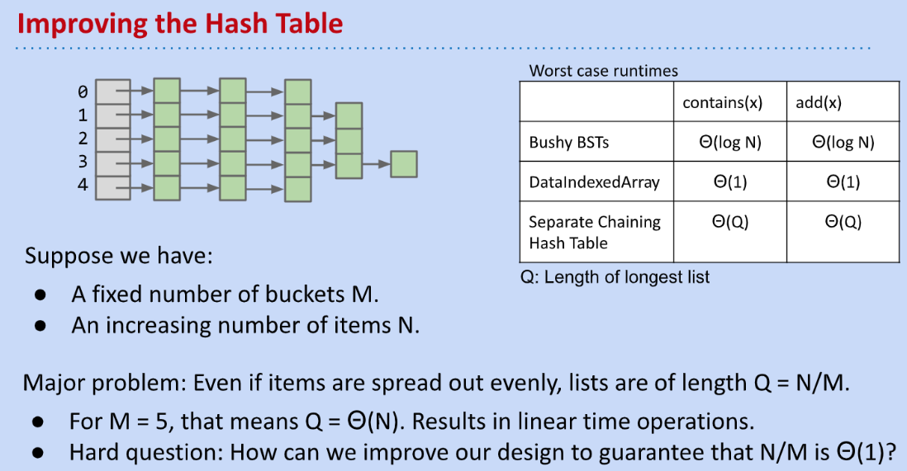

[cs61b 2019 ds5 lec19 hashing.pdf](https://www.yuque.com/attachments/yuque/0/2023/pdf/12393765/1676202385770-3222a2d1-8a1c-47b9-8d66-cc15852c8e2c.pdf)

# Separate Chaining Data Indexed Array
## Goal
> 

## Implementation
> 

## Saving Memory
> 

## Performance
> 

# Linked HashTable 
## Definition
> 

## Performance
> 

**Exercise**

## Improvements
> 

### Increasing Buckets
> 

### Resizing
> 

### Resizing Runtime
> 

## Summary
> 

# HashTable in Java
## Ubiquity of Hash Tables
> 

## Negative HashCodes
> 

## Java Implementation
> 

## Warnings when using Hashing
> 

# Good HashCodes
## Goal
> 

## Choosing Bases
### Official Java Choice - Base 31
> 

### Base 126
> 

### Typical Base
> 

## Hashing Objects
### Collection
> 

### Recursive Data Structure
> 

### Other Hashing Ways
> 

## Summary
> 

# Study Guide Exercises
[Hashing Study Guide _ CS 61B Spring 2019.pdf](https://www.yuque.com/attachments/yuque/0/2023/pdf/12393765/1676203941597-f4ff9f2f-d6d7-47c4-807a-7ffb4eb4a121.pdf)

