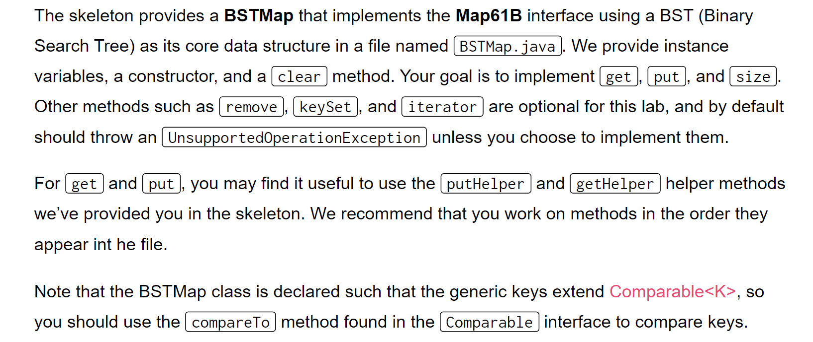
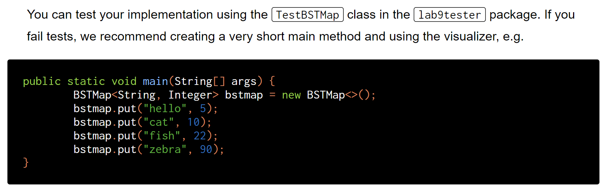
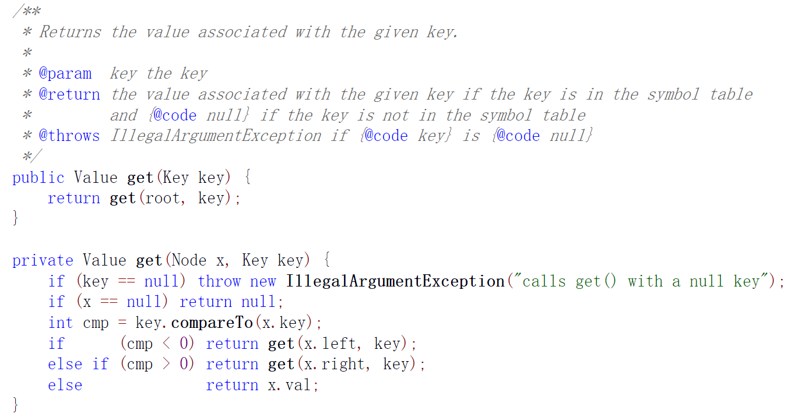
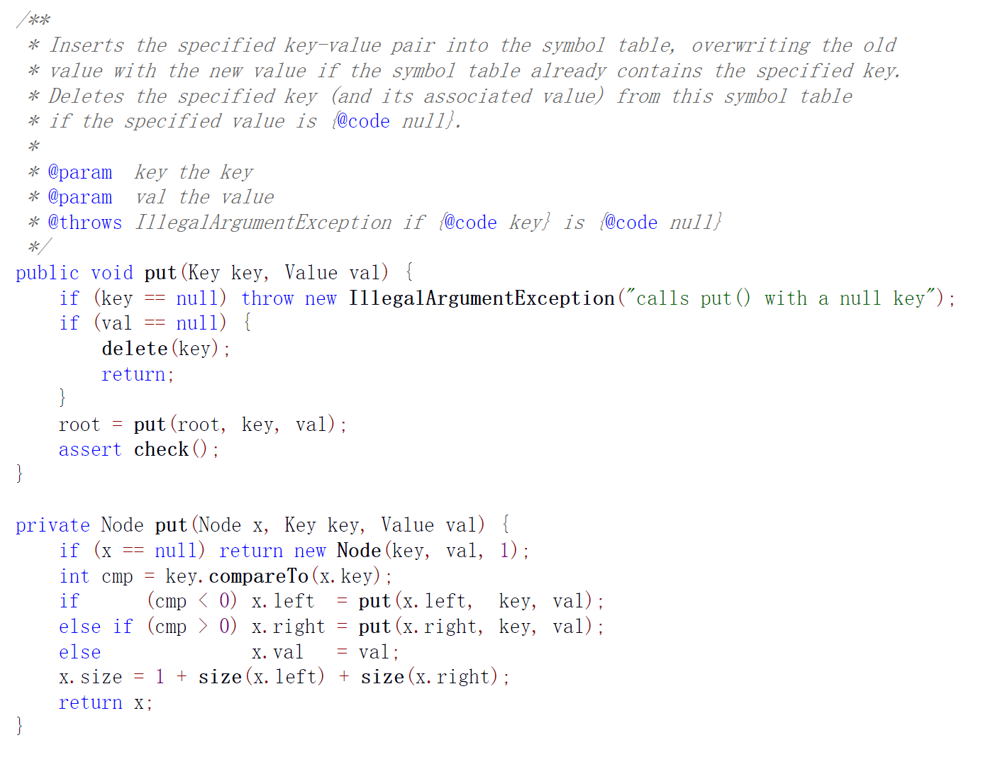
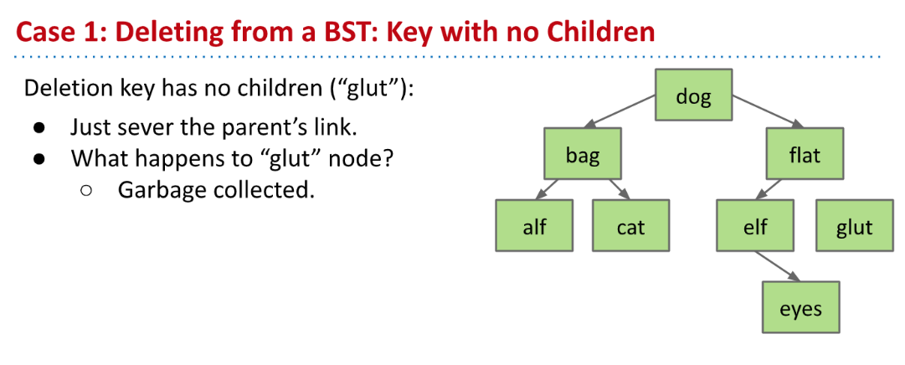
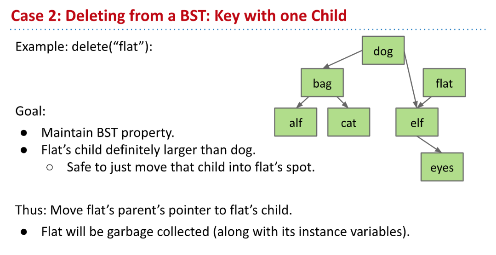
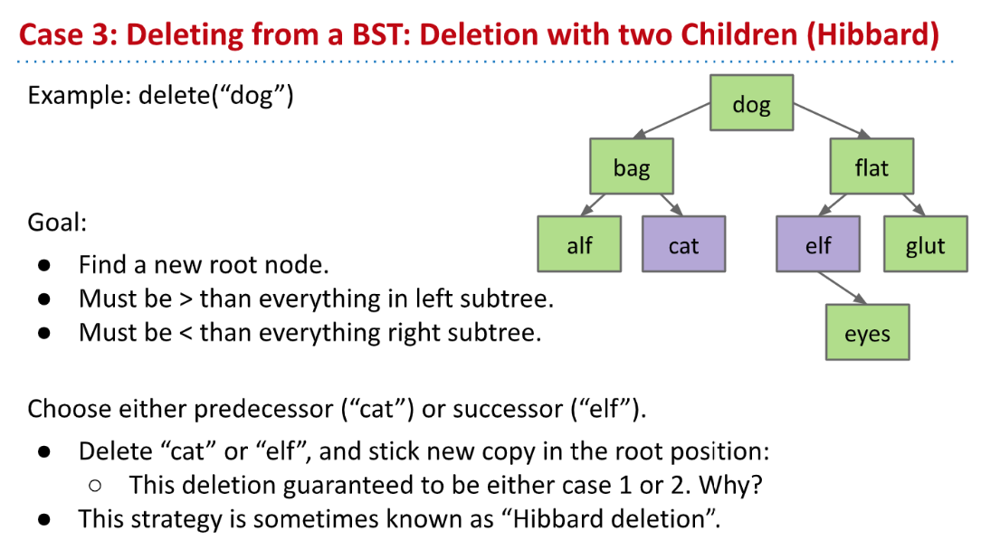
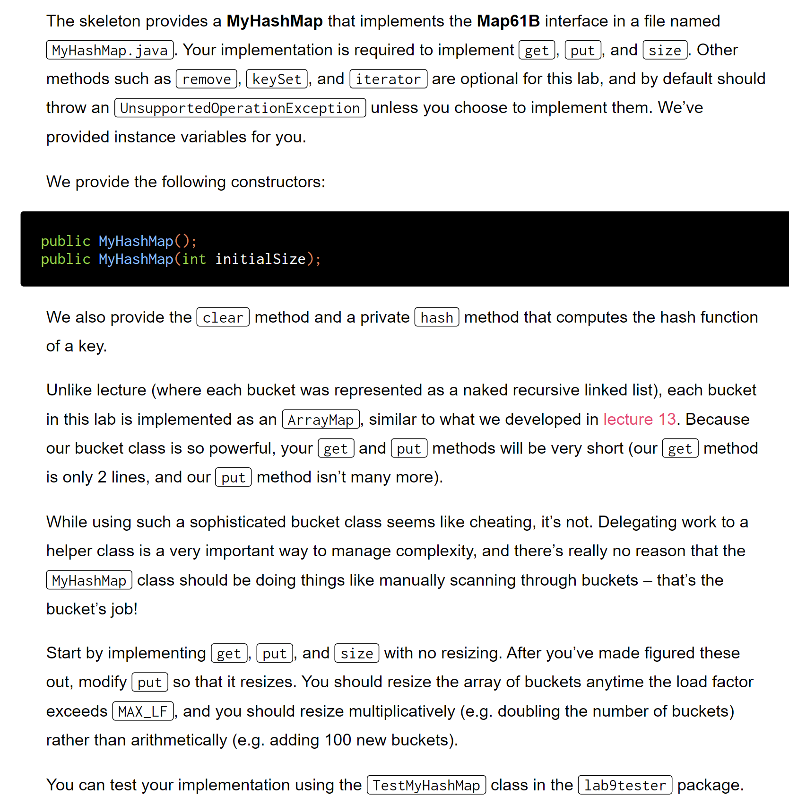
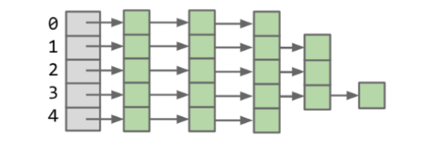
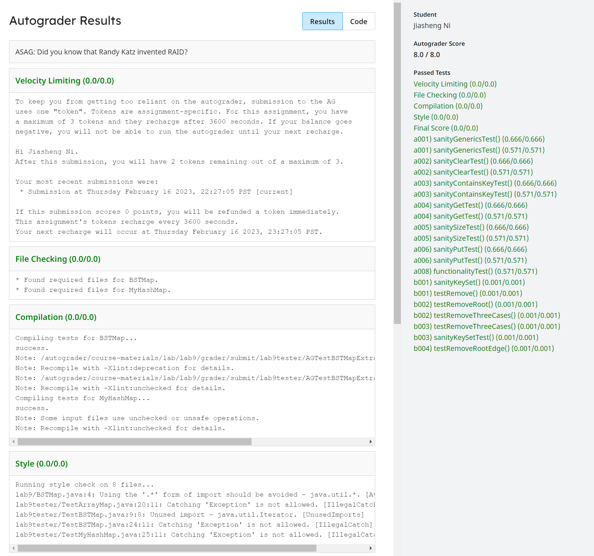

[Lab 9_ Tree Maps vs. Hash Maps _ CS 61B Spring 2018.pdf](https://www.yuque.com/attachments/yuque/0/2023/pdf/12393765/1676300561894-5ea650e1-a4cc-4669-920d-9e3c60689d60.pdf)
# BSTMap
> 
> **Reference:** [https://algs4.cs.princeton.edu/32bst/BST.java.html](https://algs4.cs.princeton.edu/32bst/BST.java.html)

```java
package lab9;

import java.util.Iterator;
import java.util.Set;

/**
 * Implementation of interface Map61B with BST as core data structure.
 *
 * @author Your name here
 */
public class BSTMap<K extends Comparable<K>, V> implements Map61B<K, V> {

    private class Node {
        /* (K, V) pair stored in this Node. */
        private K key;
        private V value;

        /* Children of this Node. */
        private Node left;
        private Node right;

        private Node(K k, V v) {
            key = k;
            value = v;
        }
    }

    private Node root;  /* Root node of the tree. */
    private int size; /* The number of key-value pairs in the tree */

    /* Creates an empty BSTMap. */
    public BSTMap() {
        this.clear();
    }

    /* Removes all of the mappings from this map. */
    @Override
    public void clear() {
        root = null;
        size = 0;
    }

    /** Returns the value mapped to by KEY in the subtree rooted in P.
     *  or null if this map contains no mapping for the key.
     */
    private V getHelper(K key, Node p) {
        throw new UnsupportedOperationException();
    }

    /** Returns the value to which the specified key is mapped, or null if this
     *  map contains no mapping for the key.
     */
    @Override
    public V get(K key) {
        throw new UnsupportedOperationException();
    }

    /** Returns a BSTMap rooted in p with (KEY, VALUE) added as a key-value mapping.
      * Or if p is null, it returns a one node BSTMap containing (KEY, VALUE).
     */
    private Node putHelper(K key, V value, Node p) {
        throw new UnsupportedOperationException();
    }

    /** Inserts the key KEY
     *  If it is already present, updates value to be VALUE.
     */
    @Override
    public void put(K key, V value) {
        throw new UnsupportedOperationException();
    }

    /* Returns the number of key-value mappings in this map. */
    @Override
    public int size() {
        throw new UnsupportedOperationException();
    }

    //////////////// EVERYTHING BELOW THIS LINE IS OPTIONAL ////////////////

    /* Returns a Set view of the keys contained in this map. */
    @Override
    public Set<K> keySet() {
        throw new UnsupportedOperationException();
    }

    /** Removes KEY from the tree if present
     *  returns VALUE removed,
     *  null on failed removal.
     */
    @Override
    public V remove(K key) {
        throw new UnsupportedOperationException();
    }

    /** Removes the key-value entry for the specified key only if it is
     *  currently mapped to the specified value.  Returns the VALUE removed,
     *  null on failed removal.
     **/
    @Override
    public V remove(K key, V value) {
        throw new UnsupportedOperationException();
    }

    @Override
    public Iterator<K> iterator() {
        throw new UnsupportedOperationException();
    }
}

```


## get(K key)
**Spoiler**
```java
/** Returns the value mapped to by KEY in the subtree rooted in P.
 *  or null if this map contains no mapping for the key.
 */
private V getHelper(K key, Node p) {
    if (key == null) {
        throw new IllegalArgumentException("calls get() with a null key");
    }
    if (p == null) {
        return null;
    }

    int cmp = key.compareTo(p.key);
    if (cmp > 0) {
        return getHelper(key, p.right);
    } else if (cmp < 0) {
        return getHelper(key, p.left);
    } else {
        return p.value;
    }
}

/** Returns the value to which the specified key is mapped, or null if this
 *  map contains no mapping for the key.
 */
@Override
public V get(K key) {
    return getHelper(key, root);
}
```


## put(K key, V value)⭐⭐⭐⭐⭐
**Spoiler**
```java
/** Returns a BSTMap rooted in p with (KEY, VALUE) added as a key-value mapping.
  * Or if p is null, it returns a one node BSTMap containing (KEY, VALUE).
 */
private Node putHelper(K key, V value, Node p) {
    if (p == null) {
        // Update the size!
        size += 1;
        return new Node(key, value);
    }

    int cmp = key.compareTo(p.key);
    if (cmp < 0) {
        p.left = putHelper(key, value, p.left);
    } else if (cmp > 0) {
        p.right = putHelper(key, value, p.right);;
    } else {
        p.value = value;
    }
    return p;
}

/** Inserts the key KEY
 *  If it is already present, updates value to be VALUE.
 */
@Override
public void put(K key, V value) {
    if (key == null) {
        throw new IllegalArgumentException("calls get() with a null key");
    }
    // Don't forget to update the root⭐⭐⭐⭐⭐
    root = putHelper(key, value, root);
}
```


## remove⭐⭐⭐⭐⭐
> `remove`操作非常重要，这也是实现的难点。我们可以参考`Lecture Slides`中的思路分几种情况来看:
> 
> 解法和`put`很像，都是需要定义一个多参数的`Helper Method`来辅助遍历和调整树形结构。代码实现如下，代码中有详细的注释:

```java
/** Removes KEY from the tree if present
 *  returns VALUE removed,
 *  null on failed removal.
 *  由于remove(K key, V value) 是其功能的增强版，所以我们只需要简单地复用一下代码即可。
 */
@Override
public V remove(K key) {
    // Validity Check
    if (key == null) {
        throw new IllegalArgumentException();
    }
    V v = get(key);
    if (v != null) {
        return remove(key, v);
    }
    return null;
}


/** Removes the key-value entry for the specified key only if it is
 *  currently mapped to the specified value.  Returns the VALUE removed,
 *  null on failed removal.
 **/
@Override
public V remove(K key, V value) {
    // Validity Check
    if (key == null) {
        throw new IllegalArgumentException();
    }
    V v = get(key);
    if (v != null) {
        // 删除节点, 修改树形结构
        root = removeHelper(key, value, root);
        // 更新树的size
        size = sizeT(root);
    }
    return v;
}


public Node removeHelper(K key, V value, Node p) {
    int cmp = key.compareTo(p.key);
    if (cmp > 0) {
        p.right = removeHelper(key, value, p.right);
    } else if (cmp < 0) {
        p.left = removeHelper(key, value, p.left);
    } else {
        if (p.value.equals(value)) {
            // 判断当前待删除节点是Case 1还是Case 2
            if (p.left == null) {
                return p.right;
            }
            if (p.right == null) {
                return p.left;
            }
            // Case 3
            // 1. Find successor(or predecessor)
            Node successor = findMin(p.right);
//                Node predecessor = findMax(p.left);

            // 2. Exchange the value of the successor and the node to be deleted.
            // 本质上是将successor的所有信息拷贝到当前节点上，这样可以尽可能少的改编树结构。
            K sKey = successor.key;
            V sValue = successor.value;
            p.key = sKey;
            p.value = sValue;
            p.right = removeHelper(sKey, sValue, p.right);
            return p;
        }
    }
    return p;
}

/**
 * Find the smallest element in the tree rooted at p
 * @param p
 * @return
 */
public Node findMin(Node p) {
    if (p.left == null) {
        return p;
    }
    return findMin(p.left);
}

/**
 * Return the size of the tree rooted at p
 * @return
 */
public int sizeT(Node p) {
    if (p == null) {
        return 0;
    }
    return sizeT(p.left) + sizeT(p.right) + 1;
}

```


## keySet()
> 使用`DFS`算法遍历树。

```java
/* Returns a Set view of the keys contained in this map. */
@Override
public Set<K> keySet() {
    Set<K> res = new HashSet<>();
    // Traverse the tree
    keySetHelper(root, res);
    return res;
}

public void keySetHelper(Node p, Set<K> s) {
    if (p == null) {
        return;
    }
    // DFS Traversal
    s.add(p.key);
    keySetHelper(p.left, s);
    keySetHelper(p.right, s);
}
```

## iterator()
> 没什么特别的，我们可以复用`ArrayList`自身的`iterator`来简化书写。

```java
@Override
public Iterator<K> iterator() {
    List<K> allKeys;
    allKeys = new ArrayList<>();
    getAllKeys(allKeys, root);
    return allKeys.iterator();
}

public void getAllKeys(List<K> container, Node p) {
    if (p == null) {
        return;
    }
    // Pre-DFS Traversal
    container.add(p.key);
    getAllKeys(container, p.left);
    getAllKeys(container, p.right);
}
```

## printTree()
> 这个方法属于`Helper Method`, 用于打印树形结构，逻辑并不复杂，但是十分重要, 在`Testing`时非常有用。

```java
// Helper Method in visualizing trees, should be commented when submitted
private List<Node> branches(Node p) {
    List<Node> childNodes = new ArrayList<>();
    if (p == null) {
        return childNodes;
    }
    if (p.left != null) {
        childNodes.add(p.left);
    }
    if (p.right != null) {
        childNodes.add(p.right);
    }
    return childNodes;
}

private void printTreeStructure() {
    printTreeStructure(root, 0);
}

private void printTreeStructure(Node p, int indent) {
    StringBuilder sb = new StringBuilder();
    for (int i = 0; i < indent; i++) {
        sb.append(" ");
    }
    sb.append(p.key);
    System.out.println(sb.toString());
    List<Node> allChildren = branches(p);
    for (Node n: allChildren) {
        printTreeStructure(n, indent + 1);
    }
}
```


## Tester
```java
package lab9tester;

import static org.junit.Assert.*;

import org.junit.Test;
import lab9.BSTMap;

import java.util.HashSet;
import java.util.Iterator;
import java.util.Set;

/**
 * Tests by Brendan Hu, Spring 2015, revised for 2018 by Josh Hug
 */
public class TestBSTMap {

    @Test
    public void sanityGenericsTest() {
        try {
            BSTMap<String, String> a = new BSTMap<String, String>();
            BSTMap<String, Integer> b = new BSTMap<String, Integer>();
            BSTMap<Integer, String> c = new BSTMap<Integer, String>();
            BSTMap<Boolean, Integer> e = new BSTMap<Boolean, Integer>();
        } catch (Exception e) {
            fail();
        }
    }

    //assumes put/size/containsKey/get work
    @Test
    public void sanityClearTest() {
        BSTMap<String, Integer> b = new BSTMap<String, Integer>();
        for (int i = 0; i < 455; i++) {
            b.put("hi" + i, 1 + i);
            //make sure put is working via containsKey and get
            assertTrue(null != b.get("hi" + i));
            assertTrue(b.get("hi" + i).equals(1 + i));
            assertTrue(b.containsKey("hi" + i));
        }
        assertEquals(455, b.size());
        b.clear();
        assertEquals(0, b.size());
        for (int i = 0; i < 455; i++) {
            assertTrue(null == b.get("hi" + i) && !b.containsKey("hi" + i));
        }
    }

    // assumes put works
    @Test
    public void sanityContainsKeyTest() {
        BSTMap<String, Integer> b = new BSTMap<String, Integer>();
        assertFalse(b.containsKey("waterYouDoingHere"));
        b.put("waterYouDoingHere", 0);
        assertTrue(b.containsKey("waterYouDoingHere"));
    }

    // assumes put works
    @Test
    public void sanityGetTest() {
        BSTMap<String, Integer> b = new BSTMap<String, Integer>();
        assertEquals(null, b.get("starChild"));
        assertEquals(0, b.size());
        b.put("starChild", 5);
        assertTrue(((Integer) b.get("starChild")).equals(5));
        b.put("KISS", 5);
        assertTrue(((Integer) b.get("KISS")).equals(5));
        assertNotEquals(null, b.get("starChild"));
        assertEquals(2, b.size());
    }

    // assumes put works
    @Test
    public void sanitySizeTest() {
        BSTMap<String, Integer> b = new BSTMap<String, Integer>();
        assertEquals(0, b.size());
        b.put("hi", 1);
        assertEquals(1, b.size());
        for (int i = 0; i < 455; i++) {
            b.put("hi" + i, 1);
        }
        assertEquals(456, b.size());
    }

    //assumes get/containskey work
    @Test
    public void sanityPutTest() {
        BSTMap<String, Integer> b = new BSTMap<String, Integer>();
        b.put("hi", 1);
        assertTrue(b.containsKey("hi"));
        assertTrue(b.get("hi") != null);
    }

    @Test
    public void testKeySet() {
        BSTMap<String, Integer> b = new BSTMap<>();
        b.put("hi", 2);
        b.put("xi", 3);
        b.put("sisihia", 4);
        Set<String> actual = b.keySet();
        Set<String> expected = new HashSet<>();
        expected.add("hi");
        expected.add("xi");
        expected.add("sisihia");
        assertEquals(expected, actual);
    }

    @Test
    public void testRemove() {
        BSTMap<Integer, Integer> b = new BSTMap<>();
        b.put(4, 1);
        b.put(2, 1);
        b.put(1, 1);
        b.put(3, 1);
        b.put(6, 1);
        b.put(5, 1);
        b.put(7, 1);
        b.printTreeStructure();

        // Now we remove the root
        b.remove(4);
        System.out.println("remove root");
        b.printTreeStructure();
    }


    public static void main(String[] args) {
        jh61b.junit.TestRunner.runTests(TestBSTMap.class);
    }
}
```


# MyHashMap - ArrayMap
> 
> `ArrayMap`的实现就是每个`bucket`中存放的是一个`ArrayMap`而不是`Lecture`中的`ULLMap(LinkedList)`


## ArrayMap - Provided
> 用于实现每一个`Bucket`的数据结构，包含`put/get/remove/iterator`基本操作。

```java
package lab9;

import java.util.HashSet;
import java.util.Iterator;
import java.util.Set;

/**
 * An array based implementation of the Map61B class.
 * @author Josh Hug (mostly done in lecture)
 */
public class ArrayMap<K, V> implements Map61B<K, V> {
    private K[] keys;
    private V[] values;
    int size;

    public ArrayMap() {
        keys = (K[]) new Object[100];
        values = (V[]) new Object[100];
        size = 0;
    }

    /** Returns the index of the given key if it exists,
     *  -1 otherwise. */
    private int keyIndex(K key) {
        for (int i = 0; i < size; i += 1) {
            if (keys[i].equals(key)) {
                return i;
            }
        }
        return -1;
    }

    @Override
    public boolean containsKey(K key) {
        int index = keyIndex(key);
        return index > -1;
    }

    @Override
    public void put(K key, V value) {
        if (key == null) {
            throw new IllegalArgumentException("Null key not allowed.");
        }
        if (value == null) {
            throw new IllegalArgumentException("Null values not allowed.");
        }
        int index = keyIndex(key);
        if (index == -1) {
            if (size == keys.length) {
                resize(keys.length * 2);
            }
            keys[size] = key;
            values[size] = value;
            size += 1;
            return;
        }
        values[index] = value;
    }

    private void resize(int capacity) {
        K[] newKeys = (K[]) new Object[capacity];
        V[] newValues = (V[]) new Object[capacity];
        System.arraycopy(keys, 0, newKeys, 0, size);
        System.arraycopy(values, 0, newValues, 0, size);
        keys = newKeys;
        values = newValues;
    }

    @Override
    public V get(K key) {
        int index = keyIndex(key);
        if (index == -1) {
            return null;
        }
        return values[index];
    }

    @Override
    public int size() {
        return size;
    }

    @Override
    public Set<K> keySet() {
        Set<K> keyset = new HashSet<>();
        for (int i = 0; i < size; i += 1) {
            keyset.add(keys[i]);
        }
        return keyset;
    }

    @Override
    public V remove(K key) {
        int keyLocation = keyIndex(key);
        V returnValue = null;
        if (keyLocation > -1) {
            returnValue = values[keyLocation];
            keys[keyLocation] = keys[size - 1];
            values[keyLocation] = values[size - 1];
            size -= 1;
        }
        return returnValue;
    }

    @Override
    public Iterator<K> iterator() {
        return keySet().iterator();
    }

    @Override
    public void clear() {
        keys = (K[]) new Object[100];
        values = (V[]) new Object[100];
        size = 0;
    }

    @Override
    public V remove(K key, V value) {
        int keyLocation = keyIndex(key);
        V returnValue = null;
        if (keyLocation > -1 && values[keyLocation].equals(value)) {
            returnValue = values[keyLocation];
            keys[keyLocation] = keys[size - 1];
            values[keyLocation] = values[size - 1];
            size -= 1;
        }
        return returnValue;
    }
}
```


## MyHashMap - Implemented
> 我们需要厘清`MayHashMap`和`ArrayMap`之间的关系:
> 
> **Remarks:**
> - 灰色的是我们的`MyHashMap`，是一张`HashTable`，是一个`Generic Array`。任何新的`Key-Value Pair`在`Put`的时候都需要经过`hash(key)`找到对应的`HashTable`中的某一个`index`, 上图中就是`0-4`中的某一个。假设现在绿色部分总共有$M$个元素，灰色部分有$N$个`index`, 则当$\frac{M}{N} > 0,75$时，`resize`的是灰色的部分。
> - 绿色的部分就是`ArrayMap/ULLMap`, 用于解决`Collision`现象做出的改进。当有太多的`Key`被`hash`到了相同的`bucket`中时，需要`resize`的是绿色的部分。
> - 所以在下面的代码中，我们可以看到，`MyHashMap`的底层数据结构就是`ArrayMap<K, V>[]`

```java
package lab9;

import java.util.HashSet;
import java.util.Iterator;
import java.util.Set;

/**
 *  A hash table-backed Map implementation. Provides amortized constant time
 *  access to elements via get(), remove(), and put() in the best case.
 *
 *  @author Your name here
 */
public class MyHashMap<K, V> implements Map61B<K, V> {

    private static final int DEFAULT_SIZE = 16;
    private static final double MAX_LF = 0.75;
    private static int MAX_CAPACITY = DEFAULT_SIZE;

    // 底层数据结构
    private ArrayMap<K, V>[] buckets;
    // HashTable的size, 注意不是ArrayMap的size
    private int size;


    private int loadFactor() {
        return size / buckets.length;
    }

    // Add for testing
    public int maxCapacity() {
        return MAX_CAPACITY;
    }

    public MyHashMap() {
        buckets = new ArrayMap[DEFAULT_SIZE];
        this.clear();
    }

    /* Removes all of the mappings from this map. */
    @Override
    public void clear() {
        this.size = 0;
        for (int i = 0; i < this.buckets.length; i += 1) {
            this.buckets[i] = new ArrayMap<>();
        }
    }

    /** Computes the hash function of the given key. Consists of
     *  computing the hashcode, followed by modding by the number of buckets.
     *  To handle negative numbers properly, uses floorMod instead of %.
     */
    private int hash(K key) {
        // Hash to the specific bucket
        if (key == null) {
            return 0;
        }

        int numBuckets = buckets.length;
        return Math.floorMod(key.hashCode(), numBuckets);
    }

    /* Returns the value to which the specified key is mapped, or null if this
     * map contains no mapping for the key.
     */
    @Override
    public V get(K key) {
        if (key == null) {
            throw new IllegalArgumentException("No such key!");
        }

        return buckets[hash(key)].get(key);
    }

    /* Associates the specified value with the specified key in this map. */
    @Override
    public void put(K key, V value) {
        if (key == null) {
            throw new IllegalArgumentException("No such key!");
        }
        ArrayMap<K, V> bucket = buckets[hash(key)];
        int oSize = bucket.size();
        // 调用ArrayMap的put方法
        bucket.put(key, value);
        // 查看ArrayMap大小是否发生变化(因为有可能是key相同然后value覆盖而导致size不变)
        if (bucket.size() > oSize) {
            size++;
        }
        resize();
    }

    /* Returns the number of key-value mappings in this map. */
    @Override
    public int size() {
        return size;
    }

    /**
     * Resize the bucket size and rehash
     */
    private void resize() {
        // 如果超过了loading factor, 需要对bucket size进行resize
        if (size >= MAX_LF * MAX_CAPACITY) {
            // 我们选择2倍放大
            int newSize = MAX_CAPACITY * 2;
            // 初始化一个新的hashTable, 容量是之前的
            ArrayMap<K, V>[] newBuckets = new ArrayMap[newSize];
            // HashTable的最大容量
            MAX_CAPACITY = newSize;

            // Initialiing, 给每个HashTable的index都初始化一个空的ArrayMap bucket
            for (int i = 0; i < newBuckets.length; i++) {
                newBuckets[i] = new ArrayMap<>();
            }

            // 拷贝数据
            for (int i = 0; i < buckets.length; i++) {
                ArrayMap<K, V> bucket = buckets[i];
                for (K key: bucket.keySet()) {
                    // Hashing
                    int bIndex = Math.floorMod(key.hashCode(), newSize);
                    newBuckets[bIndex].put(key, bucket.get(key));
                }
            }
            // Rebinding
            buckets = newBuckets;
        }
    }

    //////////////// EVERYTHING BELOW THIS LINE IS OPTIONAL ////////////////

    /* Returns a Set view of the keys contained in this map. */
    @Override
    public Set<K> keySet() {
        Set<K> res = new HashSet<>();
        for (int i = 0; i < buckets.length; i++) {
            ArrayMap<K, V> bucket = buckets[i];
            res.addAll(bucket.keySet());
        }
        return res;
    }

    /* Removes the mapping for the specified key from this map if exists.
     * Not required for this lab. If you don't implement this, throw an
     * UnsupportedOperationException. */
    @Override
    public V remove(K key) {
        if (key == null) {
            throw new IllegalArgumentException("The argument is illegal");
        }
        int hashCode = hash(key);
        ArrayMap<K, V> bucket = buckets[hashCode];
        int oSize = bucket.size();
        V res = bucket.remove(key);
        if (bucket.size() < oSize) {
            size--;
        }
        return res;
    }

    /* Removes the entry for the specified key only if it is currently mapped to
     * the specified value. Not required for this lab. If you don't implement this,
     * throw an UnsupportedOperationException.*/
    @Override
    public V remove(K key, V value) {
        if (key == null) {
            throw new IllegalArgumentException("The argument is illegal");
        }
        int hashCode = hash(key);
        ArrayMap<K, V> bucket = buckets[hashCode];
        int oSize = bucket.size();
        // Only when the value is specified.
        if (bucket.get(key).equals(value)) {
            V res = bucket.remove(key);
            if (bucket.size() < oSize) {
                size--;
            }
            return res;
        }
        return null;
    }

    // Important!
    private class HashMapIterator implements Iterator<K> {

        int bucketIndex;
        Iterator<K> currentBucket;

        HashMapIterator() {
            bucketIndex = 0;
            // 复用java.util.ArrayMap.interator
            currentBucket = buckets[bucketIndex].iterator();
        }

        // 查看是否还有下一个bucketIndex
        private boolean bound() {
            return bucketIndex >= buckets.length - 1;
        }


        @Override
        public boolean hasNext() {
            if (currentBucket.hasNext()) {
                return true;
            }

            // 如果当前的bucket iterator还有next,就返回
            // 如果没有next，就过渡到下一个bucket.
            while (!currentBucket.hasNext()) {
                if (bound()) {
                    return false;
                }
                currentBucket = buckets[bucketIndex++].iterator();
            }
            return true;
        }

        @Override
        public K next() {
            if (hasNext()) {
                return currentBucket.next();
            }
            throw new RuntimeException("Stop Iteration!");
        }
    }

    @Override
    public Iterator<K> iterator() {
        return new HashMapIterator();
    }
}
```
```java
package lab9tester;

import static org.junit.Assert.*;

import org.junit.Test;
import lab9.MyHashMap;

import java.util.HashSet;
import java.util.Iterator;
import java.util.Random;
import java.util.Set;

/**
 * Tests by Brendan Hu, Spring 2015, revised for 2018 by Josh Hug
 */
public class TestMyHashMap {

    @Test
    public void sanityGenericsTest() {
        try {
            MyHashMap<String, String> a = new MyHashMap<String, String>();
            MyHashMap<String, Integer> b = new MyHashMap<String, Integer>();
            MyHashMap<Integer, String> c = new MyHashMap<Integer, String>();
            MyHashMap<Boolean, Integer> e = new MyHashMap<Boolean, Integer>();
        } catch (Exception e) {
            fail();
        }
    }

    //assumes put/size/containsKey/get work
    @Test
    public void sanityClearTest() {
        MyHashMap<String, Integer> b = new MyHashMap<String, Integer>();
        for (int i = 0; i < 455; i++) {
            b.put("hi" + i, 1);
            //make sure put is working via containsKey and get
            assertTrue(null != b.get("hi" + i)
                    && b.containsKey("hi" + i));
        }
        b.clear();
        assertEquals(0, b.size());
        for (int i = 0; i < 455; i++) {
            assertTrue(null == b.get("hi" + i) && !b.containsKey("hi" + i));
        }
    }

    // assumes put works
    @Test
    public void sanityContainsKeyTest() {
        MyHashMap<String, Integer> b = new MyHashMap<String, Integer>();
        assertFalse(b.containsKey("waterYouDoingHere"));
        b.put("waterYouDoingHere", 0);
        assertTrue(b.containsKey("waterYouDoingHere"));
    }

    // assumes put works
    @Test
    public void sanityGetTest() {
        MyHashMap<String, Integer> b = new MyHashMap<String, Integer>();
        assertEquals(null, b.get("starChild"));
        b.put("starChild", 5);
        assertNotEquals(null, b.get("starChild"));
        b.put("KISS", 5);
        assertNotEquals(null, b.get("KISS"));
        assertNotEquals(null, b.get("starChild"));
    }

    // assumes put works
    @Test
    public void sanitySizeTest() {
        MyHashMap<String, Integer> b = new MyHashMap<String, Integer>();
        assertEquals(0, b.size());
        b.put("hi", 1);
        assertEquals(1, b.size());
        for (int i = 0; i < 455; i++) {
            b.put("hi" + i, 1);
        }
        assertEquals(456, b.size());
    }

    //assumes get/containskey work
    @Test
    public void sanityPutTest() {
        MyHashMap<String, Integer> b = new MyHashMap<String, Integer>();
        b.put("hi", 1);
        assertTrue(b.containsKey("hi") && b.get("hi") != null);
    }

    /*
     * Test for general functionality and that the properties of Maps hold.
     */
    @Test
    public void functionalityTest() {
        MyHashMap<String, String> dictionary = new MyHashMap<>();
        assertEquals(0, dictionary.size());

        // can put objects in dictionary and get them
        dictionary.put("hello", "world");
        assertTrue(dictionary.containsKey("hello"));
        assertEquals("world", dictionary.get("hello"));
        assertEquals(1, dictionary.size());

        // putting with existing key updates the value
        dictionary.put("hello", "kevin");
        assertEquals(1, dictionary.size());
        assertEquals("kevin", dictionary.get("hello"));

        // putting key in multiple times does not affect behavior
        MyHashMap<String, Integer> studentIDs = new MyHashMap<>();
        studentIDs.put("sarah", 12345);
        assertEquals(1, studentIDs.size());
        assertEquals(12345, studentIDs.get("sarah").intValue());
        studentIDs.put("alan", 345);
        assertEquals(2, studentIDs.size());
        assertEquals(12345, studentIDs.get("sarah").intValue());
        assertEquals(345, studentIDs.get("alan").intValue());
        studentIDs.put("alan", 345);
        assertEquals(2, studentIDs.size());
        assertEquals(12345, studentIDs.get("sarah").intValue());
        assertEquals(345, studentIDs.get("alan").intValue());
        studentIDs.put("alan", 345);
        assertEquals(2, studentIDs.size());
        assertEquals(12345, studentIDs.get("sarah").intValue());
        assertEquals(345, studentIDs.get("alan").intValue());
        assertTrue(studentIDs.containsKey("sarah"));
        assertTrue(studentIDs.containsKey("alan"));

        // handle values being the same
        assertEquals(345, studentIDs.get("alan").intValue());
        studentIDs.put("evil alan", 345);
        assertEquals(345, studentIDs.get("evil alan").intValue());
        assertEquals(studentIDs.get("evil alan"), studentIDs.get("alan"));
    }

    @Test
    public void testResize() {
        MyHashMap<Integer, Integer> dictionary = new MyHashMap<>();
        assertEquals(0, dictionary.size());
        for (int i = 0; i < 11; i++) {
            Integer rint = (new Random()).nextInt();
            dictionary.put(rint, rint);
        }
        Integer rint = (new Random()).nextInt();
        assertEquals(16, dictionary.maxCapacity());
        dictionary.put(rint, rint);
        assertEquals(32, dictionary.maxCapacity());
    }


    @Test
    public void testKeySet() {
        MyHashMap<String, Integer> dictionary = new MyHashMap<>();
        dictionary.put("sarah", 12345);
        dictionary.put("alan", 345);
        Set<String> expected = new HashSet<>();
        expected.add("sarah");
        expected.add("alan");
        assertEquals(dictionary.keySet(), expected);
    }

    @Test
    public void testRemove() {
        // putting key in multiple times does not affect behavior
        MyHashMap<String, Integer> studentIDs = new MyHashMap<>();
        studentIDs.put("sarah", 12345);
        assertEquals(1, studentIDs.size());
        assertEquals(12345, studentIDs.get("sarah").intValue());
        studentIDs.put("alan", 345);
        assertEquals(2, studentIDs.size());
        assertEquals(12345, studentIDs.get("sarah").intValue());
        assertEquals(345, studentIDs.get("alan").intValue());
        Integer res = studentIDs.remove("sarah", 12345);
        assertEquals(12345, res.intValue());
        assertEquals(1, studentIDs.size());
        res = studentIDs.remove("alan", 123);
        assertEquals(null, res);
        assertEquals(1, studentIDs.size());
        assertFalse(studentIDs.containsKey("sarah"));
        assertTrue(studentIDs.containsKey("alan"));
    }

    @Test
    public void testIterator() {
        MyHashMap<String, Integer> studentIDs = new MyHashMap<>();
        studentIDs.put("sarah", 12345);
        studentIDs.put("alan", 345);
        studentIDs.put("set", 435);
        Iterator<String> res = studentIDs.iterator();
        Set<String> container = new HashSet<>();
        while (res.hasNext()) {
            String next = res.next();
            System.out.println(next);
            container.add(next);
        }
        System.out.println("end");
        Set<String> expected = new HashSet<>();
        expected.add("sarah");
        expected.add("alan");
        expected.add("set");
        assertEquals(expected, container);
    }


    public static void main(String[] args) {
        jh61b.junit.TestRunner.runTests(TestMyHashMap.class);
    }
}

```


# Submission
> 

