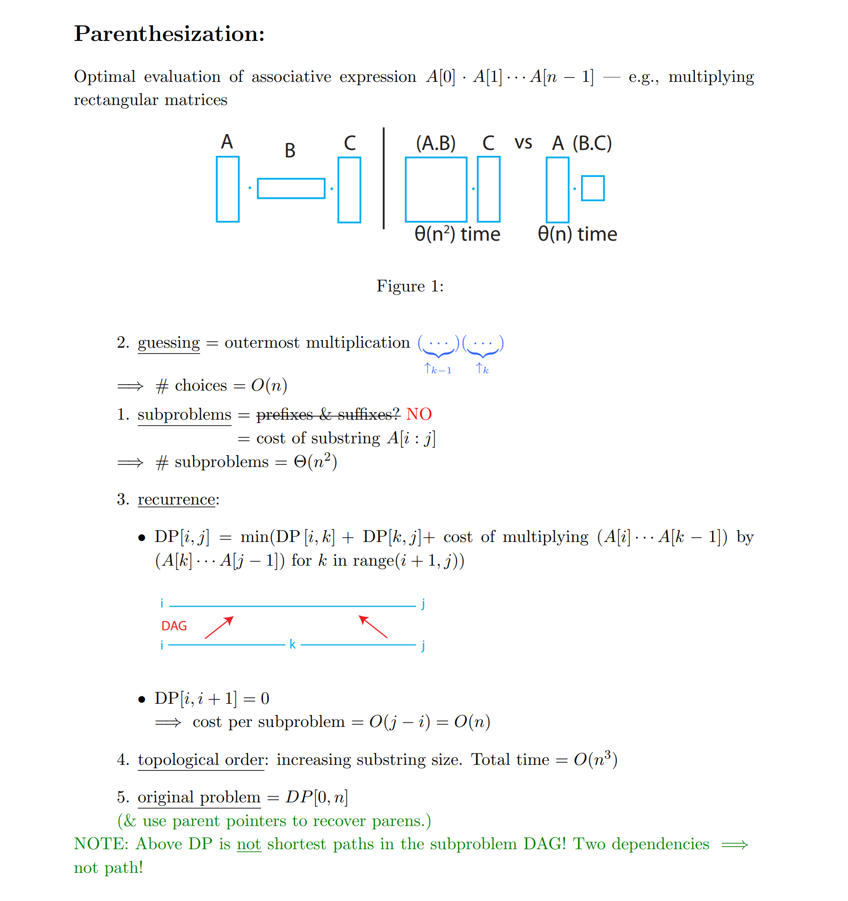
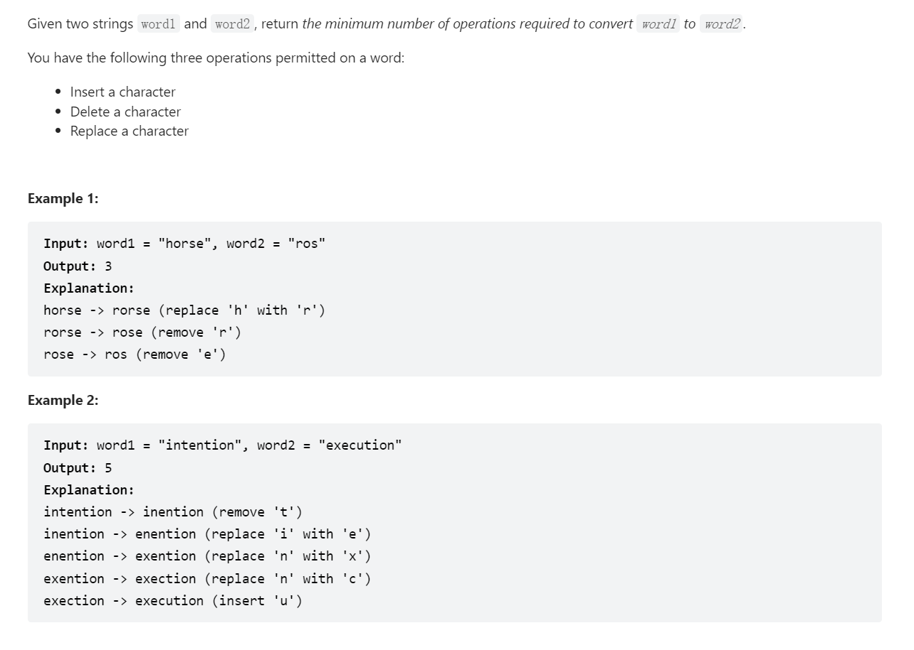
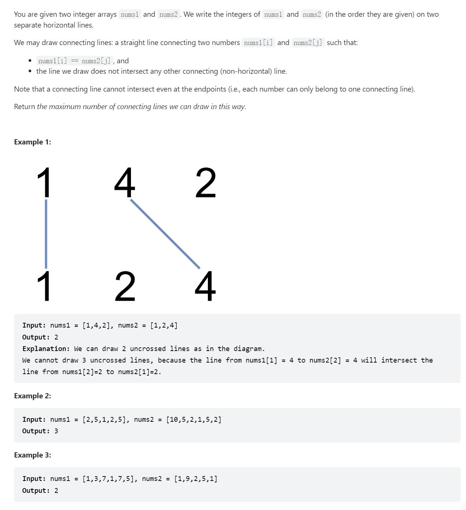
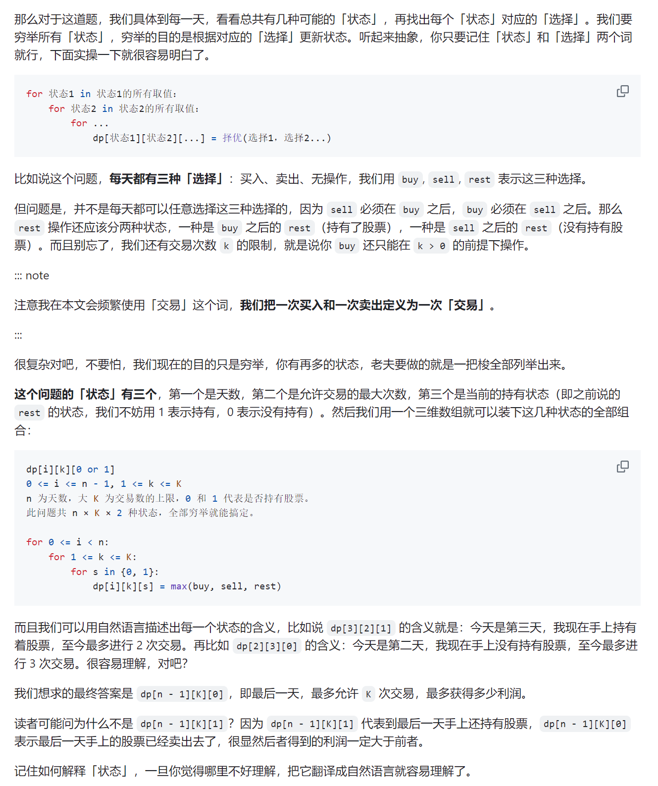
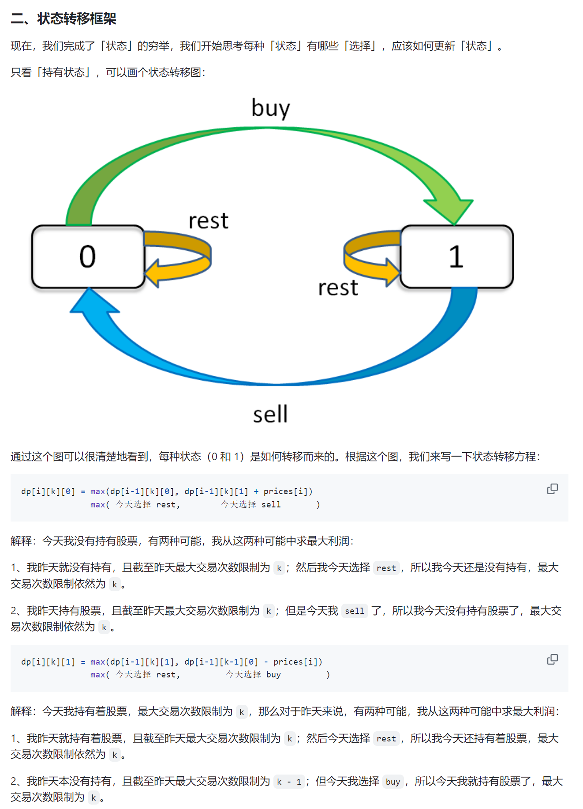
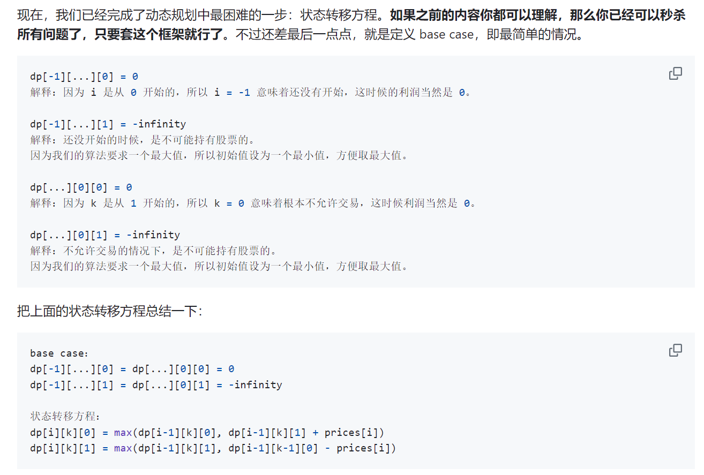

# DP Formulation
> [!important]
> 


# Fibonacci Number and DP
## Naive Algorithm
> [!concept]
> 


## Memoized DP Algorithm
> [!concept]
> 


## Bottom-up DP Algorithm
> [!concept]
> 


# Merge Sort


# Shortest Path
## DAG DP
> [!concept]
> 
> **Note:** Subproblem dependencies should be acyclic in order for memoization to work, otherwise infinite recursion.
> 
> If the subproblem dependencies are acyclic, then the runtime is # subproblems * time/subproblem.
> 
> With memoization, time/subproblem is $\Theta(1)$
> 
> Here, # subproblems = V choice for k and E choice for v(indegree), so $O(VE)$


## How to Design Recurrence
> [!important]
> 


## Cyclic => Acyclic
> [!important]
> If the graph contains cycles(non-negative ones), traditional DP won't work, so we need to transform the cyclic graph to acyclic one. The cost is that we are making more subproblems for DP.
> 


# Text Justification
> [!algo]
> 
> `DP[n]` can be thought of as empty line, which doesn't have badness since we have no words to fit that line.


# Parent Pointers

 

# Subsequences


# Parenthesization
> [!algo]
> 


# Edit Distance


# Perfect-Information Blackjack
> [!algo]
> 


# Knapsack


# Chain Matrix Multiplication


# Leetcode Problems
## 双序列DP
### 编辑距离
> [!code]
> 
> **Remarks:**
> - 我们假设所有的增删改的开销都是`1`。
```java
class Solution {
    public int minDistance(String word1, String word2) {
        int length1 = word1.length();
        int length2 = word2.length();
        int[][] dp = new int[length1 + 1][length2 + 1];

        // Initialize base cases
        for (int i = 0; i <= length1; i++) {
            dp[i][0] = i; // Cost of deleting characters from word1 to make it empty
        }
        for (int j = 0; j <= length2; j++) {
            dp[0][j] = j; // Cost of inserting characters to make word2 from empty
        }

        // Fill dp array
        for (int i = 1; i <= length1; i++) {
            for (int j = 1; j <= length2; j++) {
                if (word1.charAt(i - 1) == word2.charAt(j - 1)) {
                    dp[i][j] = dp[i - 1][j - 1]; // No operation needed
                } else {
                    int delete = dp[i - 1][j]; // Delete character from word1
                    int insert = dp[i][j - 1]; // Insert character into word1
                    int replace = dp[i - 1][j - 1]; // Replace character in word1
                    dp[i][j] = Math.min(delete, Math.min(insert, replace)) + 1;
                }
            }
        }

        return dp[length1][length2];
    }

```


### 不相交的线
> [!task]
> 
> 大体思路是:
> - `dp[i][j]`表示`nums1[:i]`和`nums2[:j]`的最大连线数量
```java
class Solution {
    public int maxUncrossedLines(int[] nums1, int[] nums2) {

        int length1 = nums1.length;
        int length2 = nums2.length;

        int[][] dp = new int[length1 + 1][length2 + 1];

        for (int i = 1; i <= length1; i++) {
            for (int j = 1; j <= length2; j++) {
                int temp = Integer.MIN_VALUE;
                // If we can connect the current pair, 3 choices
                if (nums1[i - 1] == nums2[j - 1]) {
                    temp = Math.max(temp, dp[i - 1][j -1]) + 1;
                }
                // If we cannot connect the current pair, 2 choices
                temp = Math.max(temp, dp[i][j -1]);
                temp = Math.max(temp, dp[i - 1][j]);
                dp[i][j] = temp;
            }
        }
        return dp[length1][length2];
    }
}
```


## 股票问题
> [!important] 模板
> 


### 买卖股票的最佳时机 I


### 买卖股票的最佳时机 II


### 买卖股票的最佳时机 III


### 买卖股票的最佳时机 IV


### 买卖股票的最佳时机 V


### 买卖股票的最佳时机 VI


## 背包问题


