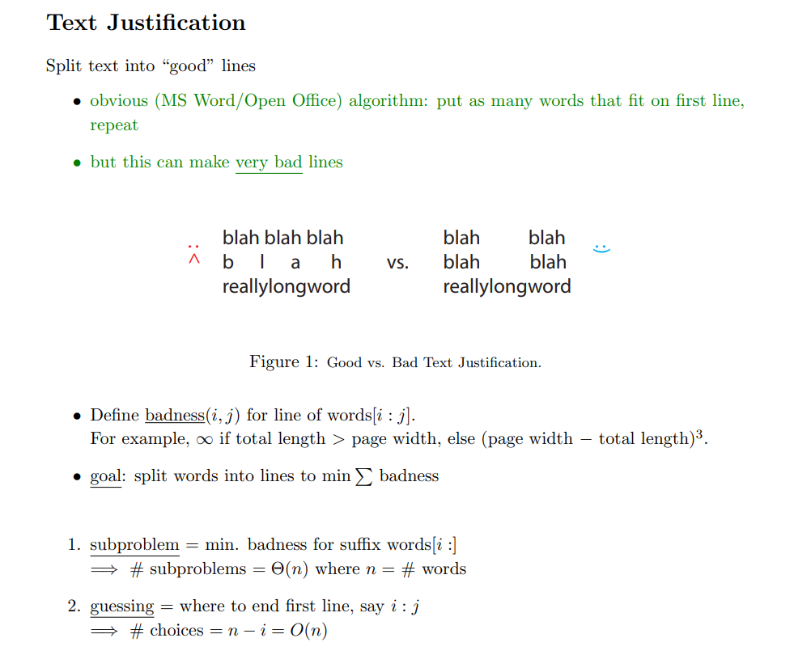

# DP Formulation
> [!important]
> 

# Fibonacci Number and DP
## Naive Algorithm
> [!concept]
> 

## Memoized DP Algorithm
> [!concept]
> 

## Bottom-up DP Algorithm
> [!concept]
> 

# Merge Sort

# Shortest Path
## DAG DP
> [!concept]
> 
> **Note:** Subproblem dependencies should be acyclic in order for memoization to work, otherwise infinite recursion.
> 
> If the subproblem dependencies are acyclic, then the runtime is # subproblems * time/subproblem.
> 
> With memoization, time/subproblem is $\Theta(1)$
> 
> Here, # subproblems = V choice for k and E choice for v(indegree), so $O(VE)$

## How to Design Recurrence
> [!important]
> 

## Cyclic => Acyclic
> [!important]
> If the graph contains cycles(non-negative ones), traditional DP won't work, so we need to transform the cyclic graph to acyclic one. The cost is that we are making more subproblems for DP.
> 

# Text Justification
> [!algo]
> 
> `DP[n]` can be thought of as empty line, which doesn't have badness since we have no words to fit that line.

# Parent Pointers

 

# Subsequences

# Edit Distance

# Perfect-Information Blackjack
> [!algo]
> 

# Knapsack

# Chain Matrix Multiplication